<div style="background-color:#f8f8f8;border:1px solid #d1d5da;border-radius:8px;padding:14px 18px;margin-bottom:20px;">
<p>⚠️ <strong>Work in progress — yet to be validated</strong></p>
</div>

# Simpl Documentation Catalogue

Main sources:
 - [Simpl website](https://simpl-programme.ec.europa.eu/)
 - [https://code.europa.eu/simpl](https://code.europa.eu/simpl)
 - [Functional and Technical Architecture Specifications](https://code.europa.eu/simpl/simpl-open/architecture/-/blob/master/functional_and_technical_architecture_specifications/Functional-and-Technical-Architecture-Specifications.md?ref_type=heads)

```
Method:
- Main document: the functional and technical architecture specification document. 
- Used the capability map as base, setup a structure <dimension>/<capability>/<service>/<solution>
- Worked heavily with Claude code to analyse the architecture document
- Approximately 9 distinct steps to distribute the documentation to the correct location (iterative)
- Traverse the development branch in code.europa.eu to retrieve all documentation from the code base
```
## Table of Contents

- [How to use this documentation](#how-to-use-this-documentation)
- [What is Simpl](#what-is-simpl)
- [Business Processes](#business-processes)
- [Supporting Activities](#supporting-activities)
- [Non-Functional Requirements](#non-functional-requirements)
- [Capability Map](#capability-map)
- [How Business Processes, Architecture, and NFRs Relate](#how-business-processes-architecture-and-nfrs-relate)
- [Foundational Reference](#foundational-reference)
- [Other Contents](#other-contents)

---

## How to use this documentation

This repository is structured to be browsed in three ways depending on what you're looking for. The descriptions below assume the eventual end state where each solution folder contains both its documentation and its code; some links resolve to documentation only today, but the navigation pattern is the same.


### If you are following a business process

Business processes describe how Simpl is actually used: who does what, in what order, with what outcome. Start at the [Business Processes](#business-processes) section below or open [foundations/business-processes/README.md](./foundations/business-processes/README.md), pick the BP or SA that matches the operational scenario you care about, read its README for the full overview, and follow the `## Touches` cross-references at the bottom into the solutions that participate in that process.

### If you are looking for a capability

The catalogue is organised around the Simpl capability map: six dimensions, each containing capabilities, each containing business services, each containing solutions. Start at the [Capability Map](#capability-map) section below or open [foundations/capability-map.md](./foundations/capability-map.md), pick the dimension that matches what you're looking for, and drill down through capability → business service → solution. Each level has its own README explaining what sits at that level and what's underneath.

### If you are working on a specific solution

Each solution has its own folder containing everything related to that solution: documentation, architecture, APIs, and the source code itself once the migration completes. Navigate to the solution's folder via the capability map — or by direct path if you already know it — for example, [simpl-catalogue/](./integration/resource-discovery/resource-catalogue/simpl-catalogue/README.md). Read the solution README for the entry point, then follow its links to the architecture document, the API documentation and the source code repository. 

Source code is reached *through* the solution folder, not directly; the same is true for APIs, deployment artefacts, and test reports. Everything related to a solution lives under that solution.

---

## What is Simpl

With the ongoing exponential growth of data, there is a pressing need within the European Union to provide access to resilient and competitive data storage and processing capacities for both the private and public sectors. The European Commission aims to address this need through greater data sharing, decentralised data processing, and the establishment of sector-specific Data Spaces — federated ecosystems where organisations pool resources, reduce duplication of effort, and create new cross-sector business value. Simpl is the European Commission's middleware programme delivering the technical foundation on which these data spaces can be built and operated.

The programme's primary technical output is Simpl-Open: an open-source, multi-vendor, modular, and interoperable middleware that powers secure and sovereign data sharing across Europe. Rather than requiring each data space initiative to build interoperability from scratch, Simpl-Open provides a modular, open, and reusable foundation that integrates existing solutions, reducing the time and resources needed to select, develop, and deploy data space components. Simpl-Open stays agnostic to the specifics of any particular data space — it provides common services on which data spaces are built, while leaving domain-specific concerns (data representation standards, quality certifications, peer review rules) to the data space governance authority. Alongside Simpl-Open, the programme includes Simpl-Labs (a testing and validation environment for components and interoperability) and Simpl-Live (production implementations applied to selected European data spaces).

Participants join a data space by deploying a Simpl-Open Agent — a set of integrated software components that acts as a local gateway for data and service interactions. The Agent spans across actor types (Governance Authorities, Providers, Consumers, and their end-users), enabling asset sharing between them. Each actor requiring a distinct role in the data space deploys their own agent instance. Agents are deployment compositions of Simpl-Open modules and are separate from the modular solutions described in this catalogue's capability map.

Simpl-Open not only enables operation within a single data space but creates interoperability between data spaces. As multiple data spaces incorporate Simpl-Open, they become more connected, allowing services and assets to cross data space boundaries. This cross-space interoperability is one of Simpl-Open's distinguishing architectural goals: it is not a standalone platform but a shared backbone for the emerging European data economy. Simpl-Open aligns with and builds upon adjacent EU and international initiatives including Gaia-X (trust model and self-description standards) and the Data Spaces Support Centre (DSSC) interoperability definitions.

---

## Business Processes

Business processes describe the operational flows through the Simpl system — the end-to-end sequences of actions that participants, providers, consumers, and governance authorities perform to achieve outcomes such as onboarding, resource sharing, or contract establishment. They are sourced from the public Simpl Requirements site and represent the authoritative behavioural specification of the platform. Each BP and SA folder in this catalogue captures the full hierarchy from the public source, including diagrams and step-level details. The supporting activities (SA entries) complement the BPs by describing specific deployment or integration patterns that cut across multiple process flows.

<table>
<tr>
<td align="center" valign="top" width="200">
<a href="./foundations/business-processes/BP01-define-dataspace-governance/README.md">
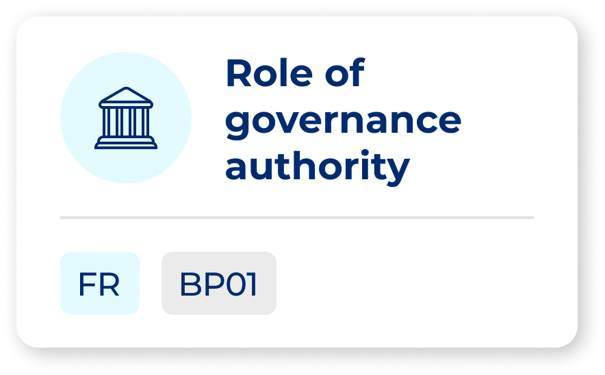<br>
<b>BP01</b><br>
<sub>Define dataspace governance</sub>
</a>
</td>
<td align="center" valign="top" width="200">
<a href="./foundations/business-processes/BP02-configuration-governance-authority/README.md">
<br>
<b>BP02</b><br>
<sub>Configure data space</sub>
</a>
</td>
<td align="center" valign="top" width="200">
<a href="./foundations/business-processes/BP03A-onboarding-participant-providers/README.md">
<br>
<b>BP03A</b><br>
<sub>Onboard providers &amp; consumers</sub>
</a>
</td>
<td align="center" valign="top" width="200">
<a href="./foundations/business-processes/BP03B-onboarding-participant-end-user/README.md">
<br>
<b>BP03B</b><br>
<sub>Onboard end-users</sub>
</a>
</td>
</tr>
<tr>
<td align="center" valign="top" width="200">
<a href="./foundations/business-processes/BP05B-provider-manages-resource-descriptions/README.md">
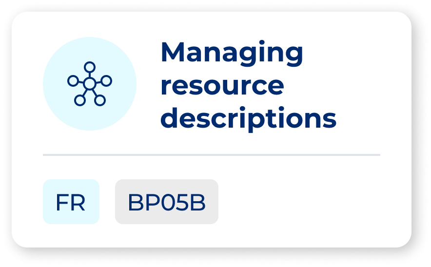<br>
<b>BP05B</b><br>
<sub>Manage resource descriptions</sub>
</a>
</td>
<td align="center" valign="top" width="200">
<a href="./foundations/business-processes/BP06-consumer-searches-resources/README.md">
<br>
<b>BP06</b><br>
<sub>Search resources</sub>
</a>
</td>
<td align="center" valign="top" width="200">
<a href="./foundations/business-processes/BP07-establish-usage-contract/README.md">
<br>
<b>BP07</b><br>
<sub>Establish usage contract</sub>
</a>
</td>
<td align="center" valign="top" width="200">
<a href="./foundations/business-processes/BP08-consume-infrastructure-resource/README.md">
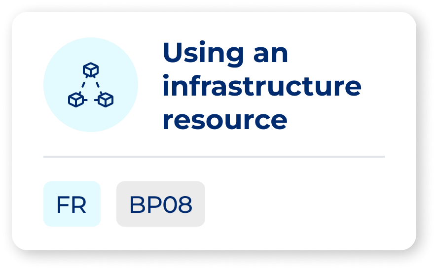<br>
<b>BP08</b><br>
<sub>Consume infrastructure resource</sub>
</a>
</td>
</tr>
<tr>
<td align="center" valign="top" width="200">
<a href="./foundations/business-processes/BP09A-consume-data-resource/README.md">
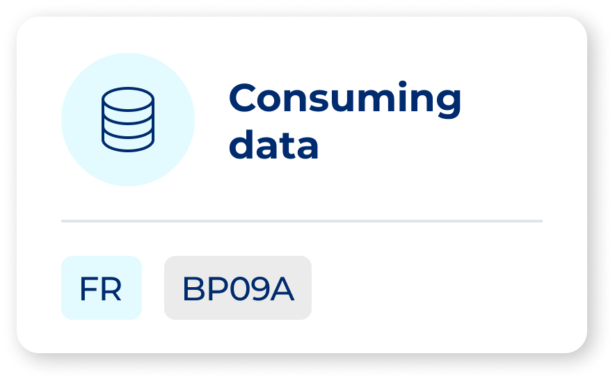<br>
<b>BP09A</b><br>
<sub>Consume data resource</sub>
</a>
</td>
<td align="center" valign="top" width="200">
<a href="./foundations/business-processes/BP09B-consume-data-via-application/README.md">
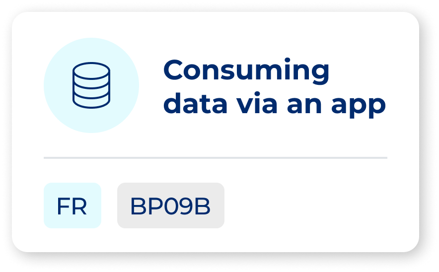<br>
<b>BP09B</b><br>
<sub>Consume data via application</sub>
</a>
</td>
<td align="center" valign="top" width="200">
<a href="./foundations/business-processes/BP12B-single-node-logging-monitoring/README.md">
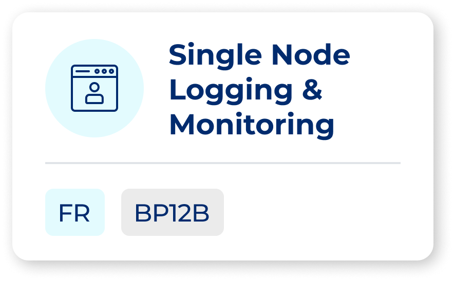<br>
<b>BP12B</b><br>
<sub>Single-node logging &amp; monitoring</sub>
</a>
</td>
<td align="center" valign="top" width="200">
<a href="./foundations/business-processes/BP13-it-administration/README.md">
<br>
<b>BP13</b><br>
<sub>IT administration</sub>
</a>
</td>
</tr>
</table>

> **BP03C** (End-user role request) has no card image on the public index page and is omitted from the tile grid above.

---

## Supporting activities

No card images exist on the public index page for the SA entries. Text-only links:

| ID | Name | Description |
|----|------|-------------|
| [SA01](./foundations/business-processes/SA01-data-orchestration/README.md) | Data orchestration | Design, execute, and monitor traceable multi-step data processing workflows |
| [SA02](./foundations/business-processes/SA02-data-processing-services/README.md) | Data processing services | Pseudonymisation and anonymisation services for participants |
| [SA03](./foundations/business-processes/SA03-credentials-actions-governance-authority/README.md) | Credentials actions | Governance Authority manages participant credentials: revocation, suspension, renewal |
| [SA04](./foundations/business-processes/SA04-provider-manages-deployment-scripts/README.md) | Deployment scripts | Infrastructure Providers create and manage VM templates and deployment scripts |

See [foundations/business-processes/README.md](./foundations/business-processes/README.md) for the full list and detailed content.

---

## Non-Functional Requirements

Non-functional requirements (NFRs) are the quality attributes the Simpl system must satisfy: accessibility, availability, security, performance, and more. They constrain how the architecture and business processes are designed — a solution may correctly implement a business process yet still fail an NFR if it does not meet the stated thresholds. NFRs are sourced from the public Simpl Requirements site, and measurable thresholds are quoted verbatim from that source wherever they are defined. Each NFR folder in this catalogue documents the requirement in the author's own words alongside the canonical source link and any verbatim threshold statements.

<table>
<tr>
<td align="center" valign="top" width="200">
<a href="./foundations/non-functional-requirements/NFR01-accessibility/README.md">
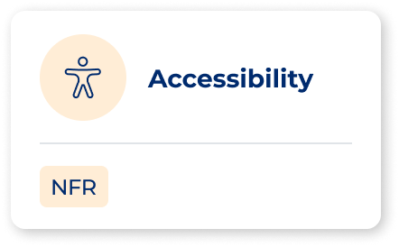<br>
<b>NFR01</b><br>
<sub>Accessibility</sub>
</a>
</td>
<td align="center" valign="top" width="200">
<a href="./foundations/non-functional-requirements/NFR02-availability/README.md">
<br>
<b>NFR02</b><br>
<sub>Availability</sub>
</a>
</td>
<td align="center" valign="top" width="200">
<a href="./foundations/non-functional-requirements/NFR03-composability-extensibility/README.md">
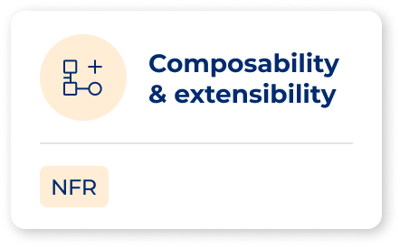<br>
<b>NFR03</b><br>
<sub>Composability &amp; extensibility</sub>
</a>
</td>
<td align="center" valign="top" width="200">
<a href="./foundations/non-functional-requirements/NFR04-discoverability/README.md">
<br>
<b>NFR04</b><br>
<sub>Discoverability</sub>
</a>
</td>
</tr>
<tr>
<td align="center" valign="top" width="200">
<a href="./foundations/non-functional-requirements/NFR05-federation/README.md">
<br>
<b>NFR05</b><br>
<sub>Federation</sub>
</a>
</td>
<td align="center" valign="top" width="200">
<a href="./foundations/non-functional-requirements/NFR06-interoperability/README.md">
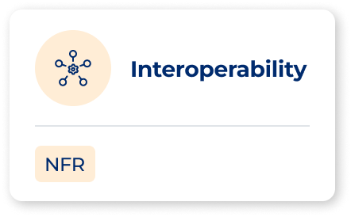<br>
<b>NFR06</b><br>
<sub>Interoperability</sub>
</a>
</td>
<td align="center" valign="top" width="200">
<a href="./foundations/non-functional-requirements/NFR07-loose-coupling/README.md">
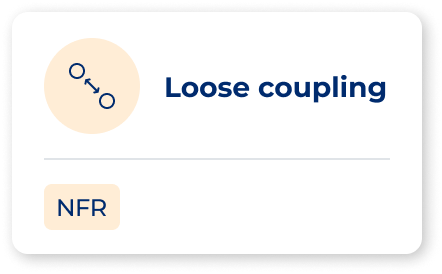<br>
<b>NFR07</b><br>
<sub>Loose coupling</sub>
</a>
</td>
<td align="center" valign="top" width="200">
<a href="./foundations/non-functional-requirements/NFR08-maintainability/README.md">
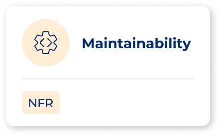<br>
<b>NFR08</b><br>
<sub>Maintainability</sub>
</a>
</td>
</tr>
<tr>
<td align="center" valign="top" width="200">
<a href="./foundations/non-functional-requirements/NFR09-modularity/README.md">
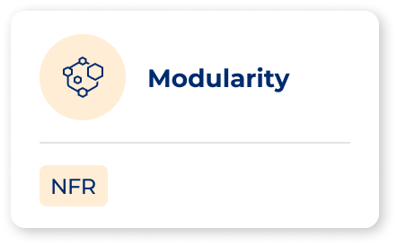<br>
<b>NFR09</b><br>
<sub>Modularity</sub>
</a>
</td>
<td align="center" valign="top" width="200">
<a href="./foundations/non-functional-requirements/NFR10-openness-agnosticism/README.md">
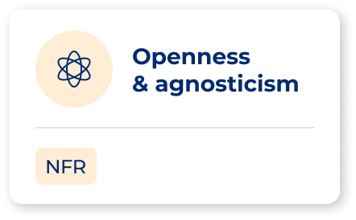<br>
<b>NFR10</b><br>
<sub>Openness &amp; agnosticism</sub>
</a>
</td>
<td align="center" valign="top" width="200">
<a href="./foundations/non-functional-requirements/NFR11-reliability/README.md">
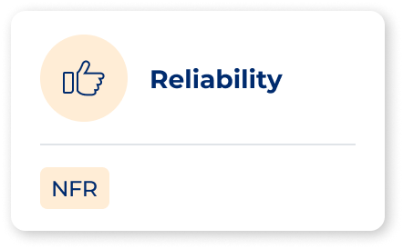<br>
<b>NFR11</b><br>
<sub>Reliability</sub>
</a>
</td>
<td align="center" valign="top" width="200">
<a href="./foundations/non-functional-requirements/NFR12-resilience/README.md">
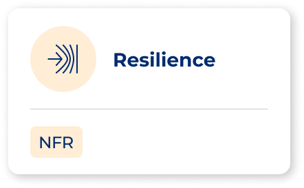<br>
<b>NFR12</b><br>
<sub>Resilience</sub>
</a>
</td>
</tr>
<tr>
<td align="center" valign="top" width="200">
<a href="./foundations/non-functional-requirements/NFR13-scalability-elasticity/README.md">
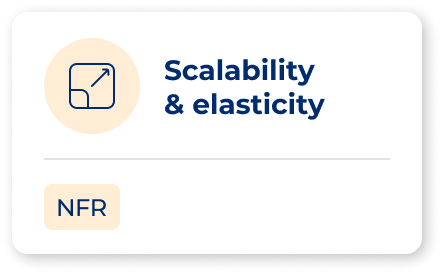<br>
<b>NFR13</b><br>
<sub>Scalability &amp; elasticity</sub>
</a>
</td>
<td align="center" valign="top" width="200">
<a href="./foundations/non-functional-requirements/NFR14-security-privacy-trust/README.md">
<br>
<b>NFR14</b><br>
<sub>Security, privacy &amp; trust</sub>
</a>
</td>
<td align="center" valign="top" width="200">
<a href="./foundations/non-functional-requirements/NFR15-usability/README.md">
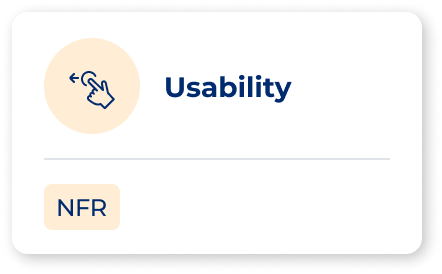<br>
<b>NFR15</b><br>
<sub>Usability</sub>
</a>
</td>
<td></td>
</tr>
</table>

See [foundations/non-functional-requirements/README.md](./foundations/non-functional-requirements/README.md) for the full list and detailed content.

---

## Capability Map

Simpl-Open organises its functionality into six dimensions: Administration, Data, Governance, Infrastructure, Integration, and Security. Each dimension contains one or more capabilities, each capability contains one or more business services, and each business service is realised by one or more solutions. This four-level hierarchy — dimension → capability → business service → solution — is the organising principle of the entire repository tree. The map was defined in the Simpl-Open functional and technical architecture specification and governs how documentation folders are named, nested, and cross-referenced. Every solution folder in this catalogue sits at a path of the form `dimension/capability/business-service/solution/` that corresponds directly to a node in the map.

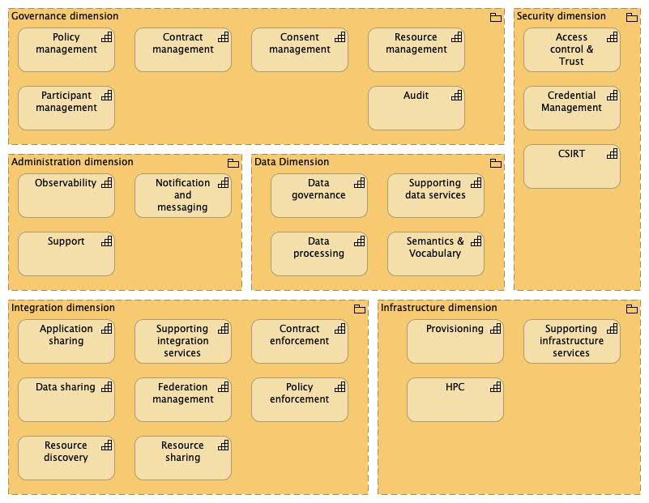
*Figure: The six dimensions of Simpl and their capabilities.*

### Dimensions

- [administration/](./administration/README.md) — platform management and operational services for a Simpl-Open agent node, covering observability and notification and messaging
  - [observability/](./administration/observability/README.md)
  - [support/](./administration/support/README.md) (Not yet implemented)
  - [notification-and-messaging/](./administration/notification-and-messaging/README.md)
- [data/](./data/README.md) — data-related platform services covering schema and vocabulary governance, data workflow orchestration, and supporting data services
  - [data-governance/](./data/data-governance/README.md) (Not yet implemented)
  - [data-processing/](./data/data-processing/README.md)
    - [anonymisation-and-pseudonymisation/](./data/data-processing/anonymisation-and-pseudonymisation/README.md)
  - [supporting-data-services/](./data/supporting-data-services/README.md)
  - [semantics-and-vocabulary/](./data/semantics-and-vocabulary/README.md)
- [governance/](./governance/README.md) — governance services covering participant lifecycle management, contract management, policy administration, and resource description management
  - [consent-management/](./governance/consent-management/README.md) (Not yet implemented)
  - [contract-management/](./governance/contract-management/README.md)
  - [policy-management/](./governance/policy-management/README.md)
  - [audit/](./governance/audit/README.md) (Not yet implemented)
  - [resource-management/](./governance/resource-management/README.md)
  - [participant-management/](./governance/participant-management/README.md)
- [infrastructure/](./infrastructure/README.md) — infrastructure provisioning services enabling consumers to request and access compute, storage, and network resources
  - [provisioning/](./infrastructure/provisioning/README.md)
  - [supporting-infrastructure-services/](./infrastructure/supporting-infrastructure-services/README.md) (Not yet implemented)
  - [hpc/](./infrastructure/hpc/README.md) (Not yet implemented)
- [integration/](./integration/README.md) — integration services connecting data space participants for resource discovery, catalogue publication, and resource sharing
  - [data-sharing/](./integration/data-sharing/README.md) (bulk transfer implemented inside the Connector; simple transfer and streaming are roadmap)
  - [application-sharing/](./integration/application-sharing/README.md) (Not yet implemented)
  - [federated-management/](./integration/federated-management/README.md) (Not yet implemented)
  - [resource-discovery/](./integration/resource-discovery/README.md)
  - [policy-enforcement/](./integration/policy-enforcement/README.md) (Not yet implemented)
  - [contract-enforcement/](./integration/contract-enforcement/README.md) (Not yet implemented)
  - [supporting-integration-services/](./integration/supporting-integration-services/README.md) (Not yet implemented)
  - [resource-sharing/](./integration/resource-sharing/README.md)
- [security/](./security/README.md) — identity, authentication, authorisation, and credential management services implementing a two-tier IAA architecture
  - [credential-management/](./security/credential-management/README.md)
  - [csirt/](./security/csirt/README.md) (Not yet implemented)
  - [access-control-and-trust/](./security/access-control-and-trust/README.md)

See [foundations/capability-map.md](./foundations/capability-map.md) for the full L1 + L2 map with all business services.

---

## How Business Processes, Architecture, and NFRs Relate

*This section is intentionally left as a placeholder. The narrative explaining how business processes, the implementation architecture, and non-functional requirements relate to each other will be authored separately and inserted here. Do not auto-generate this content.*

---

## Foundational Reference

Supporting documents that establish the design vocabulary and governing commitments of Simpl-Open:

- [Architectural principles](./foundations/principles.md) — high-level design commitments informing every architecture decision across Simpl-Open, sourced from the functional and technical architecture document.
- [Architectural patterns](./foundations/architectural-patterns.md) — recurring structural and behavioural design patterns applied across solutions, sourced from the functional and technical architecture document.
- [Glossary](./foundations/glossary.md) — definitional anchor for Simpl terminology, sourced from the official Simpl programme glossary.

---

## Other Contents

- [cross-cutting/](./cross-cutting/README.md) — components that don't map to a single capability
  - [agents/](./cross-cutting/agents/README.md) — actor-specific master Helm charts (Consumer, Data Provider, Governance Authority, etc.)
  - [tests/](./cross-cutting/tests/README.md) — IAA API and UI test suites
  - [utils/](./cross-cutting/utils/README.md) — operational utilities (EJBCA preconfig, IAA CLI, SD-Schemas generator)
  - [libs/](./cross-cutting/libs/README.md) — shared Java/Python/Vue libraries
  - [samples/](./cross-cutting/samples/README.md) — eIDAS demo node, echo service, microfrontend skeleton
- [foundations/interoperability.md](./foundations/interoperability.md) — technical and semantic interoperability index

---
