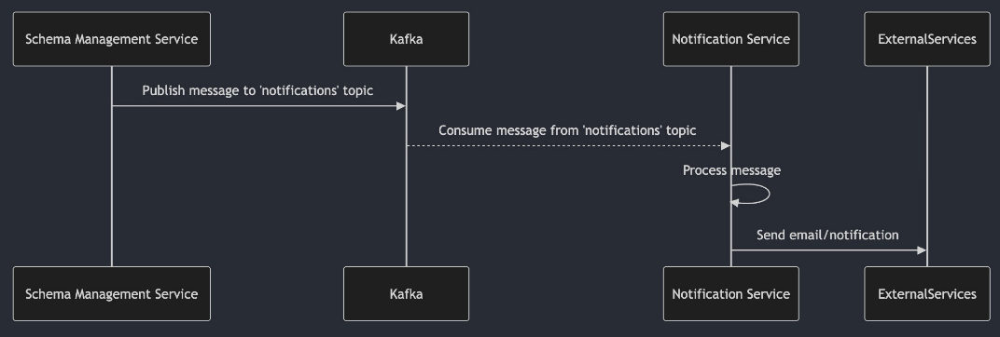

Source: functional-and-technical-architecture-specifications.md, section 6.5.8 (Notification Service — architecture, AsyncAPI specification, message flow).

# Notification Service — architecture

## Business view

The Notification Service sends notifications to data space participants in response to platform events. It implements an asynchronous, event-driven architecture using Apache Kafka for message queuing. Other Simpl-Open services act as Kafka producers, publishing notification messages to the `notifications` topic; the Notification Service consumes these messages and dispatches the actual notifications (e.g., emails) to recipients.

Example use case: when the Schema Management Service publishes a new schema, it sends a notification message to the `notifications` topic; the Notification Service delivers an email to affected providers.

Capability-map placement: Administration dimension → Notification and messaging capability → Notification business service.

## Data view

Notification messages conform to the `EmailNotification` schema defined in the AsyncAPI specification:

| Field | Type | Description |
|-------|------|-------------|
| `channel` | string (enum: `email`) | Notification channel type |
| `message` | string | Body of the message |
| `to` | string | Email address of the recipient |
| `cc` | array of string | CC email addresses |
| `subject` | string | Subject of the message |

Messages are serialised as JSON and published to the `notifications` Kafka topic.

## Application view

### Internal decomposition

**Notification Service:**
- Kafka consumer subscribing to the `notifications` topic.
- Receives `EmailNotification` messages published by other Simpl-Open services.
- Dispatches the actual notification (email delivery) to the specified recipient.

**Producer pattern (other services):**
1. Construct an `EmailNotification` message conforming to the AsyncAPI schema.
2. Serialise the message payload as a JSON string.
3. Publish to the `notifications` Kafka topic.

### Key integrations

- [Schema Management Service](../../../../../data/semantics-and-vocabulary/schema-management/schema-management-service/doc/architecture.md) — publishes schema lifecycle notifications (new schema published, schema revoked) to the `notifications` topic for delivery to providers.
- [Onboarding](../../../../../governance/participant-management/onboarding/onboarding-service/README.md) — sends status-change notifications (submitted / approved / rejected / ready) through this service.
- [Contract Manager](../../../../../governance/contract-management/contract-establishment/contract-manager/README.md) — emits contract-lifecycle notifications.
- Any Simpl-Open service that needs to notify participants can act as a Kafka producer to the `notifications` topic.
- [Common Logging (Java)](../../../../observability/logging/common-logging-java/README.md) — every published notification message is also logged in structured form, enabling end-to-end correlation across the Monitoring Service.

## Technical view

- **API specification**: AsyncAPI v3.0.0.
- **Message broker**: Apache Kafka (`kafka-secure` protocol); production host `kafka://localhost:9094`.
- **Channel**: `notifications` topic.
- **Message format**: JSON (`EmailNotification` schema).
- **Notification delivery**: email (current channel; enum value `email`).

The Notification Service is configured with the Kafka broker details and the `to:` email address(es) for notification delivery targets.

Source repository: `contract-billing/notification-service`. AsyncAPI specification: `notification-service/docs/asyncApi/asyncapi.yaml` in the source repository.

Deployment: deployed as a shared service in the `common` namespace alongside other shared platform services.

## Security view

- Communication with the Kafka broker uses `kafka-secure` protocol.
- Notification messages contain recipient email addresses and message content; access to the `notifications` topic should be restricted to authorised producer services.
- The Kafka broker configuration governs topic-level access control.

Threat model: Status: not yet documented.

Secrets management: Status: not yet documented.

## Testing

Strategy: Status: not yet documented.

PSO validation status: Status: not yet documented.

Requirements traceability: Status: not yet documented.
