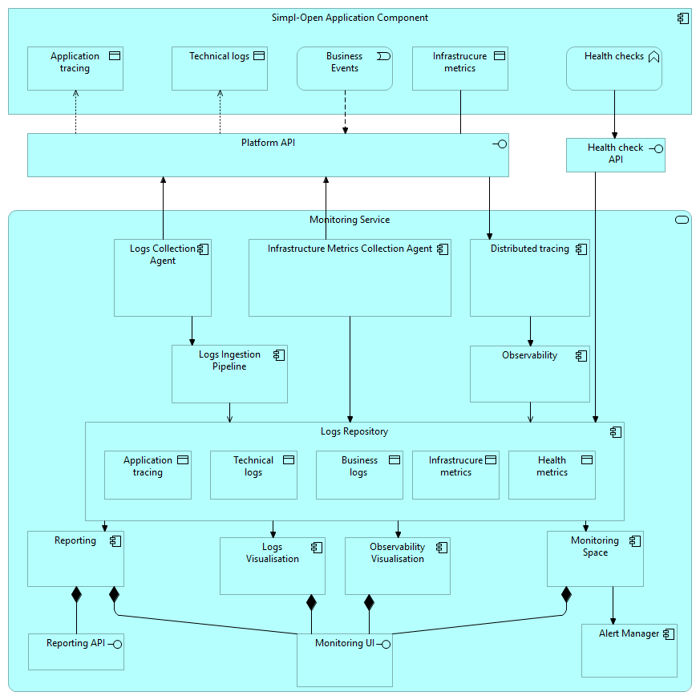

Source: functional-and-technical-architecture-specifications.md, sections 4.4.1 (ACV Static — Monitoring Service), 4.4.2 (ACV Dynamic — WF 12B Local Node Logging and Monitoring).

# Monitoring Service — architecture

## Business view

The Monitoring Service provides observability for all Simpl-Open application components within a single node (intra-node scope; inter-node federation is not yet described). It collects technical logs, business events, infrastructure metrics, and health check data from Simpl-Open application components, ingests and standardises them, and makes them available for dashboarding, visualisation, alerting, and reporting.

The Monitoring Service is offered to all Simpl-Open Application Components as a shared platform service. It spans multiple observability business services within the administration dimension: logging, dashboarding, QoS metrics and alerts, performance monitoring, and reporting.

Note (from step 3, flag c-1): placed under `dashboarding` as the Monitoring Space's primary function; the component architecturally cross-cuts multiple observability business services.

Capability-map placement: Administration dimension → Observability capability → Dashboarding business service (primary placement).

## Data view

All log types and metrics converge in the Logs Repository:
- **Technical logs** — application access logs, error logs, and platform-level logs.
- **Business events** — application-generated events triggered by business workflow steps (e.g., "Participant successfully onboarded").
- **Infrastructure metrics** — CPU utilisation, RAM utilisation, and other resource metrics.
- **Health check data** — periodic health status snapshots from Simpl-Open component health endpoints.
- **Tracing data** — API request traces for bottleneck discovery.

The Logs Repository serves as the central hub feeding the Monitoring Space, Logs Visualisation, and Reporting components.

## Application view

### Internal decomposition

**Simpl-Open Application Component (abstraction):**
- Represents any Simpl-Open application component being monitored.
- Produces: technical logs, business events, infrastructure metrics, health check responses, tracing data.
- Exposes these via APIs for collection.

**Log Collection Agent:**
- Collects technical and business logs from each Simpl-Open application component.
- Forwards collected logs to the Log Ingestion Pipeline.

**Log Ingestion Pipeline:**
- Receives logs from the Log Collection Agent.
- Standardises log format before storing them in the Logs Repository.

**Infrastructure Metrics Collection Agent:**
- Collects infrastructure metrics from each Simpl-Open application component.
- Stores metrics directly in the Logs Repository (bypassing the ingestion pipeline).

**Platform API:**
- An API provided by the deployment platform (Kubernetes) that allows collection of enriched logs and metrics.

**Logs Repository:**
- Central hub storing all types of logs and metrics in dedicated sections.
- Feeds the Monitoring Space, Logs Visualisation, and Reporting components.

**Monitoring Space:**
- Displays dashboards built on top of the different logs and metrics.
- Also directly queries health endpoints to display live component status.
- Connected to the Alert Manager to trigger alerts based on predefined thresholds.

**Logs Visualisation:**
- Allows users to run queries on the logs and visualise them in a user interface.
- Shares a common UI with the Monitoring Space (distinct tabs for each functionality).

**Reporting:**
- Includes both a UI for exports and an API to query logs for external purposes (e.g., monitoring federation, billing).

**Alert Manager:**
- Connected to the Monitoring Space; triggers alerts based on predefined thresholds.

**Health Checks:**
- An internal scheduler periodically queries Simpl-Open component health endpoints and stores results in the Logs Repository for further visualisation.

**Application Tracing:**
- Provides a mechanism to follow API requests' journeys through Simpl-Open agent components.

### Workflow — WF 12B (Local Node Logging and Monitoring)

1. **Log and Event Generation**: Simpl-Open Application Components produce technical logs, business events, infrastructure metrics, and health check data.
2. **Logs Collection**: Log Collection Agent retrieves technical logs and business events, forwards to Log Ingestion Pipeline.
3. **Metrics Collection**: Infrastructure Metrics Collection Agent gathers infrastructure metrics and forwards directly to Logs Repository.
4. **Log Transformation**: Log Ingestion Pipeline processes and standardises raw logs before storage.
5. **Centralised Storage**: Logs Repository stores all data types in dedicated sections.
6. **Log Visualisation**: Logs Visualisation component retrieves and displays logs for analysis.
7. **Data Aggregation**: Monitoring Space aggregates logs and metrics for real-time system health analysis.
8. **Alerting**: Alert Manager triggers alerts when metrics exceed predefined thresholds.

## Technical view

Implemented on the Elastic Cloud on Kubernetes (ECK) stack:
- **Log Collection Agent** — Filebeat deployed as a DaemonSet on Kubernetes nodes; collects logs from all application pods.
- **Log Ingestion Pipeline** — Logstash (or Elastic ingest pipeline).
- **Logs Repository** — Elasticsearch (via ECK); stores logs, metrics, and events.
- **Monitoring Space** — Kibana dashboards.
- **Logs Visualisation** — Kibana discover / query interface.
- **Reporting** — Kibana reporting module + Reporting API.
- **Alert Manager** — Kibana alerting rules / Elastic Watcher.
- **Infrastructure Metrics Collection Agent** — Metricbeat / Elastic Agent.
- **Health Checks** — Heartbeat (Elastic stack); periodically queries Simpl-Open component health endpoints and stores results in Elasticsearch.
- **Application Tracing** — Elastic APM.
- **Common Logging Library** — [`administration/observability/logging/common-logging-java`](../../../logging/common-logging-java/README.md) (Java) and [`common-logging-python`](../../../logging/common-logging-python/README.md) (Python) — shared structured-logging libraries that emit log lines in the format consumed by this stack.
- **ECK Operator** — source repo `monitoring/eck-monitoring-operator` — manages ECK cluster lifecycle on Kubernetes (cluster creation, rolling upgrades, configuration changes).

### Sibling solution

Cloud-provider consumption-data ingestion is its own service:
- [Infrastructure Consumption Monitoring Service](../../infrastructure-consumption-monitoring-service/doc/architecture.md) — scheduled extraction of consumption data (default OVH) published to Kafka. Distinct from the log/metric pipeline described above; downstream Kibana dashboards and billing flows consume from its Kafka topic.

Deployment: deployed per node (intra-node scope). Each Simpl-Open agent runs its own Monitoring Service instance.

## Security view

- Access to Kibana dashboards and the Reporting API is role-controlled:
  - `KIBANA_BUSINESS_USER` — read access to Kibana for business users.
  - `KIBANA_ADMIN` — administrative access to Kibana.
- The Reporting API exposes log data to external consumers (billing, federation monitoring); access must be authenticated and audited.
- Business events carry participant-identifiable data; retention and access policies must align with data space governance requirements.

Threat model: Status: not yet documented.

Secrets management: Status: not yet documented.

## Testing

Strategy: Status: not yet documented.

PSO validation status: Status: not yet documented.

Requirements traceability: Status: not yet documented.
