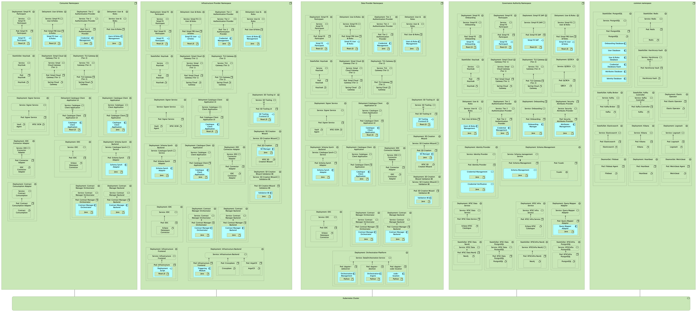

⚠️ <strong>Work in progress — yet to be validated</strong>

📍 <strong>You are here</strong> 
<a href="../../README.md">🏠 Home</a> 
    <a href="../README.md">Cross-Cutting</a> 
        <strong>Agents</strong> 

# Agents

Master Helm charts that compose the modules of the capability map into a deployable **Simpl-Open Agent**. An agent is a deployment composition, not a service in its own right — each actor type (Provider, Consumer, Governance Authority, Application Provider, Infrastructure Provider) deploys its own agent that bundles only the modules relevant to that actor's role.

These compositions cross every dimension of the capability map (security, governance, data, integration, infrastructure, administration), which is why they live under `cross-cutting/` rather than inside a single dimension.

## Agents

- [consumer-agent/](consumer-agent/README.md) — bundles the modules a Consumer Participant needs (catalogue client, contract consumption, EDC consumer connector, Tier 1/Tier 2 client stack).
- [data-provider-agent/](data-provider-agent/README.md) — bundles the Provider-side modules for sharing data resources (SD-Tooling, EDC provider connector, schema management client).
- [application-provider-agent/](application-provider-agent/README.md) — Provider variant for application/processing services. Currently a placeholder.
- [infrastructure-provider-agent/](infrastructure-provider-agent/README.md) — Provider variant for infrastructure resources. Currently a placeholder.
- [governance-authority-agent/](governance-authority-agent/README.md) — bundles the modules deployed inside the Governance Authority (onboarding, identity provider, EJBCA, signer, federated catalogue, schema management).
- [common-components/](common-components/README.md) — shared Helm chart bundle reused across the agents (Kafka, OpenBao, PostgreSQL).
- [agent-iaa/](agent-iaa/README.md) — per-actor-type IAA configuration bundles (authority, consumer, participant, provider) consumed by the master Helm chart agents above.

## Deployment composition overview

The figure below is the technology deployment view from [FTA §6.2](../../foundations/deployment-model.md#technology-deployment-view--fta-62). Each agent runs inside its own Kubernetes namespace; the rightmost `common` namespace hosts the shared infrastructure that every agent depends on. Application Provider is omitted from the figure — FTA §6.2 explicitly notes it is out of scope for the current release.

The four sub-sections below summarise what each namespace contains and link the deployed pods to their source folders in this catalogue.

### Consumer Agent

A consumer node is what an end-user organisation deploys to **discover, contract for, and consume** resources published by Providers. Its namespace contains the participant-side IAA stack, the catalogue search client, the contract consumption back-end, and the EDC consumer connector. See [`consumer-agent/`](consumer-agent/README.md) for the master Helm chart and deployment guide.

| K8s workload (per image159) | Module in this catalogue |
|---|---|
| Simpl FE Participant | (frontend bundled into the agent) |
| User & Roles | [governance/participant-management/user-roles/fe-users-roles/](../../governance/participant-management/user-roles/fe-users-roles/README.md) |
| Tier 2 Authentication Provider | [security/access-control-and-trust/authentication-provider-federation/tier-2-authentication-provider/](../../security/access-control-and-trust/authentication-provider-federation/tier-2-authentication-provider/README.md) |
| Keycloak (StatefulSet) | [security/access-control-and-trust/identity-provider-federation/](../../security/access-control-and-trust/identity-provider-federation/README.md) |
| Simpl Cloud Gateway (Tier 1) | [security/access-control-and-trust/authorisation/](../../security/access-control-and-trust/authorisation/README.md) |
| TLS Gateway (Tier 2) | [security/access-control-and-trust/authorisation/authorisation-tier-2/](../../security/access-control-and-trust/authorisation/authorisation-tier-2/README.md) |
| Signer Service | [security/credential-management/signing/signer-service/](../../security/credential-management/signing/signer-service/README.md) |
| Catalogue Client Application (UI + backend) | [integration/resource-discovery/search-engine/catalogue-client-application/](../../integration/resource-discovery/search-engine/catalogue-client-application/README.md) |
| Schema Sync | [data/semantics-and-vocabulary/schema-management/schema-sync-service/](../../data/semantics-and-vocabulary/schema-management/schema-sync-service/README.md) |
| EDC + EDC Connector Adapter | [integration/resource-sharing/resource-sharing-runtime/connector/](../../integration/resource-sharing/resource-sharing-runtime/connector/README.md), [edc-connector-adapter/](../../integration/resource-sharing/resource-sharing-runtime/edc-connector-adapter/README.md) |
| Contract Manager (Orchestrator + Backend) | [governance/contract-management/contract-establishment/contract-manager/](../../governance/contract-management/contract-establishment/contract-manager/README.md) |
| Validation Backend | [integration/resource-discovery/search-engine/validation-backend/](../../integration/resource-discovery/search-engine/validation-backend/README.md) |

### Provider Agent

The Provider role has three flavours — Data, Application, and Infrastructure — that share the same IAA / catalogue / connector baseline as the Consumer (Simpl FE, User & Roles, Tier 2 Auth, Keycloak, Cloud Gateway, TLS Gateway, Signer Service, Catalogue Client, Schema Sync, EDC + EDC Adapter, Contract Manager) and add per-flavour modules on top. Per FTA §6.2 the diagram covers Data and Infrastructure today; Application Provider is a placeholder.

**Data Provider** — adds the data-resource publication and orchestration stack. See [`data-provider-agent/`](data-provider-agent/README.md).

| K8s workload (per image159) | Module in this catalogue |
|---|---|
| Asset Orchestrator | [data/supporting-data-services/data-orchestration/asset-orchestrator/](../../data/supporting-data-services/data-orchestration/asset-orchestrator/README.md) |
| Orchestration Platform (Dagit / daemon / webserver / code-locations) | [data/supporting-data-services/data-orchestration/orchestration-platform/](../../data/supporting-data-services/data-orchestration/orchestration-platform/README.md) |
| Anonymisation / Pseudonymisation (optional code-locations) | [data/data-processing/anonymisation-and-pseudonymisation/](../../data/data-processing/anonymisation-and-pseudonymisation/README.md) |

**Infrastructure Provider** — adds the SD-Tooling stack and the infrastructure provisioning back-end / front-end. See [`infrastructure-provider-agent/`](infrastructure-provider-agent/README.md).

| K8s workload (per image159) | Module in this catalogue |
|---|---|
| SD Tooling UI / Backend / Manager / Validation BE / Creation Wizard | [sd-tooling-api/](../../data/semantics-and-vocabulary/schema-management/sd-tooling-api/README.md), [sd-manager/](../../governance/resource-management/metadata-description/sd-manager/README.md), [validation-backend/](../../governance/resource-management/metadata-description/validation-backend/README.md) |
| Infrastructure Frontend | [infrastructure/provisioning/infrastructure-provisioning/](../../infrastructure/provisioning/infrastructure-provisioning/README.md) |
| Infrastructure Backend (Argo CD) | [infrastructure/supporting-infrastructure-services/infrastructure-orchestration/argo-cd/](../../infrastructure/supporting-infrastructure-services/infrastructure-orchestration/argo-cd/README.md) |
| Triggering Module | [infrastructure/provisioning/infrastructure-provisioning/infrastructure-be/](../../infrastructure/provisioning/infrastructure-provisioning/infrastructure-be/README.md) |

**Application Provider** — placeholder; the source repo currently ships a LICENSE only. Once delivered, the composition is expected to mirror the Provider baseline plus [application-sharing](../../integration/application-sharing/README.md) modules ([machine-learning-model/](../../integration/application-sharing/machine-learning-model/README.md), [software-apps/](../../integration/application-sharing/software-apps/README.md)). See [`application-provider-agent/`](application-provider-agent/README.md).

### Governance Authority Agent

The GA namespace hosts the **central / federated services** that no Provider or Consumer runs locally — onboarding, the identity provider (with EJBCA as the data space CA), security attribute management, the federated catalogue, schema management, and the signer service. See [`governance-authority-agent/`](governance-authority-agent/README.md).

| K8s workload (per image159) | Module in this catalogue |
|---|---|
| Simpl FE Onboarding / Participant / SAP | (frontends bundled into the agent) |
| Onboarding (Manager) | [governance/participant-management/onboarding/fe-onboarding/](../../governance/participant-management/onboarding/fe-onboarding/README.md) |
| User & Roles | [governance/participant-management/user-roles/fe-users-roles/](../../governance/participant-management/user-roles/fe-users-roles/README.md) |
| Keycloak (StatefulSet) | [security/access-control-and-trust/identity-provider-federation/](../../security/access-control-and-trust/identity-provider-federation/README.md) |
| Simpl Cloud Gateway (Tier 1) / TLS Gateway (Tier 2) | [security/access-control-and-trust/authorisation/](../../security/access-control-and-trust/authorisation/README.md) |
| Tier 2 Authentication Provider | [security/access-control-and-trust/authentication-provider-federation/tier-2-authentication-provider/](../../security/access-control-and-trust/authentication-provider-federation/tier-2-authentication-provider/README.md) |
| Identity Provider (EJBCA-backed) | [security/access-control-and-trust/identity-provider-federation/identity-provider/](../../security/access-control-and-trust/identity-provider-federation/identity-provider/README.md), (EJBCA — folder removed) |
| Credential Management / Verification | [security/credential-management/](../../security/credential-management/README.md) |
| Security Attributes Provider (Attributes Management) | [security/access-control-and-trust/security-attribute-provider-federation/security-attributes-provider/](../../security/access-control-and-trust/security-attribute-provider-federation/security-attributes-provider/README.md) |
| Schema Management Service (+ Apache Jena Fuseki) | [data/semantics-and-vocabulary/schema-management/simpl-schema-manager/](../../data/semantics-and-vocabulary/schema-management/simpl-schema-manager/README.md), [apache-jena-fuseki/](../../data/semantics-and-vocabulary/schema-management/apache-jena-fuseki/README.md) |
| Signer Service | [security/credential-management/signing/signer-service/](../../security/credential-management/signing/signer-service/README.md) |
| XFSC Federated Catalogue (+ Query Mapper Adapter) | [integration/resource-discovery/resource-catalogue/xfsc-federated-catalogue/](../../integration/resource-discovery/resource-catalogue/xfsc-federated-catalogue/README.md), [simpl-catalogue/](../../integration/resource-discovery/resource-catalogue/simpl-catalogue/README.md), [query-mapper-adapter/](../../integration/resource-discovery/search-engine/query-mapper-adapter/README.md) |
| EJBCA Preconfig (init-container) | [cross-cutting/samples/ejbca-preconfig/](../samples/ejbca-preconfig/README.md) |

### Common Components

The `common` namespace contains the shared infrastructure that every agent depends on — secrets, persistence, message broker, and the observability stack. See [`common-components/`](common-components/README.md) for the bundled Helm chart.

| K8s workload (per image159) | Module in this catalogue |
|---|---|
| StatefulSet PostgreSQL (Onboarding / User / User & Roles / Credential / Attributes / Identity DBs) | [foundations/data-architecture/postgresql/](../../foundations/data-architecture/postgresql/README.md) |
| StatefulSet Redis | [foundations/data-architecture/redis/](../../foundations/data-architecture/redis/README.md) |
| StatefulSet HashiCorp Vault | [security/access-control-and-trust/encryption/](../../security/access-control-and-trust/encryption/README.md) |
| StatefulSet Kafka Broker / Controller | [administration/notification-and-messaging/notification/apache-kafka/](../../administration/notification-and-messaging/notification/apache-kafka/README.md) |
| Elastic Operator + Elasticsearch + Kibana + Logstash | [administration/observability/logging/elk-stack/](../../administration/observability/logging/elk-stack/README.md) |
| DaemonSet Filebeat | [administration/observability/logging/filebeat/](../../administration/observability/logging/filebeat/README.md) |
| Deployment Heartbeat | [administration/observability/performance-monitoring/heartbeat/](../../administration/observability/performance-monitoring/heartbeat/README.md) |
| DaemonSet Metricbeat | [administration/observability/performance-monitoring/metricbeat/](../../administration/observability/performance-monitoring/metricbeat/README.md) |
