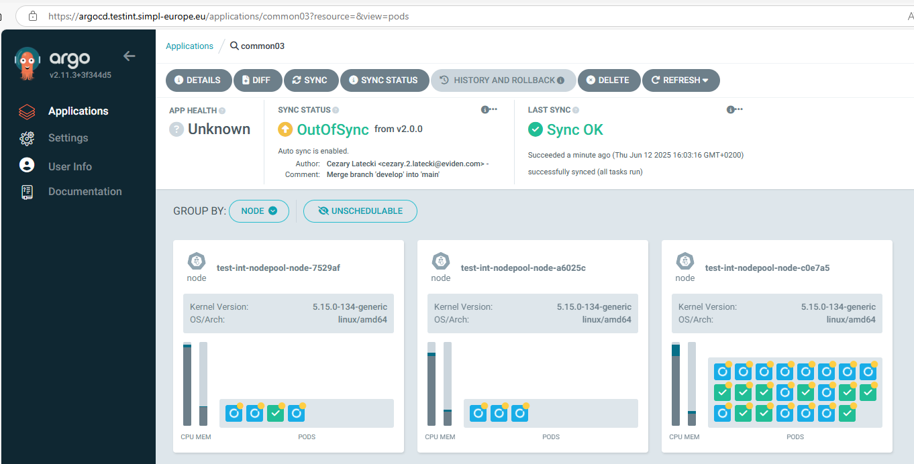
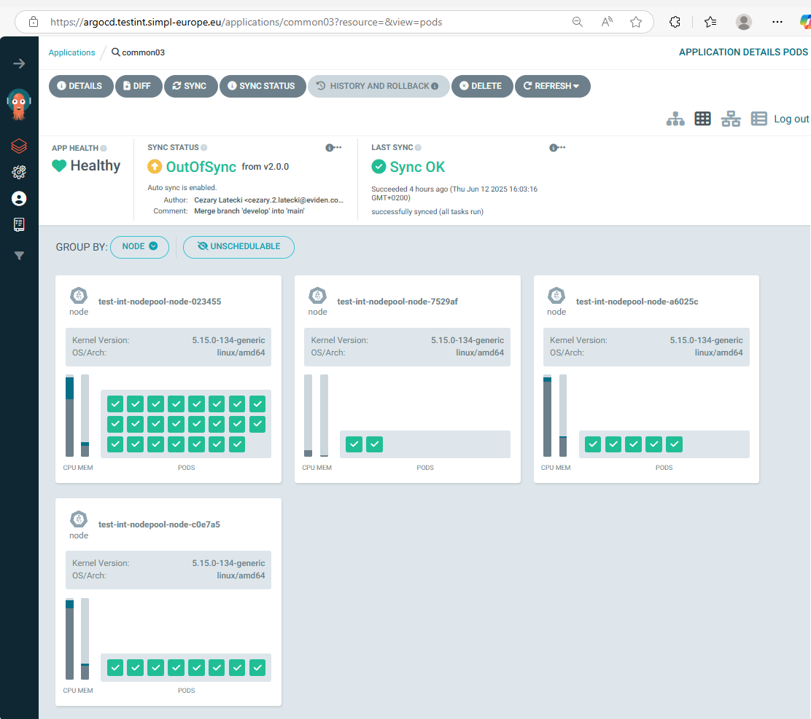
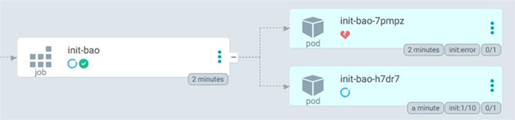
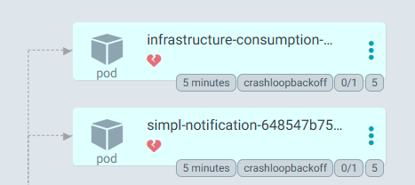
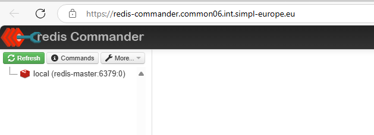
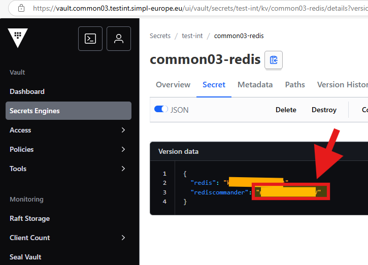
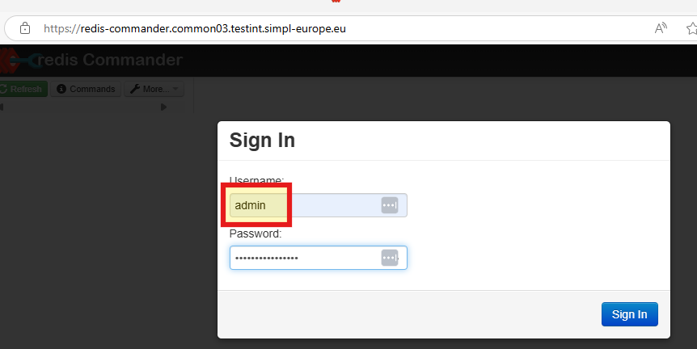

# SIMPL-Open Middleware : Common Components Deployment

<!-- TOC -->
- [SIMPL-Open Middleware : Common Components Deployment](#simpl-open-middleware-common-components-deployment)
  - [Description](#description)
    - [Tools](#tools)
    - [DNS entries](#dns-entries)
  - [Deployment](#deployment)
    - [Graphical deployment using ArgoCD](#graphical-deployment-using-argocd)
    - [Manual deployment](#manual-deployment)
      - [Files preparation](#files-preparation)
      - [Command to execute](#command-to-execute)
  - [Additional steps and remarks](#additional-steps-and-remarks)
    - [Init-bao job issues](#init-bao-job-issues)
    - [Failing pod restart](#failing-pod-restart)
    - [Monitoring](#monitoring)
    - [OpenBao Configuration](#openbao-configuration)
    - [Redis Commander](#redis-commander)
  - [Troubleshooting](#troubleshooting)
<!-- /TOC -->

## Description

This project contains the configuration files required to deploy SIMPL-Open Middleware Common Components.  The Common Components are the basis required by all the others SIMPL-Open Middleware agents.  Two deployment methods are documented here under :

- manual deployment using command line tools such as Helm and kubectl.
- ArgoCD deployment using mainly graphical interface

The deployment is performed using master helm chart deploying the SIMPL-Open Middleware _Common components_ in one step.  The master helm chart requires a value file for the deployment, here under you will find an example of the master value chart, please be aware that many values must be replaced to be aligned with your environment.  These values are explained by inline comment in the values file of the master helm chart example.  The values file of each common components could found in te app-values folder of the source code repository.

### Tools

The following versions of the elements will be used in the process: [Tools Requirements](<https://code.europa.eu/simpl/simpl-open/documentation/installation-guide/-/blob/main/Prerequisites.md?ref_type=heads#tools-requirements>)

The elements listed above are also mandatory:

| Pre-Requisites     |     Version     | Description                                                                                                                                                                                              |
|--------------------|     :-----:     |----------------------------------------------------------------------------------------------------------------------------------------------------------------------------------------------------------|
| external-dns       | 0.16.1 or newer | Used for DNS entries creation. <br/> Other version *might* work but tests were performed using 0.16.1-debian-12-r6 version. <br/> Image used: `docker.io/bitnamilegacy/external-dns:0.16.1-debian-12-r6` |
| kube-state-metrics | 2.13.x or newer | Used for monitoring, Metricbeat statuses in Kibana dashboard                                                                                                                                             |

### DNS entries

| Entry Name | Entries |
| ------------- | ----------------------------------- |
| elastic-apm-server | apm.(namespace).(domainSuffix) |
| elastic-elasticsearch-http| elastic-elasticsearch-es-http.(namespace).svc |
| elastic-elasticsearch-http-public | elasticsearch.(namespace).(domainSuffix) |
| elastic-kibana-dashboard | kibana.(namespace).(domainSuffix) |
| elastic-otel-collector | collector.(namespace).(domainSuffix) |
| logstash-api-beats | logstash.beats.(namespace).(domainSuffix) |
| mailpit-(namespace) | mailpit.(namespace).(domainSuffix) |
| pg-admin-(namespace) | pgadmin.(namespace).(domainSuffix) |
| redpanda | redpanda.(namespace).(domainSuffix) |
| OpenBao | secrets.(namespace).(domainSuffix) |

## Deployment

### Graphical deployment using ArgoCD

All the values mentioned in the sections below you can input in ArgoCD deployment. The repoURL gets the package directly from code.europa.eu.
"targetRevision" is the package version.

In the example below, please replace the marked versions with the ones applicable to your environment.

Please pay special attention to the namespace names: common01, authority01, consumer01 and dataprovider01, and also to replace the domain name example.com and the occurrence of the example value itself.

Important notice - agent names in agentList value list cannot contain "-" character.

```yaml
apiVersion: argoproj.io/v1alpha1
kind: Application
metadata:
  # name of the currently deploying app in argocd, this is the name that will be displayed in ArgoCD
  name: 'common01-deployer'                         # name of the deploying app in argocd
  namespace: argocd                                 # namespace of your argocd
spec:
  project: default
  source:
    repoURL: 'https://code.europa.eu/api/v4/projects/951/packages/helm/stable'
    path: '""'
    targetRevision: 3.0.2                           # version of package
    helm:
      values: |
        values:
          branch: v3.0.2                            # branch of repo with values
        resourcePreset: default                     # set to "low" to disable requests of resources
        agentList:                                  # list of all the agents to be deployed
          authorities:
            - authority01
          consumers:
            - consumer01
          providers:
            - dataprovider01
        project: default                            # Project to which the namespace is attached
        namespaceTag: common01                      # identifier of deployment and part of fqdn
        domainSuffix: example.com                   # last part of fqdn
        argocd:
          appname: common01                         # name of generated argocd app 
          namespace: argocd                         # namespace of your argocd
        cluster:
          # FQDN Fully Qualified Domain Name of your kubernetes cluster
          address: https://kubernetes.default.svc
          namespace: common01                       # where the app will be deployed
          issuer: dev-prod                          # issuer of certificate
          internalIssuer: dev-selfsigned            # issuer of self-signed certificates
          kubeStateHost: kube-prometheus-stack-kube-state-metrics.devsecopstools.svc.cluster.local:8080    # link to kube-state-metrics svc
        secrets:
          secretEngine: example                     # name of the kv secret engine that will be created in OpenBao
          role: example-role                        # name of the role that will be created in OpenBao
        kafka:
          ha: true                                  # true creates 3 replicas of each component, false creates 1 of each
          topic:
            # set this value to true, to have kafka creating automatically the required topics
            autocreate: true
        mailpit:
          # set this value to true, to have mailpit activated
          enabled: true
        monitoring:
          # set this value to true, to enable the monitoring features
          enabled: true
    # Name of the helm chart to deploy
    chart: common_components
  destination:
    # FQDN Fully Qualified Domain Name of your kubernetes cluster
    server: 'https://kubernetes.default.svc'
    # Name of the Kubernetes NameSpace in which the Common Tools will be deployed
    namespace: common01
```

Be patient!... Depending on the your kubernetes configuration and resources availalbe, the deployment of the Common Tools could take more than 30 minutes.

### Manual deployment

#### Files preparation

Another way for deployment, is to unpack the released package to a folder on a host where you have kubectl and helm available and configured.

There is basically one file that you need to modify - values.yaml.
There are a couple of variables you need to replace - described below. The rest you don't need to change.

Important notice - agent names in agentList value list cannot contain "-" character.

```YAML
values:
  branch: v3.0.2                            # branch of repo with values
resourcePreset: default                     # set to "low" to disable requests of resources
agentList:                                  # list of all the agents to be deployed
  authorities:
    - authority01
  consumers:
    - consumer01
  providers:
    - dataprovider01
project: default                            # Project to which the namespace is attached
namespaceTag: common01                      # identifier of deployment and part of fqdn
domainSuffix: example.com                   # last part of fqdn
argocd:
  appname: common01                         # name of generated argocd app 
  namespace: argocd                         # namespace of your argocd
cluster:
  address: https://kubernetes.default.svc
  namespace: common01                       # where the app will be deployed
  issuer: dev-prod                          # issuer of certificate
  internalIssuer: dev-selfsigned            # issuer of self-signed certificates
  kubeStateHost: kube-prometheus-stack-kube-state-metrics.devsecopstools.svc.cluster.local:8080    # link to kube-state-metrics svc
secrets:
  secretEngine: example                     # name of the kv secret engine that will be created in OpenBao
  role: example-role                        # name of the role that will be created in OpenBao
kafka:
  ha: true                                  # true creates 3 replicas of each component, false creates 1 of each
  topic:
    autocreate: true                        # set to true if kafka should automatically create topics
mailpit:
  enabled: true                             # set to true if mailpit should be deployed as mock smtp for notification service
monitoring:
  enabled: true                             # should monitoring be enabled
```

#### Command to execute

After you have prepared the values file, you can start the deployment.
Use the command prompt. Proceed to the folder where you have the Chart.yaml file and execute the following command. The dot at the end is crucial - it points to current folder to look for the chart.

Now you can deploy the agent:

`helm install common .`

After starting the deployment synchronization process, the expected namespace will be created.

Initially, the status observed e.g. in ArgoCD will indicate the creation of new pods:

<BR>

At the end, all pods should be created correctly:

<BR>

## Additional steps and remarks

### Init-bao job issues

Ocassionaly, the init-bao job might go ahead with creating secrets, despite open-bao secret engine not being available. This creates empty secrets, which might cause components to fail.

<BR>

in case this happens, the secrets must be deleted and then the job has to be restarted if it has ran out of tries.

These secrets have to be deleted:

secrets-root-token<br>
secrets-unseal-keys

### Failing pod restart

If failing. these two pods need to be restarted after OpenBao is up. They rely on information from OpenBao and may be up before it is up.

<BR>

Although it's rare, it might happen more than once so retry the following steps if init-bao is failing again.

### Monitoring

ELK stack for monitoring is added with this release.  
Its deployment can be disabled by switch the value monitoring.enabled to false.  
When it's enabled, after the stack is deployed, you can access the ELK stack UI by <https://kibana.**namespacetag**.**domainSuffix**>
Default user is "elastic", its password can be extracted by kubectl command. `kubectl get secret elastic-elasticsearch-es-elastic-user -o go-template='{{.data.elastic | base64decode}}' -n {namespace}`

### OpenBao Configuration

The description of configuring and using OpenBao is in a separate document:
<https://code.europa.eu/simpl/simpl-open/development/agents/common_components/-/blob/main/documents/user-manual/Using_OpenBao.md>

Please read this document before proceeding to install and configure other SIMPL-OPEN agents(namespaces).

### Redis Commander

Redis commander is a frontend allowing to visualise the data stored in redis-master, this tool is not required for end user to the SIMPL-Middleware is it need for the developer of the middleware

<BR>

The password for redis commander is stored in a OpenBao Secret in the OpenBao "common-redis secret".

Note!!! To log in, we use the password stored in the "rediscommander" variable, but as a username, we should enter "admin" and not "rediscommander"!

<BR>
<BR>

### Kafka Administration

The description of Kafla Administration tool is in a separate document: <https://code.europa.eu/simpl/simpl-open/development/agents/common_components/-/blob/main/documents/user-manual/KAFKA_ADMINISTRATION.md>

### PostgreSQL Administation

The description of PostgreSQL  Administration tool is in a separate document: <https://code.europa.eu/simpl/simpl-open/development/agents/common_components/-/blob/main/documents/user-manual/POSTGRESQL_ADMINISTRATION.md>

## Troubleshooting

If you encounter issues during deployment, check the following:

- Ensure that ArgoCD is properly set up and running.
- Verify that the namespace exists in your Kubernetes cluster.
- Check the ArgoCD application logs and Helm error messages for specific issues.
