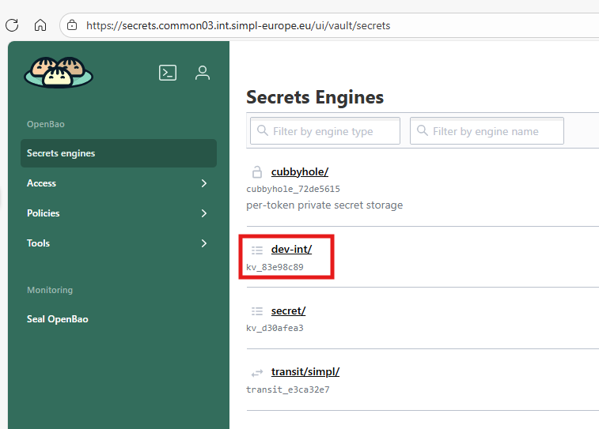
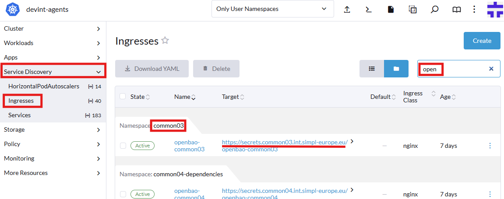
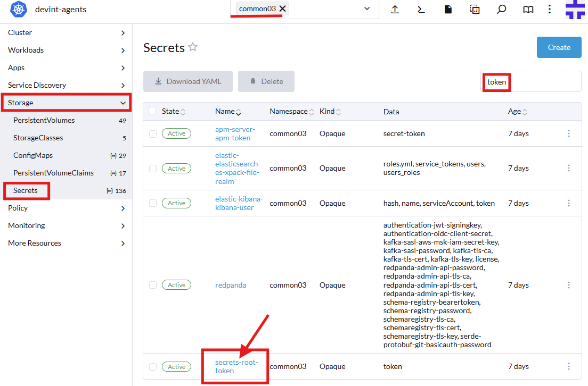
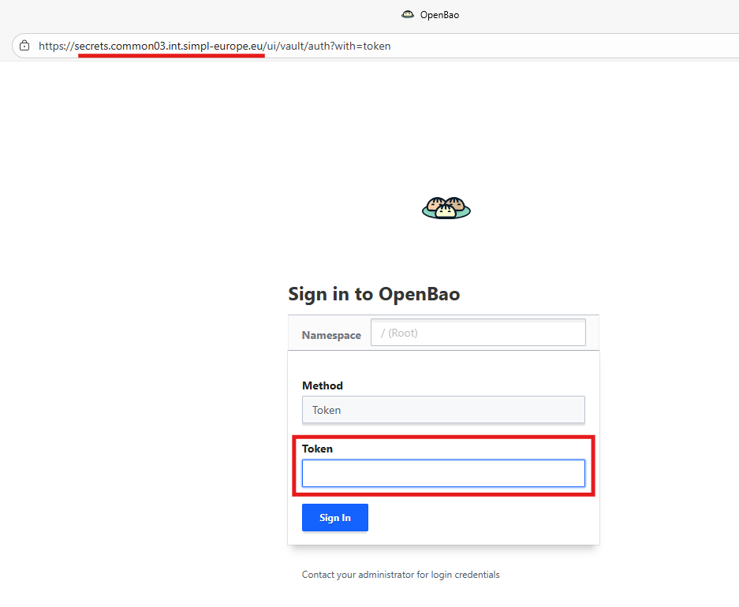

# Using OpenBao

In our project, we use OpenBao to increase security in different namespaces.
OpenBao is a powerful tool for managing secrets, such as passwords, tokens, and encryption keys. It is a community-driven, open-source fork of HashiCorp Vault, created in response to the relicensing of Vault under the Business Source License (BSL). OpenBao maintains compatibility with Vault while remaining under a permissive open-source license.
Additionally, our environment has been enriched with modules that facilitate integration between OpenBao and our application.

Applications retrieve all necessary passwords, keys, and tokens from OpenBao based on the appropriate definitions contained in the application.yaml file.

**_IMPORTANT_**: **dataprovider_namespace**-gitea secret is not in use as Gitea credential yet.

Example entries in OpenBao look like this:

 
 

**_As an update from previous version, most of the OpenBao configuration is now applied automatically.
You just need to create a key for Signer and update a couple of values, which is mentioned in other agents readmes._**

**_All the credentials (for Keycloak and other components) are also now automatically stored in OpenBao - review the secrets for credentials if needed._**

You can access OpenBao on <https://secrets.**namespacetag**.**domainsuffix**>

We can always check the actual address in rancher:

 

Root token can be found in secret secrets-root-token, in key token. 

 
 
 

The application retrieves them according to the following configuration:

The above configuration ensures that passwords and other secrets are generated securely and managed efficiently, reducing the risk of security breaches and simplifying the management of secrets across namespaces.

