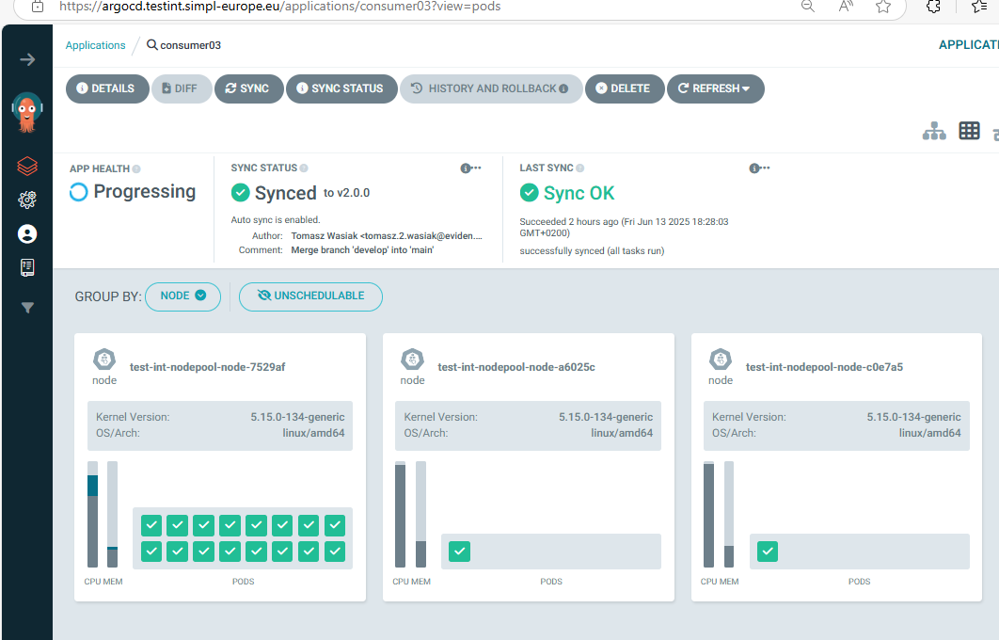

# Consumer Agent

<!-- TOC -->
- [Consumer Agent](#consumer-agent)
  - [Description](#description)
  - [Prerequisites](#prerequisites)
    - [Tools](#tools)
    - [DNS entries](#dns-entries)
  - [Deployment](#deployment)
    - [Preliminary tasks](#preliminary-tasks)
      - [OpenBao related tasks](#openbao-related-tasks)
        - [Secret for EDC](#secret-for-edc)
    - [Deployment using ArgoCD](#deployment-using-argocd)
    - [Manual deployment](#manual-deployment)
      - [Files preparation](#files-preparation)
      - [Deployment Command to execute](#deployment-command-to-execute)
    - [Verification of deployment](#verification-of-deployment)
  - [Additional steps and remarks](#additional-steps-and-remarks)
    - [Onboarding](#onboarding)
    - [Tier2-proxy status](#tier2-proxy-status)
    - [Monitoring](#monitoring)
  - [Troubleshooting](#troubleshooting)
<!-- /TOC -->

## Description

This repo contains:

- a master helm chart allowing to deploy a **Consumer** agent using a single command.
- templates of values.yaml files used inside *Integration* environment under `app-values` folder

## Prerequisites

### Tools

The following versions of the elements will be used in the process: [Tools Requirements](<https://code.europa.eu/simpl/simpl-open/development/agents/common_components/-/blob/main/documents/deployment-guide/README.md?ref_type=heads#tools>)

### DNS entries

| Entry Name | Entries |
| :-----------: | :-------------------------------------------------------------------------------------------------: |
| catalogue-ui | catalogue-ui.(namespaceTag).(domainSuffix) |
| redis-commander     | redis-commander.(namespaceTag).(domainSuffix) |
| simpl-fe-authentication-provider | participant.fe.(namespaceTag).(domainSuffix)/participant-utility |
| simpl-fe-users-roles             | participant.fe.(namespaceTag).(domainSuffix)/users-roles         |
| simpl-ingress | participant.be.(namespaceTag).(domainSuffix) | 
| tier2-gateway          | tls.participant.(namespaceTag).(domainSuffix) |

## Deployment

The deployment is based on master helm chart which, when applied on Kubernetes cluster, should deploy the Data Provider to it using ArgoCD.

### Preliminary tasks

#### OpenBao related tasks

You can access OpenBao on <https://secrets.**commonnamespacetag**.**domainSuffix**>
Root token can be found in common namespace, secret secrets-root-token, in key token. 

The description of using OpenBao is in a separate document:

<https://code.europa.eu/simpl/simpl-open/development/agents/common_components/-/blob/main/documents/user-manual/Using_OpenBao.md>

Before you proceed with the next steps related to accessing your OpenBao and changing its contents, please read the document above.<BR>

##### Secret for EDC

Edit the key for Infrastructure-be named "*consumernamespacetag*-simpl-edc" where the first part reflects the namespace of your consumer. You need to provide endpoint and keys to your Minio.

You need to modify:

| Variable name                    |     Example              | Description              |
| ----------------------           |     :-----:              | ---------------          |
| fr_gxfs_s3_access_key            | minioacckey              | minio access key         |
| fr_gxfs_s3_endpoint              | https://minio.address.eu | minio api address        |
| fr_gxfs_s3_secret_key            | minioseckey              | minio secret key         |

All the other necessary secrets are now created automatically with proper data.

### Deployment using ArgoCD

You can easily deploy the agent using ArgoCD. All the values mentioned in the sections below you can input in ArgoCD deployment. The repoURL gets the package directly from code.europa.eu.
targetRevision is the package version. 

In the example below, please replace the marked versions with the ones applicable to your environment.

Please pay special attention to the namespace names: common01, authority01, consumer01 and dataprovider01 and replace them with yours, as well as replace the domain name example.com and the occurrence of the value example itself.

```YAML
apiVersion: argoproj.io/v1alpha1
kind: Application
metadata:
  name: 'consumer01-deployer'           # name of the deploying app in argocd
  namespace: argocd                     # namespace of your argocd
spec:
  project: default
  source:
    repoURL: 'https://code.europa.eu/api/v4/projects/903/packages/helm/stable'
    path: '""'
    targetRevision: 3.0.2                  # version of package
    helm:
      values: |
        values:
          branch: v3.0.2                    # branch of repo with values - for released version it should be the release branch
        project: default
        namespaceTag: 
          consumer: consumer01              # identifier of deployment and part of fqdn for this agent
          authority: authority01            # identifier of deployment and part of fqdn for authority
          common: common01                  # identifier of deployment and part of fqdn for common components
        domainSuffix: example.com           # last part of fqdn
        resourcePreset: default             # set to "low" to disable requests of resources
        argocd:
          appname: consumer01               # name of generated argocd app 
          namespace: argocd                 # namespace of your argocd
        cluster:
          address: https://kubernetes.default.svc
          namespace: consumer01             # where the app will be deployed
          commonToolsNamespace: common01    # namespace where main monitoring stack is deployed
          issuer: dev-prod                  # certificate issuer
        secrets:
          secretEngine: example             # secret engine name created in OpenBao
          role: example-role                # role created in OpenBao for access
        monitoring:
          enabled: true                     # should monitoring be disabled
    chart: consumer
  destination:
    server: 'https://kubernetes.default.svc'
    namespace: consumer01                   # where the package will be deployed

```

### Manual deployment

#### Files preparation

Another way for deployment, is to unpack the released package to a folder on a host where you have kubectl and helm available and configured.

There is basically one file that you need to modify - values.yaml. 
There are a couple of variables you need to replace - described below. The rest you don't need to change.

```YAML
values:
  branch: v3.0.2                    # branch of repo with values - for released version it should be the release branch
project: default
namespaceTag: 
  consumer: consumer01              # identifier of deployment and part of fqdn for this agent
  authority: authority01            # identifier of deployment and part of fqdn for authority
  common: common01                  # identifier of deployment and part of fqdn for common components
domainSuffix: example.com           # last part of fqdn
resourcePreset: default             # set to "low" to disable requests of resources
argocd:
  appname: consumer01               # name of generated argocd app 
  namespace: argocd                 # namespace of your argocd
cluster:
  address: https://kubernetes.default.svc
  namespace: consumer01             # where the app will be deployed
  commonToolsNamespace: common01    # namespace where main monitoring stack is deployed
  issuer: dev-prod                  # certificate issuer
secrets:
  secretEngine: example             # secret engine name created in OpenBao
  role: example-role                # role created in OpenBao for access
monitoring:
  enabled: true                     # should monitoring be disabled
```

#### Deployment Command to execute

After you have prepared the values file, you can start the deployment.
Use the command prompt. Proceed to the folder where you have the Chart.yaml file and execute the following command. The dot at the end is crucial - it points to current folder to look for the chart.

Now you can deploy the agent:

`helm install consumer .`

After starting the deployment synchronization process, the expected applications in ArgoCD will be created.

### Verification of deployment

Initially, the status observed e.g. in ArgoCD will indicate the creation of new pods.

Be patient!... Depending on the configuration, this step can take up to 30 minutes!

At the end, all pods should be created correctly:

<BR>

## Additional steps and remarks

### Onboarding

After the deployment process is complete, a manual onboarding process of the participant is required.

The steps are described in the document:

<https://code.europa.eu/simpl/simpl-open/development/iaa/documentation/-/blob/main/versioned_docs/2.9.x/user-manual/ONBOARD.md>

### Tier2-proxy status

Please keep in mind that until the agent is properly initialized, the tier2-proxy component will not work properly.

### Monitoring

Filebeat components for monitoring are included in this release.
Their deployment can be disabled by switching the value monitoring.enabled to false.

## Troubleshooting

If you encounter issues during deployment, check the following:

- Ensure that ArgoCD is properly set up and running.
- Verify that the namespace exists in your Kubernetes cluster.
- Check the ArgoCD application logs and Helm error messages for specific issues.
