# Governance Authority Agent

<!-- TOC -->
- [Governance Authority Agent](#governance-authority-agent)
  - [Description](#description)
  - [PreRequisites](#prerequisites)
    - [Tools](#tools)
    - [DNS entries](#dns-entries)
  - [Deployment](#deployment)
    - [Deployment using ArgoCD](#deployment-using-argocd)
    - [Manual deployment](#manual-deployment)
      - [Files preparation](#files-preparation)
      - [Deployment Command to execute](#deployment-command-to-execute)
  - [Additional steps and remarks](#additional-steps-and-remarks)
    - [Initialization](#initialization)
    - [Tier2-proxy status](#tier2-proxy-status)
    - [Monitoring](#monitoring)
  - [Troubleshooting](#troubleshooting)
  - [Identity Provider failure](#identity-provider-failure)
  - [FAQ](#faq)
<!-- /TOC -->

## Description

This project contains the configuration files required for deploying an application using Helm and ArgoCD.

- the deployment will be done by master helm chart allowing to deploy a **Governance Authority** agent using a single command.
- templates of values.yaml files used inside *Integration* environment under `app-values` folder

## PreRequisites

### Tools

The following versions of the elements will be used in the process: [Tools Requirements](<https://code.europa.eu/simpl/simpl-open/development/agents/common_components/-/blob/main/documents/deployment-guide/README.md?ref_type=heads#tools>)

### DNS entries

| Entry Name                       | Entries                                                        |
|----------------------------------|----------------------------------------------------------------|
| schema-manager-ui                | schema-manager-fe.(namespaceTag).(domainSuffix)                |
| redis-commander                  |  redis-commander.(namespaceTag).(domainSuffix)                 |
| simpl-fe-authentication-provider | authority.fe.(namespaceTag).(domainSuffix)/participant-utility |
| simpl-fe-identity-provider       | authority.fe.(namespaceTag).(domainSuffix)/identity-provider   |
| simpl-fe-onboarding              | authority.fe.(namespaceTag).(domainSuffix)/onboarding          |
| simpl-fe-sap                     | authority.fe.(namespaceTag).(domainSuffix)/sap                 |
| simpl-fe-users-roles             | authority.fe.(namespaceTag).(domainSuffix)/users-roles         |
| simpl-ingress                    | authority.be.(namespaceTag).(domainSuffix)                     |
| tier2-gateway                    | tls.authority.(namespaceTag).(domainSuffix)                    |
| simpl-schema-manager-ingress     | schema-manager-be.(namespaceTag).(domainSuffix)                |

## Deployment

The deployment is based on master helm chart which, when applied on Kubernetes cluster, should deploy the Authority to it using ArgoCD.

### Deployment using ArgoCD

You can easily deploy the agent using ArgoCD. All the values mentioned in the sections below you can input in ArgoCD deployment. The repoURL gets the package directly from code.europa.eu.
targetRevision is the package version.

When you create it, you set up the values below (example values)

```yaml
apiVersion: argoproj.io/v1alpha1
kind: Application
metadata:
  name: 'authority01-deployer'             # name of the deploying app in argocd
  namespace: argocd                        # namespace of your argocd
spec:
  project: default
  source:
    repoURL: 'https://code.europa.eu/api/v4/projects/902/packages/helm/stable'
    path: '""'
    targetRevision: 3.0.4                   # version of package
    helm:
      values: |
        values:
          branch: v3.0.4                    # branch of repo with values - for released version it should be the release branch
        project: default                    # Project to which the namespace is attached
        namespaceTag: 
          authority: authority01            # identifier of deployment and part of fqdn for this agent
          common: common01                  # identifier of deployment and part of fqdn for common components
        domainSuffix: example.com           # last part of fqdn
        resourcePreset: default             # set to "low" to disable requests of resources
        argocd:
          appname: authority01              # name of generated argocd app 
          namespace: argocd                 # namespace of your argocd
        cluster:
          address: https://kubernetes.default.svc
          namespace: authority01            # where the app will be deployed
          commonToolsNamespace: common      # namespace where main monitoring stack is deployed
          issuer: dev-int-dns01             # certificate issuer name
        secrets:
          role: example-role                # role created in OpenBao for access
          secretEngine: example             # container for secrets in your OpenBao
        monitoring:
          enabled: true                     # you can set it to false if you don't have common monitoring stack
    chart: authority
  destination:
    server: 'https://kubernetes.default.svc'
    namespace: authority01                  # where the package will be deployed
```

### Manual deployment

#### Files preparation

Another way for deployment, is to unpack the released package to a folder on a host where you have kubectl and helm available and configured.

There is basically one file that you need to modify - values.yaml.
There are a couple of variables you need to replace - described below. The rest you don't need to change.

```yaml
values:
  repo_URL: https://code.europa.eu/simpl/simpl-open/development/agents/governance-authority.git   # repo URL
  branch: v3.0.4                    # branch of repo with values - for released version it should be the release branch
project: default                    # Project to which the namespace is attached

namespaceTag: 
  authority: authority01            # identifier of deployment and part of fqdn for this agent
  common: common01                  # identifier of deployment and part of fqdn for common components
domainSuffix: example.com           # last part of fqdn
resourcePreset: default             # set to "low" to disable requests of resources
argocd:
  appname: authority01              # name of generated argocd app 
  namespace: argocd                 # namespace of your argocd
cluster:
  address: https://kubernetes.default.svc
  namespace: authority01            # where the package will be deployed
  commonToolsNamespace: common      # namespace where main monitoring stack is deployed
  issuer: dev-int-dns01             # certificate issuer name

secrets:
  role: example-role                # role created in OpenBao for access
  secretEngine: example             # container for secrets in your OpenBao

monitoring:
  enabled: true                     # you can set it to false if you don't have common monitoring stack
```

#### Deployment Command to execute

After you have prepared the values file, you can start the deployment.
Use the command prompt. Proceed to the folder where you have the Chart.yaml file and execute the following command. The dot at the end is crucial - it points to current folder to look for the chart.

Now you can deploy the agent:

`helm install authority .`

After starting the deployment synchronization process, the expected namespace will be created.

Initially, the status observed e.g. in ArgoCD will indicate the creation of new pods:

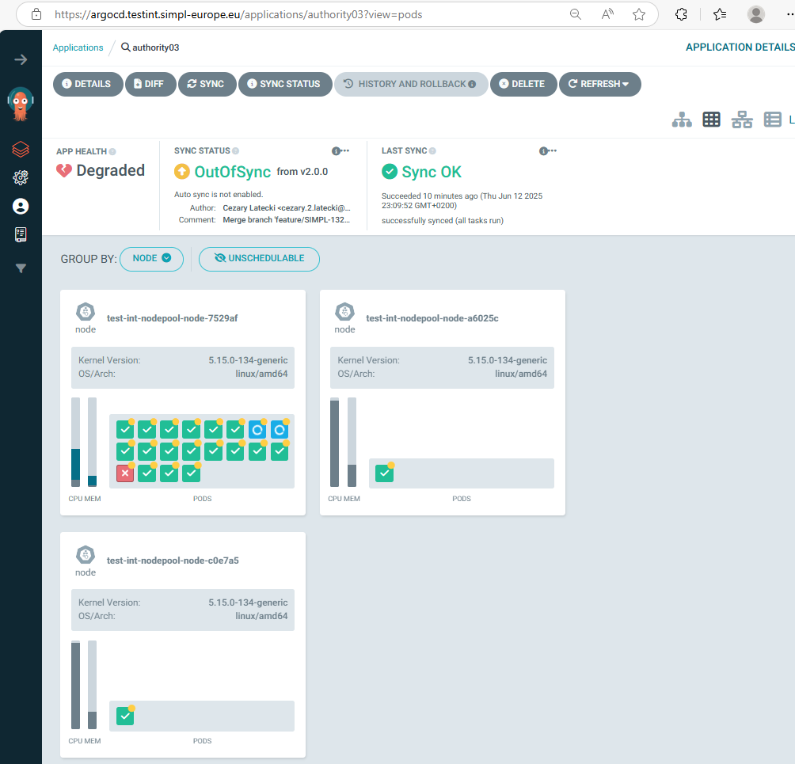<BR>

Be patient!... Depending on the configuration, this step can take up to 30 minutes!

At the end, all pods should be created correctly:

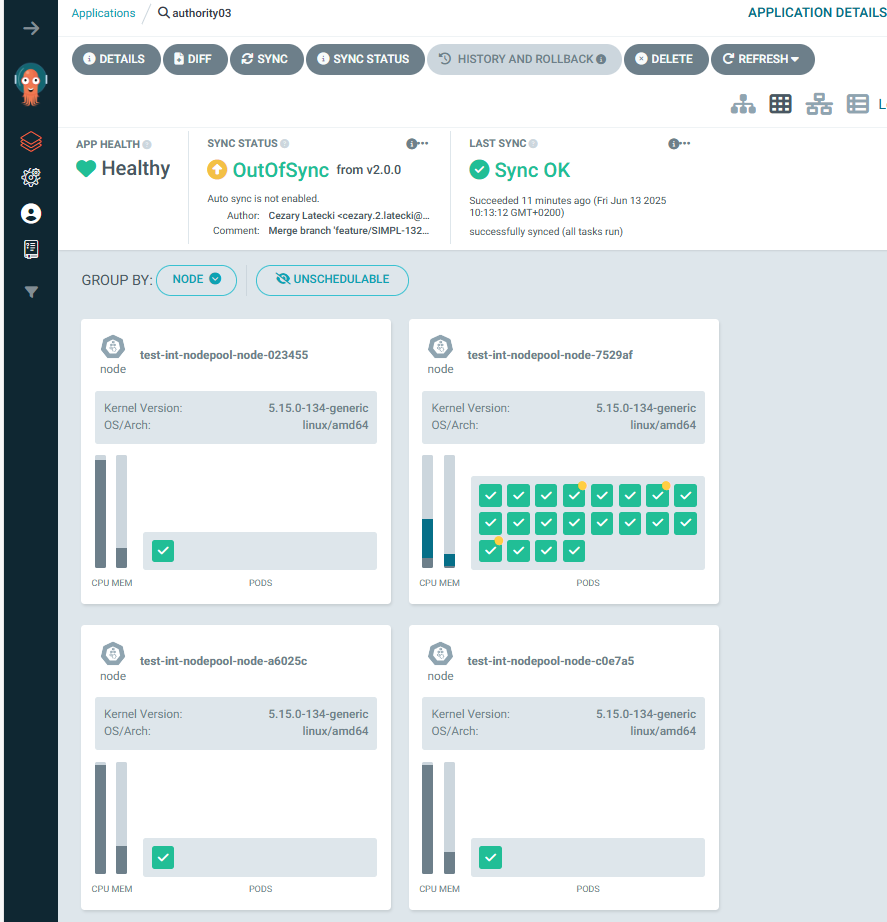<BR>

## Additional steps and remarks

### Initialization

After the deployment process is complete, a manual initialization process of the authority is required.

The steps are described in the document:
<https://code.europa.eu/simpl/simpl-open/development/iaa/documentation/-/tree/main/versioned_docs/2.9.x#governance-authority-init-via-apis>

### Tier2-proxy status

Please keep in mind that until the agent is properly initialized, the tier2-proxy component will not work properly.

### Monitoring

Filebeat components for monitoring are included in this release.
Their deployment can be disabled by switching the value monitoring.enabled to false.

## Troubleshooting

If you encounter issues during deployment, check the following:

- Ensure that ArgoCD is properly set up and running.
- Verify that the namespace exists in your Kubernetes cluster.
- Check the ArgoCD application logs and Helm error messages for specific issues.

## Identity Provider failure

Sometimes, probably due to cluster performance issues, an error related to identity-provider and Tier2-gateway appears:<BR>

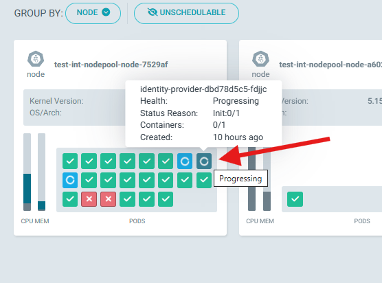<BR>

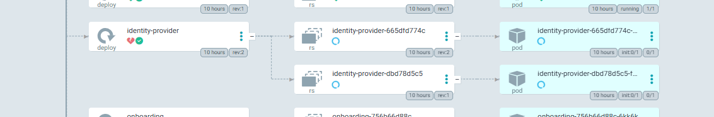<BR>


The cause of the error should be checked. We can do this in Rancher by checking the ivents occurring on this pod:<BR>

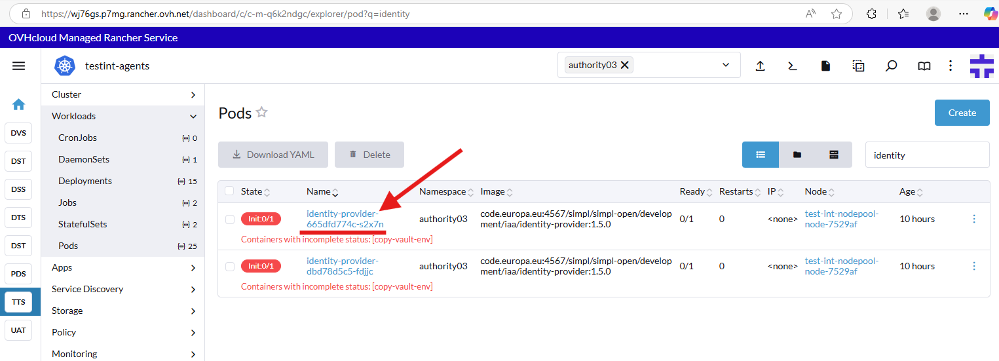<BR>

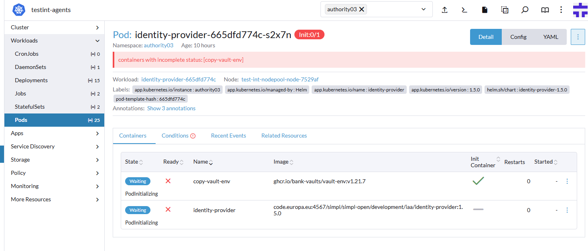<BR>

Unfortunately, a typical, frequently occurring error is the failure to automatically create an appropriate secret:<BR>

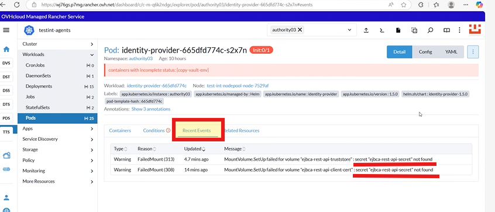<BR>

Unfortunately, to fix this error we need to delete two instances of the postgres databases.

In rancher please find the address to the postgres database:<BR>

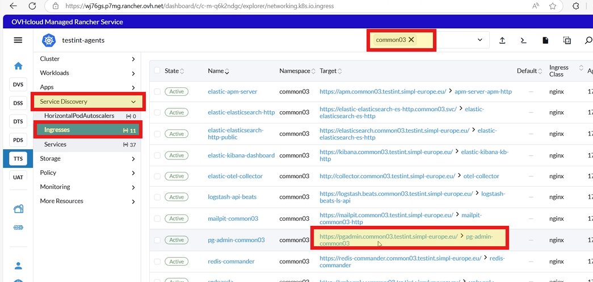<BR>

Access to the database is described in the document: https://code.europa.eu/simpl/simpl-open/development/agents/common_components/-/blob/main/documents/user-manual/POSTGRESQL_ADMINISTRATION.md<BR>
However to log in we use the account admin@(domainsuffix) with password from the OpenBao from the commonXX-pgadmin-credentials key for the "password" entry:<BR>
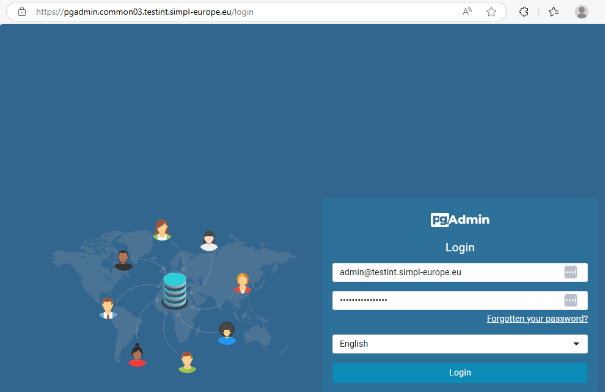<BR>

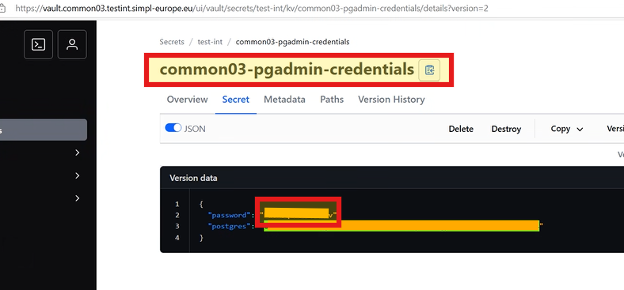<BR>

After accessing the website above, if you extend the Servers list, you will see the following request for password.
Password is in the same OpenBao secret, in key named "postgres".<BR>

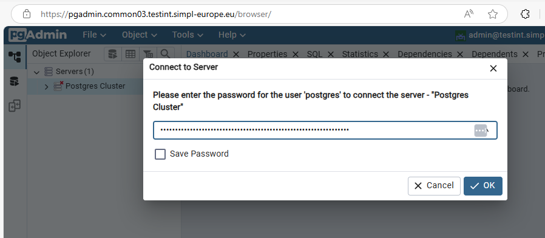<BR>

Now please remove two databases: authority03_ejbca and authority03_identityprovider:<BR>
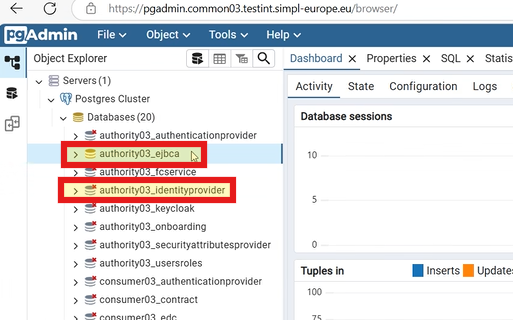<BR>
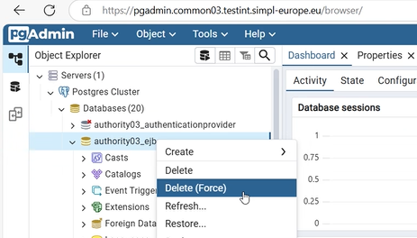<BR>

In the Common namespace restart pg-operator-commonXX (deploy) and check if the previously deleted databases have been created:<BR>
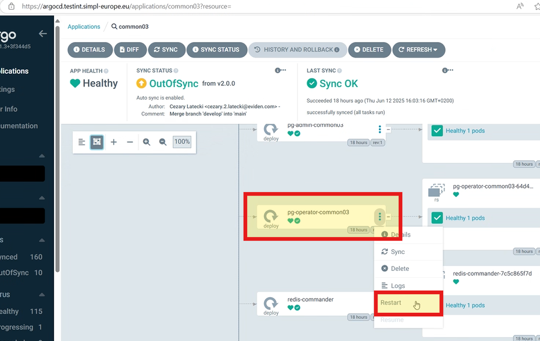<BR>

Next in namespace Authority delete identity_provider (deploy):<BR>
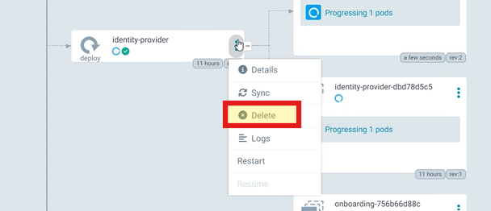<BR>

and ejbca-community-helm (deploy):<BR>
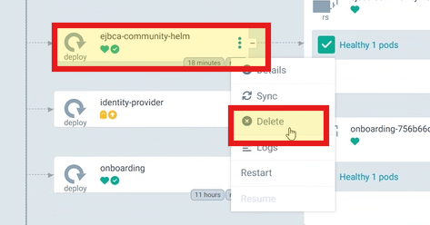<BR>

After full synchronization of the entire namespace Authority, the previously missing secret will already exist:<BR>
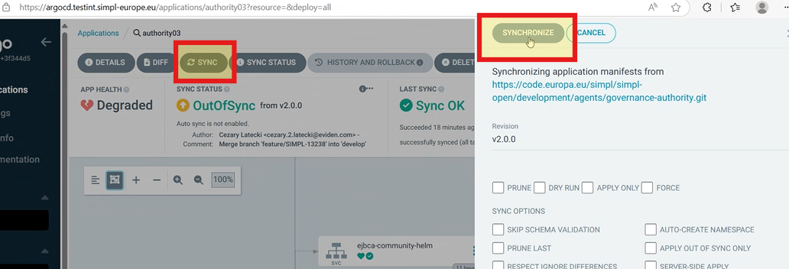<BR>
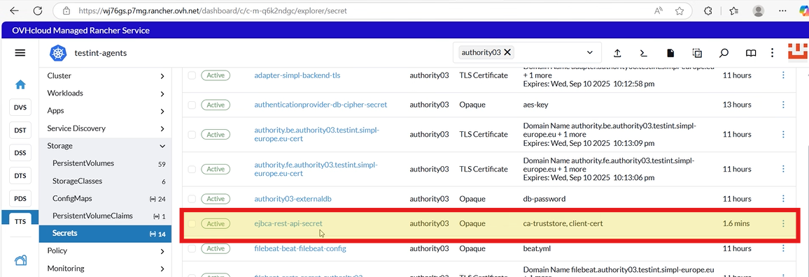<BR>

All that's left is to restart tier2-gateway (deploy) and all pods should work properly:<BR>
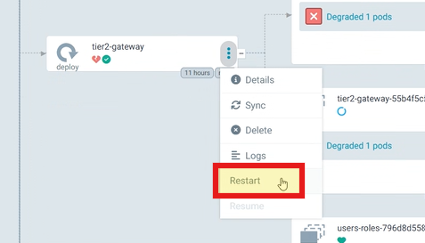<BR>

## FAQ

1. `What is the Governance Authority Agent?`
   </br> The data space participant that is accountable for creating, developing, operating, maintaining and enforcing the governance framework for a particular data space.
2. `What is the prerequisite for governance authority installation`
   </br> [Common components installed](https://code.europa.eu/simpl/simpl-open/documentation/installation-guide/-/blob/main/README.md?ref_type=heads#set-up-common-components)
3. `What are the OpenBao related tasks during installation?`
   </br> [OpenBao related tasks](https://code.europa.eu/simpl/simpl-open/development/agents/common_components/-/blob/main/documents/user-manual/Using_OpenBao.md)


