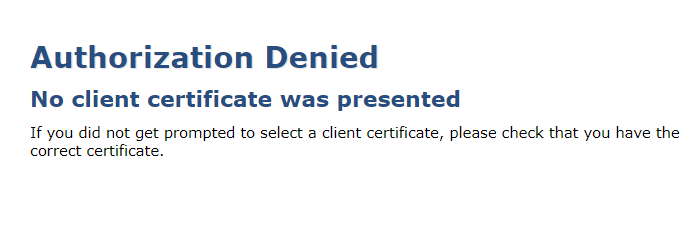
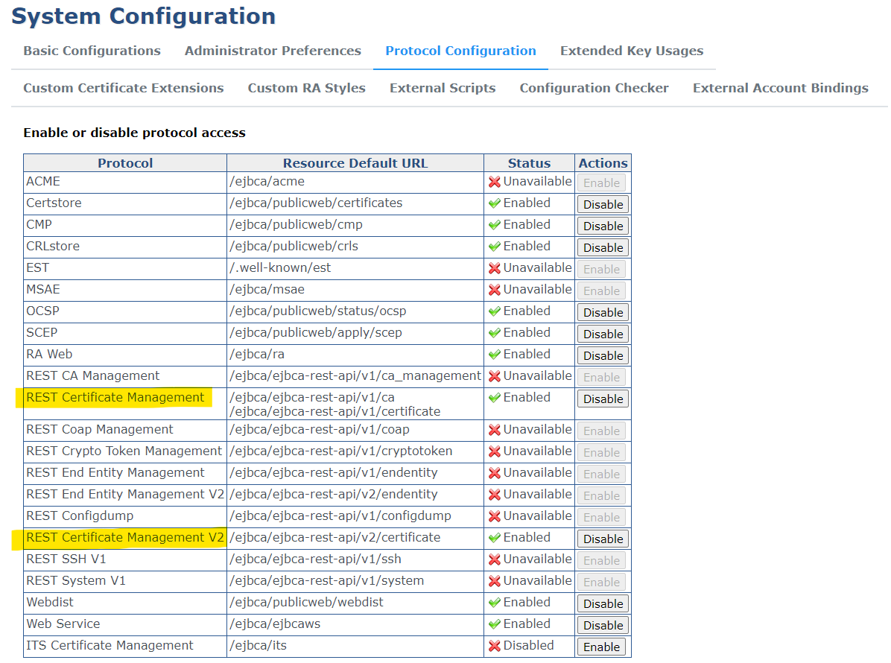
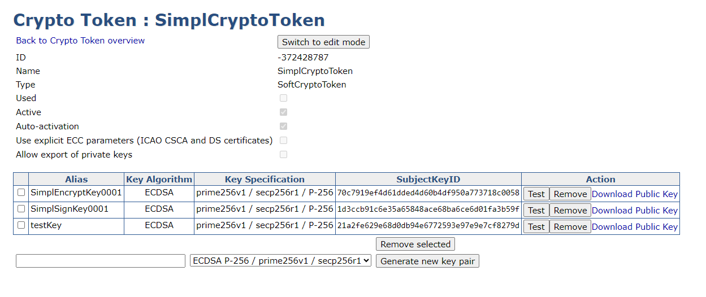
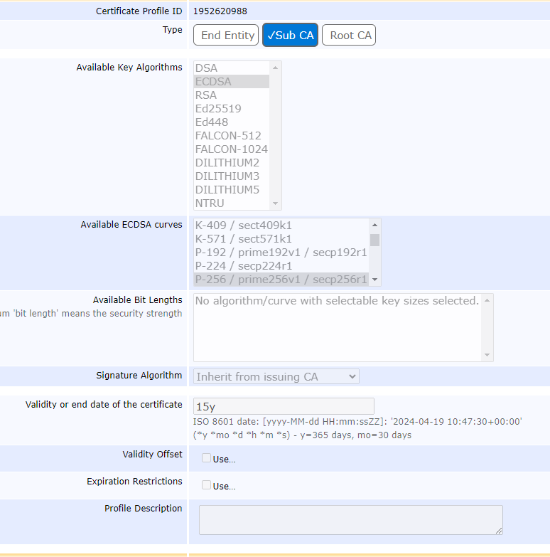
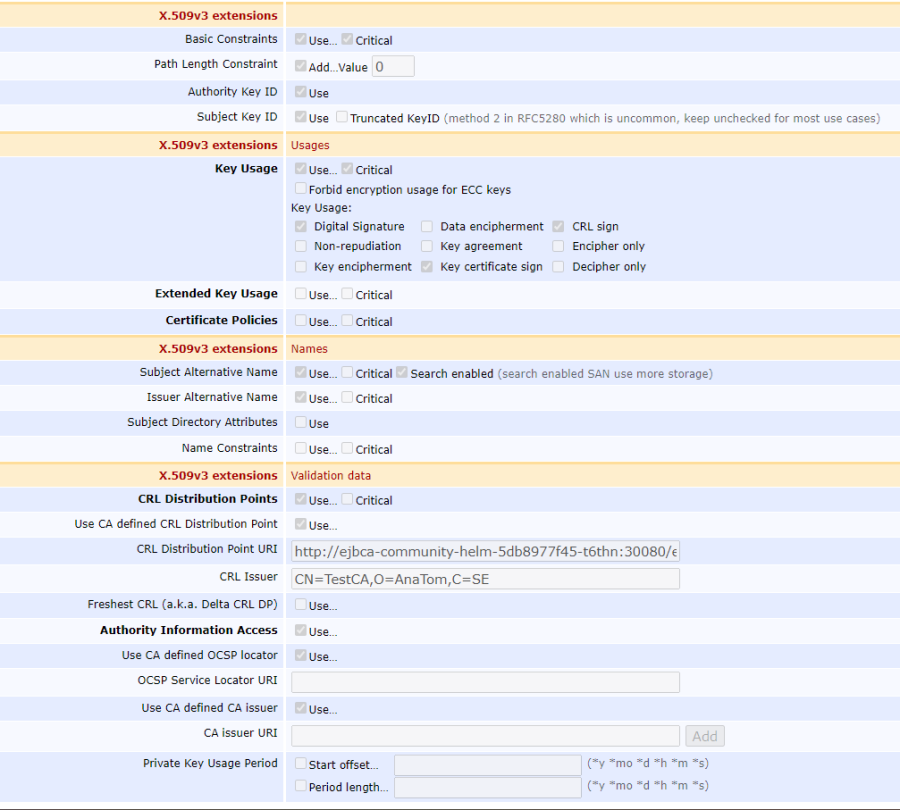
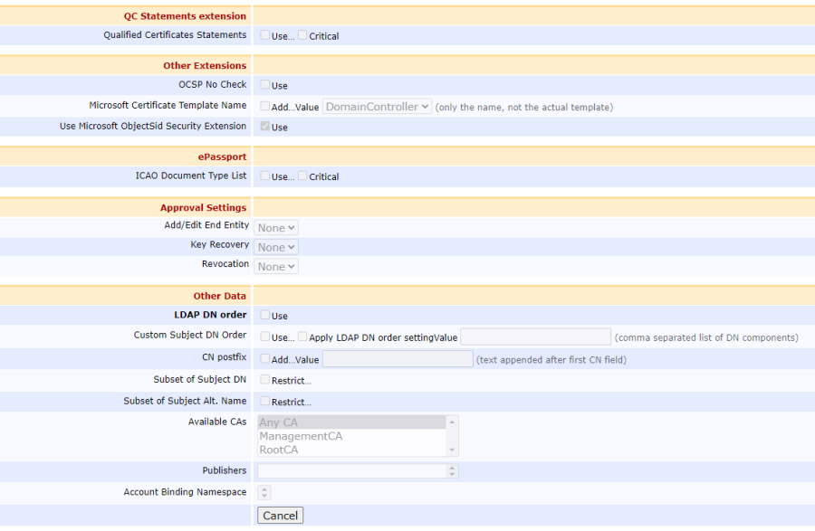
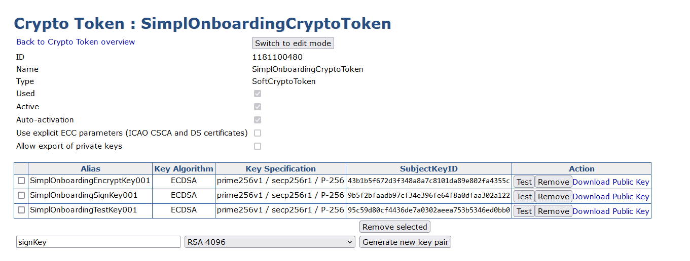

# EJBCA Configuration - SimplCA and OnBoardingCA

The following guide describe how to configure the **SimplCA** and **OnBoardingCA**. For more information on configuration, refer to the official [EJBCA documentation](https://doc.primekey.com/ejbca/ejbca-operations). 


> **⚠️** Security Notice: Security is a critical aspect of managing a Certification Authority. Please refer to the [EJBCA Security Documentation](https://docs.keyfactor.com/ejbca/latest/ejbca-security) for detailed information. The use of [Hardware Security Modules (HSM)](https://doc.primekey.com/ejbca/ejbca-integration/hardware-security-modules-hsm) is strongly recommended for production environments.

## Prerequisites
- EJBCA deployed
- EJBCA dashboard accessible

## Summary

1. [Obtain SuperAdmin Certificate](#1-obtain-superadmin-certificate)
2. [Enable REST APIs](#2-enable-rest-api)
3. [Create the Root CA](#3-create-the-root-ca)
4. [Create a Sub CA](#4-create-a-sub-ca)
5. [Create an End Entity Profile to issue TLS certificates](#5-create-an-end-entity-profile-to-issue-tls-certificates)

## 1. Obtain SuperAdmin Certificate

As TLS mode is configured, you will need to obtain the Super Admin certificate to access the Admin Dashboard. After the EJBCA deployment, you can recover the password used for the client certificate enrollment in the log. The certificate obtained will be used as the admin credential.

### Recover the SuperAdmin password
1. Print the logs for the container in the pod: `kubectl logs <ejbca_pod_name> --follow`
2. Wait for the following output to be displayed
    ```
    ****************************************************************************************************************************
    *                                                                                                                          *
    * A fresh installation was detected and a ManagementCA was created for your initial                                        *
    * administration of the system.                                                                                            *
    *                                                                                                                          *
    * Initial SuperAdmin client certificate enrollment URL (adapt port to your mapping):                                       *
    *                                                                                                                          *
    *   URL:      https://ejbca-community-helm.iaa.svc.cluster.local:443/ejbca/ra/enrollwithusername.xhtml?username=superadmin *
    *   Password: o+cndTh0U0i82loxKdosU35U                                                                                     *
    *                                                                                                                          *
    * Once the P12 is downloaded, use "o+cndTh0U0i82loxKdosU35U" to import it.                                                 *
    *                                                                                                                          *
    ****************************************************************************************************************************
    ```
3. Store the password securely. **Be aware that it is not possible to recover them or make them visible again**

### Download the SuperAdmin Certificate

1. Connect to the enrollment URL by forwarding the port EJBCA port locally, for example:
```shell
kubectl port-forward svc/ejbca-community-helm 30443:30443
```

2. Then update the URL with the forward port of your choice, for example `https://127.0.0.1:30443/ejbca/ra/enrollwithusername.xhtml?username=superadmin` and open it in a browser. Accept the SSL risk
3. The username is already set to "*superadmin*". Select the algorithm of your choice (for example "*ECDSA P-256 / prime 256v1 / secp256r1*" ) and insert the SuperAdmin password
4. Download the certificate in *PKCS#12* format (`*.p12` file extension). This can also be called a **Keystore**.

Install the certificate into your browser. ([Here](https://doc.primekey.com/ejbca-cloud/ejbca-cloud-aws/quick-start-guide/import-certificate-to-mozilla-firefox) is an example of how to do this). You can use the certificate as a credential to access to the **Admin dashboard** `https://127.0.0.1:30443/ejbca/adminweb/`

> **💡** If you have loaded the certificate into your browser and still get this error. Restart the browser.


### Download the ManagementCA Certificate

To download the ManagementCA certificate, follow these steps:

1. Access the Admin dashboard.
2. In the sidebar, click **CA Structure & CRL**.
3. Download the certificate in **JKS** format, which will be used as the **Truststore**.

When you click the download button, EJBCA will prompt you to provide a password to encrypt the file. Ensure you store this password securely, as it will be required for other component configurations.


## 2. Enable REST APIs

In order to enable REST API, access the Admin dashboard, select **System Configuration** from the sidebar, then enter into *Protocol Configuration* and click the button *Enable* for the following protocols:

- REST Certificate Management    
- REST Certificate Management V2    




## 3. Create the Root CA

### Create Certificate Profile

In this first step, we will create a certificate profile. The certificate profile defines the constraints of new certificates, such as the allowed key algorithms and the extensions applied.

Follow these steps:

1. In the sidebar, go to **CA Functions**, click **Certificate Profiles**. The *Manage Certificate Profiles* page displays a list of default profiles
2. Click **Clone** by the *ROOTCA* default template to create a new profile using that template
3. Name the new certificate profile "*Simpl Profile*" and click **Create from template**.
4. To modify the default values of the Root CA profile, locate the newly created profile in the list and click **Edit**.
5. Now set: 
    - **Available Key Algorithms** to "*ECDSA*"
    - **Available ECDSA curves** to "*P-256 / prime 256v1 / secp256r1*"
    - **Validity or end date of the certificate**, for example, to "*30y*"
6. Disable the following values:
    - X.509v3 extensions - Authority Key ID
    - X.509v3 extensions Names - Subject Alternative Name
    - X.509v3 extensions Names - Issuer Alternative Name
    - Other data - LDAP DN order
8. Click **Save**

### Create crypto token

EJBCA stores cryptographic keys within a cryptographic token. This token can either be stored in a database, referred to as a soft keystore, or within a Hardware Security Module (HSM).

We need to create a crypto token containing three keys: a signing key, an encryption key (used as default key), and a test key.

Follow the next steps:

1. In the sidebar, go to **CA Functions**, and click **Crypto Tokens**
2. Click **Create new...**, then enter a *name* for the Root CA crypto token (a suggested suffix is "*CryptoToken*"). Also, set an *Authentication Code* (used to reactivate the token if the container is restarted - be sure to remember this code), enable **Auto-activation** and then click **Save**
3. Create three key pairs using the following naming pattern:
    - Start with the key's name, followed by its type (Sign, Encrypt, or Test), and end with an incremental number. This naming convention allows easy reference to the keys throughout the certificate lifespan (this is considered a best practice). You can opt to make the test key shorter than the other two.

>  **⚠️ ALL KEYS MUST USE THE ECDSA P-256 / prime 256v1 / secp256r1 ALGORITHM**

When this step is completed, your setup should resemble the image below.



### Create the Certification Authority

Now we can create a CA. Follow these steps:

1. In the sidebar, go to **CA Functions** and click **Certification Authorities**
2. In the **Add CA** field, enter the name for the CA (e.g. *SimplCA*) and click **Create…**
3. In **Crypto Token**, select the one you created earlier.
4. The **DefaultKey** and **CertSignKey** will be pre-selected. Change **DefaultKey** to **EncryptKey**.
5. Specify the **Subject DN** as: `CN = SimplCA`
6. Set the **Validity**, for exampple, to `30y` (30 years)
7. Select the **Certificate Profile** you created earlier
8. Uncheck the **Use** option from **LDAP DN order**
9. For **CRL Expire Period**, set the CRL lifetime to 3 months by entering `3mo`
10. Click **Create**.

## 4. Create a Sub CA

### Create Certificate Profile for the Sub CA

Follow these steps:

1. In the sidebar, go to **CA Functions**, click **Certificate Profiles**. The *Manage Certificate Profiles* page displays a list of default profiles
2. Click **Clone** by the *SUBCA* default template to create a new profile using that template
3. Name the new certificate profile "*OnBoarding Profile*" and click **Create from template**.
4. To modify the default values of the Sub CA profile, locate the newly created profile in the list and click **Edit**.
5. Now set: 
    - **Available Key Algorithms** to "*ECDSA*"
    - **Available ECDSA curves** to "*P-256 / prime 256v1 / secp256r1*"
    - **Validity or end date of the certificate**, for example, to "*15y*"
6. Under **X.509v3 extensions**, update the following:
    Select **Path Length Constraint** and set it to 0 to ensure that this Sub CA cannot issue any further sub CAs beneath it and is only allowed to issue end entity certificates.
7. Under **X.509v3 extensions – validation data**:
   - Enable **CRL Distribution Points** to allow for validation:
     - Check **Use CA defined CRL Distribution Point** to use the value pre-configured in the CA.
   - Enable **Authority Information Access**, and ensure the following options are enabled to use the locations defined in your CA settings:
     - **Use CA defined OCSP locator**.
     - **Use CA defined CA issuer**.

8. Disable **Other Data** - **LDAP DN Order**.
9. Click **Save**

The resulting configuration is shown in the image below.





### Create crypto token for the Sub CA

Follow the step outlined in [Create crypto token](#create-crypto-token). The resulting configuration is shown in the image below.
<!-- When you create the token for the Sub CA, select **auto-activation**. -->



### Create Sub CA

Now to create the Sub CA, do the following:

- In the sidebar, go to **CA Functions** and click **Certification Authorities**.
- In the **Add CA** field, enter the name for the CA, for example, *OnBoardingCA*, and click **Create…**.
- In **Crypto Token**, select the one previously created for the Sub CA.
- For **Signing Algorithm**, select **SHA256withECDSA**.
- The **DefaultKey** and **CertSignKey** are pre-selected. Change **DefaultKey** to **EncryptKey**.
- In the **Directives** section:
    - Disable **Enforce unique public keys**
    - Disable **Enforce unique DN**
- Specify the **Subject DN** as: `CN = OnBoardingCA`.
- Under **Signed by**, select the ROOT CA (*SimplCA*).
- Choose the **Certificate Profile**: *OnBoarding Profile*.
- Set the **Validity** to `15y` (15 years).
- Uncheck the **Use** option from **LDAP DN order**.
- In the **CRL Specific Data** section:
    - For **CRL Issue Interval**, set it to `1d` (1 day).
    - For **CRL Expire Period**, update it to a CRL lifetime of 3 months by entering `3mo`.
    - Set **CRL Overlap Time** to `0m` (0 minutes).
- Under **Default CA defined validation data**, define the default values to be used in certificates issued by the CA:
    - **Default CRL Distribution Point**: `<https://your.tier.one.gateway.domain>/crl/OnBoardingCA`, for example: `https://authority.be.simpl-europe.eu/crl/OnBoardingCA`
    - **OCSP service Default URI**: `<https://your.tier.one.gateway.domain>/ocsp`, for example: `https://authority.be.simpl-europe.eu/ocsp`
    - **CA issuer Default URI**: `<https://your.tier.one.gateway.domain>/ca/OnBoardingCA`, for example: `https://authority.be.simpl-europe.eu/ca/OnBoardingCA`
- Click **Create**.

## 5. Create an End Entity Profile to issue TLS certificates

### Step 1 – Create End Entity Certificate Profile


1. In the sidebar, go to **CA Functions**, click **Certificate Profiles**. The *Manage Certificate Profiles* page displays a list of default profiles
2. Click **Clone** by the *SERVER* default template to create a new profile using that template
3. Name the new certificate profile "*Onboarding TLS Profile*" and click **Create from template**.
4. To modify the default values of the profile, locate the newly created profile in the list and click **Edit**.

Verify that the profile is of type **End Entity** and update the following settings:

1. Select **ECDSA** under **Available Key Algorithms**:
   - For **Available ECDSA curves**, select **P-256 / prime256v1 / secp256r1**.
   - Ensure that **Inherit from Issuing CA** is selected as the **Signature Algorithm**.
2. Specify a validity period or end date for the certificate.
3. Enable **Expiration Restrictions**, then allow certificates to only expire on **Tuesdays**, **Wednesdays**, and **Thursdays** to avoid expirations near weekends.

4. Under **X.509v3 extensions**:
   - Clear **Basic Constraints**.
   - In **Key Usage**, verify that both **Digital Signature** and **Key Encipherment** are selected.
   - For **Extended Key Usage**, select both **Server Authentication** and **Client Authentication**.
   - In **X.509v3 extensions - Names**, ensure that **Subject Alternative Name** is selected, and clear the **Issuer Alternative Name** extension since the CA does not have an alternative name.

5. Under **X.509v3 extensions – validation data**:
   - Enable **CRL Distribution Points** to allow for validation:
     - Check **Use CA defined CRL Distribution Point** to use the value pre-configured in the CA.
   - Enable **Authority Information Access**, and ensure the following options are enabled to use the locations defined in your CA settings:
     - **Use CA defined OCSP locator**.
     - **Use CA defined CA issuer**.

6. Under **Other Data**:
   - Clear **LDAP DN Order**.
   - Select your new Sub CA (e.g. *OnBoarding CA*)under **Available CAs**.

7. Click **Save**.

### Step 2 – Create End Entity Profile

- In the sidebar, go to **RA Functions** and click **End Entity Profiles**.
- In the **Add End Entity Profile** field, enter a name for the new profile (e.g., "TLS Server Profile") and click **Add Profile**.
- Select the newly created profile and click **Edit End Entity Profile** to modify the profile settings.
   
Update the following settings:

1. Disable **End Entity E-mail**.
2. Under **Subject DN Attributes**, perform the following actions:
   - Add the **CN (Common Name)**, **O (Organization)**, **OU (Organizational Unit)** and **C (Country)**  attributes if they are missing.
   - For **CN (Common Name)**, ensure that both **Required** and **Modifiable** are selected. This allows the value to be used when a new request is made. Optionally, you can add a validation regex to restrict allowed values.
   - For **O (Organization)**, verify that **Required** and **Modifiable** are selected, allowing this field to be used for the organization.
   - For **OU (Organizational Unit)**, verify that **Required** and **Modifiable** are selected, allowing this field to be used for the organizational unit.
   - For **C (Country)**, verify that **Required** and **Modifiable** are selected, allowing this field to be used for the country.
3. Under **Other Subject Attributes**, specify options for Subject Alternative Name (SAN). This field is required by some browsers and should be implemented for server certificates:
   - Select the **DNS Name** attribute and click **Add**. Then, choose **Use entity CN field** to add a DNS name that matches your common name field.
   - Add additional optional DNS names to allow more than one DNS name in the certificate. Select **DNS Name** and click **Add**. For the displayed **DNS Name** field, keep the default **Modifiable** option selected. (Repeat this step to add more optional DNS names).
4. **Main Certificate Data** allows you to map the profile to default certificate profiles and CAs:
   - For **Default Certificate Profile** and **Available Certificate Profiles**, select the profile you created in the previous step (e.g., **Onboarding TLS Profile**).
   - For **Default CAs** and **Available CAs**, choose your SubCA to restrict this profile to only be usable by your SubCA (e.g., **OnboardingCA**).
   - For **Default Token**, select **User Generated**. . This indicates that the requester generates their own key pair and thus creates and provides a Certificate Signing Request (CSR) for the certificate request to EJBCA.
   - For **Available Token**, select both **User Generated** and **P12 file**. The latter option allows CA-side key pair generation together with the certificate, returning the result in a single file.
5. Click **Save**

## References

- [Tutorial - Create a PKI Hierarchy in EJBCA](https://docs.keyfactor.com/ejbca/latest/tutorial-create-a-pki-hierarchy-in-ejbca) from Keyfactor documentation