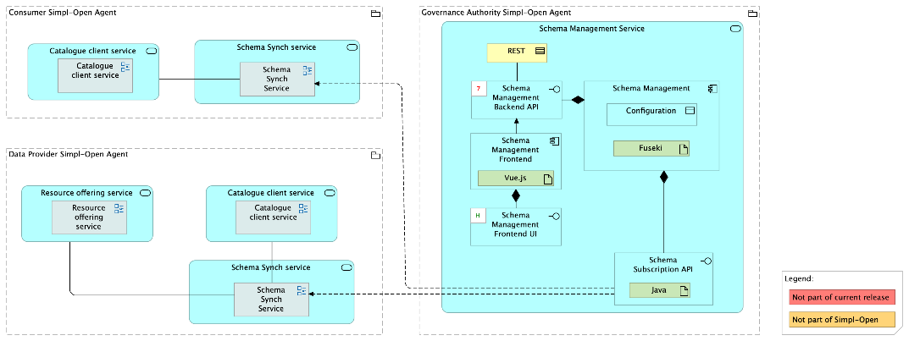
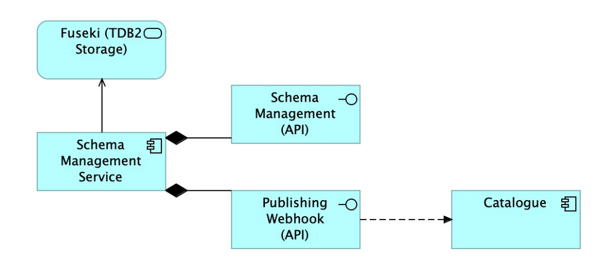

Source: functional-and-technical-architecture-specifications.md, sections 4.3.1 (ACV Static — Schema Management Service), 4.4.1 (ACV Static — Schema Management Service), 6.1.2 (TCV Static — Schema Management Service), 6.5.7 (Schema Management — architecture overview, data and metadata models).

# Schema Management Service — architecture

## Business view

The Schema Management Service (SMS) is the definitive source of truth and lifecycle manager for all schemas and vocabularies within the Simpl-Open data space. It enables the Governance Authority to define the structure of self-descriptions — establishing properties, data types, constraints, and controlled vocabularies that apply across resource types (datasets, applications, infrastructure). Schema configurations are automatically transformed into semantic files and propagated to Provider Nodes via the Schema Synch Service, ensuring providers always have access to current schema standards.

The SMS exposes its functionality via a Management API (private, authenticated), a Resolver Interface (public, read-only), and an event publisher that notifies subscribed downstream services of schema lifecycle changes (SchemaPublished, SchemaRevoked events).

Business process involvement: BP 02C (Manage Resource Description Schemas) — the Governance Authority creates, versions, publishes, and revokes schemas via the SMS.

Capability-map placement: Data dimension → Semantics and vocabulary capability → Schema management business service.

## Data view

The SMS uses Apache Jena Fuseki with a TDB2 backend (SPARQL-compliant RDF triple store). Data is partitioned across five logical datasets:

- **ds_schemas** — raw SHACL content of schemas; each schema version stored in its own named graph whose URI is the version's public dereferenceable URI.
- **ds_schema_metadata** — administrative metadata about schemas (titles, versions, lifecycle status, changelogs); managed exclusively by the SMS.
- **ds_vocabularies** — raw RDF content of vocabularies (e.g., SKOS thesauri).
- **ds_vocabulary_metadata** — administrative metadata about vocabularies.
- **ds_resource_descriptions** — out of scope for the SMS itself; managed by the Catalogue Service for validated Resource Descriptions.

**Guiding principles:** Separation of Concerns, Decoupling, Interoperability; immutability (changes create new versions, not updates); rich metadata for provenance tracking.

**Schema metadata model:**
- *Schema Concept* (family): `simpl:Schema`, `dct:title`, `dct:description`, `simpl:resourceType` (data/infrastructure/application), `simpl:status` (PUBLISHED/REVOKED), `simpl:latestVersion`.
- *Schema Version*: `simpl:SchemaVersion`, `dct:isPartOf` (→ concept URI), `dct:creator`, `dct:created`, `owl:versionInfo` (semantic version), `simpl:changelog`.

## Application view

### Internal decomposition

**Schema Management Service:**
- **Schema Management** — stores and manages schemas (SHACL files) and their versioned metadata.
- **Schema Subscription API** — allows downstream services to subscribe for schema lifecycle events (SchemaPublished, SchemaRevoked webhooks).
- **Schema Management Backend API** — private, authenticated RESTful interface for creating schema versions, changing lifecycle status (PUBLISHED/REVOKED), and managing vocabularies.
- **Schema Management UI** — user interface for Governance Authority administrators.
- **Resolver Interface** — public, read-only interface serving raw RDF content of schemas and vocabularies at stable, dereferenceable URIs (e.g., GET /schemas/{schemaName}/{version}).
- **Event Publisher** — internal component that pushes lifecycle event notifications to registered webhooks of subscribing services.

**Schema lifecycle flow:**
1. Governance Administrator creates a schema version by submitting a SHACL file + metadata to the Management API.
2. Administrator publishes the schema concept (status → PUBLISHED) via the Management API.
3. SMS updates its database and publishes a SchemaPublished event to all subscribers.
4. Revocation: administrator changes status to REVOKED; a SchemaRevoked event is published, preventing validation against any version of that schema.

**Event-driven consumer pattern (example — Catalogue Service):**
1. Catalogue subscribes to SMS events via webhook (POST /internal/events/schema-published).
2. On receiving SchemaPublished/SchemaRevoked, Catalogue updates its local schema registry.
3. Catalogue validates submitted Resource Descriptions against its local registry — no real-time calls to SMS during validation.

### Key integrations

- [Schema Synch Service](../../schema-synch-service/doc/architecture.md) — subscribes to SMS lifecycle events and distributes updated schemas to Provider Node NFS storage for use by SD Tooling.
- [Simpl Catalogue](../../../../../integration/resource-discovery/resource-catalogue/simpl-catalogue/doc/architecture.md) — subscribes to SMS events to maintain a local registry of published schemas; uses the Vocabulary Datastore for semantic validation during self-description publication.
- [SD Tooling](../../../../../governance/resource-management/metadata-description/sd-tooling/doc/architecture.md) — reads schemas from the Provider Node's local schema cache (populated by Schema Synch Service) for self-description creation and validation.
- [Catalogue Client Application](../../../../../integration/resource-discovery/search-engine/catalogue-client-application/doc/architecture.md) — uses schema to define search fields for advanced search; schema cache enables local parameter validation without real-time SMS queries.

## Technical view

- **Schema Management Backend** — implements Schema Management, Schema Subscription API, Schema Management Backend API.
- **Schema Management UI** — frontend for Governance Authority users.
- **Data store** — Apache Jena Fuseki with TDB2 backend (standards-compliant RDF triple store with SPARQL support).

Deployment: deployed in Governance Authority Agents.

## Security view

- The Management API is private and authenticated; only Governance Authority administrators can create schema versions or change lifecycle status.
- The Resolver Interface is public and read-only; no authentication required for schema content retrieval.
- Data segregation across five datasets provides the highest level of data isolation — the Catalogue Service has no ability to modify schema content or metadata.
- Schema versioning with immutability guarantees provenance and auditability: each published schema version is traceable to its submitter and timestamp.
- Lifecycle status (PUBLISHED/REVOKED) ensures that only approved schemas can be used for new resource validation.

Threat model: Status: not yet documented.

Secrets management: Status: not yet documented.

## Testing

Strategy: Status: not yet documented.

PSO validation status: Status: not yet documented.

Requirements traceability: Status: not yet documented.
