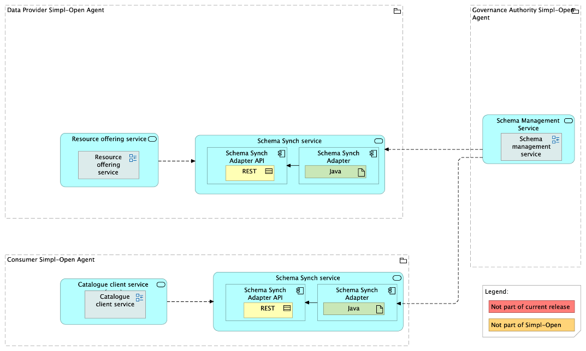

Source: source repo `data1/schema-sync-adapter` (README.md). FTA spec, §4.3.1 (ACV Static — Schema Sync Service), §6.1.2 (TCV Static — Schema Management Service, Schema Sync Service).

# Schema Sync Service — architecture

## Business view

The Schema Sync Service keeps Provider and Consumer agents aligned with the schemas published by the [Schema Management Service](../../simpl-schema-manager/README.md). It subscribes to lifecycle events from the SMS and mirrors the published schema set into a **shared persistent volume** local to each agent, in **Turtle (TTL)** format. Dependent components — SD Tooling, the Catalogue Client Application, and the Validation Backend — read from the local volume rather than calling the SMS API on every operation, which keeps the SMS off the hot path of normal agent operations and lets dependent components keep working briefly even if the SMS is unreachable.

Capability-map placement: Data dimension → Semantics and vocabulary capability → Schema management business service.

**Business processes supported:**
- [BP05B Provider manages resource descriptions](../../../../../foundations/business-processes/BP05B-provider-manages-resource-descriptions/README.md) — providers create self-descriptions against locally cached SHACL constraints.

## Data view

Local cache on each agent: a **shared persistent volume** holding the published schemas as **TTL** files. Two operations on the cache:

- **Initial full sync** at service startup — the adapter pulls every currently published schema from the SMS Resolver Interface and writes the TTL content into the volume.
- **Incremental update** on each lifecycle event — `SchemaPublished` adds (or replaces, for new versions) a TTL file; `SchemaRevoked` removes it.

The volume's contents are an exact mirror of the SMS's published set as of the last processed event; downstream components can therefore treat it as an authoritative local source of truth.

## Application view

### Internal decomposition

The service is a single Java/Spring component in source — `data1/schema-sync-adapter`. Internally:

- **Initial-sync routine** — runs once at startup. Calls the SMS Resolver Interface (`GET /schemas/...`) for each published schema and writes the TTL to the volume.
- **Event-subscription registration** — registers a webhook endpoint with the SMS so that subsequent `SchemaPublished` and `SchemaRevoked` events are pushed to it in real time.
- **Webhook receiver (Schema Sync Adapter API)** — receives lifecycle events from the SMS.
- **Sync engine** — on each event, fetches the schema TTL (publish) or deletes the local file (revoke), with logging and audit on every step.

### Key integrations

- [Schema Management Service](../../simpl-schema-manager/README.md) — source of schema content and lifecycle events; the Synch Service is one of its event subscribers.
- [SD Tooling](../../../../../data/semantics-and-vocabulary/schema-management/sd-tooling-api/README.md) — reads SHACL constraints from the local volume during self-description creation/validation.
- [Catalogue Client Application](../../../../../integration/resource-discovery/search-engine/catalogue-client-application/doc/architecture.md) — reads the local cache to populate advanced-search fields.
- [Validation Backend](../../../../../integration/resource-discovery/search-engine/validation-backend/README.md) — reads the local cache to validate self-descriptions against the active SHACL.

## Technical view

- **Source repo**: `data1/schema-sync-adapter` (Java / Spring Boot).
- **Storage**: shared persistent volume mounted into each consuming pod (NFS or equivalent CSI-backed volume in Kubernetes).
- **Format**: TTL files, one per schema version, named after the version's dereferenceable URI.
- **Deployment**: typically a sidecar or co-deployed service on each Provider and Consumer Agent; the volume is mounted into SD Tooling, Catalogue Client, and Validation Backend pods.

## Security view

- The webhook endpoint authenticates inbound events to ensure only the SMS can push notifications (typically via a shared secret or an mTLS client cert held by the SMS).
- The persistent volume is **read-only** from the perspective of consumers; only the Synch Service has write access. This prevents a compromised consumer from poisoning the local schema cache.
- The Synch Service has **no public ingress** — it only consumes events from the SMS and reads from the SMS Resolver Interface. There are no externally-callable endpoints for state mutation.
- **Audit trail** — every sync operation is logged with the event type, schema URI, timestamp, and outcome.

Threat model: not yet documented.

Secrets management: webhook authentication credentials and SMS Resolver client credentials — stored in the agent's Vault.

## Testing

Strategy: integration tests pair a fake SMS (mock Resolver + webhook caller) with the adapter against a tmpfs volume to verify both the initial-sync and event-driven flows. CI/CD runs unit tests, SAST (SonarQube), and security tests (Fortify).

PSO validation status: not yet documented.

Requirements traceability: not yet documented.
