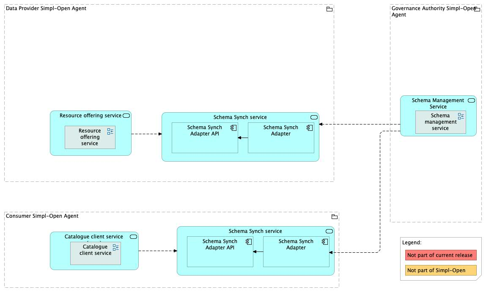
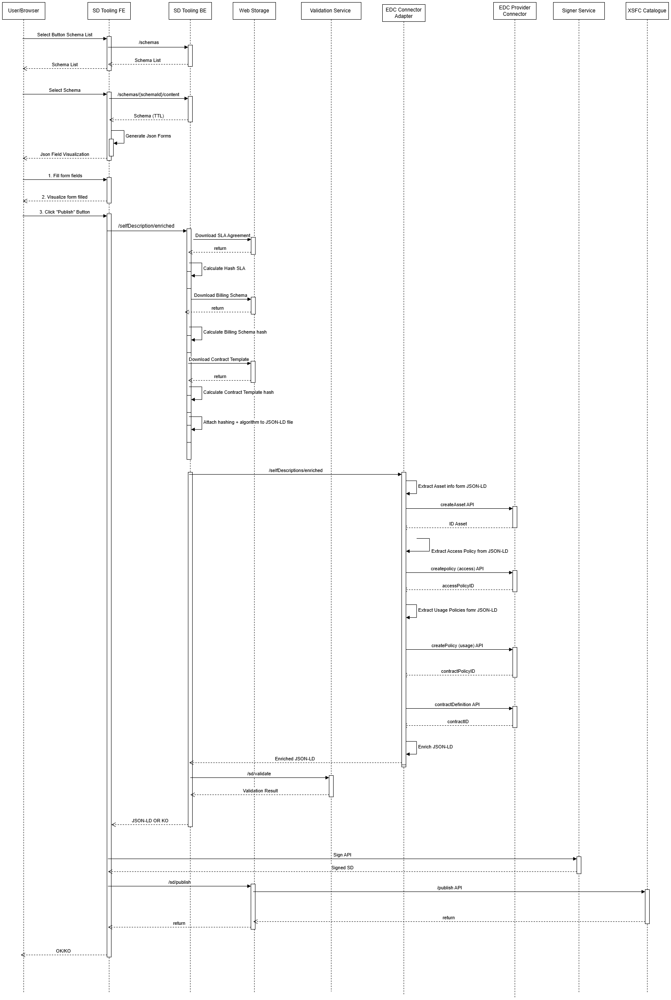

Source: functional-and-technical-architecture-specifications.md, sections 4.3.1 (ACV Static — Schema Synch Service), 6.1.2 (TCV Static — Schema Management Service, Schema Synch Service).

# Schema Synch Service — architecture

## Business view

The Schema Synch Service ensures that Provider Nodes and other dependent components always have access to the most current schema standards produced by the Schema Management Service. It subscribes to schema lifecycle events from the SMS and propagates updated schemas to local node storage (NFS), where they are available to SD Tooling and the Catalogue Client Application for self-description creation and advanced search field generation.

Capability-map placement: Data dimension → Semantics and vocabulary capability → Schema management business service.

## Data view

The Schema Synch Service receives schema updates from the SMS and stores them in NFS (Network File System) storage on the Provider Node. This local schema cache is consumed by SD Tooling (for self-description creation) and the Catalogue Client Application (for advanced search field generation).

## Application view

### Internal decomposition

**Schema Synch Adapter API:**
- Receives notifications from the Schema Management Service when a schema is published, versioned, or revoked.
- Acts as the entry point for SMS-pushed schema lifecycle events.

**Schema Synch Adapter:**
- Retrieves schema updates from the Schema Management Service upon notification.
- Processes and stores the retrieved schemas in NFS storage on the node, making them available for dependent components.

### Key integrations

- [Schema Management Service](../../schema-management-service/doc/architecture.md) — source of schema lifecycle events and schema content; the Schema Synch Service subscribes to SchemaPublished and SchemaRevoked events from the SMS.
- [SD Tooling](../../../../../governance/resource-management/metadata-description/sd-tooling/doc/architecture.md) — consumes the locally cached schemas (SHACL constraints and ontologies) for self-description creation and validation.
- [Catalogue Client Application](../../../../../integration/resource-discovery/search-engine/catalogue-client-application/doc/architecture.md) — uses the local schema cache to define and validate search field parameters for advanced search.

## Technical view

The Schema Synch Service is described in the TCV as part of the Schema Management Service technical section:
- **Schema Synch Adapter API** — receives schema lifecycle notifications from the SMS.
- **Schema Synch Adapter** — retrieves and processes schema updates, stores them in NFS.

Deployment: deployed in Provider Nodes and Consumer Nodes as a sidecar or co-deployed service alongside SD Tooling and the Catalogue Client Application.

## Security view

- The Schema Synch Adapter API endpoint receives events from the SMS; only the SMS is authorised to push notifications.
- Schemas stored in NFS are read-only from the perspective of dependent components (SD Tooling, Catalogue Client Application) — modifications are only possible via the SMS Management API.

Threat model: Status: not yet documented.

Secrets management: Status: not yet documented.

## Testing

Strategy: Status: not yet documented.

PSO validation status: Status: not yet documented.

Requirements traceability: Status: not yet documented.
