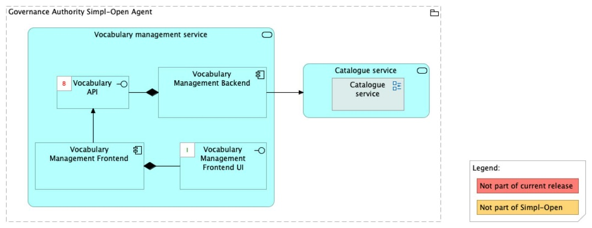
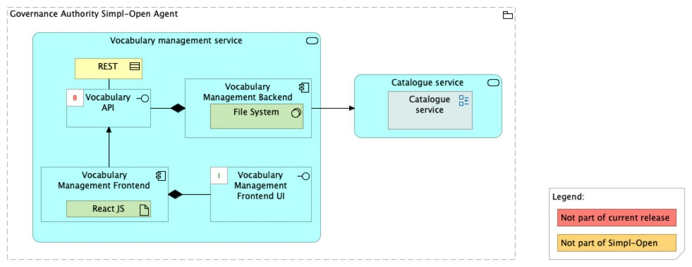

Source: FTA spec, §4.3.1 (ACV Static — Vocabulary Management Service) — heading-only entry — and §6.1.2 (TCV Static — Vocabulary Management Service). Cross-referenced against the PSO mapping spreadsheet (sheet "Repository mapping AS IS-TO PSO"), which marks both `vocabulary-management-backend` and `vocabulary-management-frontend` as **"Not yet existing"** under owner team Data1.

> **Status: planned — no source repository.** This document is a stub pending implementation. Treat all content below as the *current spec snapshot*; do not promote any of it as committed design until source landing confirms it.

# Vocabulary Management — architecture

## Business view

The Vocabulary Management component manages ontologies and controlled vocabularies used across the Simpl-Open data space to ensure semantic consistency in self-descriptions, resource discovery, and validation. The architecture specification lists this component under the Vocabulary hub capability; however, the ACV Static section for this service contains no body description — only the section heading and diagram reference.

Capmap note A7 (recorded against this section): the vocabulary-hub may merge vocabulary management and ontology management into a single component once Data1 begins implementation. Until source lands, this distinction is open.

Capability-map placement: Data dimension → Semantics and vocabulary capability → Vocabulary hub business service.

## Data view

Status: not yet documented. The TCV notes that the Vocabulary Management Backend is implemented as a File System, suggesting ontology/vocabulary files are stored as files rather than in a database.

## Application view

### Internal decomposition

**Vocabulary Management Backend:**
- Manages ontologies and controlled vocabularies.
- Implemented as a File System.

**Vocabulary Management Frontend:**
- User interface for Governance Authority users to manage vocabularies.
- Implemented as a ReactJS application.

### Key integrations

- [Schema Management Service](../../../schema-management/schema-management-service/doc/architecture.md) — vocabularies managed here may be referenced by schemas in the SMS; the relationship between vocabulary lifecycle and schema validation is not yet fully documented.
- [Simpl Catalogue](../../../../../integration/resource-discovery/resource-catalogue/simpl-catalogue/doc/architecture.md) — the Catalogue's Vocabulary Datastore contains loaded ontologies and schemas used for semantic validation of self-descriptions.

## Technical view

- **Vocabulary Management Backend** — implemented as a File System.
- **Vocabulary Management Frontend** — implemented as a ReactJS application.

Deployment: deployed in Governance Authority Agents.

## Security view

Status: not yet documented.

Threat model: Status: not yet documented.

Secrets management: Status: not yet documented.

## Testing

Strategy: Status: not yet documented.

PSO validation status: Status: not yet documented.

Requirements traceability: Status: not yet documented.
