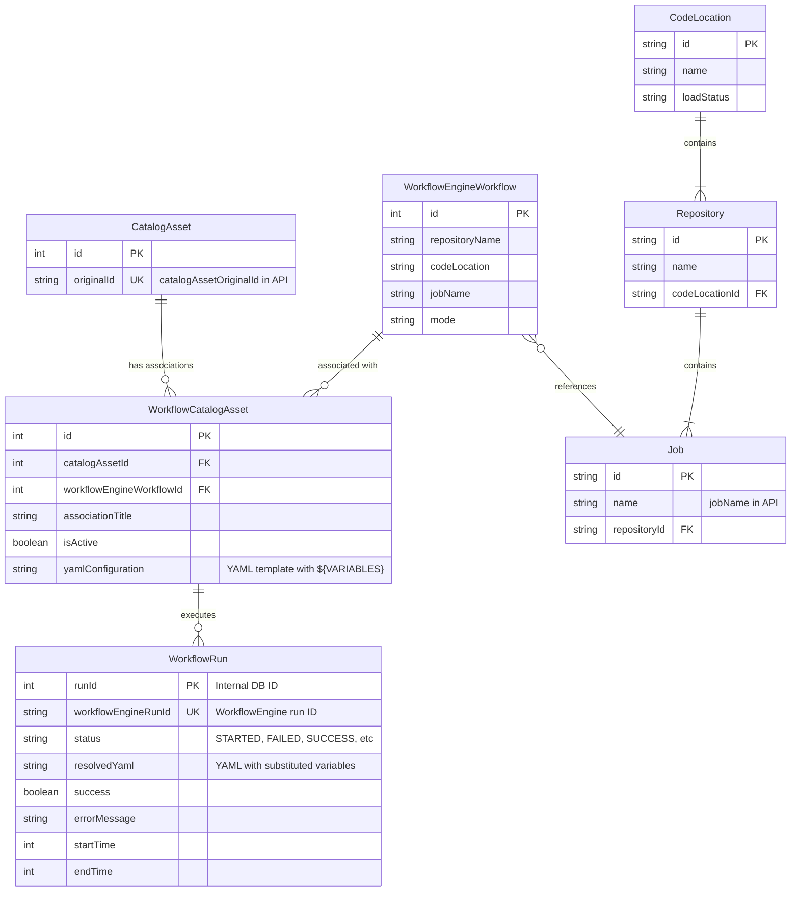

# Entity Relationship Diagram - Asset Orchestrator API

This diagram represents the entities and their relationships as they appear in the Asset Orchestrator API.

## Entity Descriptions

### CatalogAsset
Represents a data asset in the catalog. Assets can be associated with multiple workflows.

### WorkflowEngineWorkflow
Represents a workflow definition that references a job in the WorkflowEngine. Contains the coordinates (repository, code location, job name) to identify the workflow in WorkflowEngine.

### WorkflowCatalogAsset
Association entity between catalog assets and workflows. Contains the YAML configuration template with variable placeholders (e.g., `${APP_URL}`).

### WorkflowRun
Records each execution of a workflow. Stores both the internal database ID and the WorkflowEngine run ID, along with execution status and resolved configuration.

### CodeLocation
Top-level container in WorkflowEngine hierarchy. Represents a deployment location for workflow code.

### Repository
Second level in WorkflowEngine hierarchy. Contains multiple jobs and belongs to a code location.

### Job
The actual workflow/pipeline definition in WorkflowEngine. Referenced by WorkflowEngineWorkflow through repositoryName, codeLocation, and jobName.

## Key Relationships

- **CatalogAsset ↔ WorkflowEngineWorkflow**: Many-to-many relationship through WorkflowCatalogAsset
- **WorkflowCatalogAsset → WorkflowRun**: One-to-many (each association can have multiple execution runs)
- **CodeLocation → Repository → Job**: Hierarchical structure in WorkflowEngine
- **WorkflowEngineWorkflow → Job**: Logical reference (not a direct FK, but through naming coordinates)
