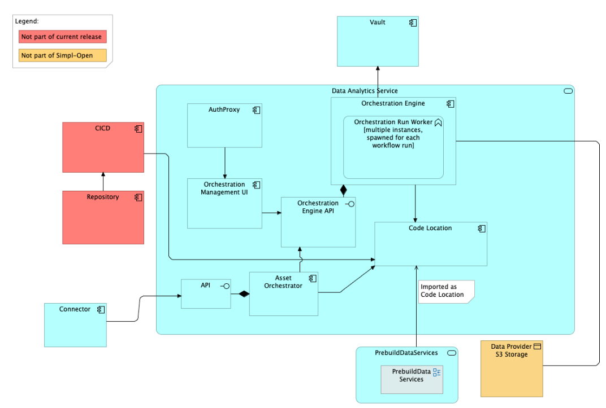
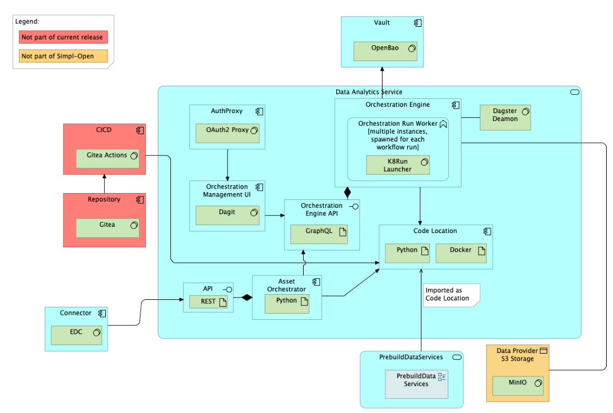

Source: functional-and-technical-architecture-specifications.md, sections 4.3.1 (ACV Static — Data Orchestration Service), 4.3.2 (ACV Dynamic — BP 09B), 6.1.2 (TCV Static — Data Orchestration Service), 6.5.3 (Data Sharing).

# Orchestration Platform — architecture

## Business view

The Orchestration Platform is able to execute Data Workflows to process or pre-process data using custom or built-in data services, like data anonymisation. It acts as a data plane bridge between data sources and consumer destinations.

In the context of bundled infrastructure, data, and application, the role of the data plane component is performed by the Infrastructure Orchestrator (part of the Connector), which retrieves the deployment script ID and triggers script execution. The Orchestration Platform serves the data workflow orchestration role.

Capability-map placement: Data dimension → Supporting data services capability → Data orchestration business service.

**Business process supported — BP 09B (Consumer receives data processing service via application):** The Orchestration Platform executes data workflows that apply transformations or processing steps to data assets before delivery to the consumer.

## Data view

The Orchestration Platform manages workflow definitions, run state, and pipeline versioning.

- **Repository (Gitea)** — stores orchestration code (jobs, ops, schedules, sensors). Each commit/tag corresponds to a known pipeline version, providing full audit traceability and rollback capability.
- **Dagster run state** — internal Dagster storage for run history, logs, and event streams.

## Application view

### Internal decomposition

- **Orchestration Engine (Dagster Daemons)** — several Dagster features (schedules, sensors, run queueing) require a long-running `dagster-daemon` process. Daemons start the RunLauncher as ephemeral processes.
- **Orchestration Run Worker (K8Run Launcher)** — interface to computational resources; allocates a Kubernetes job per workflow run. Each run is an ephemeral Kubernetes job.
- **Code Location** — a collection of Dagster definitions (Definitions instance in a top-level Python variable) loadable by Dagster tools. Comprises a reference to a Python module and the environment to load it.
- **Orchestration Management UI (Dagit)** — browser-based orchestration console; visualises pipelines, manages runs, inspects logs, manages schedules/sensors, and observes asset materialisations.
- **Orchestration Engine API (GraphQL)** — Dagster's primary programmatic interface; underpins Dagit and Python client libraries. Supports launching/cancelling runs, querying run state, managing workspace locations.
- **Asset Orchestrator** — custom Simpl-Open component; connects data and application offerings from the Simpl Catalogue with the Dagster orchestration engine.
- **Auth Proxy** — authentication sidecar; integrates the orchestration platform with the IAA stack (Tier 1/Tier 2 authentication) in a loosely coupled way.
- **Repository (Gitea)** — source control for orchestration code. Enables versioning, audit trails, and rollbacks. CI/CD via Gitea Actions automates testing and deployment of pipeline changes.

### Key integrations

- [Connector](../../../../../integration/resource-sharing/resource-sharing-runtime/connector/doc/architecture.md) — the Orchestration Platform is described as a Connector extension/data plane bridge for data workflow execution.
- [Simpl Catalogue](../../../../../integration/resource-discovery/resource-catalogue/simpl-catalogue/doc/architecture.md) — the Asset Orchestrator links catalogue offerings with workflow execution.
- [Authorisation](../../../../../security/access-control-and-trust/authorisation/authorisation/doc/architecture.md) — the Auth Proxy integrates with the IAA stack for authentication.

## Technical view

- **Orchestration Engine** uses Dagster Daemons.
- **Orchestration Run Worker** uses the K8Run Launcher (Kubernetes job per run).
- **Orchestration Management UI** is Dagit (Dagster's browser-based console).
- **Orchestration Engine API** is a GraphQL API exposed by Dagster.
- **Asset Orchestrator** is a Simpl-specific Python component.
- **Auth Proxy** is an authentication sidecar component.
- **Repository** is implemented with Gitea; CI/CD uses Gitea Actions.

Deployment: deployed in Participant Agents and/or Governance Authority infrastructure. Runs on Kubernetes; each pipeline run is a separate Kubernetes job.

## Security view

- The Auth Proxy sidecar handles authentication with the Simpl IAA stack without requiring tight coupling between Dagster and the IAA components.
- Run versioning via Gitea provides auditability: each run can be tied to a specific code version (commit hash or image tag).
- Access to Dagit and the GraphQL API is controlled via the Auth Proxy.

Threat model: Status: not yet documented.

Secrets management: Status: not yet documented.

## Testing

Strategy: Status: not yet documented.

PSO validation status: Status: not yet documented.

Requirements traceability: Status: not yet documented.
