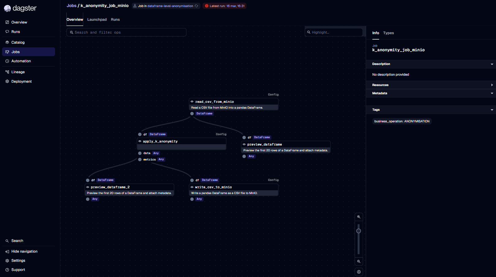
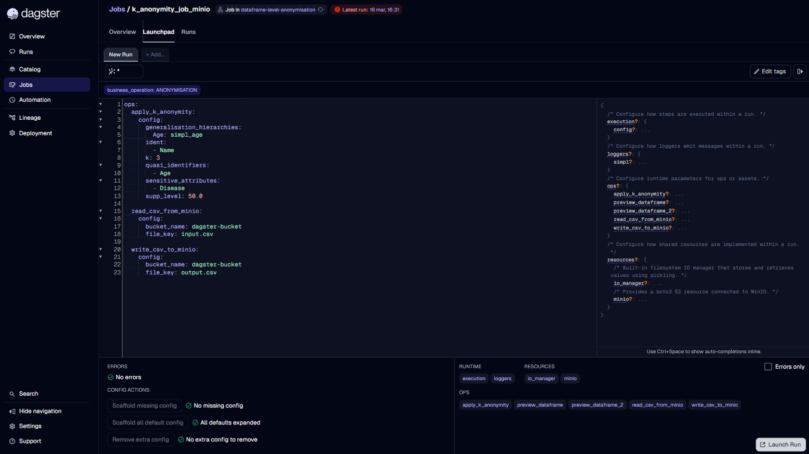
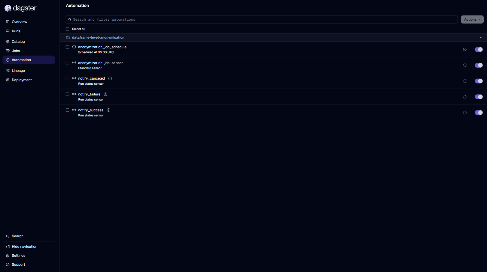

# Workflow Details

This guide explains how to **inspect the details of a deployed workflow** in Dagster using both the **Dagster UI** and the **Dagster GraphQL API**.
It complements *Workflow Discovery* by describing how to access workflow configuration, resources, schedules, and sensors.

---

# Viewing Workflow Details via Dagster UI

Workflow details are primarily accessible through the **Jobs** page and the **Automation** section.

---

## 1. Open a Workflow Detail Page

1. Click **Jobs** in the left navigation menu.  
2. Select a workflow from the list.  
3. The workflow detail page displays:
   - The workflow execution graph  
   - Recent runs  
   - Access to **Launchpad** for configuration



---

## 2. View Workflow Configuration

Workflow configuration is managed through the **Launchpad**.

1. Open a workflow detail page.  
2. Click **Launchpad**.  
3. The **Run Config Editor** shows the YAML configuration that the workflow accepts.

You can inspect:

- Step/op configuration  
- Resources  
- Inputs and outputs  
- Custom parameters  



---

## 3. View Schedules and Sensors

Schedules and sensors associated with a workflow are found in the **Automation** section.

1. Click **Automation**.  
2. Open **Schedules** or **Sensors**.  
3. Select an item to view:
   - Target workflow  
   - Cron or interval configuration  
   - Tick history  
   - Enabled/disabled status  



---

# Viewing Workflow Details via GraphQL API

Dagster exposes workflow metadata via GraphQL.  
Use the following queries to retrieve structure, default configuration YAML, required resources, and schedules & sensors.

Access the API at:

```
<dagster-webserver-url>/graphql
```

Example:
```
https://<dagster-instance>/graphql
```

---

## 4. Retrieve Workflow Structure

```graphql
query WorkflowStructure($params: PipelineSelector!) {
  pipelineOrError(params: $params) {
    ... on Pipeline {
      name
      description
      solids { name }
    }
  }
}
```

### Variables

```json
{
  "params": {
    "repositoryName": "__repository__",
    "repositoryLocationName": "dataframe-level-anonymisation",
    "pipelineName": "k_anonymity_job_minio"
  }
}
```

### Example response

```json
{
  "data": {
    "pipelineOrError": {
      "name": "k_anonymity_job_minio",
      "description": null,
      "solids": [
        { "name": "apply_k_anonymity" },
        { "name": "preview_dataframe" },
        { "name": "preview_dataframe_2" },
        { "name": "read_csv_from_minio" },
        { "name": "write_csv_to_minio" }
      ]
    }
  }
}
```

---

## 5. Retrieve Default Workflow Configuration

Dagster exposes a **default YAML** derived from the workflow’s config schema.  
Use it as a starting point in Launchpad and adjust values as needed.

```graphql
query WorkflowDefaultConfig($selector: PipelineSelector!) {
  runConfigSchemaOrError(selector: $selector) {
    ... on RunConfigSchema {
      rootDefaultYaml
    }
  }
}
```

### Variables

```json
{
  "selector": {
    "repositoryName": "__repository__",
    "repositoryLocationName": "dataframe-level-anonymisation",
    "pipelineName": "k_anonymity_job_minio"
  }
}
```

### Example response

```json
{
  "data": {
    "runConfigSchemaOrError": {
      "rootDefaultYaml": "ops:\n  apply_k_anonymity:\n    config:\n      generalisation_hierarchies:\n        Age: simpl_age\n      ident:\n      - Name\n      k: 3\n      quasi_identifiers:\n      - Age\n      sensitive_attributes:\n      - Disease\n      supp_level: 50.0\n  read_csv_from_minio:\n    config:\n      bucket_name: dagster-bucket\n      file_key: input.csv\n  write_csv_to_minio:\n    config:\n      bucket_name: dagster-bucket\n      file_key: output.csv\n"
    }
  }
}
```

> Note: If no defaults are defined by the workflow, this YAML may be minimal or omit sections without defaults.

---

## 6. Retrieve Required Resources

```graphql
query WorkflowRequiredResources($params: PipelineSelector!) {
  pipelineOrError(params: $params) {
    __typename
    ... on Pipeline {
      name
      modes {
        name
        resources {
          name
          description
        }
      }
    }
  }
}
```

### Variables

```json
{
  "params": {
    "repositoryName": "__repository__",
    "repositoryLocationName": "dataframe-level-anonymisation",
    "pipelineName": "k_anonymity_job_minio"
  }
}
```

### Example response

```json
{
  "data": {
    "pipelineOrError": {
      "__typename": "Pipeline",
      "name": "k_anonymity_job_minio",
      "modes": [
        {
          "name": "default",
          "resources": [
            {
              "name": "io_manager",
              "description": "Built-in filesystem IO manager that stores and retrieves values using pickling."
            },
            {
              "name": "minio",
              "description": "Provides a boto3 S3 resource connected to MinIO."
            }
          ]
        }
      ]
    }
  }
}
```

---

## 7. Retrieve Schedules & Sensors

### Variables

```json
{
  "repositorySelector": {
    "repositoryName": "__repository__",
    "repositoryLocationName": "dataframe-level-anonymisation"
  }
}
```

### Example response

```json
{
  "data": {
    "repositoryOrError": {
      "schedules": [
        {
          "name": "anonymization_job_schedule",
          "pipelineName": "anonymization_job",
          "cronSchedule": "0 6 * * *",
          "executionTimezone": "UTC"
        }
      ],
      "sensors": [
        {
          "name": "anonymization_job_sensor",
          "targets": [
            {
              "pipelineName": "anonymization_job"
            }
          ]
        },
        {
          "name": "notify_canceled",
          "targets": []
        },
        {
          "name": "notify_failure",
          "targets": []
        },
        {
          "name": "notify_success",
          "targets": []
        }
      ]
    }
  }
}
```

> Note: For sensors, the targets field determines which workflows the sensor can trigger.
> * If one or more workflows are listed in targets, the sensor will only run for those specific workflows.
> * If targets is empty, the sensor is considered generic, meaning it is not tied to a specific workflow and may evaluate global conditions.

---

# Summary

- Use **Jobs** and **Automation** in the UI to navigate workflow details and automation.  
- Via GraphQL, you can obtain:
  - **Workflow structure**  
  - **Default run configuration**  
  - **Required resources**  
  - **Schedules & Sensors**  

---

# References

- Dagster Webserver Documentation — https://docs.dagster.io/guides/operate/webserver  
- Dagster GraphQL API Reference — https://docs.dagster.io/api/graphql  
