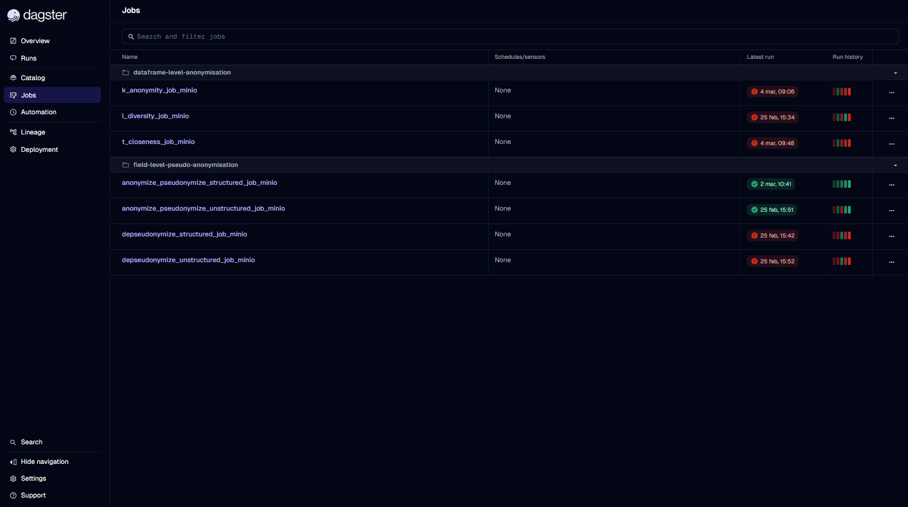
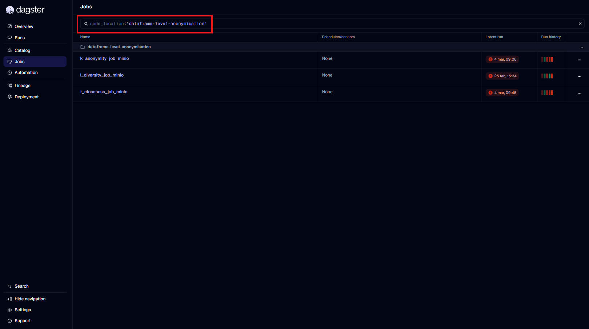
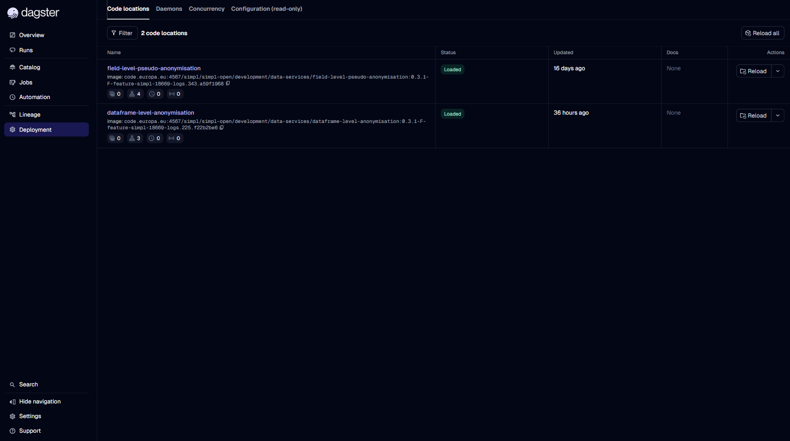
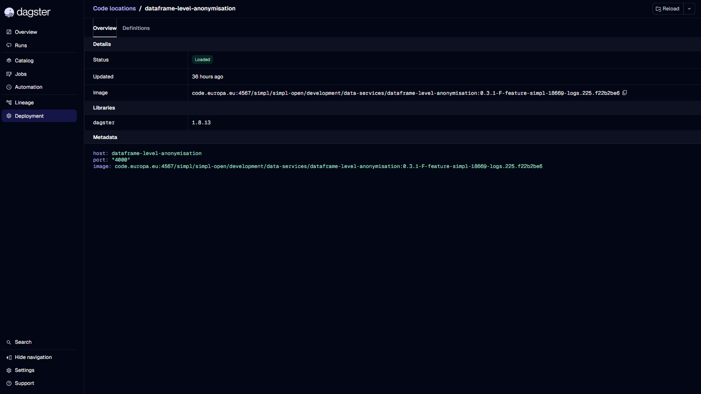

# Workflow Discovery

This guide explains how to **discover which workflows are deployed** in Dagster using both the **Dagster UI** and the **Dagster GraphQL API**.
Use it to locate workflows and understand how they are organized across code locations.

---

# Discovering Workflows via Dagster UI

Dagster exposes workflows primarily through two UI sections:

- **Jobs** → direct list of all deployed workflows
- **Deployment → Code locations → Definitions** → workflows grouped by deployment location

Both views are complementary.

---

## 1. Discover Workflows from the “Jobs” Section

1. Click **Jobs** from the left navigation menu.
2. The list of deployed workflows appears.
3. Select a workflow to view its execution graph, configuration, or recent runs.



### Filtering workflows by code location

You can filter workflows using the **search bar** at the top of the Jobs page.

To filter workflows belonging to a specific code location, type:

```
code_location:"<name-to-search-for>"
```

Example:
```
code_location:"dataframe-level-anonymisation"
```



This allows you to narrow down the list to only the workflows deployed under that code location.

---

# Discovering Workflows from the “Deployment” Section

The Deployment page provides a structured view of **code locations**, the units that Dagster loads from deployment artifacts.

### Step 1 — Open the Deployment page

Click **Deployment** in the left sidebar. You will see all available code locations.



### Step 2 — Inspect a specific code location

Click any code location to view its definitions.



Inside the location details page, open **Definitions** to see:

- **Assets**
- **Jobs** → these are the user-facing **workflows**
- **Sensors**
- **Schedules**
- **Resources**

This view is useful for understanding workflows grouped by deployment unit and verifying code location loading.

---

# Discovering Workflows via GraphQL API

Dagster exposes a GraphQL API for programmatic workflow discovery. Use it for automation, validation, or documentation.

Access the API at:

```
<dagster-webserver-url>/graphql
```

Example:
```
https://<dagster-instance>/graphql
```

---

## 2. List All Repositories and Workflows

This query returns all repositories, code locations and their workflows:

```graphql
query {
  repositoriesOrError {
    ... on RepositoryConnection {
      nodes {
        name
        location { name }
        pipelines { name }
      }
    }
  }
}
```

### Example response

```json
{
  "data": {
    "repositoriesOrError": {
      "nodes": [
        {
          "name": "__repository__",
          "location": {
            "name": "field-level-pseudo-anonymisation"
          },
          "pipelines": [
            { "name": "anonymize_pseudonymize_structured_job_minio" },
            { "name": "anonymize_pseudonymize_unstructured_job_minio" },
            { "name": "depseudonymize_structured_job_minio" },
            { "name": "depseudonymize_unstructured_job_minio" }
          ]
        },
        {
          "name": "__repository__",
          "location": {
            "name": "dataframe-level-anonymisation"
          },
          "pipelines": [
            { "name": "k_anonymity_job_minio" },
            { "name": "l_diversity_job_minio" },
            { "name": "t_closeness_job_minio" }
          ]
        }
      ]
    }
  }
}
```

Note: `pipelines` are the **workflows**.

---

## 3. List Workflows for a Specific Repository

Use this query to retrieve workflows belonging to a single code location:

```graphql
query ListWorkflowsInRepository($repositorySelector: RepositorySelector!) {
  repositoryOrError(repositorySelector: $repositorySelector) {
    ... on Repository {
      name
      location { name }
      pipelines { name }
    }
  }
}
```

### Variables

```json
{
  "repositorySelector": {
    "repositoryName": "__repository__",
    "repositoryLocationName": "dataframe-level-anonymisation"
  }
}
```

### Example response

```json
{
  "data": {
    "repositoryOrError": {
      "name": "__repository__",
      "location": {
        "name": "dataframe-level-anonymisation"
      },
      "pipelines": [
        { "name": "k_anonymity_job_minio" },
        { "name": "l_diversity_job_minio" },
        { "name": "t_closeness_job_minio" }
      ]
    }
  }
}
```

---

# Summary

- Use **Jobs** to browse and filter all deployed workflows.
- Use **Deployment → Code locations** to inspect workflows grouped by deployment unit.
- Use **GraphQL** for automated or programmatic workflow discovery.

---

# References

- Dagster Webserver Documentation — https://docs.dagster.io/guides/operate/webserver
- Dagster GraphQL API Reference — https://docs.dagster.io/api/graphql
