# Observability

This guide explains how workflow observability is implemented in SIMPL using Dagster execution events and structured JSON logs.
It describes what is captured during runs, how technical and business log messages are recorded, and where logs are stored for live monitoring and retrospective analysis.
Use it to trace job behavior end-to-end for troubleshooting, auditing, and operations.

* [Workflow Execution Logs](#workflow-execution-logs)
* [Workflow Status and Logging on UI](#accessing-workflow-execution-status-and-logs-current-and-historical-runs)

# Workflow Execution Logs

This description explains:

* How Dagster captures workflow execution logs within the SIMPL platform
* How workflow logs are structured and stored
* How logs are generated during workflow runs
* Where workflow execution logs are persisted
* How logs can be accessed in real time and retrospectively

---

## 1. Overview

Every time a workflow (known as a **job** in Dagster) is executed, the platform automatically produces a detailed trace of what happened. This trace is composed of **events** — discrete, timestamped records that describe each stage of the execution lifecycle. In addition to these system-generated events, workflow steps (**ops**) can emit custom log messages written by the developer.

SIMPL extends Dagster's built-in logging with a **custom structured JSON logger** (`simpl_json_logger`) that writes one JSON object per line to a dedicated file for each run. This provides a portable, machine-readable audit trail that exists alongside the database-backed event log.

Two complementary logging channels are therefore available:

| Channel | Storage | Purpose |
| --- | --- | --- |
| **Event Log** (Dagster built-in) | PostgreSQL database | Powers the Dagster Webserver UI, run history, and GraphQL API |
| **SIMPL JSON Log** (custom) | JSON file on shared volume | Structured audit trail per run, accessible outside Dagster |

---

## 2. How Dagster Captures Execution Events

### 2.1 The Event Log

Dagster is an **event-driven orchestrator**. As a workflow executes, the engine emits a stream of **DagsterEvent** objects that record every meaningful state transition. These events are captured automatically — no user action or configuration is required.

The event log is configured in `dagster.yaml` through the `event_log_storage` section. In SIMPL, events are persisted to a **PostgreSQL** database:

```yaml
event_log_storage:
  module: dagster_postgres.event_log
  class: PostgresEventLogStorage
  config:
    postgres_db:
      hostname: dagster_postgresql
      username:
        env: DAGSTER_POSTGRES_USER
      password:
        env: DAGSTER_POSTGRES_PASSWORD
      db_name:
        env: DAGSTER_POSTGRES_DB
      port: 5432
```

Each event is written to the database as it occurs, which means the event log is available for inspection in the Dagster Webserver UI **during execution** (live tailing) and **after completion** (historical lookup).

### 2.2 Event Categories

The following categories of events are captured during a run:

| Event Type | When It Occurs | Example Message |
| --- | --- | --- |
| `RUN_START` | The run begins executing | *Started execution of run for "k_anonymity_job".* |
| `ENGINE_EVENT` | The execution engine reports internal activity | *Executing steps using multiprocess executor: parent process (pid: 1)* |
| `STEP_WORKER_STARTING` | A subprocess is launched for a step | *Launching subprocess for "read_csv_to_df".* |
| `RESOURCE_INIT_STARTED` | Resource initialisation begins | *Starting initialization of resources [io_manager].* |
| `RESOURCE_INIT_SUCCESS` | Resource initialisation completes | *Finished initialization of resources [io_manager].* |
| `LOGS_CAPTURED` | Dagster begins capturing stdout/stderr for a process | *Started capturing logs in process (pid: 32).* |
| `STEP_START` | A step begins executing | *Started execution of step "read_csv_to_df".* |
| `STEP_INPUT` | A step receives an input | *Got input "df" of type "DataFrame". (Type check passed).* |
| `LOADED_INPUT` | An input is loaded via the IO manager | *Loaded input "df" using input manager "io_manager", from output "result" of step "read_csv_to_df"* |
| `STEP_OUTPUT` | A step yields an output | *Yielded output "result" of type "DataFrame". (Type check passed).* |
| `HANDLED_OUTPUT` | An output is persisted by the IO manager | *Handled output "result" using IO manager "io_manager"* |
| `STEP_SUCCESS` | A step completes successfully | *Finished execution of step "read_csv_to_df" in 33ms.* |
| `STEP_FAILURE` | A step fails with an error | *(includes exception and stack trace)* |
| `RUN_SUCCESS` | The entire run completes successfully | *Finished execution of run for "k_anonymity_job".* |
| `RUN_FAILURE` | The run terminates due to an error | *(includes root-cause information)* |

This is not an exhaustive list. Dagster defines additional event types for assets, hooks, retries, and other advanced features. For the complete reference, see the [Dagster event types documentation](https://docs.dagster.io/concepts/logging/loggers).

---

## 3. Run-Level and Step-Level Logs

### 3.1 Run-Level Events

Run-level events describe the lifecycle of the **entire workflow execution**. They bracket the run from start to finish:

- **`RUN_START`** — marks the beginning of the run.
- **`ENGINE_EVENT`** — reports executor-level activity (e.g. the multiprocess executor starting and shutting down its parent process).
- **`RUN_SUCCESS`** / **`RUN_FAILURE`** — marks the terminal state.

These events do not reference a specific step; they apply to the run as a whole.

### 3.2 Step-Level Events

Step-level events describe what happens inside each individual **op** (operation) within the workflow graph. Every step produces its own sequence:

1. **`STEP_WORKER_STARTING`** — a subprocess is launched for the step.
2. **`RESOURCE_INIT_STARTED`** / **`RESOURCE_INIT_SUCCESS`** — resources required by the step are initialised.
3. **`LOGS_CAPTURED`** — Dagster begins capturing the process's stdout/stderr.
4. **`STEP_START`** — the step's user code begins executing.
5. **`STEP_INPUT`** / **`LOADED_INPUT`** — inputs are received and loaded.
6. **`STEP_OUTPUT`** / **`HANDLED_OUTPUT`** — outputs are yielded and persisted.
7. **`STEP_SUCCESS`** or **`STEP_FAILURE`** — the step terminates.

Each step-level event carries an **`op_name`** field, so events can be filtered by the specific operation that produced them.

### 3.3 Viewing Logs in the Webserver

The Dagster Webserver provides a **Run log viewer** that displays both run-level and step-level events in a unified, chronological timeline. Features include:

- **Live tailing** — logs stream into the viewer while the run is in progress.
- **Step filtering** — click on a step in the execution graph to see only the events for that step.
- **Log level filtering** — filter by severity (DEBUG, INFO, WARNING, ERROR, CRITICAL).
- **Structured event detail** — click on any event row to expand its full metadata.

For more information, see the [Dagster Webserver documentation](https://docs.dagster.io/guides/operate/webserver).

---

## 4. User-Defined Log Messages

### 4.1 Logging with `context.log`

Inside any Dagster op, the **`context.log`** object provides standard Python-style logging methods. Messages emitted through this interface are automatically captured by the configured logger and appear in the event log alongside the system events.

```python
from dagster import op

@op
def my_step(context):
    context.log.info("Processing started")
    context.log.warning("Data quality issue detected")
    context.log.error("Unexpected value encountered")
```

The available log levels are:

| Method | Level |
| --- | --- |
| `context.log.debug(...)` | DEBUG |
| `context.log.info(...)` | INFO |
| `context.log.warning(...)` | WARNING |
| `context.log.error(...)` | ERROR |
| `context.log.critical(...)` | CRITICAL |

All messages emitted via `context.log` are:

1. Displayed in the **Dagster Webserver** run log viewer.
2. Stored in the **PostgreSQL event log**.
3. Written to the **SIMPL JSON log file** (when the `simpl` logger is active).

#### Enabling the SIMPL JSON Logger

The custom `simpl` logger is **not active by default**. To turn it on, the `loggers` section must be included in the job's **run configuration** when launching a run. For example:

```yaml
loggers:
  simpl:
    config:
      log_level: INFO
```

This can be provided via the **Launchpad** in the Dagster Webserver UI, or passed programmatically through the run config. Without this configuration, only the built-in Dagster event log (PostgreSQL) will capture execution events — no JSON log file will be produced.

### 4.2 Business Events

SIMPL ops can emit enriched **business events** by passing structured `extra` data to `context.log.info()`. When the `event_type` field is set to `"BUSINESS_EVENT"`, the custom logger records the entry with a `"BUSINESS"` severity level and includes the additional metadata.

```python
@op
def apply_k_anonymity(context, config, df):
    context.log.info(
        "Anonymize dataset with k-anonymity algorithm",
        extra={
            "business_operation": "ANONYMISATION",
            "event_type": "BUSINESS_EVENT",
            "op_name": "apply_k_anonymity",
            "custom_fields": {
                "algorithm": "k-anonymity",
                "dataset_type": "structured",
                "job_config": config.model_dump(),
            },
        },
    )
```

Business events appear in the JSON log file with level `"BUSINESS"` and carry the full `custom_fields` payload, making them useful for auditing and compliance purposes.

### 4.3 Business Operation Tagging

Each job in SIMPL is tagged with a `business_operation` at the job level:

```python
@job(tags={"business_operation": "ANONYMISATION"})
def k_anonymity_job():
    ...
```

The custom logger resolves the `business_operation` for every log record using the following priority (highest to lowest):

1. **Job tags** attached to the Dagster run metadata.
2. **Explicit `business_operation`** attribute on the log record (via `extra`).
3. **Logger configuration** default (fallback value from `dagster.yaml` or run config).

Once a non-default value is resolved, it becomes "sticky" — subsequent log records in the same run inherit it even if they don't explicitly set the field.

---

## 5. Log Storage and Persistence

### 5.1 PostgreSQL Event Log

All Dagster events — both system-generated and user-emitted — are persisted to **PostgreSQL** via the `PostgresEventLogStorage` backend. This storage:

- Powers the **Webserver UI** (run timeline, step detail, log viewer).
- Is queryable through the **Dagster GraphQL API**.
- Retains data for the lifetime of the database.

The relevant configuration sections in `dagster.yaml` are:

| Section | Purpose |
| --- | --- |
| `event_log_storage` | Where execution events are persisted |
| `run_storage` | Where run metadata (status, tags, config) is persisted |
| `schedule_storage` | Where schedule and sensor tick data is persisted |

All three use the same PostgreSQL instance in the default SIMPL configuration.

### 5.2 SIMPL JSON Log Files

In addition to the database, the **`simpl_json_logger`** writes a structured JSON Lines file for each run. Each run produces one file:

```text
/dagster/shared/simpl_run_<run_id>.json
```

Where `<run_id>` is the Dagster run UUID (e.g. `206ac098-a0fd-405a-b902-f6a3e0de5e79`).

#### File Location

The log files are written to the directory configured via the `log_dir` logger setting. The default path is `/dagster/shared` inside the container.

> **Note:** In the local development environment (`dagster-dev-local` repository), the log directory is overridden to `/opt/dagster/logs`, which is backed by a Docker volume (`dagster_logs`). A **sync sidecar** container (`sync_logs`) periodically copies these files to the host filesystem so they can be accessed outside Docker.

#### JSON Structure

Each line in the log file is an independent JSON object. There are two record types:

**Technical record** (system events and informational messages):

```json
{
    "timestamp": "2026-02-17T18:41:47.928Z",
    "level": "DEBUG",
    "message": "Started execution of run for \"anonymize_pseudonymize_depseudonymize_structured_job\".",
    "http": {
        "status": null,
        "requestSize": null,
        "executionTime": null,
        "responseSize": null,
        "action": null,
        "method": null
    },
    "thread": "MainThread",
    "customFields": {
        "event_type": "RUN_START"
    }
}
```

**Business record** (domain-specific audit events):

```json
{
    "timestamp": "2026-02-17T18:42:02.456Z",
    "level": "BUSINESS",
    "message": {
        "origin": "dagster",
        "destination": "dagster",
        "businessOperation": "ANONYMISATION_PSEUDONYMISATION",
        "messageType": "RESPONSE",
        "correlationId": "f4b9928d-177e-48c6-8936-1056cd966ca5",
        "msg": "Anonymize and pseudonymize dataset",
        "user": null,
        "userIp": null,
        "customFields": {
            "event_type": "BUSINESS_EVENT",
            "op_name": "anonymize_pseudonymize_structured",
            "dataset_type": "structured",
            "job_config": {...}
        }
    },
    "thread": "MainThread",
    "http": {
        "status": null,
        "requestSize": null,
        "executionTime": null,
        "responseSize": null,
        "action": null,
        "method": null
    }
}
```

#### Key Fields

**Common fields** (present in both technical and business records):

| Field | Description |
| --- | --- |
| `timestamp` | ISO-8601 UTC timestamp with millisecond precision |
| `level` | Log severity — standard levels (`DEBUG`, `INFO`, `WARN`, `ERROR`, `CRITICAL`) for technical records, or `"BUSINESS"` for domain events |
| `thread` | The Python thread that emitted the record |
| `http` | HTTP context object (typically `null` values in pipeline runs) |

**Technical record fields:**

| Field | Description |
| --- | --- |
| `message` | Human-readable description of the event (plain string) |
| `customFields.event_type` | The Dagster event type (e.g. `RUN_START`, `STEP_SUCCESS`) |
| `customFields.op_name` | The name of the step that produced this event (where applicable) |

**Business record fields:**

| Field | Description |
| --- | --- |
| `message.origin` | The system that produced the event (e.g. `"dagster"`) |
| `message.destination` | The target system (e.g. `"dagster"`) |
| `message.businessOperation` | The business operation tag (e.g. `ANONYMISATION`, `DEPSEUDONYMISATION`) |
| `message.messageType` | Message type indicator (e.g. `"RESPONSE"`) |
| `message.correlationId` | The Dagster run ID — links all log entries for one run |
| `message.msg` | Human-readable description of the event |
| `message.customFields.event_type` | Always `"BUSINESS_EVENT"` for business records |
| `message.customFields.op_name` | The name of the step that produced this event |

### 5.3 Log Lifecycle

The following diagram summarises how log data flows through the system:

```text
  Op executes
      │
      ▼
  context.log.info(...)
      │
      ├──────────────────────────────────┐
      ▼                                  ▼
  Dagster Event Log                SIMPL JSON Logger
  (PostgresEventLogStorage)        (SimplJSONFileHandler)
      │                                  │
      ▼                                  ▼
  PostgreSQL database             JSON file per run
      │                           /dagster/shared/
      ▼                                  │
  Webserver UI / GraphQL API      Host filesystem
```

---

## 6. Accessing Logs

### 6.1 During Execution (Live)

| Method | How |
| --- | --- |
| **Webserver UI** | Open the run in the Dagster Webserver → the log viewer streams events in real time. |
| **JSON file** | The log file is written incrementally; tail the file to see new entries as they appear. |

### 6.2 After Execution (Retrospective)

| Method | How |
| --- | --- |
| **Webserver UI** | Navigate to the **Runs** tab → select a past run → view the complete event log. Filter by step, log level, or search for keywords. |
| **GraphQL API** | Query the `runsOrError` and `logsForRun` endpoints for programmatic access. |
| **JSON files** | Locate the file by run ID in the logs directory: `simpl_run_<run_id>.json`. Each file is self-contained and can be parsed with any JSON-capable tool. |

### 6.3 Log Level Configuration

The log verbosity can be configured at two levels:

- **Dagster Webserver** — the `LOG_LEVEL` environment variable controls the minimum severity shown in the UI (configured in `values.yaml`).
- **SIMPL JSON Logger** — the `log_level` config field in the logger configuration controls which messages are written to the JSON file. The default is `INFO`.

---

## 7. References

- [Dagster Logging Documentation](https://docs.dagster.io/concepts/logging/loggers)
- [Dagster Webserver User Manual](https://docs.dagster.io/guides/operate/webserver)
- [Dagster Python Logging Configuration](https://docs.dagster.io/concepts/logging/python-logging)
- [SIMPL Logging, Monitoring, Reporting Confluence Page](https://confluence.simplprogramme.eu/pages/viewpage.action?pageId=32571549&spaceKey=SIMPL&title=Logging%2BMonitoring%2BReporting)
- SIMPL custom logger implementation: [custom_json_logger.py](https://code.europa.eu/simpl/simpl-open/development/data-services/util-services/-/blob/main/src/util_services/custom_json_logger.py)
- SIMPL Dagster instance configuration: [dagster.yaml](https://code.europa.eu/simpl/simpl-open/development/orchestration-platform/dagster-dev-local/-/blob/main/dagster.yaml)
---

# Accessing Workflow Execution Status and Logs (Current and Historical Runs)
> **Prerequisite:** This guide assumes you have access to the Dagster Webserver. All interactions described below take place in a web browser pointed at the Webserver URL provided by your deployment.


This description explains:

- Where to find workflow execution status in the Dagster UI 
- Where to find workflow execution logs in the Dagster UI 
- How to search and interpret the structure of the logs
- Additional tips for using logs for debugging

---

## 1. Overview

Every workflow execution (called a **run** in Dagster) produces a complete log of events that is automatically persisted to a PostgreSQL database. These logs remain available indefinitely after the run finishes, allowing Participants to review what happened at any point in time.

The **Dagster Webserver UI** is the primary tool for exploring this history. It provides:

- A searchable, filterable list of **all runs**.
- A detailed **event log viewer** for each run, showing every execution event in chronological order.
- **Step-level filtering** to isolate events from a specific operation within a workflow.
- **Log level filtering** and **text search** to quickly locate relevant entries.
- Access to raw **stdout / stderr** output (compute logs) for each step.

---

## 2. Accessing the Runs Page

The **Runs** page is the starting point for retrieving historical logs.

1. **Open the Dagster Webserver** in your browser by navigating to the Webserver URL.

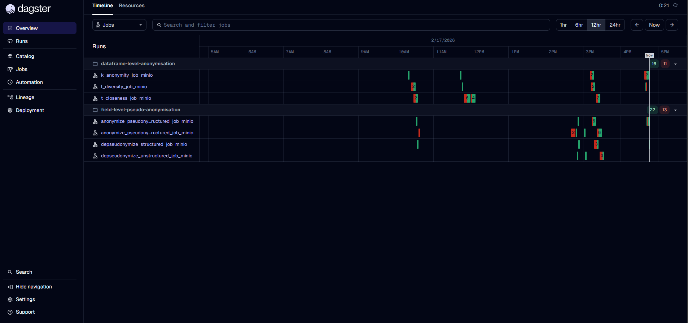


2. Click on **"Runs"** in the top navigation bar.

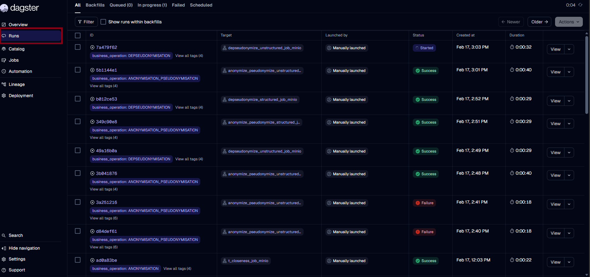
_The Runs page displays a reverse-chronological list of all workflow executions_

**Each row in the list shows the following information:**

| Column | Description |
| --- | --- |
| **Run ID** | The unique identifier (UUID) for the run |
| **Status** | Current state — `SUCCESS`, `FAILURE` etc. |
| **Job name** | The workflow (job) that was executed |
| **Launched by** | Who or what triggered the run (e.g. a user, a schedule, a sensor) |
| **Timestamp** | When the run was launched |
| **Duration** | How long the run took |

---

## 3. Filtering and Searching Runs

When the run history grows large, use the filtering capabilities on the Runs page to locate specific executions.

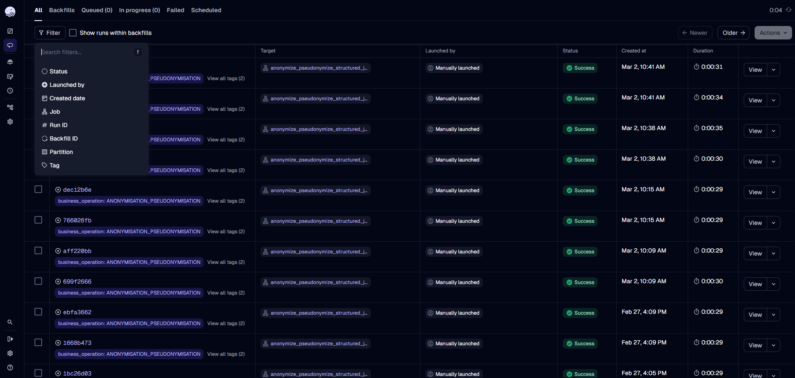

### Available Filters

| Filter | How to Use |
| --- | --- |
| **Status** | Select one or more statuses (e.g. `FAILURE`) to see only runs in those states |
| **Launched by** | Filter jobs by the initiating user or trigger |
| **Created date** | Filter the creation date (or range) of jobs |
| **Job** | Filter to a specific job name (e.g. `k_anonymity_job`) |
| **Run ID** | Filter based on the job's uuid (e.g. `6c2369c2-aaba-4b4c-a11a-a48ec7ab1651`) |
| **Backfill ID** | Filter based on the backfill id |
| **Partition** | Filter runs based on their partition key (e.g. `2026-02-11`) |
| **Tags** | Filter by run tags (e.g. `business_operation: ANONYMISATION`) |


### Using the Search Bar

The **search bar** at the top of the Runs page supports a query syntax for combining multiple filters. For example:

```text
status:FAILURE job:k_anonymity_job
```

This shows only failed runs of the `k_anonymity_job` workflow.

### Using the quick filter bar
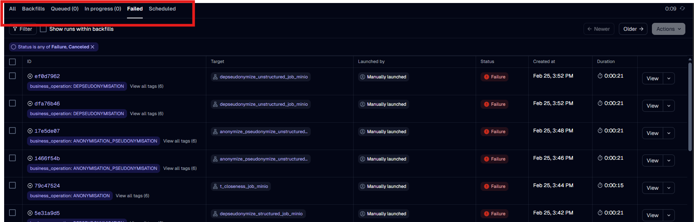


## 3. Run Status and Interpretations

Dagster uses the following run status values:

| Status | Meaning |
|--------|----------|
| `QUEUED` | The run is waiting to be executed |
| `STARTED` | The run is currently executing |
| `NOT_STARTED` | The run is in the brief window between creating the run and launching or enqueueing it |
| `MANAGED` | The run is managed by a 3rd party component |
| `SUCCESS` | The run completed successfully |
| `FAILURE` | The run failed |
| `CANCELED` | The run was canceled |
| `CANCELING` | The run is in the process of being canceled |

### How to Interpret End Results
- In case of `SUCCESS`, the job completed successfully. It should verify the final output dataset and validate that the results meet the expected criteria.
- In case of `FAILURE`, the job did not complete successfully. Review the error details and log messages, identify the root cause, apply the necessary fix, and rerun the job.
- The `STARTED` and `QUEUED` states are temporary. If a run remains in one of these states for an unusually long time, it may indicate a performance issue or insufficient resource allocation.
- The `CANCELED` status indicates that the job was intentionally aborted, either manually or programmatically, for a specific reason.

---

## 4. Viewing the Event Log

Once you have located the run you want to inspect:

1. **Click on the Run ID** of the run / or the **View** button in the Runs list.

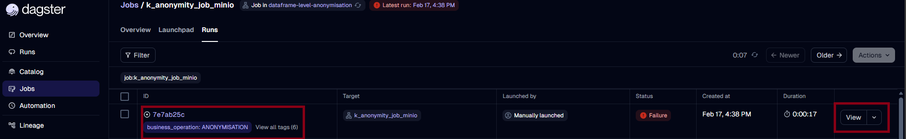

2. The **Run detail** page opens.

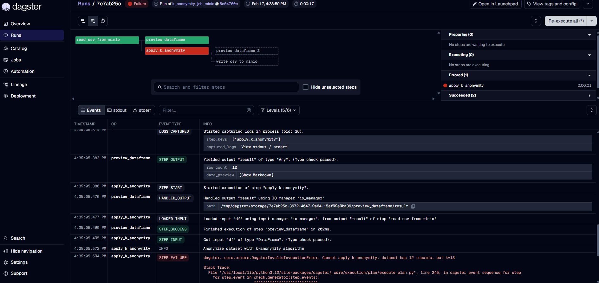

The Run detail page has two main areas:

- **Job graph** (top) — a visual representation of the workflow's ops (steps) and their dependencies. Each node is colour-coded by status (green = success, red = failure, grey = not started).
- **Log stream** (bottom) — a chronological list of all events that occurred during the run.


### Job Graph Visualization modes

| Flat | Waterfall | Timeline |
|------|----------|----------|
| 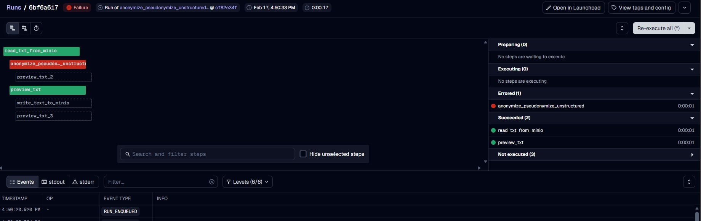 | 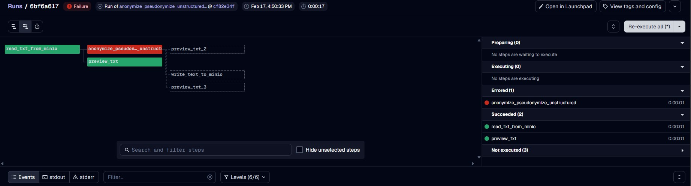 | 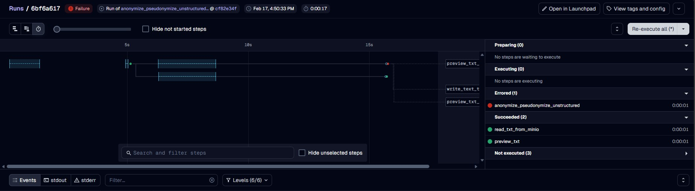 |


### Log Stream View

The Log stream view includes:

| Field | Meaning |
| --- | --- |
| **Timestamp** | Exact time the event occurred (UTC).|
| **Op name** | The step that produced the event.|
| **Event type** | The Dagster event type (e.g. `STEP_SUCCESS`) / Log level (e.g. `ERROR`)|
| **INFO / Metadata / Stack trace** | Additional context, or the full error and traceback for failure events.|

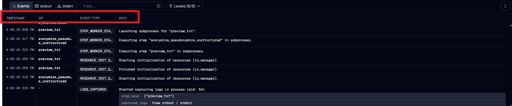

### Events Displayed in the Log

The event log includes every event that was recorded during the run:

| Event Category | Examples |
| --- | --- |
| **Run lifecycle** | `RUN_START`, `RUN_SUCCESS`, `RUN_FAILURE` |
| **Step lifecycle** | `STEP_START`, `STEP_SUCCESS`, `STEP_FAILURE` |
| **Resource management** | `RESOURCE_INIT_STARTED`, `RESOURCE_INIT_SUCCESS` |
| **Data flow** | `STEP_INPUT`, `STEP_OUTPUT`, `LOADED_INPUT`, `HANDLED_OUTPUT` |
| **Custom messages** | Any messages emitted by the workflow code via `context.log` |

---

## 5. Filtering Events Within a Run

The Run detail page offers several filtering mechanisms to refine the event log and quickly find relevant information.

### 5.1 Filtering by Step

Click on a **specific step** (op) in the job graph to display only the events related to that step:

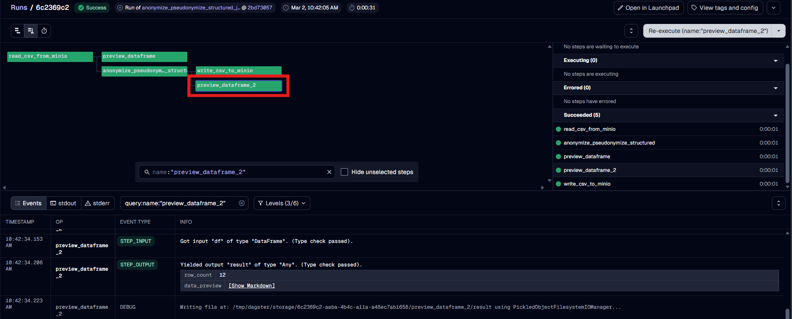

This is especially useful when investigating a failure — click the red (failed) step in the graph to immediately see only its events, including the error message and stack trace.

To clear the filter and see all events again, click the step once more or click on the background area of the execution graph.

### 5.2 Filtering by Log Level

Use the **log level dropdown** to filter events by severity:

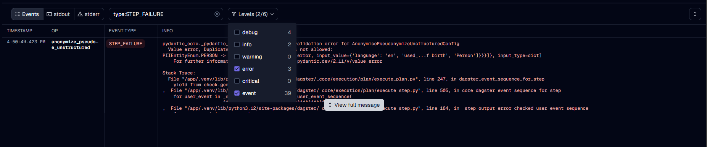

Available levels:

| Level | Use Case |
| --- | --- |
| **DEBUG** | Verbose internal details (usually hidden by default) |
| **INFO** | Standard operational messages |
| **WARNING** | Non-critical issues that may need attention |
| **ERROR** | Errors that caused a step or run to fail |
| **CRITICAL** | Severe errors |


### 5.3 Text Search

Use the **search box** above the Log stream to find events containing specific keywords. This searches across event messages and metadata.

---

## 6. Raw Compute Logs

In addition to structured Dagster events, the Webserver captures the raw **stdout** and **stderr** output produced by each step's subprocess. These are useful for viewing `print()` output or unstructured messages from the workflow code.

To access compute logs:

1. Open a **Run detail** page.
2. Click on a **step** in the Job graph.
3. Select the **"stdout"** or **"stderr"** tab beneath the Job graph.

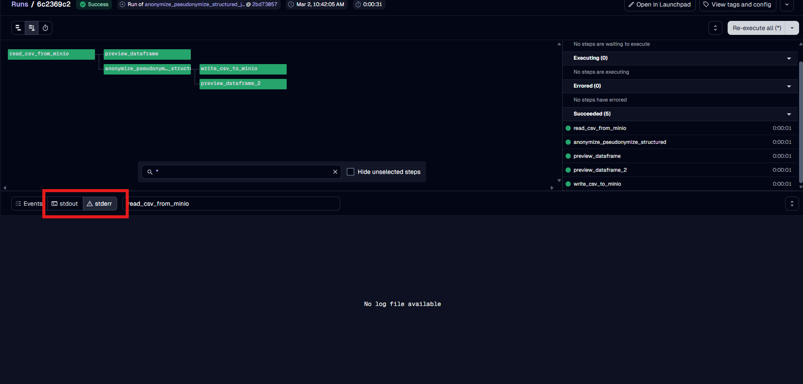

In case of need the entire logs e.g. for further analysis, you can download it.

Download the full log:

1. Open a **Run detail** page.
2. Click on the **Arrow** then the **Download debug file** button in the top right corner.


---

## 7. Step-by-Step Summary

The following table summarises the complete workflow for retrieving logs:

| Step | Action | Where |
| --- | --- | --- |
| 1 | Open the Dagster Webserver in your browser | Browser address bar |
| 2 | Click **"Runs"** in the top navigation bar | Top nav |
| 3 | *(Optional)* Filter runs by status, job name, tags, or date range | Runs page — filter bar |
| 4 | Click the **Run ID** of the run you want to inspect | Runs list |
| 5 | Browse the **event log** at the bottom of the Run detail page | Run detail page |
| 6 | *(Optional)* Click a **step** in the Job graph to filter events to that step | Job graph |
| 7 | *(Optional)* Use the **log level dropdown** or **search box** to narrow events further | Event log controls |
| 8 | *(Optional)* Click an **event row** to expand its full metadata | Event log |
| 9 | *(Optional)* View **stdout / stderr** via the compute log tabs | Below the Job graph |
| 10 | *(Optional)* Download the full log if necessary | Run detail page |

---

## 8. Troubleshooting

### Cannot find a specific run

- **Check active filters:** The Runs page may have a status or job filter active that excludes the run you are looking for. Clear all filters and search by Run ID.
- **Database retention:** Very old runs may have been cleaned up if a database retention policy is configured in your deployment.

### Event log appears empty or incomplete

- If the run is still **in progress**, events appear in real time — wait for execution to continue and new events will stream in.
- If the run was **terminated abnormally** (e.g. the container was killed), the final events may not have been recorded.

### Cannot see DEBUG-level events

- By default, the log viewer may filter out DEBUG events. Open the **log level dropdown** and ensure DEBUG is included.
- The Webserver's `LOG_LEVEL` environment variable controls the minimum severity persisted to the database. If it is set to `INFO` or higher, DEBUG events will not be available. Check the deployment configuration (`values.yaml`) if you need DEBUG logs.

---
## 9. Monitoring tips

- Check the Job graph to identify failed steps (you can click the failed step on the graph and will see only the related events on the Log stream)
- Use Log stream filters to focus on ERROR/FAILURE events; the first failure usually indicates the root cause. The log level filter is very useful in this case.
- The Timeline Job graph view helps check step durations and can help detect unusual activities.
- Once the error is fixed, it doesn’t always need to rerun the entire workflow — it can rerun from a selected or failed step.
- Check the quick output preview to inspect a step’s sample output on the Log Stream.
- To find a specific run when you already know its Run ID, paste the UUID directly into the search bar.
- Use the Quickfilter bar on Runs page to find specific group of jobs
- Monitor the job duration trends to find out hidden performance issues.
- Set up log retention according to business needs (to save storage and cost).
- Set up alerts for the long running/scheduled jobs to be notified when critical events occur.
- Set up retry policies if appropriate.

## 10. References

- [Workflow Execution Logging](#workflow-execution-logs) — detailed explanation of what is captured in logs, event types, and JSON log file structure
- [Dagster Webserver Documentation](https://docs.dagster.io/guides/operate/webserver) — official Dagster UI reference with additional screenshots
- [Dagster Logging Documentation](https://docs.dagster.io/concepts/logging/loggers) — official Dagster logging concepts
- [Dagster Logging Guide](https://docs.dagster.io/guides/log-debug/logging) — official Dagster logging guide
- [Dagster Run Status Documentation](https://docs.dagster.io/api/dagster/internals#dagster.DagsterRunStatus) — official Dagster run status