# Workflow Triggering

This guide provides step-by-step instructions to configure and validate workflow triggering in Dagster.
It covers two practical phases: time-based scheduling, calendar-based partition scheduling and manual triggering, each from job setup to UI verification.
Use it as a hands-on path to implement reliable, repeatable workflow automation.


This description explains:

- [Time-based scheduling](#time-based-scheduling) configuration and example
- [Calendar-based partition scheduling](#calendar-based-partition-scheduling) configuration and example
- [Manual triggering](#manual-triggering) options and example


# Time-based scheduling

## 1. Overview
In Dagster, you can define a schedule to express how often a pipeline should run. Dagster will use this schedule and run the pipeline by materializing the assets you specify.

## 2. Steps to add time-based scheduling to a job:

- Create a job / use an existing one
- Create a schedule linked to the job
- Register the job and schedule in the `Definitions` object
---

1. Create a job / use existing one

``` python
# jobs.py
from dagster import job, op

@op
def compute():
    print("Starting computation")

@job
def anonymization_job():
    compute()    
```
2. Create a Schedule Configuration

To configure time-based scheduling in Dagster, you need to create a dedicated schedule file
(recommended: `schedules.py`).

The minimum required parameters for the schedule object are:
-   `job`
-   `cron_schedule`

Optional parameters include `execution_timezone`, `name`, and `tags`, etc.


Create or edit `schedules.py`:

``` python
# schedules.py
# Example: set up a job to run every day at 06:00 AM (UTC)


from dagster import ScheduleDefinition
from .jobs import anonymization_job

anonymity_job_daily_6am = ScheduleDefinition(
    job=anonymization_job,
    cron_schedule="0 6 * * *",
    execution_timezone="UTC",
)
```

3. Register the schedule in Definitions

After defining the schedule, you must register it in your `Definitions`
object in `repository.py`:

``` python
# repository.py

from dagster import Definitions
from .jobs import anonymization_job
from .schedules import anonymity_job_daily_6am

defs = Definitions(
    jobs=[anonymization_job],
    schedules=[anonymity_job_daily_6am],
)
```


## 3. Verify in the UI

Once correctly configured:

-   The schedule will appear in the Dagster UI.
-   You can:
    -   View schedule details
    -   See the associated job
    -   Enable or disable the schedule
    -   Run a preview tick to validate the configuration
    -   Monitor past and upcoming runs
---

1. Open the **Automation** tab to view configured schedules and click the selected one:
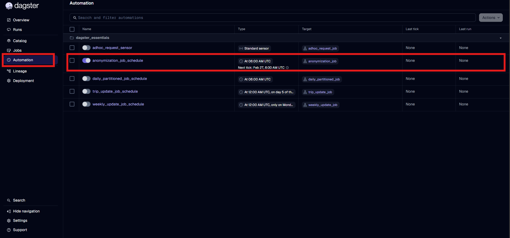

2. Check the data on the details tab:
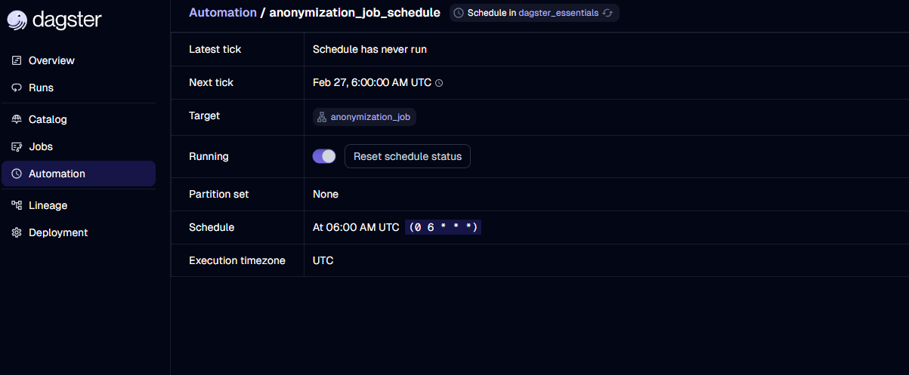


3. Initiate a mock run to test the schedule configuration
(use the **Preview tick result** button):
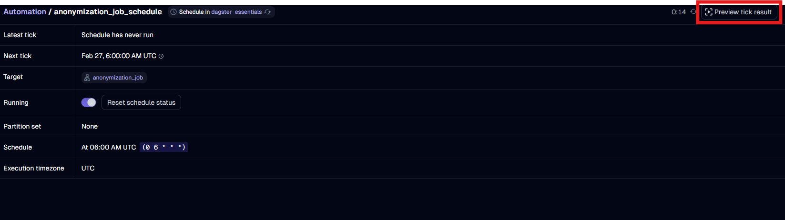

4. Set the evaluation date:
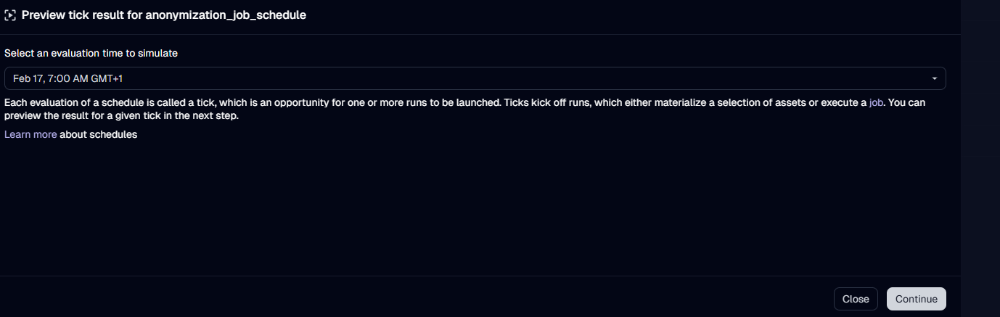

5. On the summary page, click **Launch**:
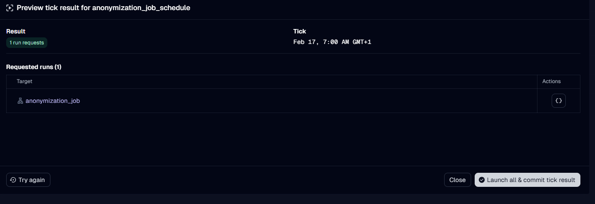

6. After starting, you can check run status and output details:
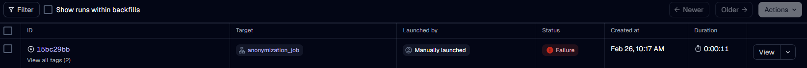
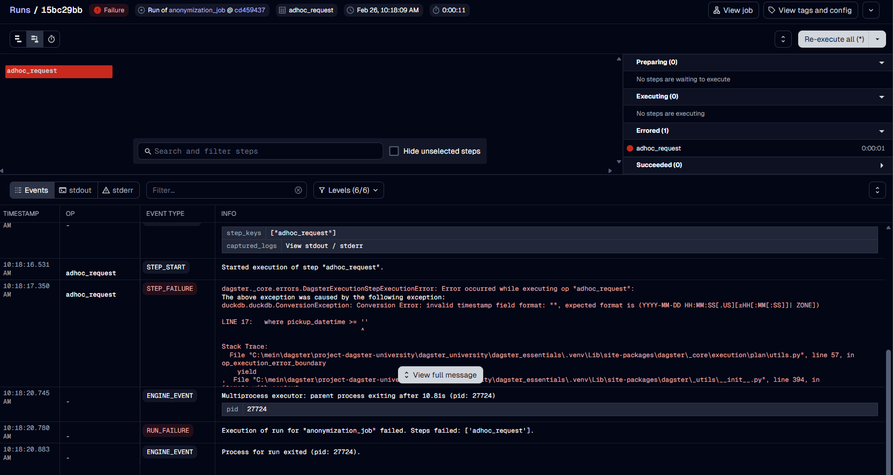

## 4. References 
* [Dagster Time-based Schedules Guide](https://docs.dagster.io/guides/automate/schedules#basic-schedule)
* [ScheduleDefinition](https://docs.dagster.io/api/dagster/schedules-sensors#dagster.ScheduleDefinition)
* [Definitions](https://docs.dagster.io/api/dagster/definitions)

---

# Calendar-based partition scheduling

## 1. Overview
Partitions allow you to split data into smaller, manageable chunks
(for example, daily or monthly partitions). This can improve performance,
support parallel processing, and simplify testing and backfills.

> **Prerequisites for running a partitioned scheduled job:**
> - The source data must be partitionable  
> - A consistent partition key must be defined  
> - Data availability must align with the partition schedule

## 2. Step-by-step instructions

- Define a partition configuration
- Attach the partition configuration to the partitioned job
- Create a schedule linked to the partitioned job
- Register the job and schedule in the `Definitions` object
---

1. Define a calendar partition configuration

Create a separate partition definition in code (recommended: `partitions.py`):

``` python
# partitions.py

from dagster import DailyPartitionsDefinition

# One partition per calendar day, starting from 2025-01-01
daily_partitions = DailyPartitionsDefinition(start_date="2025-01-01")
```

2. Create a partitioned job and link it to the partition definition

``` python
# jobs.py
from dagster import job, op

from .partitions import daily_partitions

@op
def process_daily_data(context):
    partition_key = context.partition_key  # Available only in a partitioned run
    context.log.info(f"Processing data for partition: {partition_key}")
    file_path = f"/data/raw/date={partition_key}/data.csv"
    context.log.info(f"Processing file from: {file_path}")

@job(partitions_def=daily_partitions)
def daily_partitioned_job():
    process_daily_data()
```

3. Create the partition-based schedule

Use the Dagster `build_schedule_from_partitioned_job` method to automatically evaluate partition keys.


```python
# schedules.py
# Example: set up a job to run every day at 06:00 AM using daily partitions

from dagster import build_schedule_from_partitioned_job
from .jobs import daily_partitioned_job

job_daily_6am_partitioned_schedule = build_schedule_from_partitioned_job(
    daily_partitioned_job,
    hour_of_day=6,
    minute_of_hour=0
)
```

4. Register the partitioned job and schedule in **Definitions** object.


``` python
# repository.py

from dagster import Definitions
from .jobs import daily_partitioned_job
from .schedules import job_daily_6am_partitioned_schedule

defs = Definitions(
    jobs=[daily_partitioned_job],
    schedules=[job_daily_6am_partitioned_schedule],
)
```

## 3. Validate in the UI
Once correctly configured:

-   The schedule will appear in the Dagster UI.
-   You can:
    -   View schedule details
    -   See the associated job
    -   Enable or disable the schedule
    -   Run a preview tick to validate the configuration
    -   Monitor past and upcoming runs
---

1. Open the **Automation** tab to view configured schedules and click the selected one:
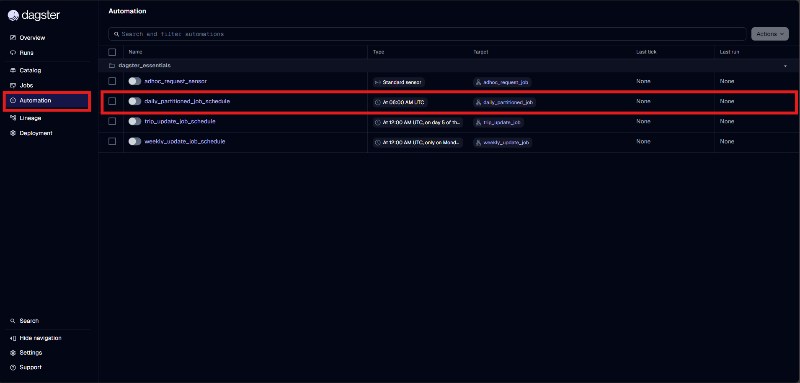

2. Check the data on the details tab:
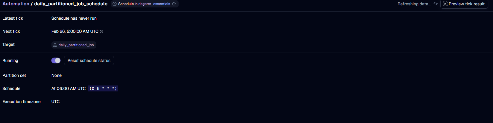


3. Initiate a mock run to test the schedule configuration
(use the **Preview tick result** button):
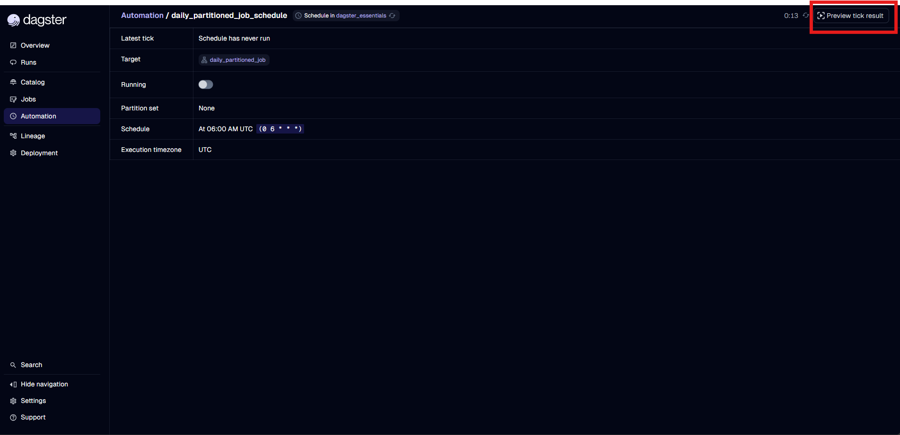

4. Set the evaluation date:
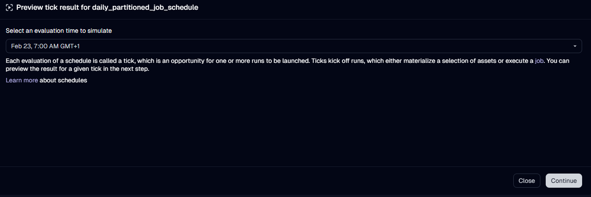

5. On the summary page, click **Launch**:
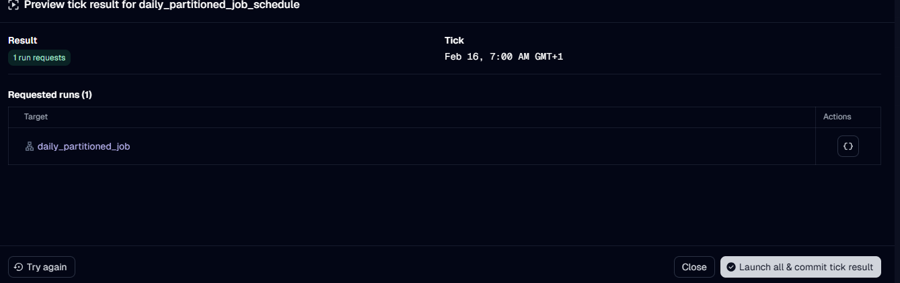

6. After starting, you can check run status and output details:
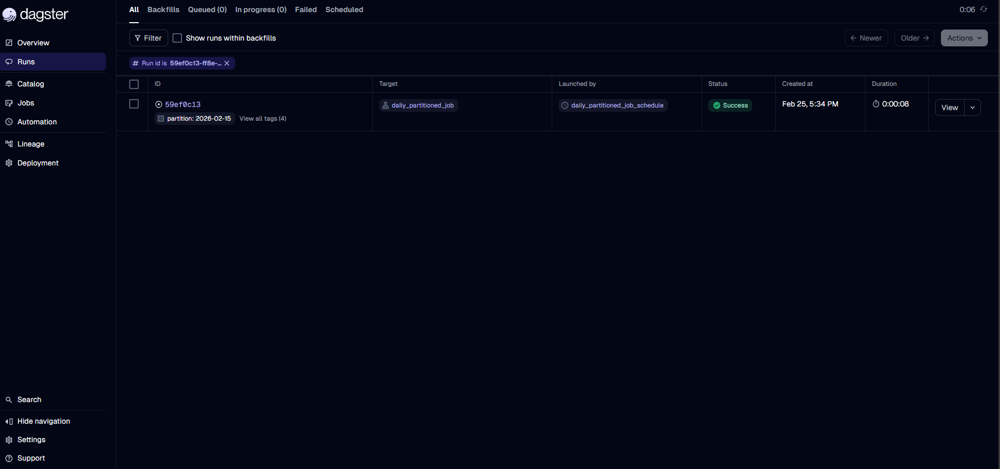
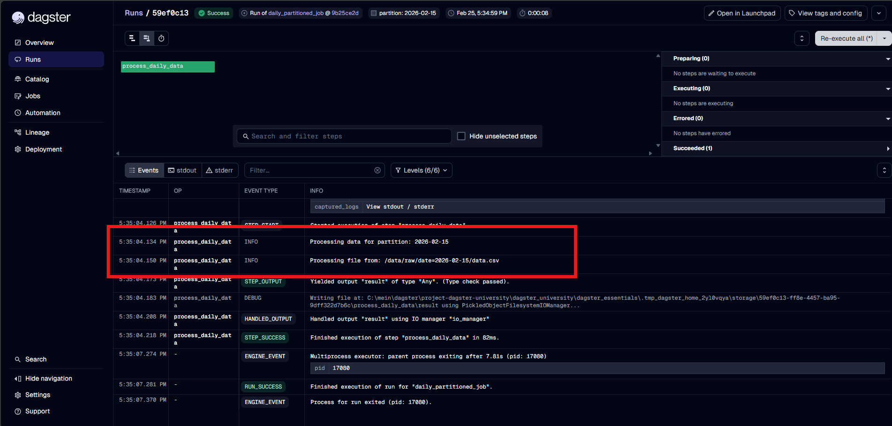


## 4. References 

* [Dagster Partition Schedules Guide](https://docs.dagster.io/guides/automate/schedules#create-schedules-from-partitions)
* [build_schedule_from_partitioned_job](https://docs.dagster.io/api/dagster/schedules-sensors#dagster.build_schedule_from_partitioned_job)
* [Definitions](https://docs.dagster.io/api/dagster/definitions)
---
## Scheduling tips
- Test your schedules in Dagster to ensure the results are as expected (for example, with **Preview tick result**).
- Set `execution_timezone` explicitly (for example UTC or your business timezone) where applicable; otherwise, you may get drift/mismatch between environments.
- Try to avoid concurrent reads/writes on the same storage path. For production safety, prefer staggered start times.
- Backfills: Dagster allows selecting historical partitions and running them retroactively.


---
# Manual triggering

## 1. Overview
In Dagster, jobs can also be started manually. This is useful for testing purposes, running jobs on an ad-hoc basis, or repairing / re-running failed jobs.

## 2. Steps to start job manually

1. Open the **Jobs** tab to view the list of available jobs, then select the job you want to run.  
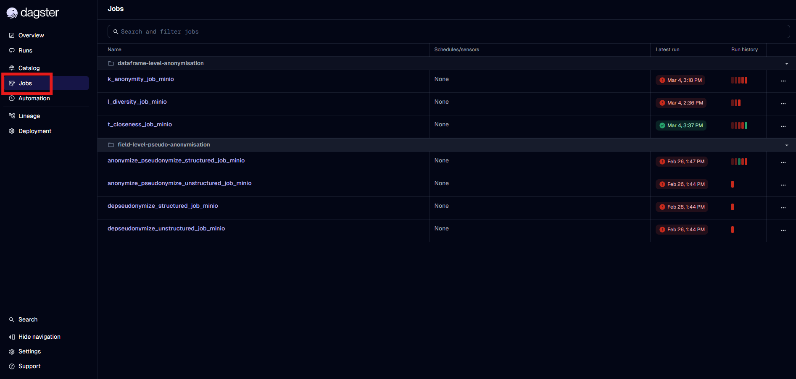
2. In the **Overview** pane, you can review the workflow steps and their dependencies.
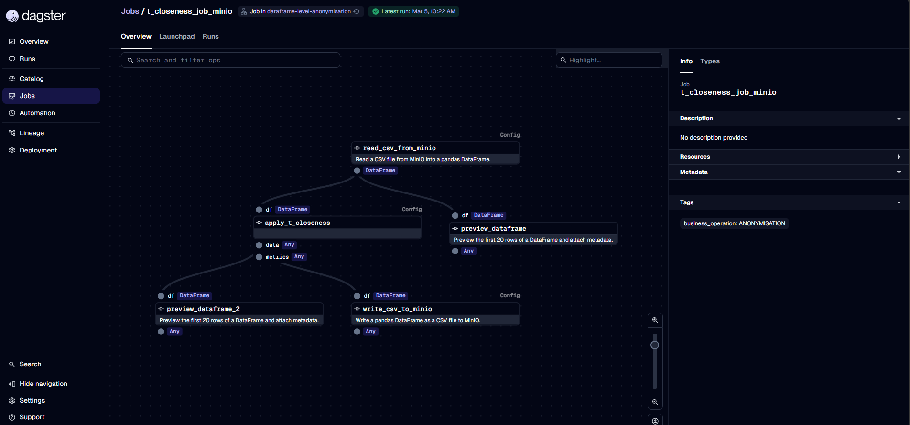

3. Open the **Launchpad** pane, which provides key configuration options before starting the job.
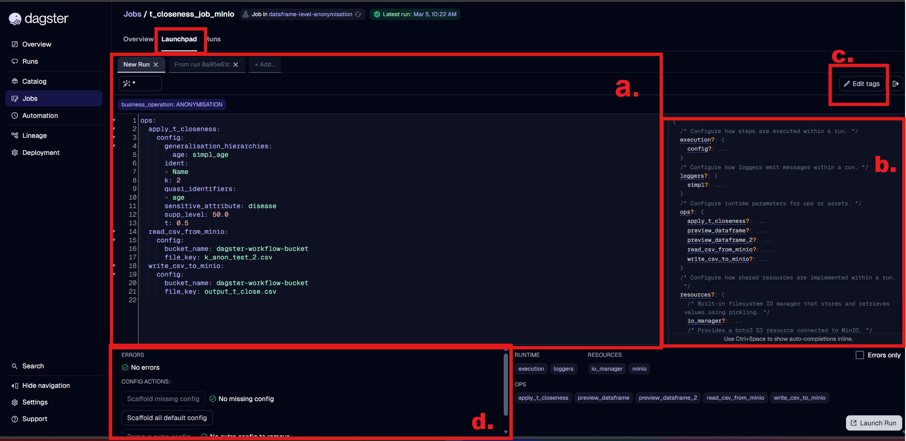
*Figure: Launchpad areas labeled a-d.*

| Pane | Function |
| --- | --- |
| *a.* **Run-time Editor** | Edit the default values or create a new run configuration for the job. |
| *b.* **Configuration Helper** | View the configuration schema, including parameter descriptions and allowed values. |
| *c.* **Tags Editor** | Review the default tags for the job and add new ones as needed. |
| *d.* **Configuration Validator** | Validates that the run configuration is valid and contains all required parameters. |

### Run-time Editor (Launchpad)

The Run-time Editor in the Launchpad of Dagster allows users to provide or modify the runtime configuration of a job before it is executed.

The editor accepts valid YAML configuration, which defines how the job and its operations (ops/assets) should run. This configuration can override default values defined in the job code and enables users to customize parameters such as input values, resources, and execution settings.

Using the Run-time Editor is particularly useful when:

* Running a job with custom parameters
* Testing different input values or execution scenarios
* Adjusting resource configurations
* Performing ad-hoc runs without modifying the pipeline code

### Example configuration
> **Note:** Each job defines its own configuration schema. Always refer the latest documentation to ensure that the provided configuration matches the expected structure and parameters.
``` yaml
ops:
  apply_t_closeness:
    config:
      generalisation_hierarchies:
        age: simpl_age
      ident:
      - Name
      k: 2
      quasi_identifiers:
      - age
      sensitive_attribute: disease
      supp_level: 50.0
      t: 0.5
  read_csv_from_minio:
    config:
      bucket_name: dagster-workflow-bucket
      file_key: k_anon_test_2.csv
  write_csv_to_minio:
    config:
      bucket_name: dagster-workflow-bucket
      file_key: output_t_close.csv

```
4. Start the job by clicking **Launch Run**.
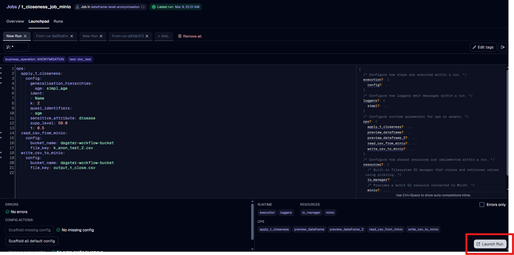

5. Monitor the job run status and output after launch.
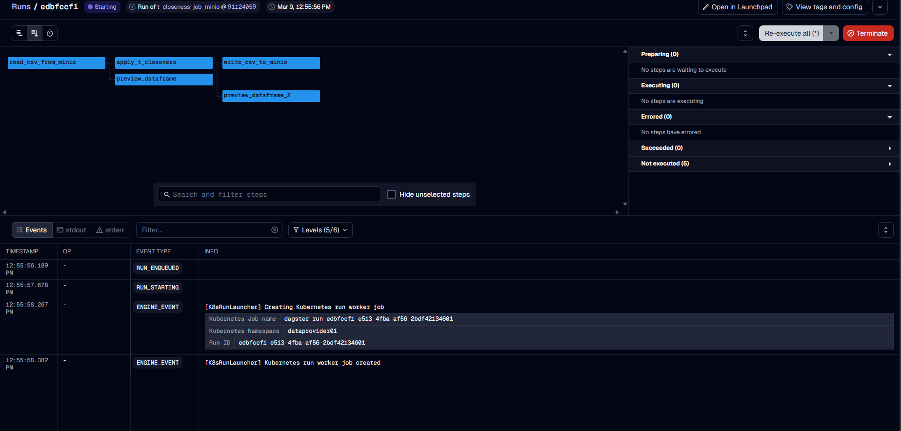

## Manual triggering tips
* Ensure the YAML syntax is properly formatted (correct indentation is critical).
* Only include configuration keys supported by the job schema.
* Use the Configuration Helper for checking the valid keys and acceptable values
* Use the Configuration Validator to detect errors before launching the run.
* For frequently used configurations, consider storing templates externally for reuse.
* Use tags to attach metadata to a run for identification, filtering, tracking execution context, and optionally influencing run behavior.

## 3. References 

* [Dagster Job Execution](https://docs.dagster.io/guides/build/jobs/job-execution)
* [Run-time Configuration](https://docs.dagster.io/guides/operate/configuration/run-configuration#providing-config-values-at-runtime)
* [Dataframe-Level Anonymisation](https://code.europa.eu/simpl/simpl-open/development/data-services/dataframe-level-anonymisation/-/blob/develop/documents/user-manual/User%20Manual.md?plain=0#dataframe-level-anonymisation---user-manual)
* [Field-Level Pseudo-Anonymisation](https://code.europa.eu/simpl/simpl-open/development/data-services/field-level-pseudo-anonymisation/-/blob/main/documents/user-manual/user-manual.md?ref_type=heads#field-level-pseudo-anonymisation---user-manual)