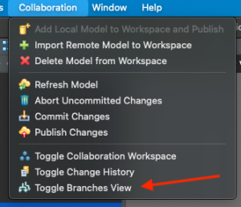
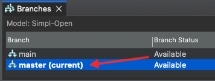
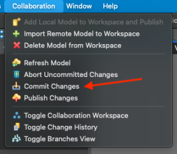
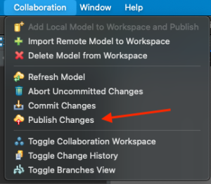

📍 <strong>You are here</strong> 
<a href="../../README.md">🏠 Home</a> 
    <a href="../README.md">Foundations</a> 
        <strong>Architecture models</strong> 

# Simpl-Open Architecture Model

This folder is the catalogue placement of the **upstream Archi / ArchiMate models** that drive every architectural diagram appearing across this repository. The models are versioned in a separate code.europa.eu repository and edited collaboratively via the Archi `coArchi` plugin — see [CANONICAL.md](CANONICAL.md) for the upstream URL and [.canonical.yaml](.canonical.yaml) for the machine-readable pointer.

The page below is the upstream `readme.md` reproduced verbatim, retitled to `README.md` per the catalogue convention and with image references rewritten to point at the local `media/` folder. The Archi model files themselves live in the upstream repo at `master/model/`; cloning that repo via the procedure below is the supported way to view or edit them.

---

Simpl-Open Architecture is modelled as ArchiMate diagrams, using [Archi](https://www.archimatetool.com/) as a tool and its [coArchi](https://github.com/archimatetool/archi-modelrepository-plugin/wiki) plugin is used to collaborate on the model.

The Archi model is versioned in this repository.

## How to use coArchi
### Pre-requisites
- Have git setup on your machine with access to code.europa.eu

### Procedure
1. Install Archi from https://www.archimatetool.com/download/
2. Install the coArchi plugin using the following guide: https://github.com/archimatetool/archi-modelrepository-plugin/wiki/Setup-and-Configuration
3. Import the collaborative model using the following guide: https://github.com/archimatetool/archi-modelrepository-plugin/wiki/Manage-Workspace#import-a-model
> URL of the repository: git@code.europa.eu:simpl/simpl-open/architecture.git
4. Toggle the Branches view: 

5. Make sure to be on the **master** branch (not the main !) or switch to it:

6. Make changes to the "Simpl-Open" model as you need
7. Commit your changes (local):

8. Publish your changes (to the remote):

9. Solve conflicts if any using the wizard

## Branch handling
- **!!! This procedure was tested multiple times and it works. But in any case: be careful. !!!**
- Archi uses its own local git repo
    - Location in the filesystem is available as a property of the open model
        - May be useful to use for example "git status" etc
- git operations should always be made in Archi
    - For safety reasons dont use git commands that modify something in this repository
        - this includes for example "git add", "git commit", ...
    - Otherwise Archi can get out of sync with its knowledge of git states
### Example of a possible workflow
- Preconditions
    - "Simpl-Open" was imported as described
    - "master" is the **current** branch
- create a branch for your work
    - In the "Branches view" select "master" and use "Add new Branch to Current Branch"
        - give it a meaningful name (in this example "work")
- Switch to the "work" branch
    - In the "Branches view" use "Switch branch"
        - "work" branch is now the **"(current)"**
    - Make the needed changes to the model ..
        - "Commit Changes" after a set of meaningful changes
        - "Publish Changes" 
    - All changes are now made on the "work" local and remote branch
- After the needed work (in "work" branch) is done
    - Prepare for model merge
        - Switch to "master" branch
            - "master" branch is now the **"(current)"** branch
        - Create a intermediate branch (in this example named "tmp") 
            - In the "Branches view" select "master" and use "Add new Branch to Current Branch"
                - give it a meaningful name (in this example "tmp")
                    - the "tmp" branch serves as **savety** for the model merge
                - the "tmp" branch now has the same content as "master"
        - Publish "tmp"
            - Switch to "tmp" branch
                - "tmp" branch is now the **"(current)"** branch
            - Publish with Collaboration."Publish Changes"
        - Switch to "tmp" branch
            - "tmp" branch is now the **"(current)"** branch
        - In the "Branches view" select "work" branch and apply "Merge Branch into Current Branch"
            - In the dialog choose the "local" option
            - "tmp" has now the content of "master" + "work"
        - Switch to "master" branch
             "master" branch is now the **"(current)"** branch
    - After the the preparation is done
        - it is possible to make the final merge
            - if a problem occured in the preparation
                - the "work" and the "master" branch is still unchanged
                - tmp can be deleted in this problem case
    - Final merge
        - "master" branch is still the **"(current)"** branch
        - In the "Branches view" select "tmp" branch and apply "Merge Branch into Current Branch"
            - In the dialog choose the "local" option
        - Publish with Collaboration.Publish Changes
        - In the "Branches view" apply "Delete Branch" on "tmp"
        - In the "Branches view" apply "Delete Branch" on "work"
