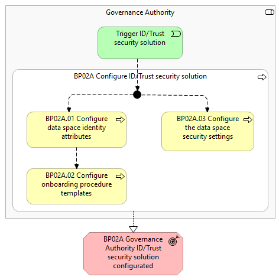
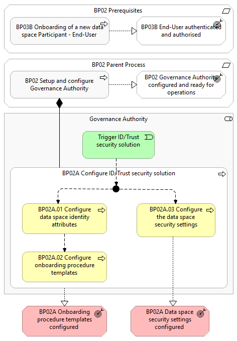

# BP02A - Configure ID/Trust security solution

## Overview

This set-up of the identification and trust in the Governance Authority details the tasks required to configure the Governance Authority agent to secure communication between Participants . The process involves the initial configuration and management of the identity attributes that secure the ABAC communication, the definition and management of onboarding procedure templates along with their validation rules and the customisation of technical aspects of the secure communication between Participants .

*BP02A figure 1*

*BP02A figure 2*

## Actors

The following actor is involved:
<ul><li><em>Governance Authority</em></li></ul>

## Assumptions

The following assumptions are made:
<ul><li>The <em>Governance Authority</em> has installed the Simpl-Open agent and default identity attributes</li></ul>

## Prerequisites

The following prerequisites must be fulfilled:
<ul><li><strong>Governance Authority configured and ready for operations:</strong> The <em>Governance Authority</em> has installed the Simpl-Open agent and default identity attributes (Parent Business Process 2).</li><li><strong>End-User authenticated &amp; authorised:</strong> The <em>Governance Authority</em> <em>Representative</em> is authenticated and has the appropriate role and permissions to perform the steps in the process (Business Process 03B).</li></ul>

## Details

The following shows the detailed business process diagram and gives the step descriptions.

 

 
<h5>Trigger ID/Trust configuration</h5>
The <em>Governance Authority</em> initiates the process to configure the identity and trust solution in the <em>Governance Authority</em> agent.
<h5>BP02A.01 Configure data space identity attributes</h5>
The <em>Governance Authority</em> representative configures new custom identity attributes, additional to the built-in/predefined identity attributes.
<h5>BP02A.02 Configure onboarding procedure templates</h5>
The <em>Governance Authority</em> representative configures onboarding procedure templates for each <em>Participant</em> type, along with documents, expiration timeframes and validation rules.
<h5>BP02A.03 Configure the data space security settings</h5>
The <em>Governance Authority</em> representative configures the security settings of the data space (e.g. encryption methods, token expiration policies)
<h5>Outcomes</h5><ul><li><strong>Onboarding procedure templates configured:</strong> The <em>Governance Authority</em> set-up is completed and the <em>Governance Authority</em> is ready to onboard new <em>Participants</em>.</li><li><strong>Data space security settings configured:</strong> <em>Participants</em> can communicate between each other in a secure way.</li></ul>
 
<figure class="responsive-figure-table" tabindex="0" aria-label="Scrollable table"><table class="table"><tbody><tr><td>Business Process</td><td><strong>Status: </strong>Proposed</td></tr></tbody></table></figure>

## High Level Requirements

<ul><li><strong>2A.1 - Configure Onboarding Procedure Templates</strong> Simpl shall provide UI and APIs that support the creation and ... <a href="https://simpl-programme.ec.europa.eu/book-page/2a1-configure-onboarding-procedure-templates-0" title="2A.1 - Configure Onboarding Procedure Templates"><strong></strong></a>  </li><li><strong>2A.2 - Configure Dataspace Identity Attributes</strong> Simpl shall allow the Governance Authority to configure the identity ... <a href="https://simpl-programme.ec.europa.eu/book-page/2a2-configure-dataspace-identity-attributes-0" title="2A.2 - Configure Dataspace Identity Attributes"><strong></strong></a></li></ul>
 

<a style="-webkit-tap-highlight-color:transparent;-webkit-text-stroke-width:0px;background-color:transparent;box-sizing:border-box;color:rgb(51, 181, 229);font-family:Montserrat, sans-serif;font-size:16px;font-style:normal;font-variant-caps:normal;font-variant-ligatures:normal;font-weight:500;letter-spacing:normal;orphans:2;outline:0px;text-align:start;text-decoration:none;text-indent:0px;text-transform:none;white-space:normal;widows:2;word-spacing:0px;" href="https://simpl-programme.ec.europa.eu/book-page/simpl-requirements"></a>

      

  

## Canonical source

[https://simpl-programme.ec.europa.eu/book-page/bp02a-configure-idtrust-security-solution](https://simpl-programme.ec.europa.eu/book-page/bp02a-configure-idtrust-security-solution)
