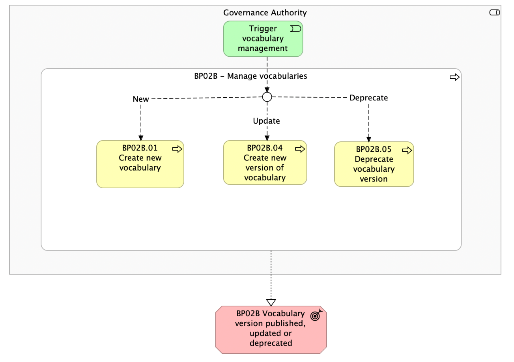

# BP02B - Manage vocabularies

## Overview

To help understand the content of this document, readers should familiarize themselves with the key definitions and actors .  Vocabulary Management is part of BP02 – Set-up and configuration of data space Governance Authority  process. It outlines the management of vocabularies within a data space, enabling semantic interoperability of data structures across domains and data providers. Vocabulary management governs the lifecycle of vocabularies native to the data space, while also enabling the registration and use of external vocabularies.

*BP02B figure 1*

## Actors

The following actors are involved:
<ul><li><em>Governance Authority</em></li></ul>

## Assumptions

The following assumptions are made:
<ul><li>Vocabularies are managed by the <em>Governance Authority</em> and centrally stored in the Vocabulary Hub. The DSSC specification link: <a href="https://dssc.eu/space/BBE/178422433/Specifications+-+Data+Models#Vocabulary-hub.">https://dssc.eu/space/BBE/178422433/Specifications+-+Data+Models#Vocabulary-hub.</a></li><li>Providers can propose (e.g. via email) well-documented modifications to a vocabulary, including proposed metadata, rationale, and potential impact analysis, and suggest adjustments based on their expertise or requirements. Interactions with other data spaces (not part of this BP) can also trigger the need of vocabulary updates.</li><li>External vocabularies - such as industry-standard or domain-specific ones, can be referenced within the data space. These vocabularies are not hosted by Simpl-Open by default but can be linked from authoritative external sources or uploaded if necessary. Simpl-Open does not have control over these external vocabularies. Any vocabulary not explicitly uploaded into Simpl-Open is considered external.</li></ul>

## Prerequisites

The following prerequisites must be fulfilled:
<ul><li><strong>Governance Authority setup: </strong>the <em>Governance Authority</em> must be setup before they can manage any vocabulary (Business Process 02A).</li><li><strong>Governance Authority configure: </strong>the <em>Governance Authority</em> must be configured before they can manage any vocabulary (Business Process 02B).</li></ul>

## Details

The following shows the detailed business process diagram and gives the step descriptions.

 
<h5><strong>Trigger vocabulary </strong><strong>management</strong></h5>
The <em>Governance Authority</em> reviews existing vocabularies and decides whether to create or import a new vocabulary, introduce a new version of an existing vocabulary, or deprecate an outdated one.
<h5><strong>BP02B.01 – Create new vocabular</strong><strong>y</strong></h5>
The <em>Governance Authority</em> creates a new vocabulary (e.g., using RDF Schema or OWL). The new vocabulary is developed according to defined syntactic and structural rules, including metadata, which ensure consistency, compatibility, and proper validation across schemas. 
<h5><strong>BP02B.02 – Validate vocabulary</strong></h5>
The vocabulary is verified through both syntax and semantic validation.<strong> </strong>While syntax validation is fully automated, semantic validation is performed through a combination of automated checks and manual review.
<h5><strong>BP02B.03 – </strong><strong>Publish vocabulary</strong></h5>
Once successfully validated, the new or updated vocabulary is published, and the previous version is immediately marked as deprecated.
<h5><strong>BP02B.04 – Create new version of vocabulary</strong></h5>
The <em>Governance Authority</em> selects an existing vocabulary and creates a new version to incorporate changes, enhancements, or stakeholder input.
<h5><strong>BP02B.05 – Deprecate</strong><strong> vocabulary version</strong></h5>
A vocabulary version is deprecated when it is no longer aligned with current business needs, has been replaced by an updated version, or is no longer applicable for future use.

Deprecation can occur in two scenarios:
<ol><li>
<strong>Version Update:</strong> When a new or updated version of a vocabulary is published, the previous version is automatically deprecated. While deprecated, it remains accessible to support legacy schemas, ensuring system continuity and backward compatibility. Access to deprecated versions is maintained either indefinitely or according to a defined sunset policy, depending on governance decisions.
</li><li>
<strong>Full Vocabulary Deprecation:</strong> In cases where the entire vocabulary is deemed obsolete or irrelevant to ongoing business processes, all versions of that vocabulary are deprecated. This means it is no longer recommended for use in any context, and future schema development should not reference it.
</li></ol>
<strong>Important Note:</strong> Deprecation does not mean deletion. Deprecated vocabularies remain available for reference and maintenance of existing implementations. However, they are no longer recommended for use in new development or integration efforts.
<h5><strong style="text-decoration:none;">BP02B.06 – </strong><strong style="text-decoration:none;">Send </strong><strong style="text-decoration:none;">validation notification</strong></h5>
Simpl-Open sends a report to the <em>Governance Authority</em> highlighting any validation issues detected in the vocabulary.
<h5><strong>Outcomes</strong></h5><ul><li>
<strong>Vocabulary version published, updated or deprecated:</strong><strong> </strong>A new or updated vocabulary is provided to support semantic schema validation. Over time, an older vocabulary version may be deprecated when it is replaced by a newer version.
</li><li style="text-decoration:none;"><strong>Report related to invalid vocabulary sent</strong><strong>:</strong> Simpl-Open sends a report to the <em>Governance Authority</em> detailing any validation issues found in the vocabulary. If issues are present, the vocabulary is not published or updated.</li></ul>
 
<figure class="responsive-figure-table" style="-webkit-text-stroke-width:0px;background-color:rgb(255, 255, 255);box-sizing:border-box;color:rgb(52, 52, 52);display:block;font-family:Montserrat, sans-serif;font-size:16px;font-style:normal;font-variant-caps:normal;font-variant-ligatures:normal;font-weight:400;letter-spacing:normal;margin:0px;max-width:100%;orphans:2;overflow-x:auto;padding-bottom:0.5rem;text-align:start;text-decoration-color:initial;text-decoration-style:initial;text-decoration-thickness:initial;text-indent:0px;text-transform:none;white-space:normal;widows:2;word-spacing:0px;" tabindex="0" aria-label="Scrollable table"><figure class="responsive-figure-table" style="box-sizing:border-box;display:block;margin:0px;max-width:100%;overflow-x:auto;padding-bottom:0.5rem;" tabindex="0" aria-label="Scrollable table"><figure class="responsive-figure-table" tabindex="0" aria-label="Scrollable table"><table class="table"><tbody><tr><td>Business Process</td><td><strong>Status: </strong>Proposed</td></tr></tbody></table></figure>

## High Level Requirements

</figure></figure><ul style="-webkit-text-stroke-width:0px;background-color:rgb(255, 255, 255);box-sizing:border-box;color:rgb(52, 52, 52);font-family:Montserrat, sans-serif;font-size:16px;font-style:normal;font-variant-caps:normal;font-variant-ligatures:normal;font-weight:400;letter-spacing:normal;margin-bottom:1rem;margin-top:0px;orphans:2;text-align:start;text-decoration-color:initial;text-decoration-style:initial;text-decoration-thickness:initial;text-indent:0px;text-transform:none;white-space:normal;widows:2;word-spacing:0px;"><li style="box-sizing:border-box;">
<strong style="box-sizing:border-box;">2B.1 - </strong><strong>The Governance Authority consults vocabularies</strong>  Simpl-Open shall allow the Governance Authority to consult the existing ... 
</li><li style="box-sizing:border-box;">
<strong style="box-sizing:border-box;">2B.2 -</strong><strong> The Governance Authority creates a new vocabulary</strong>  Simpl-Open shall allow the Governance Authority to create a ... 
</li><li>
<strong style="box-sizing:border-box;">2B.3 - </strong><strong>The Governance Authority creates a new version of a vocabulary</strong> Simpl-Open shall allow the Governance Authority to create a new ... 
</li><li>
<strong style="box-sizing:border-box;">2B.4 -</strong><strong> The Governance Authority validates a new vocabulary or a new version of a vocabulary</strong> Simpl-Open shall allow the Governance Authority to validate a new  ... 
</li><li>
<strong style="box-sizing:border-box;">2B.5 -</strong><strong> The Governance Authority publishes a new vocabulary or a new version of a vocabulary</strong> Simpl-Open shall support the Governance authority to publish a ... 
</li><li>
<strong style="box-sizing:border-box;">2B.6 -</strong><strong> The Governance Authority deprecates a vocabulary</strong> Simpl-Open shall allow the Governance Authority to deprecate a ... 
</li></ul>
 

      

  

## Canonical source

[https://simpl-programme.ec.europa.eu/book-page/bp02b-manage-vocabularies](https://simpl-programme.ec.europa.eu/book-page/bp02b-manage-vocabularies)
