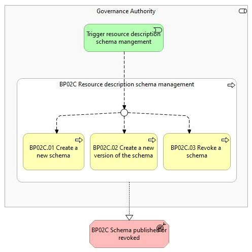
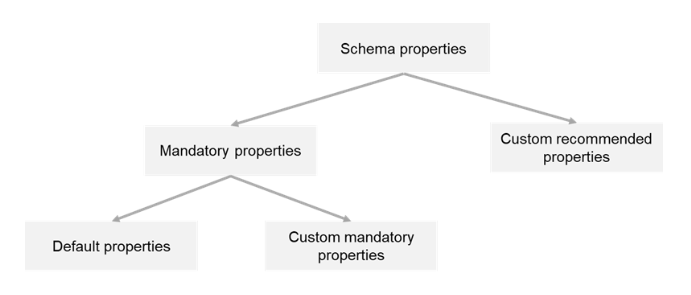

# BP02C - Manage resource description schemas

## Overview

Resource Description Schema Management  is part   of BP02 - Configuration of data space Governance Authority  process . It outlines the management of schemas within a data space, ensuring integrity and consistency of resource descriptions . A  schema  defines the structure, format, and organization of metadata used to describe resources in a data space catalogue. The schema defines rules for how  Providers  must create resource descriptions by specifying which properties must be included, how they should be structured, and what values are permitted. Schemas are built upon one or more vocabularies and the schema constraints (e.g., data types, formatting, allowed values) that define the syntax of the metadata created based on the schema to allow validation. Schemas are defined for each resource type (data, application, infrastructure) of the data space catalogue and available for creating resource descriptions.  Within Simpl, it will not be possible to create multiple schemas for a resource type. Nevertheless, it would be possible to add other resource types with their specific schema to obtain the same result. Each schema has several schema properties: Mandatory properties Default properties  that are imposed by Simpl-Open and are essential for its correct functioning, Custom mandatory properties  defined by the  Governance Authority  to ensure interoperability both within and across data spaces. Custom recommended properties  defined by the  Governance Authority , optional to include, and may be left empty if not applicable.

*BP02C figure 1*

*BP02C figure 2*

## Actors

The following actors are involved:
<ul style="list-style-type:disc;"><li style="tab-stops:list 36.0pt;"><em>Governance Authority</em></li></ul>

## Assumptions

The following assumptions are made:
<ul style="list-style-type:disc;"><li style="tab-stops:list 36.0pt;"><em>Providers</em><strong> </strong>can propose (e.g. via email) modifications to a schema and suggest adjustments based on their expertise or requirements. Interactions with other data spaces also can also trigger the need of schema updates. The <em>Governance Authority</em> will review and approve the changes via a manual process and implement the schema modifications.<ul style="list-style-type:circle;"><li style="tab-stops:list 72.0pt;">The creation of a new schema uses a structured definition and it can based on predefined schemas (data, application, infrastructure) provided by Simpl-Open.</li><li style="tab-stops:list 72.0pt;">If a new version of a schema is created, resource descriptions referencing the previous version of the schema continue to be available without altering or revoking. It is up to the <em>Providers </em>to update the resource descriptions to the new version of the schema. The creation of a resource description is always based on the latest version of a schema.</li><li style="tab-stops:list 72.0pt;">The revocation of a schema does not alter or revoke resource descriptions referencing the revoked schema. New resource descriptions can only use schemas that are not revoked.</li></ul></li><li style="tab-stops:list 36.0pt;">External vocabularies can be referred from the schema to describe e.g., domain-specific properties of a resources type.</li><li style="tab-stops:list 36.0pt;">The contract clauses schema is part of the default properties that are imposed by Simpl-Open:<ul style="list-style-type:circle;"><li style="tab-stops:list 72.0pt;">Contract clause types: Service level agreement, license agreement or billing schema.</li><li style="tab-stops:list 72.0pt;">One or more contract clause types can be used in the definition of a set of contract clauses.</li><li style="tab-stops:list 72.0pt;">The contract clauses of type license agreement and of type billing schema can only occur once in a set of contract clauses.</li></ul></li></ul>

## Prerequisites

The following prerequisites must be fulfilled:
<ul style="list-style-type:disc;"><li style="tab-stops:list 36.0pt;"><strong>Governance Authority setup: </strong>the <em>Governance Authority</em> must be setup before they can manage any schemas (Business Process 02A).</li><li style="tab-stops:list 36.0pt;"><strong>Internal vocabularies are configured: </strong>the <em>Governance Authority</em> has configured the catalogue with the corresponding vocabularies (Business Process 02B).</li><li style="tab-stops:list 36.0pt;"><strong>End-User authenticated &amp; authorised: </strong>the <em>End-User</em> is authenticated and has the appropriate role and permissions to perform the steps in the process (Business Process 03B).</li></ul>

## Details

The following shows the detailed business process diagram and gives the step descriptions.

<strong>Trigger resource description schema management</strong>

The <em>Governance Authority</em> decides whether to create a new schema, to create a new version of an existing schema, or to revoke an existing schema. This initiates resource description schema management.

<strong>BP02C.01 Create a new schema</strong>

The <em>Governance Authority</em> creates the schema by providing a comprehensive and structured definition, detailing its custom mandatory and custom recommended properties, data types, constraints, validation rules, and any relationships or dependencies.

<strong>BP02C.02 Create a new version of the schema</strong>

The <em>Governance Authority</em> selects an existing schema from the data space catalogue. The <em>Governance Authority</em> creates the new version of the schema by providing a comprehensive and structured definition, detailing its custom mandatory and custom recommended properties, data types, constraints, validation rules, and any relationships or dependencies.

<strong>BP02C.03 Revoke a schema</strong>

The <em>Governance Authority</em> revokes an existing schema if it becomes obsolete, superseded, or no longer relevant to the data space. Revocation ensures that the schema definition can no longer be used for creating or updating resource descriptions while maintaining historical records of data associated with it.

<strong>BP02C.04 Validate the schema</strong>

Simpl-Open enriches the schema with default properties.

The full schema is then validated by performing the following checks:
<ul style="list-style-type:disc;"><li style="tab-stops:list 36.0pt;">Syntactic validation of the schema according to the imposed structure and formatting</li><li style="tab-stops:list 36.0pt;">Semantic validation of the schema properties based on the vocabularies used for defining the schema.</li></ul>
<strong>BP02C.05 Publish the schema</strong>

Upon successful validation, the new schema or new version of an existing schema is published in the data space catalogue. If it concerns the creation of a new version of an existing schema, the previous version is revoked.

<strong>BP02C.06 Inform Providers about changes of the schema</strong>

When a schema is created, a new version of a schema is created or a schema is revoked, <em>Providers</em> are notified about changes (e.g. via email).

<strong>BP02C.07 Send report</strong>

Simpl-Open sends a report to the Governance Authority about validation issues of the schema . 

<strong>Outcomes</strong>
<ul style="list-style-type:disc;"><li style="tab-stops:list 36.0pt;"><strong>Schema published or revoked: </strong>The new schema, the new version of an existing schema, or the revocation of an existing schema is an outcome of resource description schema management. This makes the schema available for Providers for creating or updating resource descriptions, or unavailable in the case of revocation. (Business Process 5B).</li><li style="tab-stops:list 36.0pt;"><strong>Report related to invalid schema sent:</strong> Validation report including details such as syntax errors, missing default properties, or invalid rules is sent to the <em>Governance Authority.</em></li></ul>
 
<figure class="responsive-figure-table" tabindex="0" aria-label="Scrollable table"><table class="table"><tbody><tr><td>Business Process</td><td><strong>Status: </strong>Proposed</td></tr></tbody></table></figure>

## High Level Requirements

<ul style="-webkit-text-stroke-width:0px;background-color:rgb(255, 255, 255);box-sizing:border-box;color:rgb(52, 52, 52);font-family:Montserrat, sans-serif;font-size:16px;font-style:normal;font-variant-caps:normal;font-variant-ligatures:normal;font-weight:400;letter-spacing:normal;margin-bottom:1rem;margin-top:0px;orphans:2;text-align:start;text-decoration-color:initial;text-decoration-style:initial;text-decoration-thickness:initial;text-indent:0px;text-transform:none;white-space:normal;widows:2;word-spacing:0px;"><li style="box-sizing:border-box;">
<strong style="box-sizing:border-box;">2C.1 - Governance Authority – retrieving schemas and their versions</strong> Simpl-Open shall allow the retrieval of schemas and their versions ...

</li><li style="box-sizing:border-box;">
<strong style="box-sizing:border-box;">2C.2 - Governance Authority - creating a new schema</strong> Simpl-Open shall allow the Governance Authority to create a schema ...

</li><li style="box-sizing:border-box;">
<strong style="box-sizing:border-box;">2C.3 - Governance Authority - creating a new version of an existing schema</strong> Simpl-Open shall enable the Governance Authority to create a new version ...

</li><li style="box-sizing:border-box;">
<strong style="box-sizing:border-box;">2C.4 - Governance Authority – validating a schema</strong> Simpl-Open shall allow the Governance Authority to syntactically and ...

</li><li style="box-sizing:border-box;">
<strong style="box-sizing:border-box;">2C.5 - Governance Authority – receiving notification about schema validation issues</strong> Simpl-Open shall notify the Governance Authority about the validation ...

</li><li style="box-sizing:border-box;">
<strong style="box-sizing:border-box;">2C.6 - Governance Authority – publishing a schema</strong> Simpl-Open shall enable the Governance Authority to publish and version ...

</li><li style="box-sizing:border-box;">
<strong style="box-sizing:border-box;">2C.7 - Governance Authority - revoking and retaining a schema</strong> Simpl-Open shall allow the Governance Authority to revoke schema when ...

</li><li style="box-sizing:border-box;">
<strong style="box-sizing:border-box;">2C.8 - Governance Authority – notifying Providers about schema changes</strong> Simpl-Open shall notify Providers when a schema is published, a new ...

</li></ul>
 

<a style="-webkit-tap-highlight-color:transparent;-webkit-text-stroke-width:0px;background-color:transparent;box-sizing:border-box;color:rgb(51, 181, 229);font-family:Montserrat, sans-serif;font-size:16px;font-style:normal;font-variant-caps:normal;font-variant-ligatures:normal;font-weight:500;letter-spacing:normal;orphans:2;text-align:start;text-decoration:underline;text-indent:0px;text-transform:none;white-space:normal;widows:2;word-spacing:0px;" href="https://simpl-programme.ec.europa.eu/book-page/simpl-requirements"><strong style="box-sizing:border-box;"></strong></a>

      

  

## Canonical source

[https://simpl-programme.ec.europa.eu/book-page/bp02c-manage-resource-description-schemas](https://simpl-programme.ec.europa.eu/book-page/bp02c-manage-resource-description-schemas)
