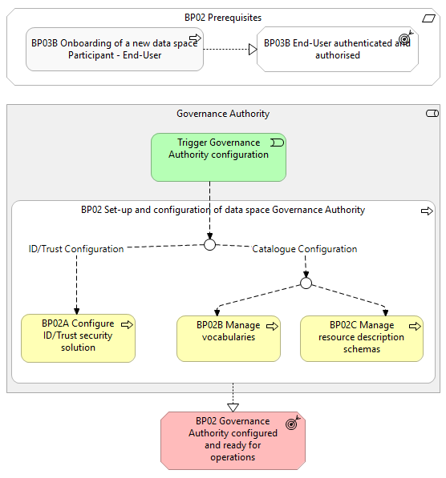

⚠️ <strong>Work in progress — yet to be validated</strong>

📍 <strong>You are here</strong> 
<a href="../../../README.md">🏠 Home</a> 
    <a href="../../README.md">Foundations</a> 
        <a href="../README.md">Business Processes</a> 
            <strong>BP02 — Configuration Governance Authority</strong> 

# BP02 - Configuration of data space Governance Authority

> **See also: [Dynamic view](./dynamic-view.md)** — sequence diagram
> showing how this business process executes at runtime, with links
> to each participating solution.

## Overview

This business process involves the overall configuration of a data space, essential to ensure that a data space is fully functional, operates adequately and secure. The configuration of the data space Governance Authority entails the configuration of identity and trust solutions, as well as schema management and vocabulary definitions of the data space catalogue. These aspects are necessary to initialise and operate data space processes and activities such as onboarding and securing communications between data space Participants, as well as enabling the publication and discovery of Resource Descriptions by Providers  and  Consumers . Note: This business process will be revisited and extended when topics such as the Simpl-Open helpdesk, ticketing system, auditing tools, CSIRT and security tools are covered.

## Actors

The following actors are involved: Governance Authority

## Assumptions

None.

## Prerequisites

The following prerequisites must be fulfilled: End-User authenticated & authorised: The Governance Authority Representative is authenticated and has the appropriate role and permissions to perform the steps in the process (Business Process 3B). Governance Authority agent is installed and set up: the Governance Authority has installed the Simpl-Open agent and is ready to operate: The default identity attributes are installed. The Simpl-Open agent is deployed. A public/private key pair is generated and securely stored in the Simpl-Open agent. Digital security credentials (e.g., x.509 certificates) that incorporate the Applicant’s public key are created and signed. Signed digital security credentials are installed and stored in the Simpl-Open agent.

*BP02 figure 1*

## Details

### Trigger Governance Authority Configuration

The Governance Authority initiates the process to configure its governance framework. This step initiates the process and sets the context for the subsequent actions.

### BP02A - Configure ID/Trust security solution

The Governance Authority configures the identity and trust solutions (Identity attributes, onboarding procedure templates, security settings) necessary to onboard Participants, as well as to enable secure communication between the Participants when they interact and operate in the data space.→ See [BP02A - Configure ID/Trust security solution](./BP02A-configure-idtrust-security-solution.md)

### BP02B - Manage vocabularies

The Governance Authority manages vocabularies within a data space, enabling semantic interoperability of data structures across domains and Data Providers . Vocabulary management governs the lifecycle of vocabularies native to the data space, while also enabling the registration and use of external vocabularies.→ See [BP02B - Manage vocabularies](./BP02B-manage-vocabularies.md)

### BP02C - Manage resource description schemas

The Governance Authority manages resource description schemas within a data space, ensuring integrity and consistency of resource descriptions.→ See [BP02C - Manage resource description schemas](./BP02C-manage-resource-description-schemas.md)

## Sub-processes

- [BP02A - Configure ID/Trust security solution](./BP02A-configure-idtrust-security-solution.md)
- [BP02B - Manage vocabularies](./BP02B-manage-vocabularies.md)
- [BP02C - Manage resource description schemas](./BP02C-manage-resource-description-schemas.md)

## Outcomes

Governance Authority configured and ready for operations: The data space catalogue is configured with the corresponding vocabulary and schemas (containing quality rules) to have the general structure of a resource description The data space onboarding procedures and security solutions are configured to enable secure communication between Participants.## Canonical source

[https://simpl-programme.ec.europa.eu/book-page/bp02b-setup-idtrust-catalogues-and-vocabulary](https://simpl-programme.ec.europa.eu/book-page/bp02b-setup-idtrust-catalogues-and-vocabulary)

## Touches

- (auto-inferred — verify) [`../../../governance/`](../../../governance/README.md)
