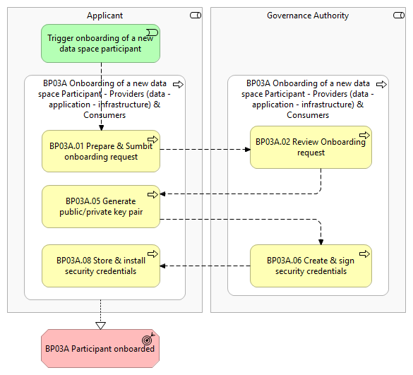
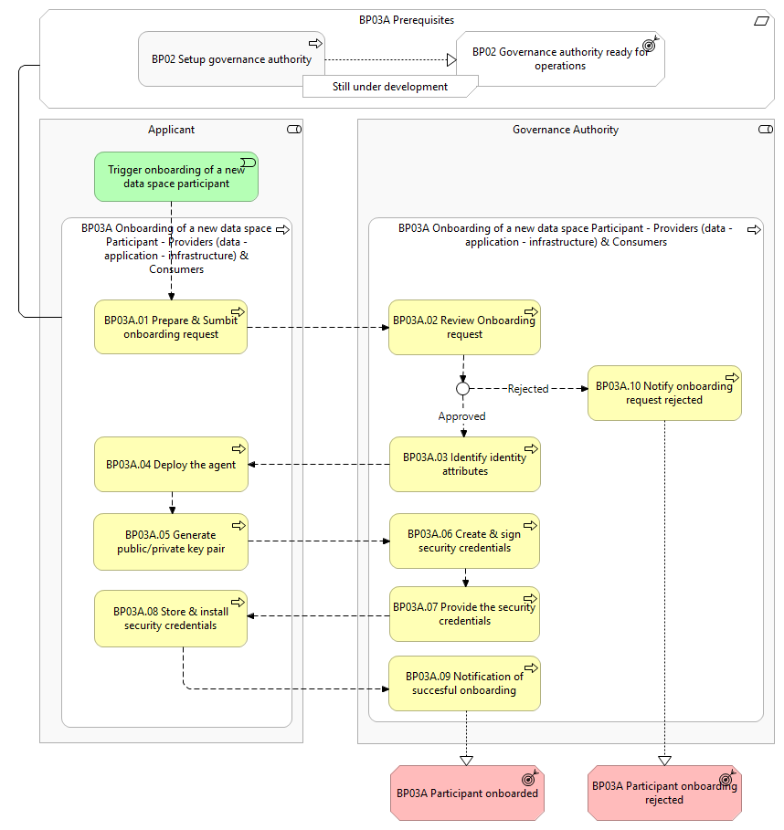

⚠️ <strong>Work in progress — yet to be validated</strong>

📍 <strong>You are here</strong> 
<a href="../../../README.md">🏠 Home</a> 
    <a href="../../README.md">Foundations</a> 
        <a href="../README.md">Business Processes</a> 
            <strong>BP03A — Onboarding of a new data space Participant (Providers &amp; Consumers)</strong> 

# BP03A – Onboarding of a new data space Participant — Providers (data – application – infrastructure) & Consumers

> **See also: [Dynamic view](./dynamic-view.md)** — sequence diagram showing how
> this business process executes at runtime, with links to each participating
> solution.

## Overview

This business process covers the onboarding process for a new _Applicant_. Both
_Providers_ and _Consumers_ can apply to a data space and will be referred to as
(data space) _Applicants_ from here on.

It includes the following main steps:

- **Prepare & submit onboarding request** — the _Applicant_ submits the onboarding request to the _Governance Authority_ for review.
- **Review onboarding request** — the _Governance Authority_ verifies the _Applicant_'s onboarding request against a predefined set of criteria and the alignment with the data space objectives.
- **Generate public/private keypair** — the _Applicant_ deploys and configures the Simpl-Open agent and uses the agent to generate a public/private key pair to enable encrypted communications and data integrity within the data space.
- **Create & sign security credentials** — the _Governance Authority_ creates and signs digital security credentials (e.g. x.509 certificates) that incorporate the _Applicant_'s public key. These credentials serve as proof of identity and are validated through the issuance of certifications by the _Governance Authority_.
- **Store & install security credentials** — the _Applicant_ stores and installs the signed identity security credentials in its Simpl-Open Agent.

## Actors

- _Governance Authority_
- _Applicant_

## Assumptions

- Data space _Applicants_ are assumed to be an organisation and not an individual person.
- The person/people acting on behalf of the _Applicant_, applying to the data space, are assumed to be a member of the _Applicant_ organisation's directory.
- **Data space specifications** — the document(s) describing the data space's objectives, candidature criteria and requirements applicable to an organisation for onboarding are developed and available to a potential _Applicant_ (e.g. website publication).

## Prerequisites

- **Data space is configured** — the _Governance Authority_ has defined the onboarding procedure and identity attributes relevant for the data space (BP02).

*BP03A figure 1 — overview*

*BP03A figure 2 — detailed*

## Process steps

### Trigger — onboarding of a new data space Participant

The _Participant_ initiates the preparation and submission of the onboarding request.

### BP03A.01 Prepare & submit onboarding request

The _Applicant_ prepares a comprehensive application to participate in the data
space by gathering the required information based on the documentation made
available by the _Governance Authority_ (see prerequisite 1). After preparation,
the _Applicant_ fills in the forms and provides any other documents that may be
mandatory (following the rules defined by the _Governance Authority_) to the
_Governance Authority_ for review.

### BP03A.02 Review onboarding request

After receiving the onboarding request, the _Governance Authority_ starts the
review process. It verifies the _Applicant_'s onboarding request against a
predefined set of criteria and the alignment with the data space objectives (see
prerequisite 1). The review can be either manual or automatic. As an outcome:

- The _Governance Authority_ can **approve** the onboarding request — the process continues at BP03A.03.
- The _Governance Authority_ can **reject** the onboarding request — the _Applicant_ is notified at BP03A.10.
- If **deficiencies** are found, the _Applicant_ has the possibility to address them and start over from BP03A.01.

### BP03A.03 Identify identity attributes

As part of the approval process the _Governance Authority_ identifies the relevant
identity attributes of the _Applicant_ that will be used for authentication.

### BP03A.04 Agent deployment

If the application is approved, the _Applicant_ downloads the minimal set of
Simpl-Open modules required for an operative Simpl-Open. The _Applicant_ then
deploys and configures the modules on its infrastructure to establish the
necessary environment for participating within the data space.

### BP03A.05 Generate public/private keypair

The _Applicant_'s agent generates a public/private key pair to enable encrypted
communications and data integrity within the data space. The private key is
securely stored in the Simpl-Open agent. The _Applicant_ shares the public key
with the _Governance Authority_ to request signed security credentials.

### BP03A.06 Create & sign security credentials

The _Governance Authority_ creates and signs digital security credentials (e.g.
x.509 certificates) that incorporate the _Applicant_'s public key. These
credentials serve as proof of identity and are validated through the issuance of
certifications by the _Governance Authority_, ensuring they are securely linked
to the correct entity.

### BP03A.07 Provide the security credentials

The _Governance Authority_ provides the signed security credentials to the
_Applicant_. The security credentials are essential to ensure secure operations
within the data space.

### BP03A.08 Store & install security credentials

The _Applicant_ stores and installs the signed identity security credentials in
its Simpl-Open Agent.

### BP03A.09 Notification of successful onboarding

The _Applicant_ is notified that they are now fully onboarded to the data space
and from now on are a _Participant_.

### BP03A.10 Notify onboarding request rejected

The _Applicant_ is notified that their onboarding request has been rejected.

## High-level requirements

| ID | Title | Local copy |
|----|-------|------------|
| 3A.1 | Registration of onboarding request — Simpl should allow the dataspace Governance Authority to define rules for the onboarding request. | [3a1-…](./3a1-onboarding-new-data-space-participant-registration-onboarding-request.md) |
| 3A.2 | Review of the onboarding request — Simpl shall provide support for the review of the onboarding requests. | [3a2-…](./3a2-onboarding-new-data-space-participant-review-onboarding-request.md) |
| 3A.3 | Attribute placement during onboarding — Simpl shall provide support to position identity attributes. | [3a3-…](./3a3-onboarding-new-data-space-participant-attribute-placement-during-onboarding.md) |
| 3A.4 | Finalizing onboarding — Simpl shall provide support for the following. | [3a4-…](./3a4-onboarding-new-data-space-participant-finalizing-onboarding.md) |

Detail pages for HLRs on the public site:

- 3A.1 → [https://simpl-programme.ec.europa.eu/book-page/3a1-onboarding-new-data-space-participant-registration-onboarding-request](https://simpl-programme.ec.europa.eu/book-page/3a1-onboarding-new-data-space-participant-registration-onboarding-request)
- 3A.2 → [https://simpl-programme.ec.europa.eu/book-page/3a2-onboarding-new-data-space-participant-review-onboarding-request](https://simpl-programme.ec.europa.eu/book-page/3a2-onboarding-new-data-space-participant-review-onboarding-request)
- 3A.3 → [https://simpl-programme.ec.europa.eu/book-page/3a3-onboarding-new-data-space-participant-finalizing-onboarding](https://simpl-programme.ec.europa.eu/book-page/3a3-onboarding-new-data-space-participant-finalizing-onboarding) *(note: source page swaps 3A.3 / 3A.4 slugs)*
- 3A.4 → [https://simpl-programme.ec.europa.eu/book-page/3a4-onboarding-new-data-space-participant-attribute-placement-during-onboarding](https://simpl-programme.ec.europa.eu/book-page/3a4-onboarding-new-data-space-participant-attribute-placement-during-onboarding)

## Outcomes

- **Participant onboarded** — the _Participant_ onboarding has been completed and the _Participant_ is fully onboarded.
- **Participant onboarding rejected** — the _Participant_ onboarding has been rejected and cannot join the data space.

## Source page metadata

- **Author:** Rick Marinus Johannes Santbergen
- **Published:** 23 June 2025
- **Status on source site:** Proposed
- **Snapshot taken:** 28 April 2026

## Canonical source

[https://simpl-programme.ec.europa.eu/book-page/3a-onboarding-new-dataspace-participant-providers-data-application-infrastructure](https://simpl-programme.ec.europa.eu/book-page/3a-onboarding-new-dataspace-participant-providers-data-application-infrastructure)

## Touches

- (auto-inferred — verify) [`../../../governance/`](../../../governance/README.md)
