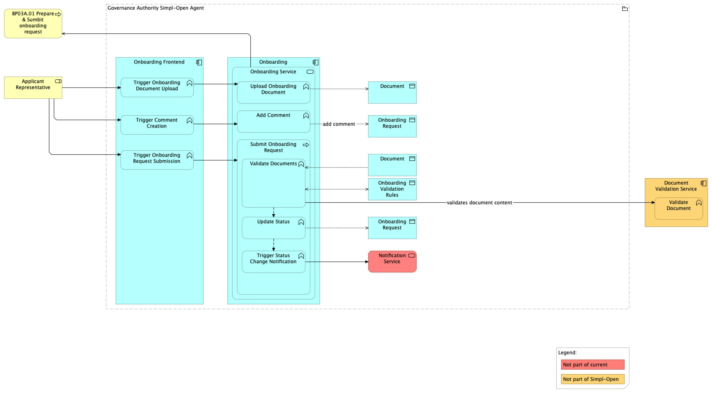

# BP03A Dynamic View

## Source

Extracted from functional-and-technical-architecture-specifications.md, section 4.2.2.

---

## Trace

A new participant — whether a data provider, application provider, infrastructure provider, or consumer — joins a data space through a six-step sequence involving the Governance Authority, the participant's own agent, and the identity infrastructure.

**Step 1 — Applicant creates an onboarding request**

The applicant requests temporary Tier 1 credentials from the Governance Authority, providing organisation information and the intended role (consumer or data/infrastructure/application provider). The Users & Roles component creates these credentials in the Tier 1 Authentication Provider and stores them in the Tier 1 User Database. The Onboarding component then creates an onboarding request with status IN PROGRESS.

*Figure: Applicant creates credentials and initiates the onboarding request.*

**Step 2 — Applicant submits the onboarding request**

Using the temporary credentials, the applicant logs in to the Onboarding Frontend and fills in the onboarding form, including mandatory documents. A comment channel is available for communication with the Governance Authority. Once all required information is provided, the applicant submits the request for review.

*Figure: Applicant logs in and submits the completed onboarding request.*

> Note: Integration with the Simpl-Open notification service is not yet included in the current release.

**Step 3 — Governance Authority reviews the request**

A Governance Authority representative reviews the submitted request and decides to: (a) APPROVE the request and proceed to credential creation, (b) REQUEST A REVIEW — returning it to the applicant for additional documents, or (c) REJECT the request, ending the process. Upon approval, the Onboarding component creates the participant record and saves the participant's identity attributes in the Security Attributes Provider.

*Figure: Governance Authority reviews and approves or rejects the onboarding request.*

**Step 4 — Applicant creates a keypair**

Once approved, the applicant representative generates a Tier 2 keypair inside the participant agent and stores it there securely.

*Figure: Applicant generates and stores a Tier 2 keypair within their agent.*

**Step 5 — Applicant triggers credential creation**

The applicant sends the public key (as a Certificate Signing Request) to the Governance Authority. The Onboarding component invokes the Identity Provider to create a Tier 2 identity credential. After creation, the applicant can download the credential.

*Figure: Public key submitted; Identity Provider issues the Tier 2 identity credential.*

**Step 6 — Applicant installs credentials**

The participant installs the downloaded credential and previously generated keypair inside their Simpl-Open Agent. The Tier 1 public key is sent to the Governance Authority via Tier 2 communication, completing the onboarding process.

*Figure: Participant installs identity credentials in their agent, completing onboarding.*

> Note: Integration with the Simpl-Open notification service is not yet included in the current release.

---

## Participants

- [tier-1-authentication-provider/](../../../security/access-control-and-trust/authentication-provider-federation/tier-1-authentication-provider/README.md) — Tier 1 Authentication Provider (issues temporary credentials; stores Tier 1 user identities)
- [users-roles/](../../../governance/participant-management/user-roles/users-roles/README.md) — Users & Roles (creates credentials in the Tier 1 provider; manages role assignment)
- [onboarding/](../../../governance/participant-management/onboarding/onboarding/README.md) — Onboarding (manages request lifecycle; triggers credential creation)
- [security-attributes-provider/](../../../security/access-control-and-trust/security-attribute-provider-federation/security-attributes-provider/README.md) — Security Attributes Provider (stores participant identity attributes on approval)
- [identity-provider/](../../../security/access-control-and-trust/identity-provider/identity-provider/README.md) — Identity Provider (issues the Tier 2 identity credential)
