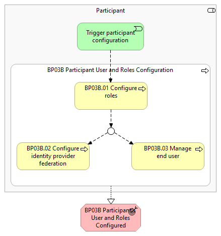
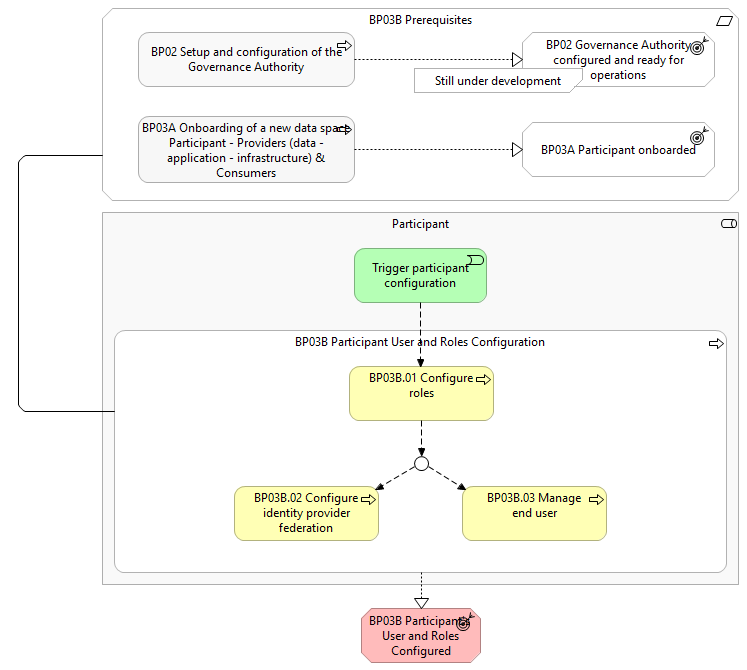

⚠️ <strong>Work in progress — yet to be validated</strong>

📍 <strong>You are here</strong> 
<a href="../../../README.md">🏠 Home</a> 
    <a href="../../README.md">Foundations</a> 
        <a href="../README.md">Business Processes</a> 
            <strong>BP03B — Onboarding Participant End User</strong> 

# BP03B – Onboarding of a new data space - Participant End-User

> **See also: [Dynamic view](./dynamic-view.md)** — sequence diagram
> showing how this business process executes at runtime, with links
> to each participating solution.

## Overview

This Business Process covers the configuration of User and Roles module of Simpl-Open. It includes the following main steps: Configure roles:  the Participant's User and Roles Manager manages the roles that should be available in the Participant's Simpl-Open Agent; Configure Identity Provider Federation:  if needed, the Participant's User and Roles Manager configures the federation between an external Identity Provider (an Identity Provider not belonging to Simpl-Open Agent, such as the organisation's private IDP or third-party IDP like eIDAS, EU Login, etc.) and the Simpl-Open Identity Provider; Manage end users:  the Participant's User and Roles Manager manages the users that should be available in Participant's Simpl-Open Agent

## Actors

The actor involved in this business process is referred to as the Participant, and can correspond to a  End-User  or  Representative  of the: Consumer Provider Governance Authority

## Assumptions

The following assumptions are made: The Participant has installed the Simpl-Open agent, and default users and roles are available for usage.

## Prerequisites

The following prerequisites must be fulfilled: Governance Authority configured and ready for operations:  The  Governance Authority has defined the onboarding procedure and identity attributes relevant for the data space (Business Process 2). Participant onboarded:  The Participant  onboarding has been completed, and the Participant  is fully onboarded (Business Process 3A).

*BP03B figure 1*

*BP03B figure 2*

## Sub-processes

- [3B.1 - Access control - end users to agent](./3B1-access-control-end-users-agent.md)
- [3B.2 - Access control - roles management](./3B2-access-control-roles-management.md)
- [3B.3 - Manage users and permissions](./3B3-manage-users-and-permissions.md)
- [3B.4 - Federated authentication](./3B4-federated-authentication.md)

## Canonical source

[https://simpl-programme.ec.europa.eu/book-page/bp03b-onboarding-new-data-space-participant-end-user](https://simpl-programme.ec.europa.eu/book-page/bp03b-onboarding-new-data-space-participant-end-user)

## Touches

- (auto-inferred — verify) [`../../../governance/`](../../../governance/README.md)
