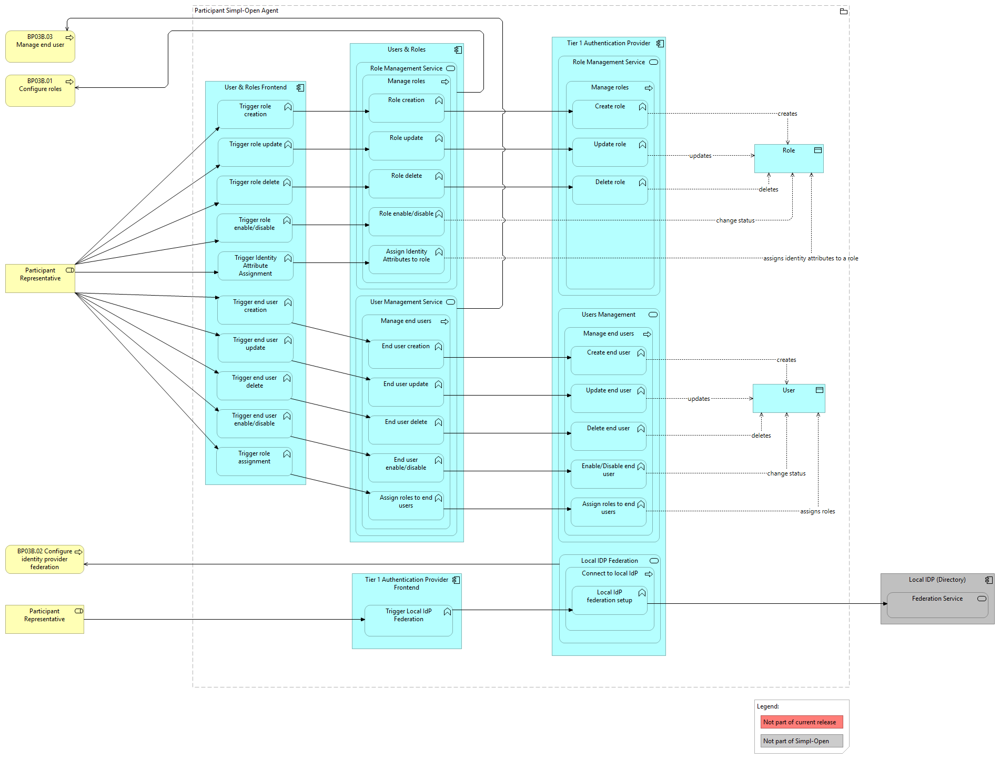

# BP03B Dynamic View

## Source

Extracted from functional-and-technical-architecture-specifications.md, section 4.2.2.

---

## Trace

After a participant has been onboarded (BP03A), a Simpl-Open administrator must configure the Users & Roles module so that end users can log in and operate within the agent. The process has three stages.

**Stage 1 — Configure roles**

A Simpl-Open administrator logs into the participant's agent and defines the roles that will be available within that agent. Roles determine what actions end users are permitted to perform.

**Stage 2 — Federate the identity provider (optional)**

If the participant uses an existing organisational identity system, the administrator can federate the local Identity Provider with the Authentication Provider module of the Simpl-Open Agent. This federation ensures that existing users' identities are recognised and managed consistently.

**Stage 3 — Manage end users**

Administrators create end users directly within Simpl-Open or connect existing users through IdP Federation. Every end user must be assigned one or more roles corresponding to their duties before they can use Simpl-Open functionality.

*Figure: Sequence of interactions for configuring users and roles within a participant agent.*

---

## Participants

- [users-roles/](../../../governance/participant-management/user-roles/users-roles/README.md) — Users & Roles (role configuration, user creation, role assignment)
- [tier-1-authentication-provider/](../../../security/access-control-and-trust/authentication-provider-federation/tier-1-authentication-provider/README.md) — Tier 1 Authentication Provider (federated with local IdP; verifies end-user identities)
