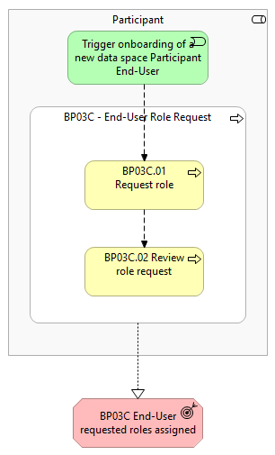
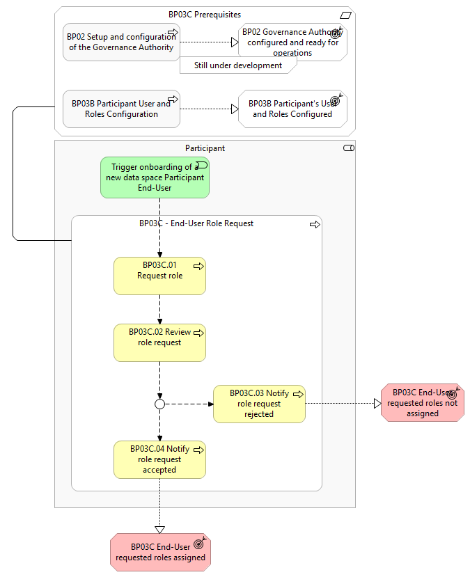

⚠️ <strong>Work in progress — yet to be validated</strong>

📍 <strong>You are here</strong> 
<a href="../../../README.md">🏠 Home</a> 
    <a href="../../README.md">Foundations</a> 
        <a href="../README.md">Business Processes</a> 
            <strong>BP03C — End-User Role Request</strong> 

# BP03C – End-User Role Request

> **See also: [Dynamic view](./dynamic-view.md)** — sequence diagram showing how
> this business process executes at runtime, with links to each participating
> solution.

## Overview

This business process covers the procedure for requesting roles by End-Users of
Simpl-Open. It applies when:

- A federated user logs in for the first time without any assigned roles — the only permitted action will be to request one or more roles.
- A local user identifies the need to request additional roles.

If a user is created with pre-assigned roles, or if federation is configured to
automatically map organisational roles to Simpl roles, the user will be fully
operational without the need to request a role through this BP.

It includes the following main steps:

- **Request role** — End-User creates and submits the role request to the Participant's Tier 1 User and Roles Manager.
- **Review role request** — the Participant's Tier 1 User and Roles Manager reviews the submitted role request.

## Actors

The actor involved in this business process is referred to as the _Participant_,
and can correspond to an End-User or Representative of the:

- _Consumer_
- _Provider_
- _Governance Authority_

## Assumptions

- The _Participant_ has installed the Simpl-Open agent, and default users and roles are available for usage.

## Prerequisites

- **Governance Authority Agent configured and ready for operations** — the _Governance Authority_ has defined the onboarding procedure and identity attributes relevant for the data space (BP02).
- **Participant's User and Roles configured** — the _Participant_'s Agent has been configured, the User and Roles module is configured, and Tier 1 users can start logging in to perform operations within the Agent (BP03B).

*BP03C figure 1 — high-level diagram*

*BP03C figure 2 — detailed-level diagram*

## Process steps

### BP03C.01 Request Role

The _Participant_'s End-User prepares the role request by filling out the form,
providing all the requested information specifying the roles they are requesting.
The request is then submitted for review.

### BP03C.02 Review Role Request

The _Participant_'s Tier 1 User Roles Manager reviews the submitted role request.
During the review, they check whether the requested role matches the user's
declared responsibilities and validate that the role request does not exceed the
appropriate access scope, in accordance with the principle of least privilege. As
an outcome:

- **Approve** the role request by assigning the role (or a different role than the one requested if the user selected a role that is not applicable) to the end user.
- **Reject** the role request (e.g. when the user is not allowed to use Simpl-Open or requests a role that is not applicable).

### BP03C.03 Notify Role Request Rejected

The end user is notified that their role request has been rejected.

### BP03C.04 Notify Role Request Accepted

The end user is notified that their role request has been approved and is
informed of the assigned role.

## High-level requirements

| ID | Title | Local copy |
|----|-------|------------|
| 3C.1 | Access control — end-user role request (Simpl shall allow end users, both local and federated, to submit role requests). | [3c1-…](./3c1-access-control-end-users-role-request.md) |

Detail page on the public site:

- 3C.1 → [https://simpl-programme.ec.europa.eu/book-page/3c1-access-control-end-users-role-request](https://simpl-programme.ec.europa.eu/book-page/3c1-access-control-end-users-role-request)

## Outcomes

- **End-User requested roles assigned** — the requested roles have been assigned due to role request acceptance.
- **End-User requested roles not assigned** — the requested roles have not been assigned due to role request rejection.

## Source page metadata

- **Author:** Annalie te Hofste
- **Published:** 15 December 2025
- **Status on source site:** Proposed
- **Snapshot taken:** 28 April 2026

## Canonical source

[https://simpl-programme.ec.europa.eu/book-page/bp03c-end-user-role-request](https://simpl-programme.ec.europa.eu/book-page/bp03c-end-user-role-request)

## Touches

- (auto-inferred — verify) [`../../../governance/`](../../../governance/README.md)
