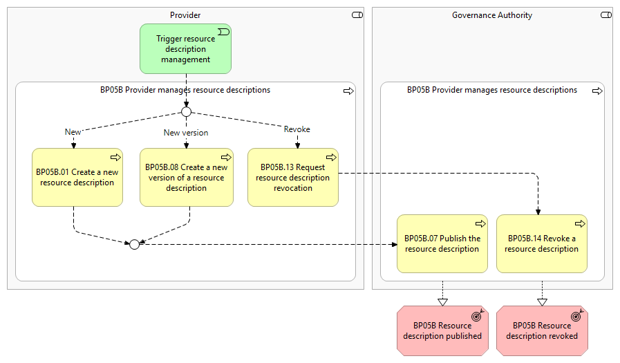
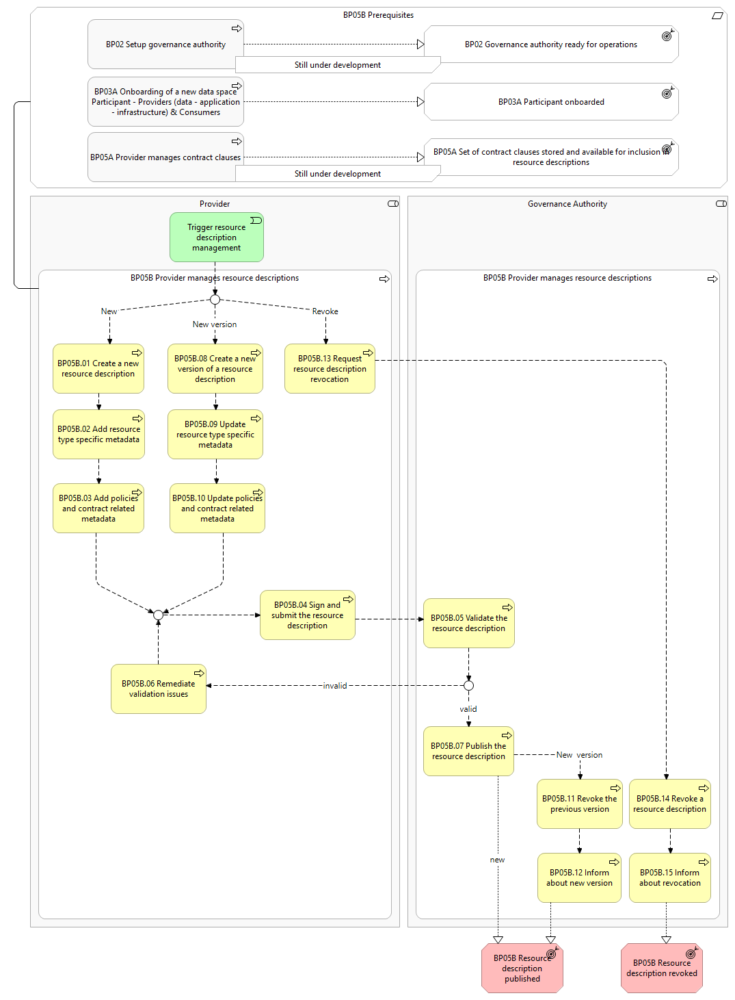

⚠️ <strong>Work in progress — yet to be validated</strong>

📍 <strong>You are here</strong> 
<a href="../../../README.md">🏠 Home</a> 
    <a href="../../README.md">Foundations</a> 
        <a href="../README.md">Business Processes</a> 
            <strong>BP05B — Provider Manages Resource Descriptions</strong> 

# BP05B - Provider manages resource descriptions

> **See also: [Dynamic view](./dynamic-view.md)** — sequence diagram
> showing how this business process executes at runtime, with links
> to each participating solution.

## Overview

This business process covers the management of resource descriptions in the data space catalogue by both a Provider and the  Governance Authority . It includes the following main steps: Create a new resource description: The  Provider  creates a new resource description with the required and optional contents, signs and submits it to the  Governance Authority for publication in the data space catalogue. Create a new version of a resource description: The Provider  creates a new version of a resource description based on an already existing resource description, updates the contents, signs and submits it to the  Governance Authority for publication in the data space catalogue. This corresponds to an update, as resource descriptions are immutable and cannot be changed. Request resource description revocation: The  Provider sends a request to revoke a resource description from the data space catalogue to the  Governance Authority Publish a resource description: Having received a request to create a new resource description, or a new version of a resource description, the Governance Authority validates the received resource description and publishes it in the data space catalogue, if valid. Consumers of an existing resource description are informed about the new version. The old version of the resource description is revoked by the  Governance Authority. Revoke a resource description: Having received a request to revoke a resource description, the  Governance Authority  revokes the resource description from the data space catalogue. Consumers of the resource description are informed about the revocation.

## Actors

The following actors are involved: Governance Authority Provider

## Assumptions

The following assumptions are made: The creation of a new resource description or a new version of a resource description always uses the latest version of a schema. If a new version of a resource description is created, usage contracts based on the old version continue without alteration. The revocation of a resource description does not alter or terminate usage contracts based on the specific resource description, which can still be inspected by the Consumer . Only new usage contracts are not possible any more with the revoked resource description, as they are no longer available in the data space catalogue.

## Prerequisites

The following prerequisites must be fulfilled: Data space is configured: The  Governance Authority has configured the data space catalogue with the corresponding vocabulary and schemas (containing quality rules) to have the general structure of a resource description (Business Process 2). Furthermore data space specific configurations such as contract templates and similar must be defined. Provider onboarded: The  Provider must be successfully onboarded (Business Processes 3A). Contract clauses are stored and available for inclusion in resource descriptions:  The  Provider must have created and stored at least one set of contract clauses so that these can be included in the resource description ( Business Process 5A) .

*BP05B figure 1*

*BP05B figure 2*

## Details

The following shows the detailed business process diagram and gives the step descriptions.

Trigger resource description management The  Provider  decides whether to create a new resource description, to create a new version of an existing own resource description, or to revoke an existing own resource description. This initiates resource description management.

BP05B.01 Create a new resource description The  Provider selects the resource type, data, application or infrastructure, and enters required and optional common metadata in the new resource description.

BP05B.02 Add resource type specific metadata Depending on the selected resource type, the Provider adds the resource type specific required and optional metadata.

BP05B.03 Add policy and contract related metadata For access and usage control, the  Provider configures the policies that shall be applied to the new resource. Furthermore, the Provider needs to add required and optional metadata related to the usage contract for the specific resource.

BP05B.04 Sign and submit the resource description After creating a new resource definition, or creating a new version of a resource description, the Provider signs new resource description with the Provider's credentials and submits it to the Governance Authority .

BP05B.05 Validate the resource description When receiving a request to publish a new resource description, or a new version of a resource description, the Governance Authority performs the following validations:

BP05B.06 Remediate validation issues In case of validation issues, the Governance Authority informs the  Provider about the issues. The  Provider must remediate the issues and submit the resource description again to the Governance Authority for publication.

BP05B.07 Publish the resource description Upon successful validation, the new (or new version of the) resource description is published in the data space catalogue.

BP05B.08 Create a new version of a resource description The Provider selects a previously published resource description and initiates the creation of a new version of this resource description. The Provider updates the required and optional metadata in this new version.

BP05B.09 Update resource type specific metadata Similar to step BP05B06 the resource type specific metadata can be updated for a new version of a resource description.

BP05B.10 Update policies and contract related metadata Similar to step BP05B.07   the policies and contract related metadata can be updated for a new version of a resource description.

After this step, the creation of a new version of a resource description continues with signing and submitting, in the same way as for a new resource description.

BP05B.11 Revoke the previous version of the resource description If the new version of the resource description is valid, the Governance Authority revokes the current resource description version.

BP05B.12 Inform about new version If a resource description is updated, the Consumers  of this resource are informed about the new version in the data space catalogue.

BP05B.13 Request resource description revocation The Provider selects a previously published resource description and initiates the revocation of this resource description.

BP05B.14 Revoke a resource description Upon receiving a request for revocation, the  Governance Authority revokes the resource description from the data space catalogue.

BP05B.15 Inform about revocation If a resource description is revoked, the Consumers  of this resource are informed about the revocation.

Outcomes

## Sub-processes

- [5B.1 - A Provider consults its own Resource descriptions](./5B1-provider-consults-its-own-resource-descriptions.md)
- [5B.2 - A Provider creates a new Resource description](./5B2-provider-creates-new-resource-description.md)
- [5B.3 - A Provider creates a new version of a Resource description](./5B3-provider-creates-new-version-resource-description.md)
- [5B.4 - A Provider signs and submits a new Resource description or a new version of a Resource description](./5B4-provider-signs-and-submits-new-resource-description-or-new-version-resource.md)
- [5B.5 - The Governance Authority publishes a Resource description](./5B5-governance-authority-publishes-resource-description.md)
- [5B.6 - A Provider notifies Consumers about a new version of a Resource description](./5B6-provider-notifies-consumers-about-new-version-resource-description.md)
- [5B.7 - A Provider requests the revocation of a Resource description](./5B7-provider-requests-revocation-resource-description.md)
- [5B.8 - The Governance Authority revokes a resource description](./5B8-governance-authority-revokes-resource-description.md)
- [5B.9 - The Provider notifies Consumers about the revocation of a resource description](./5B9-provider-notifies-consumers-about-revocation-resource-description.md)

## Canonical source

[https://simpl-programme.ec.europa.eu/book-page/bp05b-provider-manages-resource-descriptions](https://simpl-programme.ec.europa.eu/book-page/bp05b-provider-manages-resource-descriptions)

## Touches

- (auto-inferred — verify) [`../../../governance/`](../../../governance/README.md)
