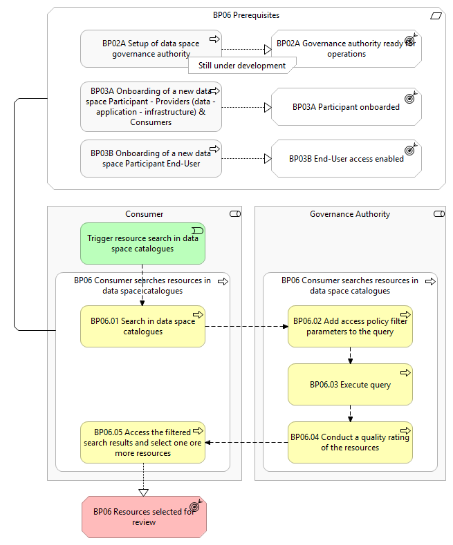

⚠️ <strong>Work in progress — yet to be validated</strong>

📍 <strong>You are here</strong> 
<a href="../../../README.md">🏠 Home</a> 
    <a href="../../README.md">Foundations</a> 
        <a href="../README.md">Business Processes</a> 
            <strong>BP06 — Consumer searches resources in data space catalogues</strong> 

# BP06 – Consumer searches resources in data space catalogues

> **See also: [Dynamic view](./dynamic-view.md)** — sequence diagram showing how
> this business process executes at runtime, with links to each participating
> solution.

## Overview

This business process covers the situation where a data space _Consumer_ can
search resources in the catalogue of one or multiple data spaces. Within the
process the _Consumer_ can search for resource descriptions, which can refer to
data, application, or infrastructure resources. There are three types of search
available:

- **Quick search** — use one or multiple search terms that are matched against any field in the resource description.
- **Federated search** — perform searches across multiple data spaces simultaneously.
- **Advanced search** — specify values for one or more attributes of the resource description to refine the search results.

It includes the following main steps:

- **Search in data space catalogues** — the _Consumer_ initiates a search using either quick, advanced, or federated search.
- **Execute query** — the _Governance Authority_ finds resource descriptions matching the provided search terms.
- **Access the filtered search results and select one or more resources** — the _Governance Authority_ provides filtered results, showing only resource descriptions the _Consumer_ is permitted to access.

## Actors

- _Governance Authority_
- _Consumer_

## Assumptions

- There is a mechanism in place to perform a quality rating of the resources based on its predefined quality rules.

## Prerequisites

- **Dataspace is configured** — the _Governance Authority_ has configured the catalogue with the corresponding vocabulary and schemas to have the general structure of a resource description, contract clauses, and other vital components (BP02).
- **Consumer onboarded** — the _Consumer_ has successfully completed the onboarding business process (BP03A).
- **End-User authenticated & authorised** — the End-User is authenticated and has the appropriate role and permissions to perform the steps in the process (BP03B).

*BP06 figure 2 — detailed-level diagram*

## Process steps

### BP06.01 Search in data space catalogues

The _Consumer_ initiates a search in the data space catalogue using either a
quick search, advanced search, or a federated search (searching multiple data
space catalogues at once) within the same or another data space. The _Consumer_
inputs the search terms relevant to their intended search.

### BP06.02 Add access policy filter parameters to the query

The query is decorated with filters based on access policies that allow it to
operate only on those resource descriptions for which the access policies permit
the _Consumer_ (and potentially the specific End-User of the _Consumer_) to
access and use the associated resource.

### BP06.03 Execute query

The _Governance Authority_ finds resource descriptions matching the provided
search terms within the data space's own catalogue or, in the case of federated
search, within data space catalogues shared by other data spaces.

### BP06.04 Conduct a quality rating of the resources

The _Governance Authority_ conducts a quality rating of the resources based on
its predefined quality rules. The filtered results include a quality rating of
the resources, which is displayed to the _Consumer_.

### BP06.05 Access the filtered search results and select one or more resources

The _Governance Authority_ provides the filtered search results to the
participant's system, showing only the resource descriptions they are permitted
to access. The results of the search are available to the _Consumer_, who can
access and display the details of selected resource descriptions.

## High-level requirements

| ID | Title | Local copy |
|----|-------|------------|
| 6.1 | Search in data/application/infrastructure catalogue through a UI or an API. | [63-…](./63-consumer-searches-resources-catalogues-data-space.md) |
| 6.2 | Search in data/application/infrastructure catalogue in another federated data space. | [62-…](./62-search-dataapplicationinfrastructure-catalogue-another-federated-data-space.md) |
| 6.3 | Search Results — provide a Data Consumer the results of the search. | [61-…](./61-consumer-consults-returned-resources-search-request.md) |
| 6.4 | Limit search parameters to referred vocabularies for UI and API search. | _no local file yet_ |
| 6.5 | Data quality assessment — verify the quality rules when searching the data catalogue. | [64-…](./64-governance-authority-provides-resource-descriptions-matching-search-request.md) |

Detail pages on the public site (note: source-site numbering is shuffled — HLR IDs and slug numbers do not align):

- 6.1 → [63-search-dataapplicationinfrastructure-catalogue-through-ui-or-api](https://simpl-programme.ec.europa.eu/book-page/63-search-dataapplicationinfrastructure-catalogue-through-ui-or-api)
- 6.2 → [62-search-dataapplicationinfrastructure-catalogue-another-federated-data-space](https://simpl-programme.ec.europa.eu/book-page/62-search-dataapplicationinfrastructure-catalogue-another-federated-data-space)
- 6.3 → [65-search-results](https://simpl-programme.ec.europa.eu/book-page/65-search-results)
- 6.4 → [66-limit-search-parameters-referred-vocabularies-ui-and-api-search](https://simpl-programme.ec.europa.eu/book-page/66-limit-search-parameters-referred-vocabularies-ui-and-api-search)
- 6.5 → [61-data-quality-assessment](https://simpl-programme.ec.europa.eu/book-page/61-data-quality-assessment)

## Outcomes

The _Consumer_ accesses and can consult the usage contract template identifying
the terms and conditions related to the use of the selected resource it has
discovered in the data space catalogues. The _Consumer_ then decides whether or
not to consume the resource offered by the _Provider_ (BP08, BP09A, BP09B). In
case a contract is required for consumption and is not already in place, the
_Consumer_ and _Provider_ establish a usage contract (BP07).

## Source page metadata

- **Author:** Rick Marinus Johannes Santbergen
- **Published:** 23 June 2025
- **Status on source site:** Proposed
- **Snapshot taken:** 28 April 2026

## Canonical source

[https://simpl-programme.ec.europa.eu/book-page/bp06-consumer-searches-resources-data-space-catalogues](https://simpl-programme.ec.europa.eu/book-page/bp06-consumer-searches-resources-data-space-catalogues)

## Touches

- (auto-inferred — verify) [`../../../governance/`](../../../governance/README.md)
