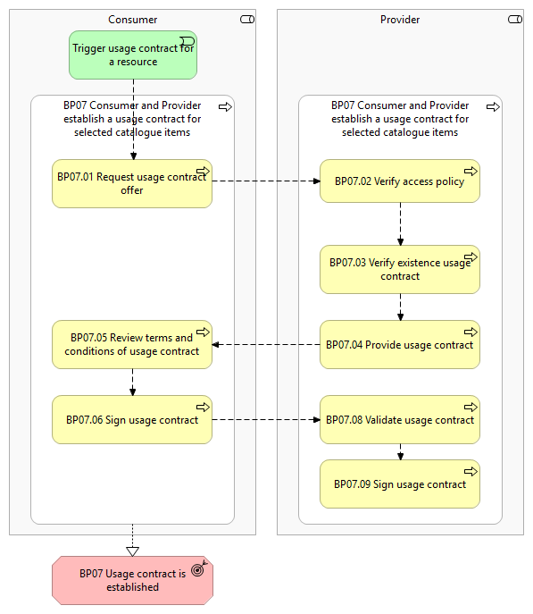
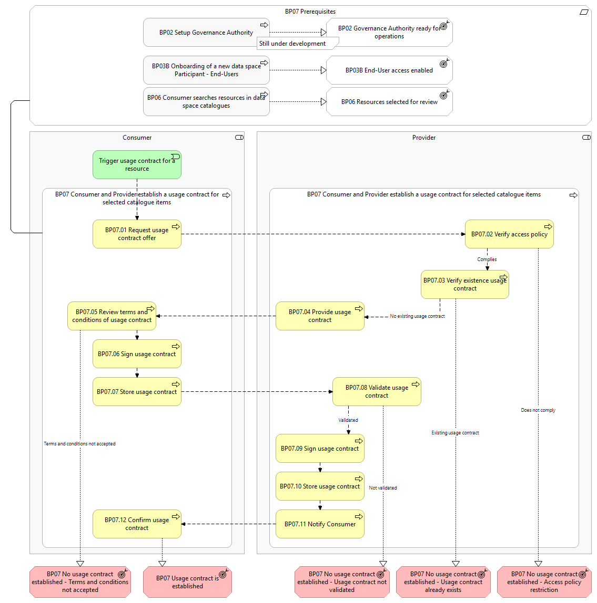

⚠️ <strong>Work in progress — yet to be validated</strong>

📍 <strong>You are here</strong> 
<a href="../../../README.md">🏠 Home</a> 
    <a href="../../README.md">Dimension: Foundations</a> 
        <a href="../README.md">Capability: Business Processes</a> 
            <strong>Service: BP07 — Establish Usage Contract</strong> 

# BP07 - Consumer and Provider establish a usage contract for selected catalogue items

> **See also: [Dynamic view](./dynamic-view.md)** — sequence diagram
> showing how this business process executes at runtime, with links
> to each participating solution.

## Overview

This business process covers the the situation where a Consumer seeks to access a   data, application, or infrastructure resource from a Provider . To gain access, both parties must establish a usage contract. This legally binding contract defines the rights, limits, and obligations of both parties, including pricing, usage limits, data retention policies, and service level agreements (SLAs). The Consumer also agrees to the licensing terms set by the Provider .  Usage contract are established in two scenarios: New resource consumption: Whenever a Consumer wants to access a new resource from a Provider . Usage contract expiration: As u sage contracts are immutable , a new usage contract must be created when an existing one expire s to allow  continued resource usage. It includes the following main steps: Request usage contract offer: The Consumer requests a usage contract based on their selection of a desired resource from the data space catalogue (Business Process 6). Verify access policy: The Provider  verifies the   Consumer   description   details (as described in their self-description),   to ensure that they are allowed to access the requested resource according to the access policies. Verify existence usage contract: The Provider verifies whether the   Consumer already has an established usage contract in place for the desired resource from the data space catalogue. Provide usage contract: T he Provider creates a formal usage contract in response to the usage contract request from the Consumer . Review terms and conditions of usage contract: The Consumer reviews the usage contract and decides whether to agree to the terms and conditions. Sign usage contract: If the Consumer agrees to the terms and conditions, they sign the usage contract. Validate usage contract: The Provider validates that the Consumer has formally agreed to the usage contract, ensuring they have accepted the terms and conditions established by the Provider . Sign usage contract: If the validation is successful, the Provider signs the usage contract. While the possibility of usage contract term negotiation has been discussed, it is not a current requirement in this process. We have prioritised other areas for initial implementation and will re-evaluate the need for negotiation as our business requirements develop.

## Actors

The following actors are involved: Consumer Provider: Infrastructure , Application or Data Provider .

## Assumptions

The following assumptions are made: The Consumer requests a usage contract based on the selection of a desired resource from the data space catalogue.

## Prerequisites

The following prerequisites must be fulfilled: Dataspace is configured:   The  Governance Authority   has configured the data space catalogue with the corresponding vocabulary and schemas to have the general structure of a resource description, contract clauses, and other vital components (Business Process 2). End-User authentication and authorisation: The End-User must be authenticated and possess the necessary roles and permissions to execute the process steps (Business Process 3B). Resource description is present in the data space catalogue:  A resource description   must be published in the data space catalogue for the  Consumer  to find a resource in the data space catalogue (Business Process 5). As such, it is assumed that the  Consumer  has searched in the data space catalogue and found the   resource description   (Business Process 6).

*BP07 figure 1*

*BP07 figure 2*

## Sub-processes

- [7.1 - A Consumer requests a new usage contract offer](./71-consumer-requests-new-usage-contract-offer.md)
- [7.2 - A Provider verifies the request for a usage contract offer](./72-provider-verifies-request-usage-contract-offer.md)
- [7.3 - A Provider creates and provides the usage contract offer](./73-provider-creates-and-provides-usage-contract-offer.md)
- [7.4 - A Consumer reviews the usage contract offer](./74-consumer-reviews-usage-contract-offer.md)
- [7.5 - A Consumer signs, stores and provide the usage contract offer](./75-consumer-signs-stores-and-provide-usage-contract-offer.md)
- [7.6 - A Provider validates the signed usage contract offer](./76-provider-validates-signed-usage-contract-offer.md)
- [7.7 - A Provider signs, stores and provides the usage contract to the Consumer](./77-provider-signs-stores-and-provides-usage-contract-consumer.md)
- [7.8 - A Consumer validates the signed usage contract](./78-consumer-validates-signed-usage-contract.md)

## Canonical source

[https://simpl-programme.ec.europa.eu/book-page/bp07-consumer-and-provider-establish-usage-contract-selected-catalogue-items](https://simpl-programme.ec.europa.eu/book-page/bp07-consumer-and-provider-establish-usage-contract-selected-catalogue-items)

## Touches

- (auto-inferred — verify) [`../../../governance/`](../../../governance/README.md)
