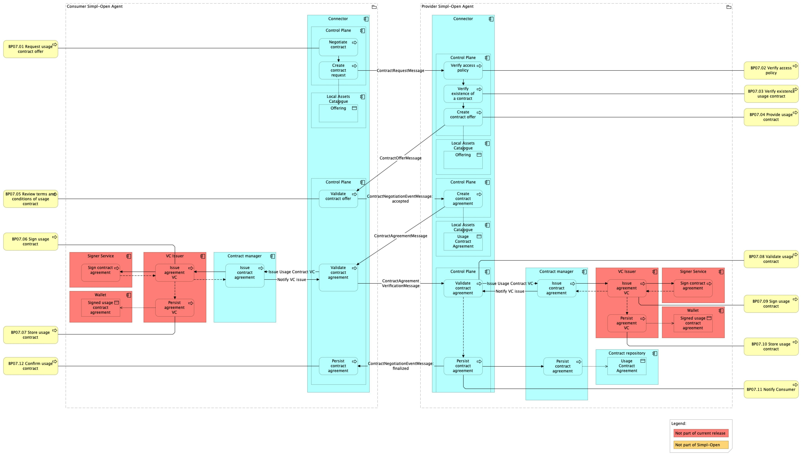

# BP07 Dynamic View

## Source

> **See also: [Business process overview](./README.md)** — narrative
> description of this business process, including actors, prerequisites,
> outcomes, and the full hierarchy of sub-processes.

Extracted from functional-and-technical-architecture-specifications.md, section 4.3.2.

---

## Trace

This dynamic view describes the interactions between Consumer, Connector, Provider, and Governance Authority to negotiate, validate, and finalise a usage contract for a selected catalogue item.

**Preconditions:**
- The Consumer has discovered and selected the desired resource (BP06).
- No existing usage contract covers this resource and the current terms.

*Figure: Contract negotiation flow between Consumer and Provider via their respective Connectors.*

1. **Initiating Contract Negotiation** — The Consumer initiates contract negotiation via their Connector's control plane by creating a "Contract Offer Request" addressed to the Provider's Connector.

2. **Contract Offer Creation and Validation** — The Provider's Connector verifies access policy and checks for an existing contract, then generates a "Contract Offer" and returns it to the Consumer's Connector. The Consumer validates the offer against their requirements.

3. **Agreement Formation and Validation** — If the Consumer accepts, the Consumer's Connector initiates a "Contract Agreement." Both Connectors validate it for mutual compliance. Both parties confirm the contract through Verifiable Credentials.

4. **Verification and Issue of Usage Contract VC** — The Provider's VC Issuer issues a Verifiable Credential (VC) for the Usage Contract Agreement, signed by the Signer Service, and stores it in the Provider's Wallet. The same process is then repeated on the Consumer's side: their VC Issuer issues, signs, and stores a corresponding VC.

5. **Persisting Agreement** — After both VCs are secured in the respective digital wallets, a copy of the contract record is stored by the Provider for billing and audit purposes.

---

## Participants

- [connector/](../../../integration/resource-sharing/resource-sharing-runtime/connector/README.md) — Connector (contract negotiation control plane on both Consumer and Provider sides)
- [contract-manager/](../../../governance/contract-management/contract-establishment/contract-manager/README.md) — Contract Manager (manages the contract lifecycle, offer templates and agreement persistence)
- [vc-issuer/](../../../security/credential-management/vc-issuance-verification/vc-issuer/README.md) — VC Issuer (issues Verifiable Credentials for Usage Contract Agreements)
- [signer-service/](../../../security/credential-management/signing/signer-service/README.md) — Signer Service (signs the Usage Contract VC)
- [wallet/](../../../security/credential-management/wallet/wallet/README.md) — Wallet (stores signed Usage Contract VCs on both Consumer and Provider sides)
