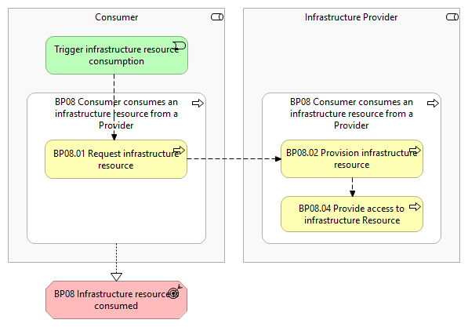
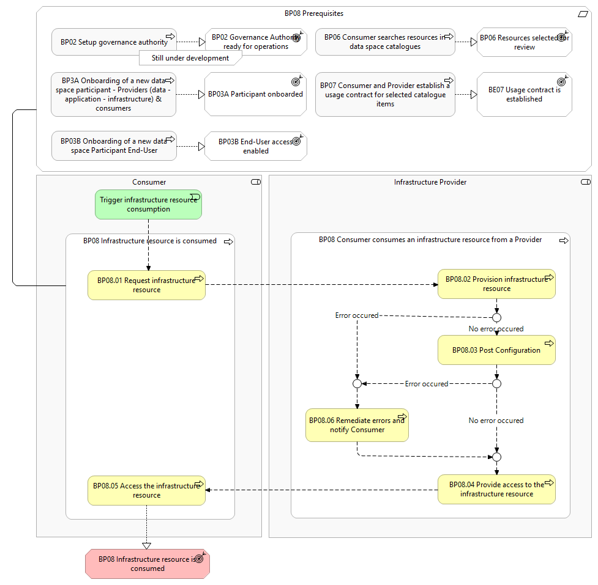

# BP08 – Consumer consumes an infrastructure resource from a Provider

> **See also: [Dynamic view](./dynamic-view.md)** — sequence diagram
> showing how this business process executes at runtime, with links
> to each participating solution.

## Overview

This business process covers the situation where a  Consumer  has a usage contract for a certain infrastructure resource, and   seeks to consume that infrastructure resource from an  Infrastructure Provider. The aim of the process is to facilitate secure, transparent, and contractually governed access to an infrastructure resource within a data space, ensuring that both the Infrastructure Provider  and  Consumer have clearly defined rights and obligations.  The Consumer can consume the infrastructure resource until it is decommissioned. It includes the following main steps: Request infrastructure resource: The Consumer requests the infrastructure resource from the Infrastructure Provider . Provision infrastructure resource: The Infrastructure Provider provisions and configures the infrastructure resource on a dedicated environment specific for the Consumer . Provide access to infrastructure resource: The Infrastructure Provider applies the access control rules and provides the Consumer with the right access credentials.

## Actors

The following actors are involved in the business process: Infrastructure Provider Consumer

## Assumptions

The following assumptions are made: The Infrastructure Provider has its services available and running. The Consumer understands the available infrastructure resources from the Infrastructure Provider and knows how to use them.

## Prerequisites

The following prerequisites must be fulfilled:  Data space is configured:   The  Governance Authority   has configured the catalogue with the corresponding vocabulary and schemas to have the general structure of a resource description, contract clauses, and other vital components (Business Process 2). Consumer / Infrastructure Provider onboarded:  Both the   Consumer   and   Infrastructure Provider   must complete the onboarding process (Business Process 3A) before they can consume or provide any available resources. End-User authenticated & authorised:  The   End-User  is authenticated and has the appropriate role and permissions to perform the steps in the process (Business Process 3B). Resource description is present in the data space catalogue:  A resource description   must be published in the data space catalogue for the  Consumer  to find a resource in the data space catalogue (Business Process 5). As such, it is assumed that the  Consumer  has searched in the data space catalogue and found the   resource description   (Business Process 6).

*BP08 figure 1*

*BP08 figure 2*

## Details

T he   following  shows the detailed business process diagram and gives the step descriptions.

Trigger infrastructure resource consumption The  Consumer  initiates the process to consume an infrastructure resource from an  Infrastructure Provider .

BP08.01 Request infrastructure resource The Consumer requests the infrastructure resource from the Infrastructure Provider .

BP08.02 Provision infrastructure resource The Infrastructure Provider provisions and configures the infrastructure resource for a dedicated environment specific for the Consumer .

BP08.03 Post configuration If the deployment script contains any part for the post configuration process, such as deployment of applications or loading datasets or images, t he Infrastructure Provider performs the necessary actions in the post configuration phase.

BP08.04 Provide access to the infrastructure resource The Infrastructure Provider configures and applies usage and access policies (e.g., who has access, the instance usage duration, resource limitations) on the infrastructure resource (and the applications/datasets, if they are a part of the deployment script) based on the usage contract, and provides the Consumer with the right access credentials.

BP08.05 Access the infrastructure resource The Consumer consumes the infrastructure resource until decommissioning .

BP08.06 Remediate errors and notify Consumer If during the provisioning or post configuration process an error occurs, both the Consumer and the Infrastructure Provider are be informed through a notification. The Infrastructure Provider subsequently reviews the process to solve the errors and manually continue and monitor the process until the errors are remediated, until the infrastructure resource can be made available as per the usage contract. The Infrastructure Provider informs the Consumer of the outcome of the remediation process.

Outcome

## Sub-processes

- [8.1 - Requesting a resource (app/data/infrastructure)](./81-requesting-resource-appdatainfrastructure.md)
- [8.2 - Using infrastructure from a provider  - Consumer Monitoring](./82-using-infrastructure-provider-consumer-monitoring.md)
- [8.3 - Using infrastructure from a provider - Connectivity](./83-using-infrastructure-provider-connectivity.md)
- [8.4 - Mechanisms to configure and provision infrastructure resources](./84-mechanisms-configure-and-provision-infrastructure-resources.md)
- [8.5 - Using infrastructure from a provider - Credential Management](./85-using-infrastructure-provider-credential-management.md)
- [8.6 - Using infrastructure from a provider - IAM](./86-using-infrastructure-provider-iam.md)
- [8.8 - Catalogue of services](./88-catalogue-services.md)

## Canonical source

[https://simpl-programme.ec.europa.eu/book-page/bp08-consumer-consumes-infrastructure-resource-provider](https://simpl-programme.ec.europa.eu/book-page/bp08-consumer-consumes-infrastructure-resource-provider)

## Touches

- (auto-inferred — verify) [`../../../governance/`](../../../governance/README.md)
