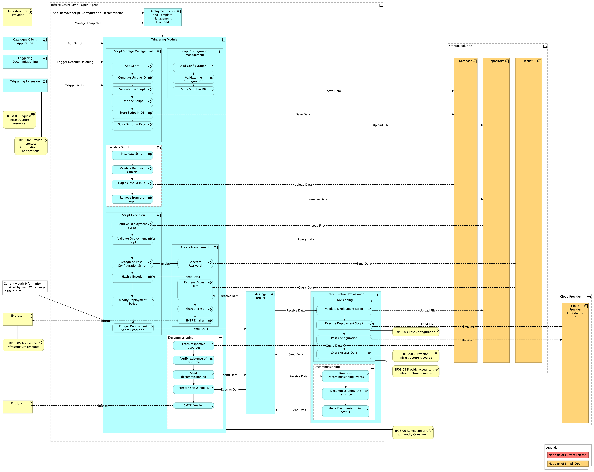

# BP08 Dynamic View

## Source

Extracted from functional-and-technical-architecture-specifications.md, section 4.3.2.

---

## Trace

This dynamic view describes the orchestrated interactions required to provision infrastructure resources and deploy applications on them. The central components are the Triggering Module, the Message Broker, and the Infrastructure Provisioner Module on the Infrastructure Provider's side.

**Preconditions:**
- The Governance Authority, Infrastructure Provider, and Consumer agents are deployed.
- Infrastructure service offerings are listed in the catalogue and registered as connector assets (BP05B).
- The Infrastructure Consumer has been onboarded (BP03A, BP03B) and is authenticated and authorised.
- A usage contract is in place between Consumer and Provider (BP07).

*Figure: Triggering Module and Infrastructure Provisioner interactions during infrastructure provisioning.*

### Triggering Module

The Triggering Module manages the lifecycle of Deployment Scripts and Configuration Scripts. Its sub-components are:

**Script Storage Management** — Providers load deployment scripts, which are validated for malicious code, assigned a unique DeploymentScriptID, hashed, and stored in both a database and a repository. Configuration scripts are validated and linked to specific deployment scripts.

**Template Management** — Infrastructure providers can use predefined VM templates (hardware specs and OS) as blueprints for constructing deployment scripts. Templates do not affect the Script Execution flow.

**Script Invalidation** — Providers can disable deployment scripts. The script's status is updated in the database and the file is removed from the repository (metadata is retained for audit purposes).

**Script Execution** — When a contract is established and the DeploymentScriptID is received:
1. The script is retrieved from the repository.
2. Its integrity is verified by re-hashing and comparing against the stored hash.
3. If a Cloud-init post-configuration section is present, it is recognised, modified (e.g., adding a generated public key or password), and base64-encoded.
4. The modified deployment script is sent to the Infrastructure Provisioner via the Message Broker asynchronously.

**Access Management** — Generates a password or access credentials for the provisioned resource and shares them with the Consumer via email (current release uses SMTP; wallet-based delivery is planned for a future release).

**Decommissioning** — Disables a deployment script and triggers decommissioning on the Infrastructure Provider side (e.g., at end of contract or policy violation).

### Message Broker

Facilitates asynchronous communication between the Triggering Module's Script Execution component and the Infrastructure Provisioner Module.

### Infrastructure Provisioner Module

The module is responsible for provisioning and decommissioning cloud resources.

**Provisioning:**
1. Validates the deployment script for syntax correctness.
2. Executes the script to provision infrastructure resources.
3. Performs post-configuration tasks (setting policies, deploying applications, mounting storage, loading datasets).
4. Returns access data (endpoints) to the Access Management Module via the Message Broker.

**Decommissioning:** Runs pre-decommissioning tasks (e.g., snapshots) and terminates/destroys the provisioned resources.

### Storage Solutions

- **Database** — Stores script metadata and hashes for integrity verification.
- **Repository** — Hosts actual deployment script files.
- **Wallet** — Temporarily stores generated passwords during provisioning; deleted once delivered to the Consumer.

---

## Participants

- [connector/](../../../integration/resource-sharing/resource-sharing-runtime/connector/README.md) — Connector (triggers the Triggering Module upon contract establishment; carries DeploymentScriptID)
- [infrastructure-provisioner/](../../../infrastructure/provisioning/infrastructure-provisioning/infrastructure-provisioner/README.md) — Infrastructure Provisioner (both the Triggering Module and the Infrastructure Provisioner Module; provisions and decommissions infrastructure resources)
- [wallet/](../../../security/credential-management/wallet/wallet/README.md) — Wallet (temporary storage of generated access passwords during provisioning)
- Message Broker — unmatched — verify (internal async communication layer between Triggering and Provisioner modules; no dedicated solution folder)
