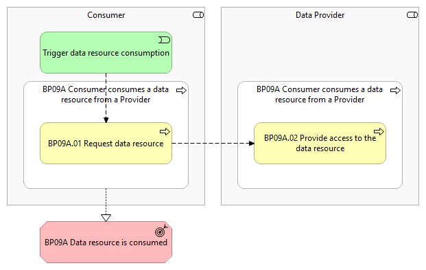
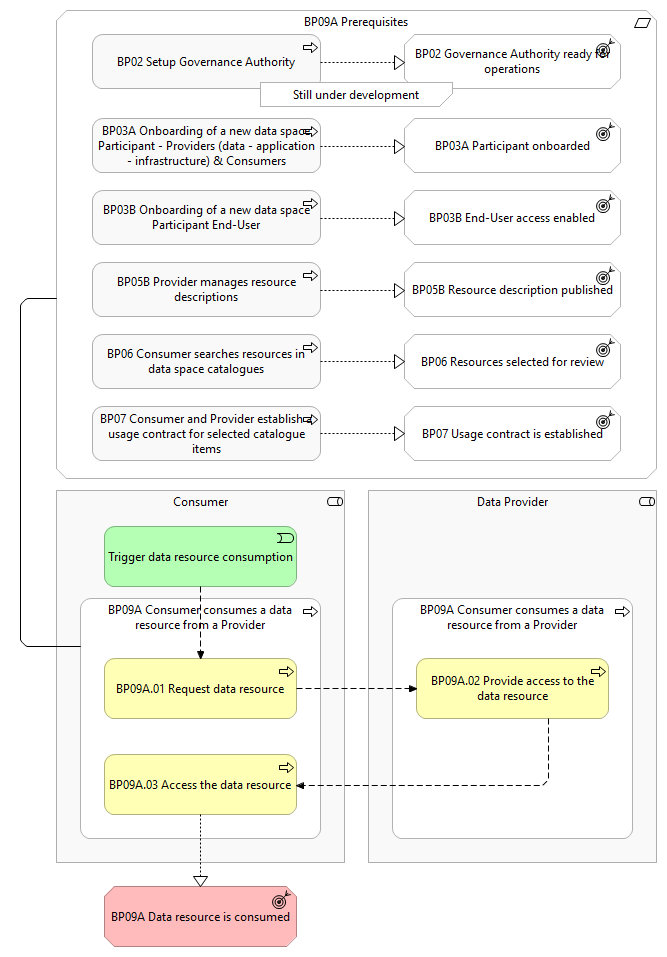

# BP09A – Consumer consumes a data resource from a Provider

> **See also: [Dynamic view](./dynamic-view.md)** — sequence diagram
> showing how this business process executes at runtime, with links
> to each participating solution.

## Overview

This business process covers the situation where a  Consumer  has a usage contract for a certain data resource, and seeks to consume that data resource from a Data Provider . The aim of the process is to facilitate secure, transparent, and contractually governed access to a data resource within a data space, ensuring that both Data Providers and Consumers have clearly defined rights and obligations. It involves the most basic and traditional type of access to a data resource: Data Providers  are able to grant  Consumers access to a data resource. The Data Provider can provide access to the data resource using various methods (e.g., direct download link, file transfer via various existing technologies, etc.).  It includes the following main step: Request data resource: The Consumer initiates the process by requesting a specific data resource from the Data Provider . This request is based on the information found in the data space catalogue, which was previously searched and identified by the Consumer . Provide access to the data resource:   The  Data Provider  a pplies the access control rules and provides the  Consumer  with the right access credentials .

## Actors

The following actors are involved: Data Provider Consumer

## Assumptions

No specific assumptions are made for this business process.

## Prerequisites

The following prerequisites must be fulfilled: Dataspace is configured:   The  Governance Authority   has configured the catalogue with the corresponding vocabulary and schemas to have the general structure of a resource description, contract clauses, and other vital components (Business Process 2). Consumer / Data Provider onboarded: Both the Consumer and Data Provider must complete the onboarding process (Business Process 3A) before they can consume or provide any available resources. End-User authenticated & authorised: The   End-User is authenticated and has the appropriate role and permissions to perform the steps in the process (Business Process 3B). Resource description is present in the data space catalogue: A resource description must be published in the data space catalogue for the Consumer to find a resource in the data space catalogue (Business Process 5). As such, it is assumed that the Consumer has searched in the data space catalogue and found the resource description (Business Process 6). Usage contract established for the data resource:  The  Consumer  can consume the data resource according to the terms and conditions of the usage contract (Business Process 7).

*BP09A figure 1*

*BP09A figure 2*

## Details

The   following  shows the detailed business process diagram and gives the step descriptions.

Trigger data resource consumption The Consumer  initiates the process to consume a data resource from a Data Provider .

BP09A.01 Request data resource The Consumer initiates the process by requesting a specific data resource from the Data Provider . This request is based on the information found in the data space catalogue, which was previously searched and identified by the Consumer .

BP09A.02 Provide access to the data resource The Data P rovider provides the data resource via various means ( e.g., direct download link, file transfer via various existing technologies, etc.), as indicated on the resource description published in the data space catalogue for this data resource and the usage contract, and accordingly the data resource can be accessed or downloaded.

BP09A.03 Access the data resource The Consumer consumes the data resource via the channel indicated on the resource description.

Outcomes

## Sub-processes

- [9A.1 - A Consumer requests a data resource](./9A1-consumer-requests-data-resource.md)
- [9A.3 - Subscription to a dataset/application/infrastructure - Penalties](./9A3-subscription-datasetapplicationinfrastructure-penalties.md)
- [9A.4 - Subscription to a dataset/application/infrastructure - Consumer](./9A4-subscription-datasetapplicationinfrastructure-consumer.md)
- [9A.5 - Support for (near)real time data within/across data spaces](./9A5-support-nearreal-time-data-withinacross-data-spaces.md)
- [9A.6 - Subscription to a data/application/infrastructure - Provider](./9A6-subscription-dataapplicationinfrastructure-provider.md)
- [9A.7 - A Provider provides access to a data resource](./9A7-provider-provides-access-data-resource.md)

## Canonical source

[https://simpl-programme.ec.europa.eu/book-page/bp09a-consumer-consumes-data-resource-provider](https://simpl-programme.ec.europa.eu/book-page/bp09a-consumer-consumes-data-resource-provider)

## Touches

- (auto-inferred — verify) [`../../../governance/`](../../../governance/README.md)
