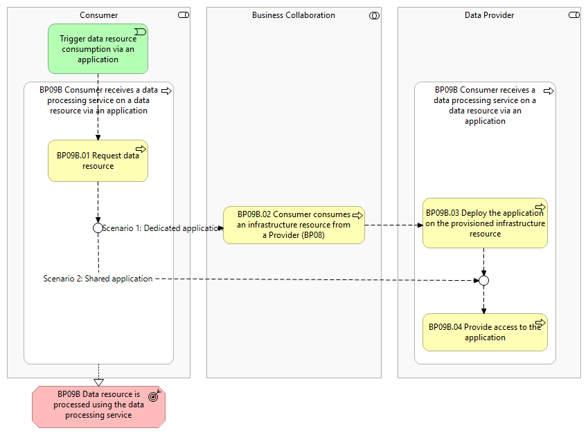
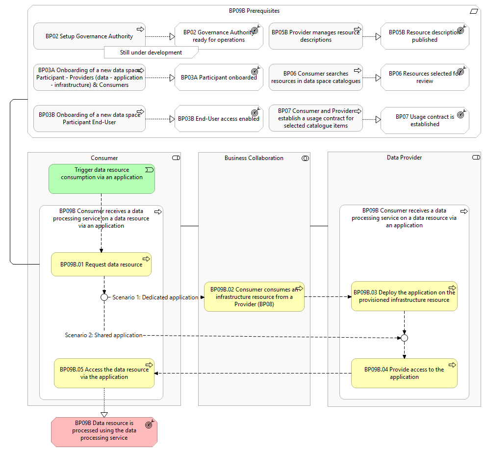

⚠️ <strong>Work in progress — yet to be validated</strong>

📍 <strong>You are here</strong> 
<a href="../../../README.md">🏠 Home</a> 
    <a href="../../README.md">Foundations</a> 
        <a href="../README.md">Business Processes</a> 
            <strong>BP09B — Consumer receives a data processing service on a data resource via an application</strong> 

# BP09B – Consumer receives a data processing service on a data resource via an application

> **See also: [Dynamic view](./dynamic-view.md)** — sequence diagram showing how
> this business process executes at runtime, with links to each participating
> solution.

## Overview

This business process covers the situation where a _Consumer_ has a usage
contract for a certain data resource and seeks to process that data resource via
an application provided by a _Data Provider_.

The process enables two scenarios:

1. **Stand-alone application** — deployed on a dedicated infrastructure resource per _Consumer_.
2. **Shared access** — to an existing application.

It includes the following main steps:

- **Request data resource**
- **Consumer consumes an infrastructure resource** (BP08)
- **Deploy the application on the provisioned infrastructure resource**
- **Provide access to the application**
- **Access the data resource via the application**

## Actors

- _Consumer_
- _Data Provider_

## Assumptions

None listed.

## Prerequisites

- **Dataspace is configured** (BP02).
- **Consumer / Data Provider onboarded** (BP03A).
- **End-User authenticated & authorised** (BP03B).
- **Resource description is present in the data space catalogue** (BP05B).
- **Usage contract established** for the data resource (BP07).

*BP09B figure 1 — overview diagram*

*BP09B figure 2 — detailed diagram*

## Process steps

### BP09B.01 Request data resource

The _Consumer_ initiates the process by requesting a specific data resource from
the _Data Provider_.

### BP09B.02 Consumer consumes an infrastructure resource from a Provider (BP08)

An infrastructure resource is provisioned in collaboration between the _Consumer_
and _Data Provider_.

### BP09B.03 Deploy the application on the provisioned infrastructure resource

The _Data Provider_ deploys a dedicated application on the provisioned
infrastructure resource.

### BP09B.04 Provide access to the application

The _Data Provider_ configures and applies the access control rules, and
provides the _Consumer_ with the right access credentials.

### BP09B.05 Access the data resource via the application

The _Consumer_ consumes the data resource via the application.

## High-level requirements

| ID | Title | Local copy |
|----|-------|------------|
| 9B.1 | Simpl shall provide a number of built-in processing tools. | [9b1-…](./9b1-consumer-requests-application-resource.md) |
| 9B.2 | Simpl shall provide the Data Consumer with the ability to choose. | [-9b8-…](./-9b8-provider-provides-access-application-resource.md) |
| 9B.3 | The Data Consumer can request to store the results. | [-9b9-…](./-9b9-provider-provides-application-deployment-instructions.md) |
| 9B.4 | Depending on the access rights and usage policies. | [-9b10-…](./-9b10-consumer-finalises-preparation-application-deployment-instructions.md) |
| 9B.5 | Simpl shall generate a copy of the dataset that is to be processed. | [9b11-…](./9b11-consumer-performs-steps-application-deployment-instructions.md) |
| 9B.6 | Simpl shall provide the mechanisms to be able to automatically configure. | _no local file yet_ |

> **Source-site note:** the HLR detail-page slugs on the public site are not
> aligned with the 9B.x numbering — they reuse 13.x and 8.x prefixes. Use the
> URLs below if navigating directly.

Detail pages on the public site:

- 9B.1 → [132-dataset-processing-built-tool](https://simpl-programme.ec.europa.eu/book-page/132-dataset-processing-built-tool)
- 9B.2 → [81-data-processing-initiation](https://simpl-programme.ec.europa.eu/book-page/81-data-processing-initiation)
- 9B.3 → [83-dataset-processing-result-storage](https://simpl-programme.ec.europa.eu/book-page/83-dataset-processing-result-storage)
- 9B.4 → [84-dataset-processing-results](https://simpl-programme.ec.europa.eu/book-page/84-dataset-processing-results)
- 9B.5 → [85-dataset-source-copy](https://simpl-programme.ec.europa.eu/book-page/85-dataset-source-copy)
- 9B.6 → [912-mechanisms-configure-and-provision-vms](https://simpl-programme.ec.europa.eu/book-page/912-mechanisms-configure-and-provision-vms)

> **Local-file note:** the `-9b8-`, `-9b9-`, `-9b10-` filenames preserve the
> source-site slug, which contains a leading hyphen. The HLR-to-file mapping
> above is approximate; the public site does not provide a clean ID-to-slug
> table for this BP.

## Source page metadata

- **Author:** Johan van Wyk
- **Published:** 23 June 2025
- **Status on source site:** Proposed
- **Snapshot taken:** 28 April 2026

## Canonical source

[https://simpl-programme.ec.europa.eu/book-page/bp09b-consumer-receives-data-processing-service-data-resource-application](https://simpl-programme.ec.europa.eu/book-page/bp09b-consumer-receives-data-processing-service-data-resource-application)

## Touches

- (auto-inferred — verify) [`../../../data/`](../../../data/README.md)
