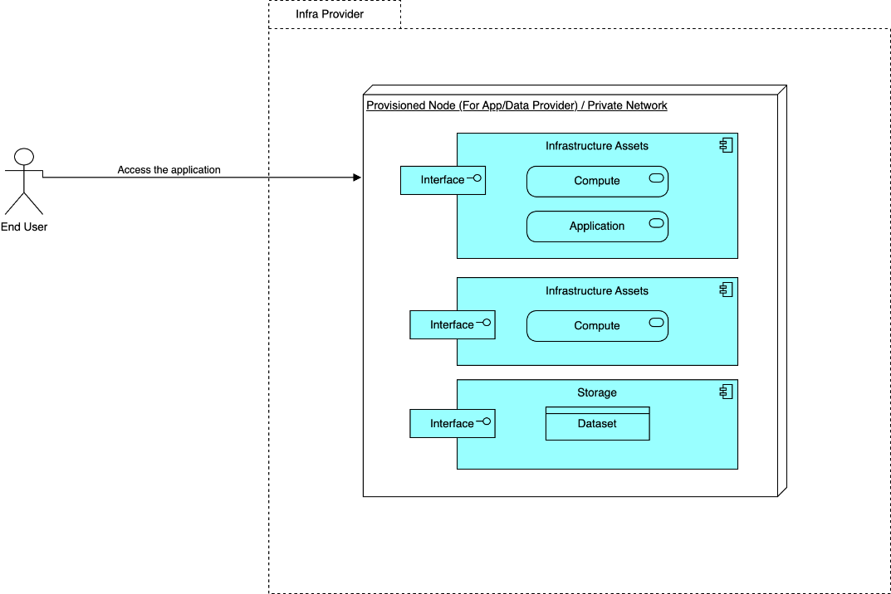

# BP09B Dynamic View

## Source

Extracted from functional-and-technical-architecture-specifications.md, section 4.3.2.

---

## Trace

The Consumer wants to process or visualise a dataset owned by a Data Provider but does not have direct access to the data. Instead, they contract a bundled offering that includes an infrastructure resource and a deployed application. The Consumer receives credentials only to the application, not to the dataset itself.

**Preconditions:**
- The Provider has registered the resource (dataset + application + infrastructure bundle) at the Connector and published a self-description to the Catalogue.
- The Consumer is authenticated, has found the bundled offering (BP06), and a usage contract exists or is established as part of this flow (BP07).

> Note: Components coloured grey in the source diagram relate to BP07 (Contract Manager) and BP06 (Search), representing preconditions rather than steps in this process.

> **Image not available**: The first sequence diagram (image66) referenced in the source document is not present in this repository. Embed it once available: ``.

**Phase 1 — Contract Negotiation and Infrastructure Trigger**

1. **Resource Selection** — The Consumer selects the bundled resource in the Catalogue Client Application, sending a request to the Contract Negotiation Adapter.

2. **Request Offering** — The Contract Negotiation Adapter forwards the request to the Data Provider's Connector (Control Plane), which checks the Asset Catalogue:
   - If not found: "Resource Not Found" is returned to the Consumer.
   - If found: the Connector returns the offering details (usage and access policies) to the Consumer.

3. **Policy Agreement** — The Consumer reviews the offering and agrees to usage and access policies via the Catalogue Client Application.

4. **Contract Negotiation Request** — The Contract Negotiation Adapter composes a contract request and sends it to the Provider's Connector. The Provider's Policy Engine evaluates the request:
   - If policy check fails: the Consumer is notified.
   - If policy check succeeds: the contract is finalised and a confirmation is sent to the Consumer.

5. **Infrastructure Deployment Trigger** — After contract finalisation, the Provider's Connector triggers the Infrastructure Orchestrator to begin provisioning.

6. **Triggering Deployment** — The Infrastructure Orchestrator sends a deployment command to the Triggering Module of the Infrastructure Provider, specifying the required infrastructure and application.

7. **Provisioning and Deployment** — The Triggering Module provisions the infrastructure instance and deploys the application. Once complete, it retrieves access credentials (e.g., application URL, API keys) and returns them to the Infrastructure Orchestrator.

8. **Returning Access Information** — The Infrastructure Orchestrator relays access information to the Provider's Connector, which passes it through the Contract Negotiation Adapter to the Consumer.

**Phase 2 — Application Access**

Once the Consumer receives the access credentials, they connect directly to the deployed application via the provided link. Direct access to the underlying dataset is not provided and is contractually prohibited.

*Figure: Consumer accesses the deployed application using the received credentials.*

---

## Participants

- [catalogue-client-application/](../../../integration/resource-discovery/search-engine/catalogue-client-application/README.md) — Catalogue Client Application (Consumer's interface for resource selection and policy agreement)
- [connector/](../../../integration/resource-sharing/resource-sharing-runtime/connector/README.md) — Connector (contract negotiation control plane on the Provider side; includes Contract Negotiation Adapter)
- [infrastructure-provisioner/](../../../infrastructure/provisioning/infrastructure-provisioning/infrastructure-provisioner/README.md) — Infrastructure Provisioner / Triggering Module (provisions infrastructure and deploys application on command)
- [simpl-catalogue/](../../../integration/resource-discovery/resource-catalogue/simpl-catalogue/README.md) — Simpl Catalogue / Asset Catalogue (consulted during asset validation)
- Policy Engine — unmatched — verify (evaluates contract request against governance rules on the Provider side)
- Infrastructure Orchestrator — unmatched — verify (intermediate component between the Connector and Triggering Module; no dedicated solution folder found)
