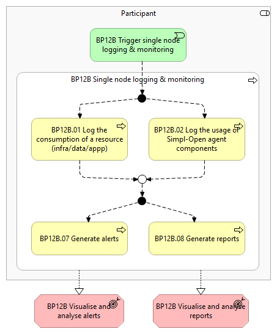
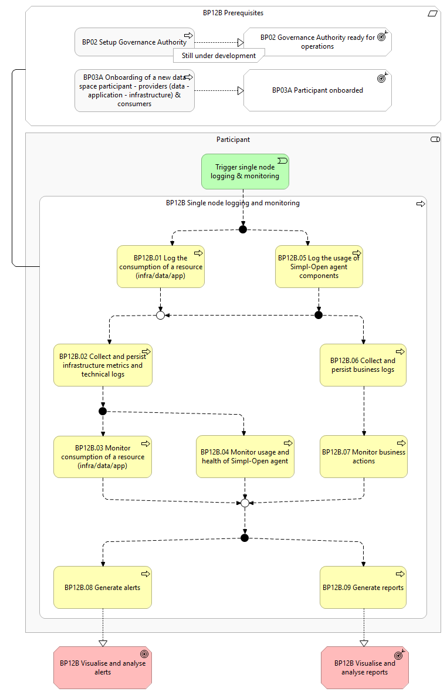

# BP12B – Single node logging & monitoring

> **See also: [Dynamic view](./dynamic-view.md)** — sequence diagram
> showing how this business process executes at runtime, with links
> to each participating solution.

## Overview

This business process covers the collection, standardisation, and persistence of logs and metrics, the monitoring of the Simpl-Agent, and the visualisation and reporting of data. The logs include gathering metrics like performance data, error logs, and usage statistics. Furthermore, visualisations and reports provide insights into system performance and user activities. This workflow is applicable to all the Participants , namely the Consumers , Providers and the Governance Authority . It includes the following main steps: Log consumption of a resource (infra/data/app): During the consumption of a (infrastructure/data/application) resource, Simpl-Open agent generates technical logs that will be used for various reasons (billing, audit, policy enforcement, regulation compliance, etc.). Log usage of Simpl-Open agent components: While they are running, the components of Simpl-Open agent generate both technical logs and business logs that will be used for the purposes of audit and troubleshooting. Generate alerts : Alerts get generated when health checks fail or predefined thresholds are exceeded. Generate reports: Compile the logged data into reports to provide insights (e.g., system performance, user activities, and issues encountered).

## Actors

The following actors are involved: Governance Authority Provider Consumer In the diagrams, they will be described as Participant .

## Assumptions

The following assumptions are made: The Simpl-Open agent is configured to capture technical logs that allow to follow the consumption of (infrastructure/data/application) resources. The Simpl-Open agent is configured to capture technical logs that allow to follow the usage of the agent components. The Simpl-Open agent is configured to capture technical logs that allow to follow the infrastructure and service health. The Simpl-Open agent is configured to capture business logs for s ignificant events or actions (related to steps within a business process or other functional use cases). A solution is in place to persist the technical and business logs. A solution is in place for monitoring, alerting and visualising of the technical and business logs.

## Prerequisites

The prerequisites for this workflow are outlined below. These prerequisites must be met to enable the process to occur: Data space is configured:   The  Governance Authority   has configured the data space catalogue with the corresponding vocabulary and schemas to have the general structure of a resource description, contract clauses, and other vital components (Business Process 2). Participant onboarded: Before the Participant can log & monitor its Simpl-Agent, they should have successfully completed the onboarding business process (Business Process 3A).

*BP12B figure 1*

*BP12B figure 2*

## Details

The following shows the detailed business process diagram and gives the step descriptions.

Trigger single node logging & monitoring While using Simpl-Open, the agent of the Participant initiates the single node logging & monitoring.

BP12B.01 Log the consumption of a resource (infra/data/app) During the consumption of a (infrastructure/data/application) resource, Simpl-Open agent of the Participant generates technical logs that will be used for various reasons (billing, audit, policy enforcement, regulation compliance, infrastructure metrics, service health, etc.).

This is generally done with a push-based mechanism, but can also be done with a pull-based mechanism for the purpose of monitoring infrastructure metrics and service health.

BP12B.02 Collect and persist infrastructure metrics and technical logs The Simpl-Open agent of the Participant c onverts the collected technical logs and infrastructure metrics into a consistent format to facilitate analysis and integration with other monitoring tools.

The collected and standardised technical logs and metrics are persisted in a durable, accessible location for future analysis and access.

BP12B.03 Monitor consumption of a resource (infra/data/app) The Participant m onitors the consumption of resources through a dashboard to enforce policies and regulations compliance.

BP12B.04 Monitor usage and health of Simpl-Open agent The Participant m onitors the Simpl-Open agent usage and health through a dashboard to ensure it is functioning correctly , tracking the usage, its performance, and any errors or warnings.

BP12B.05 Log the usage of Simpl-Open agent components While they are running, the components of Simpl-Open agent of the Participant generate both technical logs and business logs that will be used for the purposes of audit and troubleshooting.

The business logs are generated for pre-defined s ignificant events or actions (related to steps within a business process or other functional use cases).

BP12B.06 Collect and persist business logs The Simpl-Open agent of the Participant c onverts the collected business logs into a consistent format to facilitate analysis and integration with other monitoring tools.

The collected and standardised business logs are persisted in a durable, accessible location for future analysis and access.

BP12B.07 Monitor business actions The Participant monitors the business actions through a dashboard.

BP12B.08 Generate alerts The Participant defines alerts and assigns target users to receive the alerts when they occur.

The Simpl-Open agent of the Participant generates a lerts when health checks fail or predefined thresholds are exceeded, and shared with the assigned target users.

BP12B.09 Generate reports The Participant defines and schedules reports based on the logged data to support monitoring and follow up. The Simpl-Open agent of the Participant generates the pre-defined reports according to the schedule.

The Participant defines and generates custom ad-hoc reports based the logged data to support the analysis and follow up of specific issues or analysis.

Outcomes

Use cases and types of logs are described in details in the Logging, Monitoring & Reporting section of the Architecture Document:

## Sub-processes

- [12B.1 - A Consumer and Provider log the consumption of infrastructure resources](./12B1-consumer-and-provider-log-consumption-infrastructure-resources.md)
- [12B.2 - A Participant logs the usage of Simpl-Open agent components](./12B2-participant-logs-usage-simpl-open-agent-components.md)
- [12B.3 - A Participant logs business actions](./12B3-participant-logs-business-actions.md)
- [12B.4 - A Consumer and Provider log the consumption of data and application resources](./12B4-consumer-and-provider-log-consumption-data-and-application-resources.md)
- [12B.5 - A Participant checks the health of the application components of their Simpl-Open agent](./12B5-participant-checks-health-application-components-their-simpl-open-agent.md)
- [12B.6 - A Participant stores logs and metrics](./12B6-participant-stores-logs-and-metrics.md)
- [12B.7 - A Participant monitors their Simpl-Open agent usage, consumption of resources, and business actions](./12B7-participant-monitors-their-simpl-open-agent-usage-consumption-resources-and-business.md)
- [12B.8 - A Participant generates alerts on their Simpl-Open agent usage, consumption of resources, and business actions](./12B8-participant-generates-alerts-their-simpl-open-agent-usage-consumption-resources-and.md)
- [12B.9 - A Participant reports on their Simpl-Open agent usage, consumption of resources, and business actions](./12B9-participant-reports-their-simpl-open-agent-usage-consumption-resources-and-business.md)

## Canonical source

[https://simpl-programme.ec.europa.eu/book-page/bp12b-single-node-logging-monitoring](https://simpl-programme.ec.europa.eu/book-page/bp12b-single-node-logging-monitoring)

## Touches

- (auto-inferred — verify) [`../../../governance/`](../../../governance/README.md)
