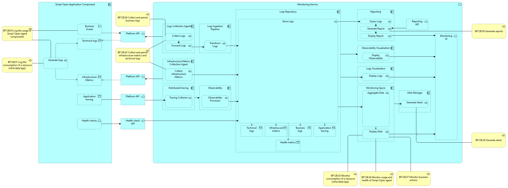

# BP12B Dynamic View

## Source

Extracted from functional-and-technical-architecture-specifications.md, section 4.4.2 (titled "ACV Dynamic - WF 12B - Local Node Logging and Monitoring").

---

## Trace

This dynamic view describes how the monitoring components interact to collect, process, store, visualise, and alert on data produced by all Simpl-Open application components running within a single agent node. Cross-node monitoring is not yet in scope.

*Figure: Component interactions for local node logging and monitoring.*

1. **Log and Event Generation** — Every Simpl-Open Application Component produces four types of data: technical logs, business events, infrastructure metrics, and health check outputs. These are exposed via APIs.

2. **Logs Collection** — The Log Collection Agent retrieves technical logs and business events from each application component and forwards them to the Log Ingestion Pipeline.

3. **Metrics Collection** — The Infrastructure Metrics Collection Agent gathers infrastructure metrics (CPU, RAM, etc.) directly from application components and stores them in the Logs Repository.

4. **Log Transformation** — The Log Ingestion Pipeline processes and standardises raw logs before writing them to the Logs Repository.

5. **Centralised Storage** — The Logs Repository stores technical logs, infrastructure metrics, and business events in dedicated sections, making them available for downstream components.

6. **Log Visualisation** — The Logs Visualisation component queries the Logs Repository and presents logs for user analysis. Logs Visualisation and Monitoring Space share a common UI with separate tabs.

7. **Data Aggregation** — The Monitoring Space aggregates logs and metrics and displays dashboards for real-time analysis of system health and performance. It also queries health endpoints directly.

8. **Alert Generation** — The Alert Manager processes aggregated data and generates alerts for anomalies or threshold breaches, notifying relevant stakeholders.

9. **Report Generation** — The Reporting Module queries the Logs Repository to produce detailed reports.

10. **Report Presentation** — Reports are displayed through a user-facing interface, providing actionable insights for administrators.

---

## Participants

- [monitoring-service/](../../../administration/observability/dashboarding/monitoring-service/README.md) — Monitoring Service (Log Collection Agent, Log Ingestion Pipeline, Logs Repository, Monitoring Space, Logs Visualisation, Alert Manager, Reporting, Health Checks, Application Tracing)
