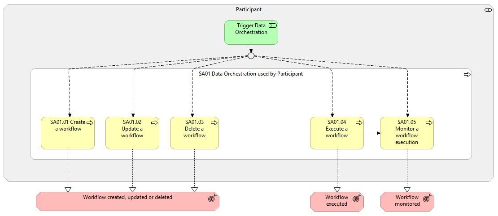

# SA01 - Data orchestration used by a Participant

## Overview

This supporting activity enables  Providers  and  Consumers  to design, execute, and monitor traceable and repeatable data processing workflows, facilitating consistent and auditable data transformation activities within the data space. These workflows orchestrate a sequence of services, allowing  Participants  to automate complex data operations in a structured and governed way. In the case of the  Provider , the data orchestration capability can also be used for data preparation workflows that, for example, can include anonymisation, pseudonymisation, or data cleansing steps. Once triggered, the workflow executes each defined step in order, processing selected data sets and delivering outputs to user-defined destinations according to the configured logic. The selection and configuration of processing services to be included in each workflow remain the responsibility of the individual  Participant , based on their specific use case and intended outcomes. To support this responsibility, the constraints and limitations of each service will be clearly communicated, ensuring that  End-Users  understand the scope, assumptions, and risks associated with incorrect usage. These services, outside the scope of this supporting activity, may consist of components or applications available through the application catalogue. The data orchestration capability in Simpl-Open is based on a two-layered model: Service : A service represents a single, self-contained unit of work. It performs a specific function such as data transformation, or communication with an external service. Services are designed to be modular, reusable, and independently testable components that can be orchestrated as part of a larger process. Workflow : A workflow is a structured sequence of services that are executed in a defined order to achieve a specific business or data processing goal. It defines the orchestration logic, including service dependencies, execution conditions, and data flow. Workflows enable the automation of complex processes by coordinating multiple services into a cohesive pipeline. A workflow receives inputs sources that will be mainly data sets. The execution of the workflow is initiated by a   triggering mechanism. During consumption of target data : This means that after the consumption requested by the  Consumer , the workflow will be triggered by passing the data set that is present in the source at the moment of the consumption request. This means explicitly that the workflow will use the dataset   as it exists in the source at the exact time of the request. The triggered workflow will be executed and, after the processing is over and the new data set is stored on the  Provider  side, it will be shared. It is important to note that the consumed dataset is constrained by the Provider’s update frequency and freshness policies: It may not include changes made to the source after the request was issued It may reflect only the latest snapshot made available according to the Provider’s refresh cycle Continuous updates are not guaranteed Source data change : This means that the  Provider  can set a trigger that creates an event when a data set is modified, and this will trigger the workflow execution. The triggered workflow will be executed, and after the processing is over, the new data set is stored on the  Provider  side. Time schedule:  The workflow runs on a predefined schedule, for instance, once per day at 3.am. Manual trigger:  The workflow is triggered manually from the UI. The scheduling possibilities of a workflow in the orchestration platform that are depicted in the diagram are: This supporting activity covers the following main steps: Define a workflow : Initial definition of the workflow and associated services. Update a workflow : Update of existing workflows. Delete a workflow :  Deletion of existing workflows. Execute a workflow : Execution of the defined workflow. Monitor a workflow : Verification of execution status, access to real-time or historical logs, and identification of errors or bottlenecks.

## Actors

The actor involved in this business process is referred to as the  Participant , and can corresponds to: Consumer Provider

## Assumptions

The following assumptions are made: Simpl-Open will not inspect or validate the internal business logic configured by the  Participants  within their workflows. The services that a  Participant  can use are either built-in Simpl-Open, defined by the  Participant  itself or selected in the application catalogue

## Prerequisites

The following prerequisites must be fulfilled: Participant onboarded:  The  Participant  should have successfully completed the onboarding business process (Business Process 3A) before they can trigger the orchestration. End-User authentication and authorisation:  The  End-User  must be authenticated and possess the necessary roles and permissions to execute the process steps (Business Process 3B).

*SA01 figure 1*

## Sub-processes

- [1.1 - Participant consults their own data orchestration workflows](./11-participant-consults-their-own-data-orchestration-workflows.md)
- [1.2 - Participant creates a new data orchestration workflow](./12-participant-creates-new-data-orchestration-workflow.md)
- [1.3 - Participant creates a new version of a data orchestration workflow](./13-participant-creates-new-version-data-orchestration-workflow.md)
- [1.4 - Participant deletes a data orchestration workflow](./14-participant-deletes-data-orchestration-workflow.md)
- [1.5 - Participant executes a data orchestration workflow](./15-participant-executes-data-orchestration-workflow.md)
- [1.6 - Participant monitors and accesses data orchestration workflow execution logs](./16-participant-monitors-and-accesses-data-orchestration-workflow-execution-logs.md)

## Canonical source

[https://simpl-programme.ec.europa.eu/book-page/sa01-data-orchestration-used-participant](https://simpl-programme.ec.europa.eu/book-page/sa01-data-orchestration-used-participant)

## Touches

- (auto-inferred — verify) [`../../../governance/`](../../../governance/README.md)
