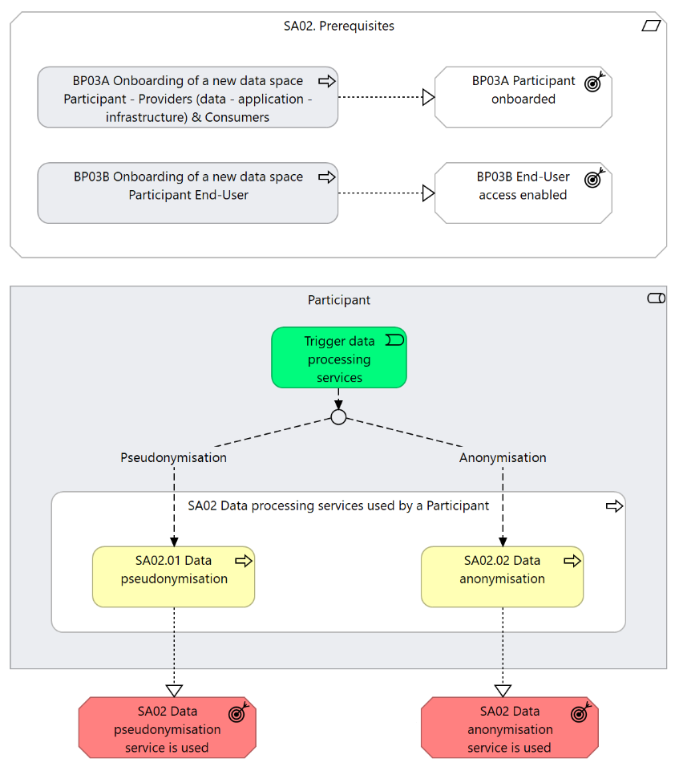

⚠️ <strong>Work in progress — yet to be validated</strong>

📍 <strong>You are here</strong> 
<a href="../../../README.md">🏠 Home</a> 
    <a href="../../README.md">Foundations</a> 
        <a href="../README.md">Business Processes</a> 
            <strong>SA02 — Data Processing Services</strong> 

# SA02 - Data processing services used by a Participant

## Overview

This supporting activity serves solely as a functional container for a set of data processing services offered through the Simpl platform. It is expected that services will be incrementally added to the process to cover the full data lifecycle, from preparation and transformation to analysis and beyond, enabling both  Providers  and  Consumers  to interact with datasets in a structured and governed manner. While this supporting activity does not aim to define specific workflows, it is intended to present, at a high level, the scope of the data processing services it refers to. Simpl currently provides two data processing services used by  Participants  (both  Provider  and  Consumer ) according to their specific needs. Additional services are planned for future introduction. These services will be made available in the Simpl-Open agent .  Some services will be  pre-installed  (i.e. deployed together with the Simpl-Open agent), others can be  added by the participants  or identified in the  application catalogue . Services expected to be relevant across multiple usage patterns will be provided as pre-installed, whereas more specialised services will be identified in the application catalogue. The currently offered services are: 1. Pseudonymisation and anonymisation service This service supports  Participants (either Provider and Consumer)  in protecting personal data, as well as business-critical information, confidential datasets, and other sensitive records, by enabling the application of a range of data protection techniques. Pseudonymisation  allows for reversible transformations, making it possible to re-identify data subjects when justified, through the use of securely managed auxiliary information.  Anonymisation , on the other hand, ensures that data is irreversibly transformed in such a way that no direct or indirect link to the original data subjects remains.

## Actors

The following actors are involved:   Participant (Provider and Consumer)

## Assumptions

The following assumptions are made: The pseudonymisation and anonymisation service allows users to balance data protection with data utility by selecting and applying the most appropriate techniques based on their operational needs. However, users retain full responsibility for making informed decisions on the data to be processed and the techniques to be used, validating the effectiveness of the chosen methods, and managing any associated risks, as the service provides support but does not replace expert judgment.

## Prerequisites

The following prerequisites must be fulfilled: Participant onboarded :   The  Participant  should have successfully completed the onboarding business process (Business Process 3A); End user authenticated & authorised:  The  End-User  is authenticated and has the appropriate role and permissions to perform the steps in the process (Business Process 3B).

*SA02 figure 1*

## Sub-processes

- [2.1 - Participant - pseudonymises a dataset](./21-participant-pseudonymises-dataset.md)
- [2.2 - Participant - anonymises a dataset](./22-participant-anonymises-dataset.md)

## Canonical source

[https://simpl-programme.ec.europa.eu/book-page/sa02-data-processing-services-used-participant](https://simpl-programme.ec.europa.eu/book-page/sa02-data-processing-services-used-participant)

## Touches

- (auto-inferred — verify) [`../../../governance/`](../../../governance/README.md)
