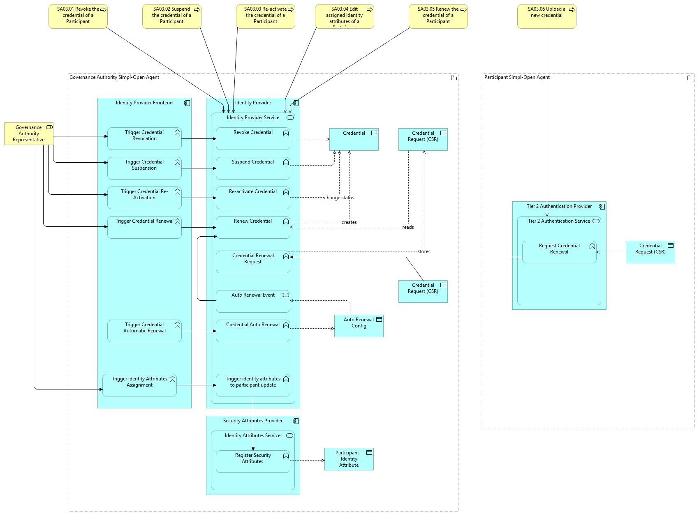

⚠️ <strong>Work in progress — yet to be validated</strong>

📍 <strong>You are here</strong> 
<a href="../../../README.md">🏠 Home</a> 
    <a href="../../README.md">Foundations</a> 
        <a href="../README.md">Business Processes</a> 
            <strong>SA03 — Credentials actions by the Governance Authority</strong> 

# SA03 – Credentials actions by the Governance Authority

> **See also: [Dynamic view](./dynamic-view.md)** — sequence diagram showing how
> this supporting activity executes at runtime, with links to each participating
> solution.

## Overview

The _Governance Authority_ manages _Participant_ credentials within the data
space through credential lifecycle management. The process introduces
"mandates" as official approvals for credential actions by authorised
representatives. The workflow may utilise ticketing systems or other mechanisms
defined by each _Governance Authority_.

> **Important:** Before the execution of any credential action (like revocation
> or suspension), careful consideration should be given to analysing the
> potential impact on ongoing agent-to-agent interactions within the data space.

Possible credential actions include:

- **Revoking** — the credentials of the selected _Participant_ are revoked so that their actions inside the data space are blocked.
- **Suspending** — the credentials of the selected _Participant_ are placed on hold so that their actions requiring authentication are temporarily blocked.
- **Re-activating** — suspended credentials of the selected _Participant_ are restored to full functionality, allowing the _Participant_ to operate in the data space with the same access rights and capabilities they had prior to the suspension.
- **Renewing** — the credentials of the selected _Participant_ are issued by the _Governance Authority_ so that a _Participant_ representative can take and upload them into the _Participant_ agent.
- **Editing identity attributes** — the identity attributes assigned to a _Participant_ are updated to reflect changes in their permissions or status within the data space.

## Actors

- _Governance Authority_ representatives with the role required to manage credentials.
- _Participant_ representative with the role to administer agent-to-agent communication configurations.

## Assumptions

- The _Governance Authority_ has defined the rules describing how mandates trigger the process actions.
- The _Governance Authority_ has defined the role that enables performing credential actions, and the role is assigned to a _Governance Authority_ representative.
- The role of accessing _Participant_ management functionalities is assigned to a _Governance Authority_ representative.
- The _Participant_ whose credentials are the target of an action has been onboarded and meets one of the following conditions depending on the mandate:
  - Holds valid credentials, allowing for credential suspension.
  - Holds credentials that are valid, suspended, or revoked, allowing for credential renewal.
  - Holds suspended credentials, allowing for credential re-activation.
  - Holds credentials that are not yet revoked, allowing for credential revocation.
- There is a formal mandate (the result of a decision-making process managed and defined by the _Governance Authority_ outside of this process) to proceed with a particular action.

## Prerequisites

- **Data space is configured** — the Simpl-Open agent is installed and the _Governance Authority_ is ready for operations (BP02). The communication security settings are configured and the _Governance Authority_ ID/Trust is configured (BP02A — Configure ID/Trust security solution).
- **Provider onboarded** — one or more _Providers_ must be successfully onboarded (BP03A).

*SA03 sequence*

## Process steps

### Trigger — credential operation change

The _Governance Authority_ representative initiates the specific action for
which a mandate was received.

### SA03.01 Revoke the credential of a Participant

The _Governance Authority_ representative identifies the _Participant_ whose
credentials must be revoked and revokes them so that their future actions using
these credentials inside the data space are permanently blocked.

### SA03.02 Suspend the credential of a Participant

The _Governance Authority_ representative identifies the _Participant_ whose
credentials must be suspended and suspends them so that their future actions
inside the data space are temporarily blocked.

### SA03.03 Re-activate the credential of a Participant

The _Governance Authority_ representative identifies the _Participant_ whose
credentials must be re-activated and re-activates them so that their future
actions inside the data space are restored as they were before the suspension.

### SA03.04 Edit assigned identity attributes of a Participant

The _Governance Authority_ representative identifies the _Participant_ whose
identity attributes have to be edited and edits them so that the new assignment
will take effect.

### SA03.05 Renew the credential of a Participant

The _Governance Authority_ representative identifies the _Participant_ whose
credentials must be renewed, then issues new credentials for the _Participant_
and makes them available to the _Participant_ to be installed.

### SA03.06 Upload a new credential

The _Participant_ whose credentials are renewed uploads the issued credentials
so that their future actions that require authentication inside the data space
continue.

## High-level requirements

| ID | Title | Local copy |
|----|-------|------------|
| 3.1 | Participant management — Simpl shall offer the Data Space Governance Authority managerial capabilities for participants. | [31-…](./31-participant-management.md) |

> **Note on numbering:** the source site uses bare `3.x` IDs (and `3x-…` slugs)
> for these HLRs, not `SA03.x`. Local files mirror that. SA03 currently
> publishes only one HLR (3.1).

Detail page on the public site:

- 3.1 → [31-participant-management](https://simpl-programme.ec.europa.eu/book-page/31-participant-management)

## Outcomes

- **Credential action completed.** Depending on the scenario, the following outcomes are achieved:
  - The _Governance Authority_ has revoked the credentials of a _Participant_, permanently blocking all future actions with these credentials (SA03.01).
  - The _Governance Authority_ has suspended the credentials of a _Participant_, temporarily blocking all future actions with these credentials (SA03.02).
  - The _Governance Authority_ has re-activated the credentials of a _Participant_, restoring all future actions with these credentials as before the suspension (SA03.03).
  - The _Governance Authority_ has edited the identity attributes of a _Participant_ (SA03.04).
  - The _Governance Authority_ has renewed the credentials of a _Participant_, and the _Participant_ has uploaded the new credentials, activating all future actions with these credentials (SA03.05 and SA03.06).

## Source page metadata

- **Author:** Annalie te Hofste
- **Published:** 19 December 2025
- **Status on source site:** Proposed
- **Snapshot taken:** 28 April 2026

## Canonical source

[https://simpl-programme.ec.europa.eu/book-page/sa03-credentials-actions-governance-authority](https://simpl-programme.ec.europa.eu/book-page/sa03-credentials-actions-governance-authority)

## Touches

- (auto-inferred — verify) [`../../../governance/`](../../../governance/README.md)
- (auto-inferred — verify) [`../../../security/`](../../../security/README.md)
