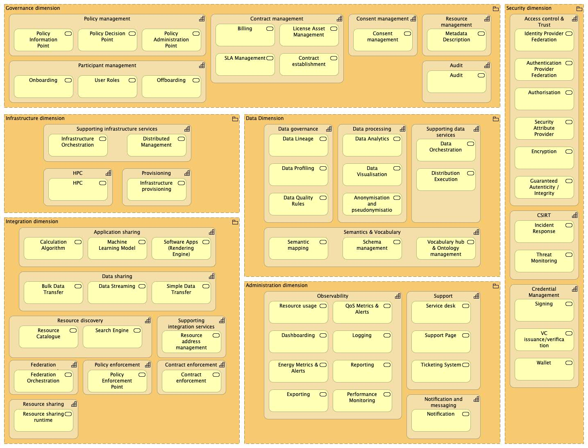
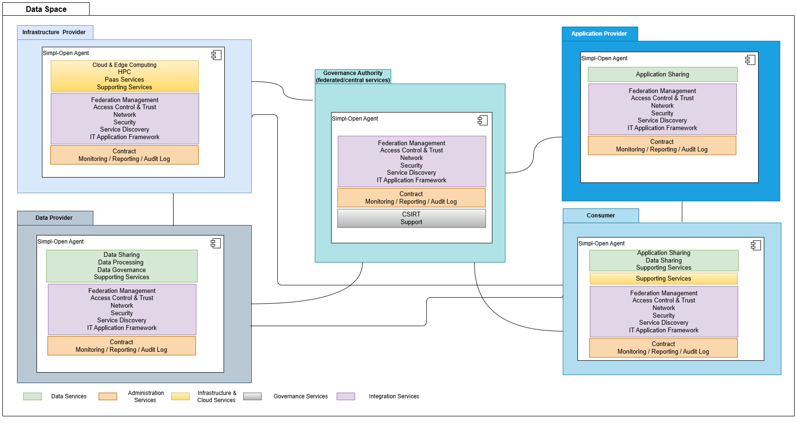
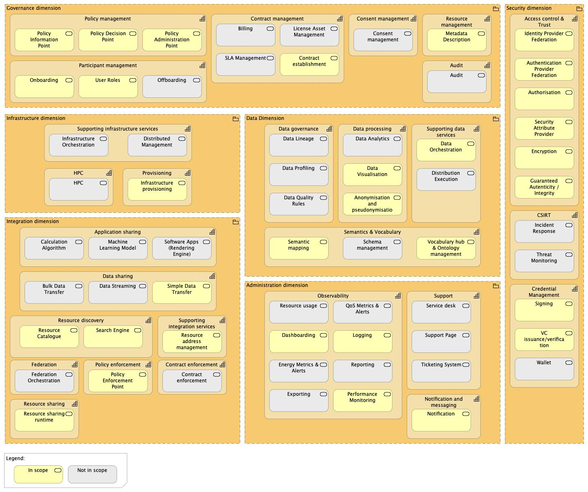

Source: `functional-and-technical-architecture-specifications.md`, §2.7 (Capabilities — Level 1), §2.8 (Services — Level 2) including §2.8.1 Deployment model and §2.8.2 Scope covered by Release 3.0.

# Simpl-Open capability map

Simpl-Open organises its functionality into **dimensions → capabilities → business services**. This file captures the Level 1 (capabilities) and Level 2 (business services) views as published in the architecture specification, along with the deployment and release-scope diagrams from §2.8.

Solution folders in this repository mirror this hierarchy: `dimension/capability/business-service/solution/`.

---

## Level 1 — capabilities per dimension

In the **Administration dimension**, the **Observability** capability monitors system health, usage, and performance across the data space, providing insights and dashboards for operational oversight. The **Support** capability provides operational assistance to participants and end-users through service desk services, ticketing systems, and status pages. It enables troubleshooting, issue tracking, and knowledge sharing to ensure smooth installation, configuration, and ongoing use of Simpl-Open components. The **Notification and messaging** capability provides asynchronous, event-driven notifications to users and admins for key workflows like onboarding requests and governance actions.

In the **Data dimension**, the **Data governance** capability ensures that data sharing adheres to defined quality, metadata, and governance standards. It provides services like data lineage, data profiling and data quality rules. The **Data processing** capability provides the means to transform, aggregate and visualise datasets across multiple sources. The **Supporting data services** capability provides the foundational data services that enable efficient, scalable, and reliable management of data operations across the ecosystem, including orchestration and distributed execution. The **Semantics & Vocabulary** ensures semantic interoperability across the Data Space by providing standardized vocabularies, ontologies, and schema management. It enables participants to understand and interpret shared data consistently through formal knowledge representation and mapping services.

In the **Integration dimension** the **Data sharing** capability allows participants to exchange data with others through interoperable interfaces, where the **Application sharing** capability allows participants to make applications and services available to others through interoperable interfaces, as well as provide algorithms and models for AI-based processing. The **Federated Management** capability manages identity federation, catalogue federation, trust anchoring, and cross-domain access across multiple data spaces. The **Resource discovery** capability supports consumers in finding available resources securely and efficiently through catalogues. The **Policy enforcement** capability enforces access and usage policies at runtime integration points where policy decisions are applied. The **Contract enforcement** capability clarifies its role in validating and enforcing contractual terms at integration points, connecting it to policy management and billing. The **Supporting Integration Services** emphasizes its supporting role in maintaining persistent resource addresses across federated environments and integration endpoints. The **Resource sharing** capability will embed all services related to generic resource sharing, specifically focused on the implementation of the connector protocol.

In the **Infrastructure dimension**, the **Provisioning** capability handles allocation, lifecycle, and orchestration of infrastructure resources required by participants and data services. The **Supporting infrastructure services** capability provides underlying infrastructure-level services such as distribution and the management of distributed resources. The **HPC** capability enables the execution of high-performance computing workloads where demanding analytical or AI-driven computations are needed, leveraging shared or external infrastructure resources.

In the **Governance dimension**, the **Consent management** capability ensures that data subjects' consent preferences are properly captured, managed, and respected throughout data processing activities. The **Contract management** capability governs the lifecycle of contractual agreements between participants, ensuring that terms and obligations are traceable and enforceable. The **Policy management** capability enables the lifecycle, the definition and distribution of access and usage policies across the Data Space. The **Audit** capability provides transparency and verifiable evidence of compliance, supporting accountability and continuous assurance. The **Participant management** capability handles onboarding, identity validation, and lifecycle management including offboarding of all participants in the ecosystem.

In the **Security dimension**, the **Credential management** capability covers the implementation of digital signatures to guarantee data confidentiality, integrity, and authenticity, along with the storage of these credentials and signatures in the digital wallet. The **CSIRT** capability provides coordinated incident detection, response, and resolution services. It ensures operational readiness against threats, manages vulnerability disclosures, and leads recovery activities in case of security incidents. The **Access control and trust** capability enables secure and trusted collaboration between participants within the Data Space. It ensures that only authenticated and authorised entities can access shared data, services, and applications, while maintaining interoperability across different trust domains.

---

## Level 2 — business services per capability

### Administration Dimension

The **Observability** capability has the following services: Resource usage, QoS metrics and alerts, Exporting, Dashboarding, Logging, Performance monitoring, Energy metrics and alerts, and Reporting:

- The **Resource usage** service: provides visibility into consumption of compute, storage, and network resources to support capacity planning and chargeback.
- The **QoS metrics and alerts** service: tracks SLOs and emits alerts on threshold breaches to enable timely operational responses.
- The **Exporting** service: enables scheduled or ad-hoc export of metrics and logs to external observability or compliance systems.
- The **Dashboarding** service: offers configurable dashboards for real-time and historical operational insights across tenants and domains.
- The **Logging** service: centralises, indexes, and retains logs with correlation to traces and metrics for efficient troubleshooting.
- The **Performance monitoring** service: measures latency, throughput, and error rates to detect regressions and bottlenecks early.
- The **Energy Metrics & Alerts** service: captures energy usage KPIs and triggers notifications to optimise sustainability targets.
- The **Reporting** service: generates scheduled and on-demand reports aggregating operational data, compliance evidence, and business metrics. Supports customisable report templates, multi-format exports (PDF, CSV, JSON), and role-based access to reporting views. Enables stakeholders to track resource consumption, policy adherence, SLA compliance, and data space activity over time.

The **Support** capability has the following services: Service desk, Support page, Ticketing system:

- The **Service desk** service: provides first-line assistance, triage, and knowledge-base guidance for participants and operators.
- The **Support page** service: publishes status, FAQs, runbooks, and contact channels to streamline self-service support.
- The **Ticketing system** service: orchestrates issue lifecycle with SLAs, prioritisation, and handoffs across resolver groups.

The **Notification and messaging** capability has the following services:

- **Notification** service: enables timely, reliable communication of critical business events to participants across federated data spaces.

### Data Dimension

The **Data governance** capability has the following services: Data lineage, Data profiling, Data quality rules.

- The **Data lineage** service: records end-to-end provenance to enable impact analysis, compliance evidence, and reproducibility.
- The **Data profiling** service: analyses datasets for structure, distributions, and anomalies to inform governance decisions.
- The **Data quality rules** service: defines and evaluates quality checks with reporting and remediation workflows.

The **Data processing** capability has the following services: Data analytics, Data visualisation, Anonymisation.

- The **Data analytics** service: provides batch and interactive analytics for descriptive, diagnostic, and predictive insights.
- The **Data visualisation** service: delivers charts and exploratory views to communicate insights and monitor KPIs.
- The **Anonymisation and pseudonymisation** service: applies masking, pseudonymisation, and differential privacy patterns to protect personal data.

The **Supporting data services** capability has the following services: Data orchestration, Distributed execution, Semantic mapping.

- The **Data orchestration** service: coordinates multi-step pipelines with dependencies, retries, and policy-aware scheduling.
- The **Distributed execution** service: runs data jobs elastically across clusters with placement, scaling, and fault tolerance.

The **Semantics & Vocabulary** capability has the following services: Semantic mapping service, Vocabulary hub and ontology management, and Schema management.

- The **Semantic mapping** service: discovers and documents schema/ontology mappings across domains. Supports semantic interoperability and cross-domain discovery.
- The **Vocabulary hub** service: manages, versions, and publishes controlled vocabularies (SKOS, DCAT, schema.org, domain-specific ontologies). Enables cross-domain data understanding. Authors, aligns, and publishes ontologies (OWL, RDF) for domain modelling (e.g., manufacturing, healthcare). Enables semantic queries and reasoning.
- The **Schema management** service: stores, versions, and governs data schemas (JSON Schema, Avro, Parquet metadata) linked to vocabularies. Supports the Metadata description service (Governance) in enforcing DCAT-AP compliance.

### Integration Dimension

The **Data sharing** capability has the following services: Bulk data transfer, Data streaming, Simple data transfer.

- The **Bulk data transfer** service: moves large datasets reliably with checkpointing, integrity checks, and resume support.
- The **Data streaming** service: publishes and subscribes to real-time event flows with ordering, retention, and replay.
- The **Simple data transfer** service: provides lightweight pull or push exchanges for small files and APIs.

The **Application sharing** capability has the following services: Calculation algorithm, Machine Learning Model, Software apps (Rendering engine).

- The **Calculation algorithm** service: exposes deterministic computational functions for remote execution.
- The **Machine Learning Model** service: serves trained models with versioning, inference endpoints, and monitoring.
- The **Software apps (Rendering engine)** service: hosts interactive applications and engines for domain-specific processing and visualisation.

The **Supporting Integration Services** capability has the following service: Resource address management.

- The **Resource address management** service: manages the resolution and lifecycle of resource identifiers across the Data Space. Provides persistent addressing schemes that enable resources to be uniquely identified and located regardless of their physical location or deployment changes. Integrates with the Resource Catalogue service to maintain synchronised resource metadata and enable consumers to locate resources through both catalogue searches and direct URI-based addressing.

The **Federated Management** capability has the following services: Federation orchestration.

- The **Federation orchestration** service: coordinates cross-domain identity federation, trust framework establishment, and catalogue synchronisation across multiple autonomous data spaces. Manages trust anchors, maintains federation metadata, and orchestrates authentication and authorisation flows that span organisational boundaries. Enables seamless interoperability while preserving sovereignty of individual data space instances.

The **Resource discovery** capability has the following services: Resource catalogue, Search engine.

- The **Resource catalogue** service: publishes registries of datasets, services, and apps with federation support.
- The **Search engine** service: indexes and queries resources with fine-grained policy-aware filtering.

The **Policy Enforcement** capability has the following services: Policy Enforcement Point service.

- The **Policy Enforcement Point** service: enforces access and usage policies at integration interfaces (API gateways, connectors, catalogues, data/application sharing endpoints).

The **Contract enforcement** capability has the following services: Contract Enforcement service.

- The **Contract enforcement** service: applies and monitors contractual terms programmatically across interactions.

The **Resource sharing** capability has the following services: Resource sharing runtime.

- The **Resource sharing runtime** service: embeds all services related to implementing the DSP (Dataspace Protocol).

### Infrastructure Dimension

The **Provisioning** capability has the following services: Infrastructure provisioning.

- The **Infrastructure provisioning** service: allocates, configures, and lifecycles compute, storage, and network resources.

The **Supporting infrastructure services** capability has the following services: Infrastructure orchestration, Distributed management.

- The **Infrastructure orchestration** service: automates deployment and day-2 operations via declarative control and runbooks.
- The **Distributed management** service: manages multi-site topologies, synchronisation, and drift remediation.

The **HPC** capability has the following services: HPC.

- The **HPC** service: provides access to high-performance compute resources for large-scale simulations and AI workloads.

### Governance Dimension

The **Consent management** capability has the following services: Consent management service.

- The **Consent management** service: captures, stores, and enforces data subjects' consent preferences in accordance with GDPR and privacy regulations. Maintains versioned consent records linked to specific data processing activities, enables consent revocation workflows, and provides audit trails. Integrates with policy management to ensure consent terms are enforced across data sharing operations.

The **Contract management** capability has the following services: Billing, SLA Management, License asset, Contract establishment.

- The **Billing** service: calculates and issues invoices based on usage, entitlements, or fixed agreements.
- The **SLA Management** service: tracks service commitments and penalties with evidence and notifications.
- The **License asset** service: manages software and content licences, entitlements, and renewals.
- The **Contract establishment** service: establishes (and invalidates) contract agreements.

The **Policy management** capability has the following services: Policy decision point service and policy administration point service.

- The **Policy Decision Point** service: evaluates policies against attributes, contracts, and consent to render decisions (grant / deny / obligation). Takes attributes from PIP adapters and usage context from PEP.
- The **Policy Administration Point** service: authors, approves, versions, and distributes policies and contract-linked obligations. Manages policy lifecycle (draft → approved → active → deprecated).
- The **Policy Information Point** service: adapts attributes from external sources (participant registry, consent store, contract service, catalogue) to feed PDP decisions. Bridges organisational context to policy evaluation.

The **Audit** capability has the following services: Audit.

- The **Audit** service: collects immutable evidence, signatures, and trails to support compliance and assurance.

The **Resource management** capability has the following services: Metadata description.

- The **Metadata description** service: maintains DCAT-AP compliant descriptors to enable interoperability.

The **Participant management** capability has the following services: Onboarding, User roles, Offboarding.

- The **Onboarding** service: validates identities, performs due diligence, and provisions initial access.
- The **User roles** service: defines and assigns roles and responsibilities with least-privilege defaults.
- The **Offboarding** service: revokes access, archives evidence, and ensures controlled exit procedures.

### Security Dimension

The **CSIRT** capability has the following services: Incident response, Threat monitoring.

- The **Incident response** service: coordinates detection, containment, eradication, and recovery with post-incident review.
- The **Threat monitoring** service: continuously monitors for indicators of compromise and emerging vulnerabilities.

The **Access control and trust** capability has the following services: Identity provider, Authentication provider federation, Authorisation, Security attribute provider federation, Encryption, Guaranteed Authenticity / Integrity.

- The **Identity provider** service: issues and manages identities with lifecycle hooks for onboarding and offboarding.
- The **Authentication provider federation** service: federates external IdPs to enable single sign-on across domains.
- The **Authorisation** service: enforces fine-grained, policy-based access decisions for data, services, and apps.
- The **Security attribute provider federation** service: aggregates and validates assurance attributes to support trust decisions.
- The **Encryption** service: protects data in transit and at rest using modern, configurable cryptography.
- The **Guaranteed Authenticity / Integrity** service: uses signatures and checksums to ensure tamper detection and provenance.

The **Credential Management** capability has the following services: Wallet, VC issuance/verification, Signing.

- The **Wallet** service: manages the storage, signing, and lifecycle of resource descriptions, verifiable credentials, and usage contracts for dataspace participants.
- The **VC issuance/verification** service: issues, verifies, and manages W3C-compliant verifiable credentials for organisation identity, user attributes, and data provenance. Includes VC issuance, verification, and trust anchor registry.
- The **Signing** service: generates digital signatures using cryptographic keys; verifies signatures to confirm authenticity and integrity. Ensures non-repudiation (the signer cannot later deny they signed something) and tamper detection (any change to signed data invalidates the signature).

---

## Deployment model

Simpl-Open follows a loosely coupled, self-contained architecture which groups components into building blocks, capability by capability. This approach permits deploying the Simpl-Open agent in different flavours depending on the type of participant — an Infrastructure Provider requires a different subset from the full Simpl-Open stack than a Data Provider. This modular architecture within a Data Space is presented in the following figure:

---

## Scope covered by Release 3.0

The figure below depicts the capabilities that will be (partially) implemented as part of Release 3.0 (December 2025):

The current version of the architecture specification covers the architecture of Release 3.0 only and, as such, focuses on components implementing the capabilities in scope of Release 3.0. Placeholders have also been added in the architecture specification for content that will be made available after Release 3.0, with clear disclaimers at the beginning of the respective sections.

---

## How this maps to the repository tree

Every solution folder in this documentation catalogue sits under a `dimension/capability/business-service/solution/` path that matches the hierarchy above. The complete set of generated solutions is indexed in the top-level [README.md](../README.md).

For the component → service home mapping (including OSS products and roadmap items), see [MAPPING.md](../MAPPING.md).
