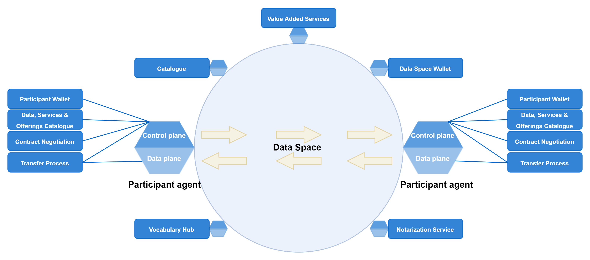

⚠️ <strong>Work in progress — yet to be validated</strong>

📍 <strong>You are here</strong> 
<a href="../README.md">🏠 Home</a> 
    <a href="README.md">Foundations</a> 
        <strong>Connector protocol</strong> 

# Connector (Data Space Protocol)

The Data Space Protocol (DSP) — formerly IDSA — is the agent-to-agent contract negotiation and transfer protocol used by every Simpl-Open participant. The Eclipse Dataspace Connector (EDC) is Simpl-Open's reference implementation of DSP. This page summarises the protocol concepts at a level that lets a reader navigate the [resource-sharing-runtime](../integration/resource-sharing/resource-sharing-runtime/README.md), [data-sharing](../integration/data-sharing/README.md), and [contract-management](../governance/contract-management/README.md) folders without having to reach for the upstream IDSA documentation.

## Source

Extracted verbatim from `Functional-and-Technical-Architecture-Specifications.md`, section **2.5 Connector** (lines 1214–1304 of the source, dated 2026-04-20). Upstream link: [FTA spec §2.5](https://code.europa.eu/simpl/simpl-open/architecture/-/blob/master/functional_and_technical_architecture_specifications/Functional-and-Technical-Architecture-Specifications.md?ref_type=heads#25-connector).

---

###  2.5. Connector

The [IDSA Reference Architecture
Model](https://docs.internationaldataspaces.org/ids-knowledgebase/ids-ram-4/layers-of-the-reference-architecture-model/3-layers-of-the-reference-architecture-model/3-1-business-layer/3_1_1_roles_in_the_ids#basic-roles-in-the-international-data-space)
defines the connector as being the technical core component required for
a participant to join a Data Space.

[DSSC](https://dssc.eu/space/bv15e/766062287/7+Interoperability) defines
the connector as a technical software component that is run by (or on
behalf of) a participant and that provides connectivity with similar
components run by (or on behalf of) other participants, to enable the
secure and trusted sharing of data.

A connector can provide more functionality than what is strictly related
to connectivity. The connector can offer technical modules that
implement data interoperability functions, authentication interfacing
with trust services and authorisation, resource description, contract
negotiation, etc.

DSSC uses “participant agent services” as the broader term to define
these services.

[DSSC](https://dssc.eu/space/BVE/357075035/Functional+Overview+of+Components)
also distinguishes the 2 major components that make up a connector:

-   The **control plane** is responsible for deciding how data is
    managed, routed and processed. For example: the control plane
    handles the identification of users and the handling of access and
    usage policies.

-   The **data plane** handles the actual exchange of data.

This implies that the control plane by its nature can be standardised to
a high-level, while the data plane is likely to be different for each
Data Space (as different types and sorts of data exchange take place in
each Data Space).

The data plane needs to be integrated with the control plane to ensure
that it can work with the necessary control mechanisms.

DSSC identifies the different categories of components within a Data
Space, making a distinction between the (1) participant agent (=
connector in DSSC vocabulary) and (2) shared services:

Within the control plane, several components can be identified:

-   A Participant Wallet: providing participants with the ability to
    store and exchange identities and other attestations. For instance,
    in the form of Verifiable Credentials.

-   A Data, Services & Offerings Catalogue: providing participants with
    the ability to share (on a technical level) the data, services and
    offerings which are provided through the data plane.

-   Components for Contract Negotiation: providing participants with the
    ability to share data access and usage policies with others in the
    Data Space and to enforce these on the data plane. For instance: to
    create an authorisation registry, which - based on policies - can
    determine who gets access to a certain data set or service.

On the data plane there is the actual transfer process. As indicated
before, the data plane is likely to be highly application specific. It
should however work in conjunction with the control plane, e.g. to
ensure that no data sharing can start before certain conditions are met
(identification, contract negotiation, etc.).

Note that components of the connector can have different granularities.
They can be conceived as an integrated component, but they can also
consist of multiple (packaged) components (e.g. with a separated, but
linked, component for Participant Wallet).

Concretely for Simpl-Open, a connector is used to implement the 3 parts
of the IDSA Data Space Protocol :

1.  Publication and request of catalogue items - mapping to Data,
    Services & Offerings Catalogue component of the control plane ;

2.  Contract negotiation - mapping to Contract Negotiation component of
    the control plane;

3.  Data transfer process - mapping to the Data Plane.

The control plane of the connector is also used as orchestrator between
the 3 parts.

The current implementations of connectors do not cover all the needs
envisioned in Simpl-Open and therefore extension points are planned, for
instance, to cover the infrastructure provisioning.

