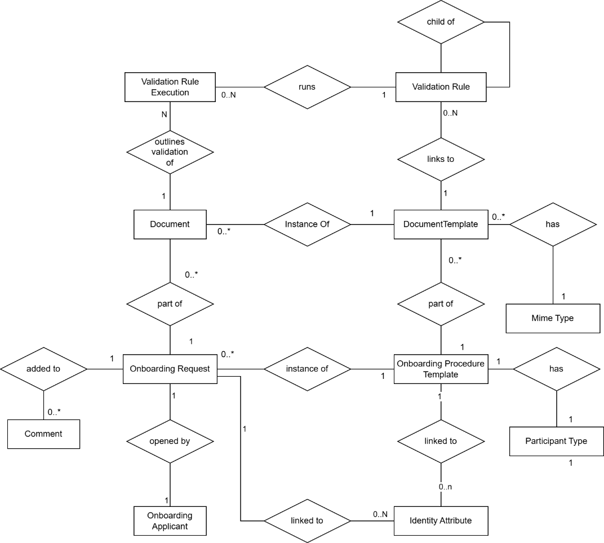
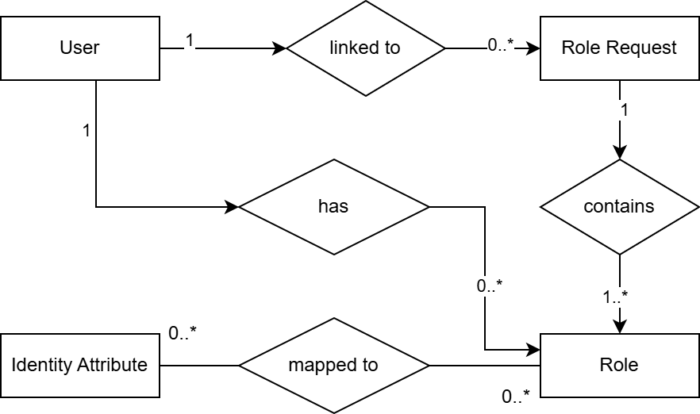
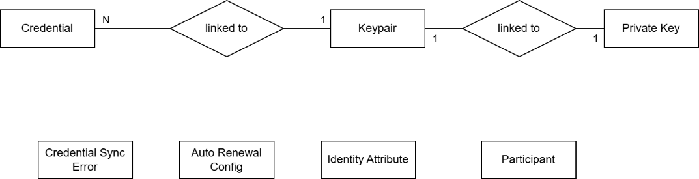
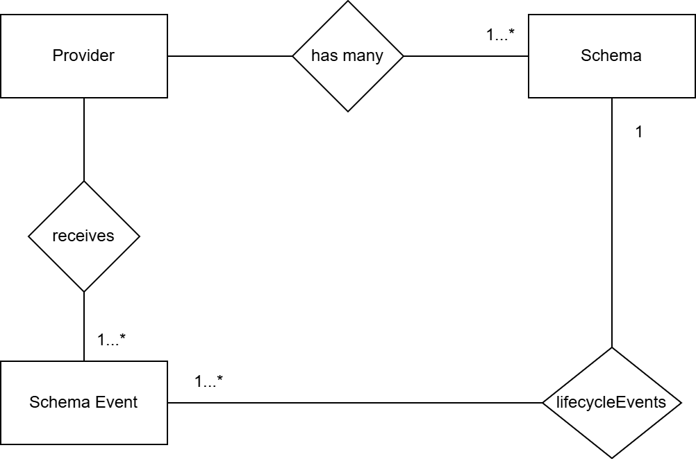

⚠️ <strong>Work in progress — yet to be validated</strong>

📍 <strong>You are here</strong> 
<a href="../../README.md">🏠 Home</a> 
    <a href="../README.md">Foundations</a> 
        <a href="README.md">Data architecture</a> 
            <strong>Conceptual data model</strong> 

# Conceptual data model

> FTA §5.2 intro and §5.2.1 (lines 6578–6856 of the source, dated 2026-04-20). Upstream link: [FTA spec §5.2.1](https://code.europa.eu/simpl/simpl-open/architecture/-/blob/master/functional_and_technical_architecture_specifications/Functional-and-Technical-Architecture-Specifications.md?ref_type=heads#521-conceptual-data-model).

---

###  5.2. Custom Components Data Model

####  5.2.1. Conceptual Data Model

#####  2.19.1. CDM - Domain 1 - Access Control & Trust

Conceptual data model of components from domain 1. Please refer to
Domain 1 Logical Data Model for a complete description of entities and
their fields.

###### CDM - Onboarding

Handles the onboarding of a new participant in the Data Space.

<table>
<thead>
<tr class="header">
<th><strong>Entity</strong></th>
<th><strong>Description</strong></th>
</tr>
</thead>
<tbody>
<tr class="odd">
<td><strong>Participant Type</strong></td>
<td>A type of participant in the dataspace. It can be a consumer, an application provider, a data provider, or an infrastructure provider.</td>
</tr>
<tr class="even">
<td><strong>Onboarding Applicant</strong></td>
<td>An applicant representing an organisation that seeks to join a dataspace.</td>
</tr>
<tr class="odd">
<td><strong>Onboarding Procedure Template</strong></td>
<td>A template that defines, for each participant type, the data that must be provided by an applicant (see User Roles) to complete the onboarding process.</td>
</tr>
<tr class="even">
<td><strong>Document Template</strong></td>
<td>A component of an onboarding procedure template. It defines the document that must be uploaded as part of an onboarding request.</td>
</tr>
<tr class="odd">
<td><strong>MIME Type</strong></td>
<td>The MIME type associated with a document template.</td>
</tr>
<tr class="even">
<td><strong>Onboarding Request</strong></td>
<td>An instance of an onboarding procedure template, created by an applicant. The request can change status based on actions taken by the applicant (e.g. submission) or by governance authority representatives (e.g. rejection, approval, or request for review).</td>
</tr>
<tr class="odd">
<td><strong>Document</strong></td>
<td>An instance of a document linked to an onboarding request, uploaded by an applicant (see User Roles).</td>
</tr>
<tr class="even">
<td><strong>Comment</strong></td>
<td>A comment that can be added to an onboarding request by either an applicant or a governance authority representative (e.g. Notary).</td>
</tr>
<tr class="odd">
<td><strong>Identity Attribute</strong></td>
<td>A Tier 2 identity attribute used within the dataspace.</td>
</tr>
<tr class="even">
<td><strong>Validation Rule</strong></td>
<td>A definition containing the parameters required to validate a document uploaded by an applicant. Validation rules can be combined into hierarchical structures.</td>
</tr>
<tr class="odd">
<td><strong>Validation Rule Execution</strong></td>
<td>A record of the outcome of a validation performed on a document uploaded by an applicant.</td>
</tr>
</tbody>
</table>

###### CDM - Users Roles

Microservice that helps to map tier 1 roles with tier 2 security
attributes.

<table>
<thead>
<tr class="header">
<th><strong>Entity</strong></th>
<th><strong>Description</strong></th>
</tr>
</thead>
<tbody>
<tr class="odd">
<td>Identity Attribute</td>
<td>A Tier 2 identity attribute used within the dataspace. It can be assigned to one or more Tier 1 roles.</td>
</tr>
<tr class="even">
<td>Role</td>
<td>A Tier 1 role assigned to a user within the SIMPL agent. It can have one or more Tier 2 identity attributes assigned.</td>
</tr>
<tr class="odd">
<td>User</td>
<td>A Simpl-Open end-user that uses the agent's functionalities</td>
</tr>
<tr class="even">
<td>Roles Request</td>
<td>Created by an end-user to request specific roles and access the agent's functionalities.</td>
</tr>
</tbody>
</table>

###### CDM - Security Attributes Provider

Microservice that provides Ephemeral Proofs to onboarded Data Space
participants. It's the core of Dynamic Attribute Provisioning. Deployed
only by the Data Space Governance Authority.

<table>
<thead>
<tr class="header">
<th><strong>Entity</strong></th>
<th><strong>Description</strong></th>
</tr>
</thead>
<tbody>
<tr class="odd">
<td>Participant</td>
<td>An onboarded Data Space participant.</td>
</tr>
<tr class="even">
<td>Identity Attribute</td>
<td>A Tier 2 identity attribute used within the dataspace.</td>
</tr>
</tbody>
</table>

###### CDM - Identity Provider

Microservice that handles the credentials for each Data Space
participant. Deployed only by the Data Space Governance Authority.

<table>
<thead>
<tr class="header">
<th><strong>Entity</strong></th>
<th><strong>Description</strong></th>
</tr>
</thead>
<tbody>
<tr class="odd">
<td>Participant</td>
<td>An onboarded Data Space participant, along with the information needed to issue a credentials.</td>
</tr>
<tr class="even">
<td>Credential</td>
<td>A credential (currently x509 Certificate) signed by the Governance Authority and later provided to the participant (see Credential in Authentication Provider component).</td>
</tr>
<tr class="odd">
<td>Auto Renewal Defaults</td>
<td>The default auto-renewal configurations of the dataspace. </td>
</tr>
<tr class="even">
<td>Participant Auto Renewal</td>
<td>The credential auto-renewal configurations of the specific participant. </td>
</tr>
<tr class="odd">
<td>Auto Renewal Errors</td>
<td>Errors that may arise during credential auto renewal of a participant.</td>
</tr>
</tbody>
</table>

###### CDM - Authentication Provider

<table>
<thead>
<tr class="header">
<th><strong>Entity</strong></th>
<th><strong>Description</strong></th>
</tr>
</thead>
<tbody>
<tr class="odd">
<td>KeyPair</td>
<td>A KeyPair (public and private) linked to the participant's credential.</td>
</tr>
<tr class="even">
<td>Credential</td>
<td>A credential issued by the Governance Authority to the participant. The participant uses it to communicate with other participants.</td>
</tr>
<tr class="odd">
<td>Private Key</td>
<td>The private key content related to the keypair.</td>
</tr>
<tr class="even">
<td>Participant </td>
<td>The information of the participant owning the agent.</td>
</tr>
<tr class="odd">
<td>Identity Attribute</td>
<td>A local copy of the dataspace identity attributes.</td>
</tr>
<tr class="even">
<td>Auto Renewal Config</td>
<td>The agent's credential auto-renewal configuration.</td>
</tr>
<tr class="odd">
<td>Credential Sync Error</td>
<td>Execution errors that may happen during credential synchronisation with the Governance Authority.</td>
</tr>
</tbody>
</table>

#####  2.19.2. CDM - Domain 2 - Publish and consume resources

###### CDM - Contract Manager

<table>
<thead>
<tr class="header">
<th><strong>Entity</strong></th>
<th><strong>Description</strong></th>
</tr>
</thead>
<tbody>
<tr class="odd">
<td><strong>Infrastructure Provider</strong></td>
<td>Represents the signed agreement between a provider and a consumer.</td>
</tr>
</tbody>
</table>

###### **CDM - Infrastructure Provider Storage**

Handles the storage and management of deployment scripts by
infrastructure providers for provisioning infrastructure instances and
applications.

**Entity Description**

<table>
<thead>
<tr class="header">
<th><strong>Entity</strong></th>
<th><strong>Description</strong></th>
</tr>
</thead>
<tbody>
<tr class="odd">
<td><strong>Infrastructure Provider</strong></td>
<td>Represents the company that offers infrastructure deployment services.</td>
</tr>
<tr class="even">
<td><strong>Deployment Script</strong></td>
<td>Represents the deployment script uploaded by the provider to enable provisioning of infrastructure instances and applications.</td>
</tr>
<tr class="odd">
<td><strong>Script Trigger</strong></td>
<td>Represents a provisioning request for a deployment script.</td>
</tr>
<tr class="even">
<td><strong>Script Identify</strong></td>
<td>Represents metadata about deployment scripts, including their hash for integrity checks.</td>
</tr>
</tbody>
</table>

###### **CDM - Schema Sync Adapter**

It manages the storage of information related to schemas, including
their versions, associated metadata, and the events related to the
publication and revocation of a schema.

