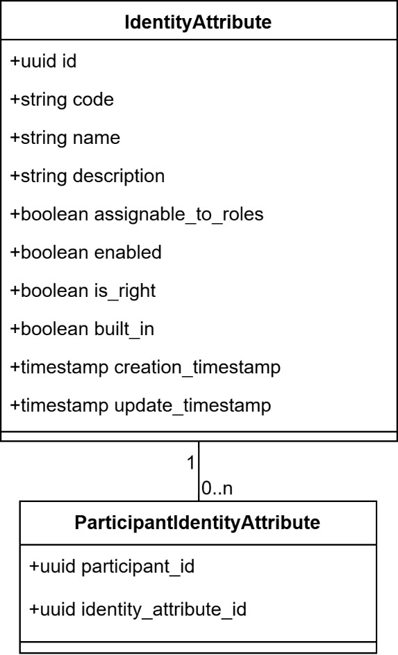
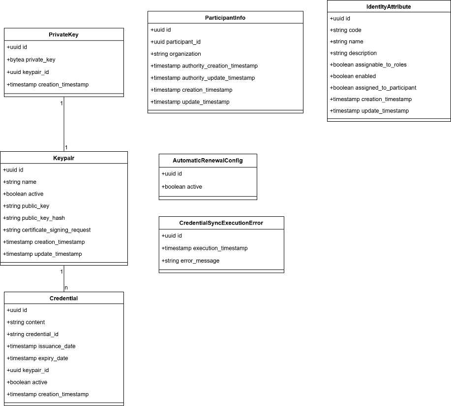
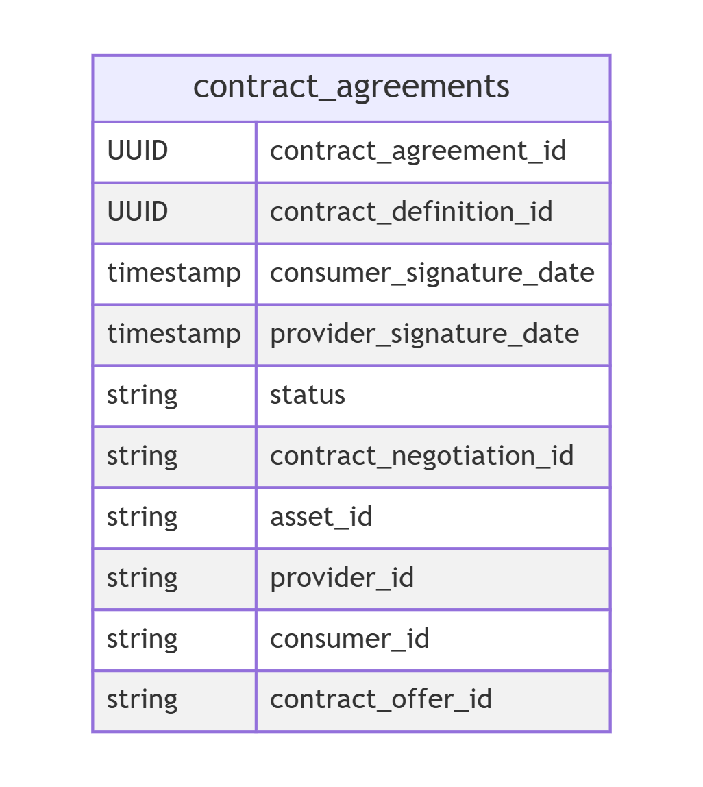
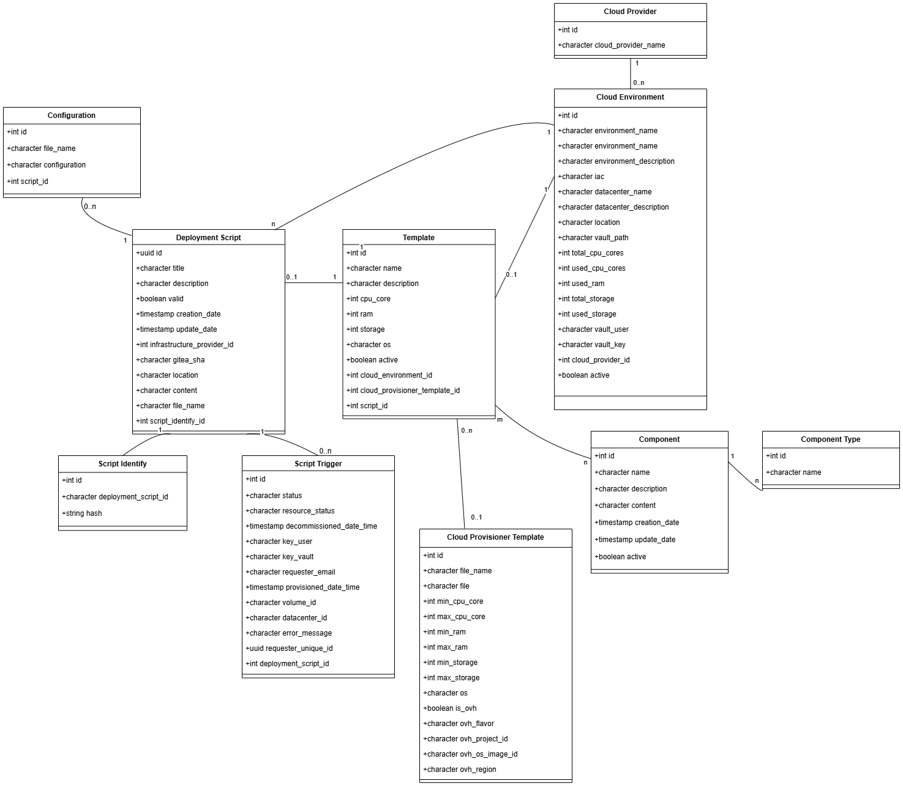
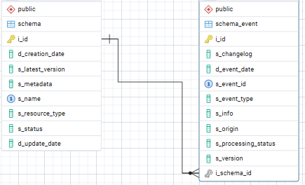

⚠️ <strong>Work in progress — yet to be validated</strong>

📍 <strong>You are here</strong> 
<a href="../../README.md">🏠 Home</a> 
    <a href="../README.md">Foundations</a> 
        <a href="README.md">Data architecture</a> 
            <strong>Logical data model</strong> 

# Logical data model

> FTA §5.2.2 (lines 6857–8039 of the source, dated 2026-04-20). Upstream link: [FTA spec §5.2.2](https://code.europa.eu/simpl/simpl-open/architecture/-/blob/master/functional_and_technical_architecture_specifications/Functional-and-Technical-Architecture-Specifications.md?ref_type=heads#522-logical-data-model).

---

####  5.2.2. Logical Data Model

#####  2.20.1. LDM - Domain 1 - Access Control & Trust

###### LDM - Onboarding

Handles the onboarding of a new participant in the Data Space.

**Entity Descriptions and Attributes**

**MimeType**

-   **Description:** Represent the allowed MIME types for onboarding
    request documents.

-   **Attributes**

    -   **id:** the identifier of the MIME type.

    -   **description**: A human-readable text that describes the MIME
        type (e.g. "pdf", "zip").

    -   **value**: The actual MIME type value following the RFC6838
        (e.g. "application/pdf", "application/zip").

**ParticipantType**

-   **Description:** The participant type is related to an onboarding
    procedure template.

-   **Attributes**

    -   **id:** The identifier of the participant type.

    -   **value**: The code of the participant type.

    -   **label:** A human-readable name for the participant type.

**OnboardingProcedureTemplate**

-   **Description**: The template of an onboarding procedure. Along with
    the document template, it defines the information that has to be
    filled out by the applicant.

-   **Attributes**

    -   **id:** The template identifier

    -   **description:** A brief description of the onboarding procedure
        template (e.g. "The role of this participant in the dataspace is
        ....").

    -   **participant\_type\_id:** The participant type the onboarding
        procedure template refers to. References to **ParticipanType**
        entity.

    -   **expiration\_timeframe**: An expiration timeframe after which
        the onboarding request is considered rejected, expressed in
        seconds.

    -   **expiration\_timeframe\_timeunit**: The time unit for the
        expiration timeframe (HOUR, DAY, YEAR).

    -   **creation\_timestamp**: The creation timestamp.

    -   **update\_timestamp**: The update timestamp.

**OnboardingProcedureTemplateIdentityAttribute**

-   **Description:** The mapping between the onboarding procedure
    template and the dataspace identity attributes.

-   **Attributes:**

    -   **onboarding\_procedure\_template\_id**: the identifier of the
        onboarding procedure template. References to
        **OnboardingProcedureTemplate** entity.

    -   **identity\_attribute\_code**: the code of the identity
        attribute mapped to the onboarding procedure template.

**DocumentTemplate**

-   **Description:** The information related to a document that has to
    be uploaded.

-   **Attributes:**

    -   **id**: The template identifier.

    -   **name:** The short name of the document template.

    -   **description**: A brief description of the requested document
        (e.g. "Business License", "Proof of Identity").

    -   **mandatory**: Specifies if the document template has to be
        provided or is optional. Defaults to true (mandatory).

    -   **mime\_type\_id**: The document mime type. References the
        **MimeType** entity.

**OnboardingApplicant**

-   **Description:** The information regarding the applicant who opens
    an onboarding request.

-   **Attributes:**

    -   **id:** The identifier of the applicant

    -   **username:** The username of the user (same as the one in
        Keycloak).

    -   **firstname:** User's first name.

    -   **lastname:** User's last name.

**OnboardingRequest**

-   **Description:** Onboarding request represents an instance of an
    onboarding request created by an applicant. 

-   **Attributes:**

    -   **id**: the identifier of the onboarding request

    -   **onboarding\_procedure\_template\_id**: The onboarding
        procedure template that the onboarding request refers to.
        References the **OnboardingProcedureTemplate** entity.

    -   **onboarding\_status\_id**: The status of the onboarding
        request. References the Onboarding request status.

    -   **expiration\_timeframe:** An expiration timeframe after which
        the onboarding request is considered rejected. 

    -   **expiration\_timeframe\_timeunit**: The time unit for the
        expiration timeframe (HOUR, DAY, YEAR)

    -   **participant\_type\_id**: The participant type, copied from the
        related onboarding procedure template. References the
        **ParticipantType** entity.

    -   **participant\_id**: The participant's identifier. Populated
        when the onboarding request is approved and the participant is
        created. 

    -   **rejection\_cause**: The text explaining why the request is
        rejected.

    -   **onboarding\_applicant\_id:** The identifier of the applicant
        representative that created the onboarding request. References
        the **OnboardingApplicant** entity.

    -   **organization**: The name of the organisation that opened this
        onboarding request through the applicant representative.

    -   **creation\_timestamp**: The creation timestamp.

    -   **update\_timestamp**: The update timestamp.

**OnboardingRequestIdentityAttribute**

-   **Description:** The mapping between the onboarding request and the
    dataspace identity attributes.

-   **Attributes:**

    -   **onboarding\_request\_id**: The identifier of the onboarding
        request. References the **OnboardingRequest** entity.

    -   **identity\_attribute\_code**: The code of the identity
        attribute mapped to the onboarding procedure template.

**Document**

-   **Description:** The document uploaded by an applicant to complete
    the onboarding request.

-   **Attributes:**

    -   **id:** the identifier of the document.

    -   **description**: A brief description of the requested document
        (e.g. "Business License", "Proof of Identity")

    -   **document\_template\_id**: The document template in the
        onboarding procedure to which this document refers. References
        the **DocumentTemplate** entity. It can be null if the document
        is requested during the onboarding of the applicant participant.

    -   **onboarding\_request\_id**: The identifier of the onboarding
        request. References the **OnboardingRequest** entity.

    -   **mime\_type\_id**: The document type. References the
        **MimeType** entity.

    -   **content**: The actual content of the document uploaded by the
        applicant dataspace participant during the request creation or
        editing. If null, it means that the document has not been
        uploaded yet by the applicant dataspace participant.

    -   **fileSize**: The size of the uploaded file.

    -   **filename**: The name of the uploaded file.

**Comment**

-   **Description:** Comments inserted by the actors involved in the
    onboarding process.

-   **Attributes:**

    -   **id:** The identifier of the comment.

    -   **onboarding\_request\_id**: The identifier of the onboarding
        request to which the comment belongs. References the
        **OnboardingRequest** entity.

    -   **author**: The author of the comment. It's the username stored
        in Keycloak.

    -   **content**: The comment written by the author.

**OnboardingStatus**

-   **Description:** Supporting table containing the status values
    (APPROVED, IN PROGRESS, IN REVIEW, REJECTED, EVALUATING).

-   **Attributes:**

    -   **id:** The id of the status.

    -   **value**: The actual status of an onboarding request.

    -   **label**: A human-readable label for the status.

**EventLog**

-   **Description:** Register Business Events related to an onboarding
    request (Comment Inserted, Onboarding Request Status Change).

-   **Attributes:**

<!-- -->

-   -   **id**: The identifier of the event.

    -   **onboarding\_request\_id**: The identifier of the related
        onboarding request. References the **OnboardingRequest** entity.

    -   **initiator\_user\_id**: The identifier of the user that caused
        the event.

    -   **initiator\_service**: The identifier of the component or
        service that caused the event (e.g. background service
        monitoring stale onboarding request).

    -   **event\_type**:  Type of event (e.g. COMMENT\_INSERTED,
        STATUS\_CHANGED).

    -   **event\_details**:  Additional JSON metadata that contains
        details about the event (e.g. new state).

    -   **entity\_id**:  The id of the entity related to the event (e.g.
        the id of the comment if the event Type is COMMENT\_INSERTED.

    -   **creation\_timestamp**: The creation timestamp of the event.

**ValidationRule**

-   **Description:** Validation rule context used to validate documents
    uploaded by the applicants.

-   **Attributes:**

    -   **id**: The identifier of the validation rule.

    -   **name**: The short name of the validation rule.

    -   **description**: A detailed description of the validation rule.

    -   **document\_template\_id:** The identifier of the document
        template to which the rule applies. References the
        **DocumentTemplate** entity.

    -   **onboarding\_procedure\_template\_id**: The onboarding
        procedure template where the rule has been created. References
        the **OnboardingProcedureTemplate** entity.

    -   **valid\_since**: The date from which the rule becomes valid and
        must be evaluated.

    -   **valid\_to**: The date until which the rule remains valid and
        must be evaluated.

    -   **active:** Boolean parameter indicating if the rule is active.
        An inactive rule is not evaluated.

    -   **type:** the validation rule type (CONTENT\_CHECK, PRESENCE,
        COMPOSITE).

    -   **auto\_approval:** Flag indicating that if the rule passes, the
        related onboarding request is automatically approved.

    -   **required:** Flag indicating that if the rule does not pass,
        the related onboarding request is automatically rejected.

    -   **content\_validation\_rule:** When the type is CONTENT\_CHECK,
        it contains the URL to an external validation service.

    -   **strategy**: The evaluation strategy for a composite rule. ALL
        indicates that all child rules must be valid. AT\_LEAST\_ONE
        indicates that only one rule needs to be valid.

    -   **parent\_id**: The id of the parent COMPOSITE rule, if the rule
        is a child rule. Reference the **ValidationRule** entity.

    -   **creation\_timestamp**: The creation timestamp.

    -   **update\_timestamp**: The update timestamp.

**ValidationRuleExecution**

-   **Description:** The rule execution outcome of a rule evaluated
    against an actual document uploaded by the applicant.

-   **Attributes:**

    -   **id:** The identifier of the execution.

    -   **validation\_rule\_id:** The identifier of the validation rule
        used for this execution. Reference the **VaklidationRule**
        entity.

    -   **document\_id:**  The ID of the document on which the
        validation was performed. References the **Document** entity.

    -   **onboarding\_request\_id:** The onboarding request this
        execution is related to. References the **OnboardingRequest**
        entity.

    -   **execution\_start\_date**: The start date and time of the rule
        execution.

    -   **execution\_end\_date**: The end date and time of the rule
        execution.

    -   **status**: The outcome of the validation (SUCCESS, IN PROGRESS,
        ERROR, FAULT).

    -   **creation\_timestamp**: The creation timestamp.

    -   **update\_timestamp**: The update timestamp.

**ValidationRuleExecution**

-   **Description:** A validation rule remark. Register the result of
    the external validation service when a content check rule fails.

-   **Attributes:**

    -   **id:** The identifier of the remark.

    -   **execution\_id:** The identifier of the validation rule
        execution to which the remark refers. References the
        **ValidationRuleExecution** entity.

    -   **jsonb:** An unstructured field containing the remark.

###### LDM - Users Roles

Microservice that helps to map tier 1 roles with tier 2 security
attributes.

**Entity Descriptions and Attributes**

**IdentityAttributeRole**

-   **Description:** The mapping between the tier 1 role and the
    assignable tier 2 identity attributes.

-   **Attributes:**

    -   **id**: The unique ID of the attribute → role association.

    -   **ida\_code:** The unique identity attribute code.

    -   **role\_name**: The role name mapped to the attribute. The role
        name references a role defined inside the tier1 authentication
        provider.

    -   **enabled**: Flag indicating if the association between the
        identity attribute and the role is valid.

**RoleRequest**

-   **Description:** The role request created by an end-user to request
    a role in the agent.

-   **Attributes**:

    -   **id:** The unique ID of the roles request

    -   **user\_email:** the email of the user who requested the roles

    -   **status:** the status of the request (open, cancelled,
        approved, rejected)

    -   **reviewed\_by:** the id of the user that reviewed the request

    -   **creation\_timestamp**: The creation timestamp.

    -   **update\_timestamp**: The update timestamp.

**RoleRequested**

-   **Description:** A specific role linked to a role request.

-   **Attributes**:

    -   **id:** The unique ID of the requested role request

    -   **role\_request\_id:** the id of the parent role request

    -   **role:** the code of the requested role

    -   **requested\_by:** either the id of the end-user that requested
        the role or the id of the approver that added the role to the
        existing role request

    -   **approved:** if the role has been included when the parent role
        request has been accepted

    -   **requested\_timestamp**: The request timestamp.

**Role**

-   **Description:** An End-User Simpl-Open role

-   **Attributes:**

    -   **id:** The unique ID of the role.

    -   **code:** The role code.

    -   **name:** The role's human-readable name.

    -   **description:** The role's human-readable description.

    -   **builtin:** Boolean indicating if the role built-in (default)
        for Simpl-Open.

    -   **enabled:** Boolean indicating if the role can be assigned to a
        user and can be included in their session after authentication. 

###### LDM - Security Attributes Provider

Microservice that provides Ephemeral Proofs to onboarded Dataspace
Participants. It's the core of the Dynamic Attribute Provisioning
approach. Deployed only by the Data Space Governance Authority.

**Entity Descriptions and Attributes**

**IdentityAttribute**

-   **Description:** The complete list of all the identity attributes of
    the Data Space.

-   **Attributes:**

    -   **id**: The unique ID of the identity attribute.

    -   **code**: The identity attribute unique code. This is the actual
        identifier that is used to enforce authorisation across
        participants.

    -   **name**: The human-readable identity attribute name.

    -   **description**: The description of the identity attribute.

    -   **assignable\_to\_roles**: Flag indicating if the identity
        attribute can be assigned to a role.

    -   **enabled**: True if the identity attribute is enabled for this
        participant.

    -   **is\_right**: Flag indicating if the identity attribute is
        considered a legal right.

    -   **built\_in**: Boolean indicating that the identity attribute is
        built-in (installed with the agent and not modifiable).

    -   **creation\_timestamp**: The creation timestamp.

    -   **update\_timestamp**: The update timestamp.

**ParticipantIdentityAttribute**

-   **Description:** Maps a participant with their identity attribute.

-   **Attributes:**

    -   **participant\_id:** The identifier of the participant
        associated with the entity attribute.

    -   **identity\_attribute\_id**: The identifier of the identity
        attribute. References the **IdentityAttribute** entity.

###### LDM - Identity Provider

Microservice that handles the credentials for each dataspace
participant. Deployed only by the Data Space Governance Authority.

**Entity Descriptions and Attributes**

**Participant**

-   **Description:** Contains the information of the dataspace
    participants.

-   **Attributes:**

<!-- -->

-   -   **id**: The unique ID of the participant.

    -   **organization**: The organisation name of the participant.

    -   **participant\_type**: The type of the participant (CONSUMER,
        DATA PROVIDER, INFRASTRUCTURE PROVIDER, APPLICATION PROVIDER).

    -   **certificate\_signing\_request\_content**: The content of the
        CSR needed to issue a credential to the participant

    -   **tier1\_public\_key\_content**: Contains the tier 1 public key
        (Keycloak public key) used by the participant Keycloak to sign
        user tier1 JWTs.

    -   **active\_credential\_id**: The id of the the participant's
        active credential. References the **Credential** entity.

    -   **applicant\_email**: The email of the applicant responsible for
        the onboarding procedure of the participant

    -   **is\_authority**: Boolean indicating that the participant is
        the Governance Authority of the data space.

    -   **creation\_timestamp**: The creation timestamp.

    -   **update\_timestamp**: The update timestamp.

    -   **renewal\_request\_timestamp**: The timestamp of the renewal
        request issuance by the participant.

**Credential**

-   **Description:** Metadata of the credential stored in the credential
    factory component (EJBCA)

-   **Attributes:**

    -   **id**: The unique ID of the credential 

    -   **participant\_id**: The id of the participant owning the
        credential. References the **Participant** entity.

    -   **credential\_type:** Type of the credential, currently only
        x509 credentials are supported

    -   **certificate\_authority**: The certificate authority name of
        the credential factory component (EJBCA)

    -   **serial:** The serial number of the credential in the
        credential factory component (EJBCA)

    -   **credential\_id:** The id of the credential inside the
        credential factory component (EJBCA)  

    -   **expiry\_date:** the expiration date of the credential/

**AutoRenewalDefault**

-   **Description:** the default auto-renewal configuration for the data
    space.

-   **Attributes:**

    -   **id:** the id of the auto-renewal configuration.

    -   **days\_before\_expiry:** the number of days prior to the
        credential’s expiration at which the auto-renewal process is
        triggered by the scheduled job.

    -   **modified\_by\_user:** indicates if the default installation
        configuration has been overwritten by a user of the Governance
        Authority.

    -   **creation\_timestamp**: The creation timestamp.

    -   **update\_timestamp**: The update timestamp.

**AutoRenewalParticipant**

-   **Description:** auto-renewal configurations that override the
    default ones for the participant

-   **Attributes:**

    -   **participant\_id:** the id of the participant.

    -   **days\_before\_expiry:** the number of days prior to the
        credential’s expiration at which the auto-renewal process for
        the participant is triggered by the scheduled job.

    -   **boolean:** indicates if the auto renewal is enabled for the
        participant.

    -   **creation\_timestamp**: The creation timestamp.

    -   **update\_timestamp**: The update timestamp.

**AutoRenewalError**

-   **Description:** stores the auto-renewal error details link to each
    participant.

-   **Attributes:**

    -   **id:** the id of the logged error.

    -   **participant\_id:** the id of the participant for whom the
        autorenewal has failed.

    -   **description:** the description of the error.

    -   **creation\_timestamp**: The creation timestamp.

###### LDM - Authentication Provider

Microservice that manages the credentials and the tier2 authentication
of a participant

**Entity Descriptions and Attributes**

**KeyPair**

-   **Description:** The keypair created or uploaded by an applicant
    representative to initiate the credential creation after the
    approval of an onboarding request.

-   **Attributes:**

    -   **id**: The unique ID of the participant.

    -   **name:** The name of the KeyPair, inserted by the user upon
        creation.

    -   **active:** Boolean indicating that the keypair is linked to an
        active credential.

    -   **public\_key**: The keypair public key content.

    -   **public\_key\_hash:** The keypair public key hash.

    -   **certificate\_signing\_request:** The content of the CSR,
        needed for requesting the issuance of a new credential linked to
        the keypair

    -   **creation\_timestamp**: The creation timestamp.

    -   **update\_timestamp**: The update timestamp.

**PrivateKey**

-   **Description:** The private key content related to the keypair.

-   **Attributes:**

    -   **id: The ID of the private key.**

    -   **private\_key:** The private key encrypted content.

    -   **keypair\_id:** The keypair linked to this key. References the
        **KeyPair** entity. 

    -   **creation\_timestamp**: The creation timestamp.

**Credential**

-   **Description:** The credential that allows tier2 communication of
    the participant in the dataspace. Can be empty if the configured
    credential storage is Hashicorp Vault.

-   **Attributes:**

    -   **id**: The unique ID of the credential.

    -   **content**: The credential (x509 certificate or foreseen SSI
        Verifiable Credential).

    -   **credential\_id:** The Base58 of the credential content. 

    -   **issuance\_date:** The date and time when the credential was
        issued.

    -   **expiry\_date:** The expiry date and time of the credential.

    -   **keypair\_id:** the keypair linked to this credential.
        References the **KeyPair** entity.

    -   **creation\_timestamp**: The creation timestamp.

**Identity Attribute**

-   **Description:** When used inside a participant agent, it contains a
    local copy of the identity attributes of the data space, in sync
    with the identity attributes provided by the governance authority.

-   **Attributes:**

    -   **id**: The id of the identity attribute

    -   **code**: The unique code identifying the identity attribute

    -   **name:** The human readable identity attribute name.

    -   **description**: The description of the identity attribute

    -   **assignable\_to\_roles**: Boolean indicating if the identity
        attribute is assignable to roles

    -   **enable**: Boolean indicating if the identity attribute is
        enabled or not

    -   **assigned\_to\_participant**: Boolean indicating if the
        identity attribute is currently assigned to the participant.

    -   **creation\_timestamp**: The creation timestamp

    -   **update\_timestamp**: The update timestamp

**ParticipantInfo**

-   **Description:** the details of the participant. Needed to retrieve
    the basic information related to the organization owning the agent.
    Populated only after the onboarding process has completed.

-   **Attributes:**

    -   **id:** the ID of the entry.

    -   **participant\_id:** the ID of the participant owning the
        agent. 

    -   **organization:** the name of the organisation of the
        participant owning the agent.

    -   **authority\_creation\_timestamp:** the creation timestamp of
        the participant inside the governance authority.

    -   **authority\_update\_timestamp:** the update timestamp of the
        participant inside the governance authority.

    -   **creation\_timestamp:** the creation timestamp.

    -   **update\_timestamp:** the update timestamp.

**AutoRenewalConfig**

-   **Description**: stores the auto-renewal config for the agent.

-   **Attributes:**

    -   **id:** the ID of the entry.

    -   **enabled:** indicates if the auto-renewal is enabled for the
        participant agent.

**CredentialSyncExecutionError**

-   **Description:** logs the execution errors that may happen during
    credential syncronization with the Governance Authority.

-   **Attributes:**

    -   **id:** the ID of the entry.

    -   **execution\_timestamp:** the execution timestamp of the
        attempted credential synchronisation.

    -   **error\_message:** the error details.

#####  2.20.2. LDM - Domain 2 - Publish and consume resources

###### LDM - Contract Manager

Contract manager handles the integration between the connector and VC
Issuer component, Signer component, and Wallet component.

In the current release, the Contract Manager stores contract agreement
related data in a single table for two main purposes:

1.  Establish the data persistence for billing purposes (future feature)

2.  Demonstrate contract negotiation status

**contract\_agreements**

-   **contract\_agreement\_id:** UUID of contract agreement issued by
    the Connector

-   **contract\_definition\_id** ID of the contact definition

-   **consumer\_signature\_date:** Date and time of the consumer
    signature event

-   **provider\_signature\_date:** Date and time of the provider
    signature event

-   **status:** Status of contract negotiations

-   **contract\_negotiation\_id:** ID of the contract negotiation

-   **asset\_id:** ID of the asset

-   **provider\_id:** ID of the provider

-   **consumer\_id:** ID of the consumer

-   **contract\_offer\_id:** ID of the contract offer

###### **LDM - Infrastructure Provider Storage**

Handles the logical representation of the infrastructure provider's
deployment scripts and their relationships, ensuring efficient storage,
retrieval, and management.

**Entity Descriptions and Attributes**

**Configuration**

-   **Description**: Represents the companies offering infrastructure
    deployment services.

-   **Attributes**:

    -   id: Unique identifier for the configuration.

    -   file\_name: Configuration name.

    -   configuration: Instruction containing the configuration.

    -   script\_id: The deployment script that is bonded to the
        configuration.

**Deployment Script**

-   **Description**: Stores details about deployment scripts used for
    infrastructure provisioning.

-   **Attributes**:

    -   **id**: Unique identifier for the script.

    -   **title**: Title of the script.

    -   **description**: A short description of the script.

    -   **valid**: Indicates if the script is valid.

    -   **creation\_date**: Date when the script was uploaded.

    -   **update\_date**: Last modification date.

    -   **cloud\_provider\_id**: Links to the Infrastructure Provider
        table.

    -   **gitea\_sha**: Hash of the script in the repository.

    -   **location**: Location in the repository.

    -   **content**: Content of the deployment script.

    -   **file\_name**: Name of the file that was uploaded.

    -   **script\_identify\_id**: Links to the Script Identify table.

**Script Trigger**

-   **Description**: Represents provisioning requests for deployment
    scripts.

-   **Attributes**:

    -   **id**: Unique identifier for the provisioning request.

    -   **status**: Status of the provisioning process (e.g., Received,
        Sent, Running).

    -   **resource\_status**: Status of the provisioned resource (e.g.,
        Provisioning, Activated).

    -   **decommissioned\_date\_time**: Decommissioning timestamp.

    -   **key\_user**: Credential retrieval key part 1.

    -   **key\_vault**: Credential retrieval key part 2.

    -   **requester\_email**: Email address of the requester.

    -   **provisioned\_date\_time**: Provisioned timestamp.

    -   **volume\_id**: Id of the Virtual Machine's storage.

    -   **datacenter\_id**: Id of the Datacenter where the Virtual
        Machine is running.

    -   **error\_message**: Error message related to the
        provisioning/decommissioning process.

    -   **requester\_unique\_id**: Unique identifier for the resource
        request.

    -   **script\_id** : Links to the Deployment Script table.

**Script Identify**

-   **Description**: Stores metadata for deployment scripts, such as
    hashes for integrity verification.

-   **Attributes**:

    -   **id**: Unique identifier for the metadata entry.

    -   **deployment\_script\_id**: Links to the Deployment Script
        table.

    -   **hash**: Hash of the deployment script.

**Template**:

-   **Description**: Stores VM template related data and references.

-   **Attributes**:

    -   **id**: Primary Key, unique identifier for each Template.

    -   **cloud\_environment\_id**: Reference to the Cloud Environment
        where the template will be running.

    -   **cloud\_provisioner\_template\_id**: Reference to the Cloud
        Provider Template file and description of VM limits.

    -   **name**: Template name.

    -   **description**: Template description.

    -   **cpu\_core**: The number of cores of the VM.

    -   **ram**: The amount (mb) of memory to be assign to the VM.

    -   **storage**: The storage (mb) size of the VM.

    -   **os**: Name of the Operative System do be installed.

    -   **active**: Indicates if the template is active (True) or
        inactive (False).

    -   **creation\_date**: Date when template was stored.

    -   **script\_id**: Referenc to the Deployment script created based
        on this template.

**Component**

-   **Description**: Represents a component that can be applied to a VM
    Template.

-   **Attributes**:

    -   **id**: Unique identifier for the component.

    -   **name**: Name of the component

    -   **description:** Description of the component

    -   **content:** Content of the component

    -   **creation\_date**: creation date

    -   **update\_date:** update date

    -   **active:** if the component is active or not

**Component Type**

-   **Description**: Represents a the types of components (VM
    Configuration, Post configuration and Policies)

-   **Attributes**:

    -   **id**: Unique identifier for the component type.

    -   **name**: component type name.

**Cloud Provider**:

-   **Description**: Simple and basic attributes for a cloud provider.

-   **Attributes**:

    -   **id**: Primary Key, unique identifier for each Provider

    -   **cloud\_provider\_name**: Cloud Provider name.

**Cloud Environment**:

-   **Description**: The main characteristics for one of many
    environments a cloud provider provides.

-   **Attributes**:

    -   **id**: Primary Key, unique identifier for each Cloud
        Environment

    -   **cloud\_provider\_id**: Reference to Cloud Provider stored in
        the database (e.g. Ionos, AWS...).

    -   **environment\_name**: Environment name.

    -   **environment\_description**: Environment description.

    -   **iac**: Infrastructure as Code technology to support the
        deployed resources.

    -   **datacenter\_name**: Name of the DataCenter where the resources
        will be provisioned.

    -   **datacenter\_description**: Description of the DataCenter.

    -   **location**: Cloud Environment location identifier (e.g.,
        us-east-1, europe-west3).

    -   **vault\_path:** Vault path where the cloud environment token is
        securely stored.

    -   **total\_cpu\_cores**: The number of total cores available for
        the Cloud Environment

    -   **used\_cpu\_cores**: The number of cores used by the Cloud
        Environment

    -   **total\_ram**: The total amount of memory available for the
        Cloud Environment

    -   **used\_ram**: RAM used by the Cloud Environment

    -   **total\_storage**: The total amount of storage available for
        the Cloud Environment

    -   **used\_storage**: Storage used by the Cloud Environment

    -   **vault\_user**: Vault identity or role with permissions to
        access the cloud environment token.

    -   **vault\_key**: Vault path or key where the cloud environment
        token is securely stored.

    -   **active**: if the Cloud Environment is active or not.

**Cloud Provisioner Template**:

-   **Description**: The provisioner specific data to derive/create
    templates.

-   **Attributes**:

    -   **id**: Primary Key, unique identifier for each Cloud
        Provisioner Template.

    -   **file\_name**: Template file title.

    -   **file**: File content of the Cloud Provider Template
        (Terraform/Crossplane)

    -   **min\_cpu\_core**: Minimum number of cores for the VM

    -   **max\_cpu\_core**: Maximum number of cores for the VM

    -   **min\_ram**: Minimum ram size (Mb) for the VM

    -   **max\_ram**: Maximum ram size (Mb) for the VM

    -   **min\_storage**: Minimum storage size (Gb) for the VM

    -   **max\_storage**: Maximum storage size (Gb) for the VM

    -   **os**: (List of) OS's allowed for the creation of VMs

    -   **is\_ovh**: Flag to identify OVH templates

    -   **ovh\_flavor**: Ovh flavor for the VM

    -   **ovh\_project\_id**: Ovh project id related to the environment
        of the vm

    -   **ovh\_os\_image\_id**: Ovh os image id for the VM

    -   **ovh\_region**: Ovh region where the VM will be running

###### **LDM - Sync Schema Adapter**

Handles the logical representation of schema and update events

**Entity Descriptions and Attributes**

**Schema**

-   **Description**: Stores details about schema info and publication
    status

-   **Attributes**:

    -   **id**: Unique identifier for the schema.

    -   **creation\_date**: Creation date of schema

    -   **latest\_version**: Latest version available for the schema

    -   **metadata**: Metadata info for the schema

    -   **name**: Name of the schema as created on Schema Management
        Service GA side

    -   **resource\_type**: Last modification date.

    -   **status**: Publication status of schema

    -   **update\_date**: Last update date of specific schema

**Schema Event**

-   **Description**: Stores details about notification events related to
    publication and revoking of schema, produced by Schema Management
    Service

-   **Attributes**:

    -   **id**: Unique identifier for the schema.

    -   **changelog**: Changelog info associated to event

    -   **event\_date**: Date the event occurred

    -   **event\_id**: Event id generated by schema management service 

    -   **event\_type**: Event type (PUBLISH | REVOKE)

    -   **info**: Last modification date.

    -   **origin**: System originating event

    -   **processing\_status**: Processing status of event

    -   **version**: Schema version event refers to

