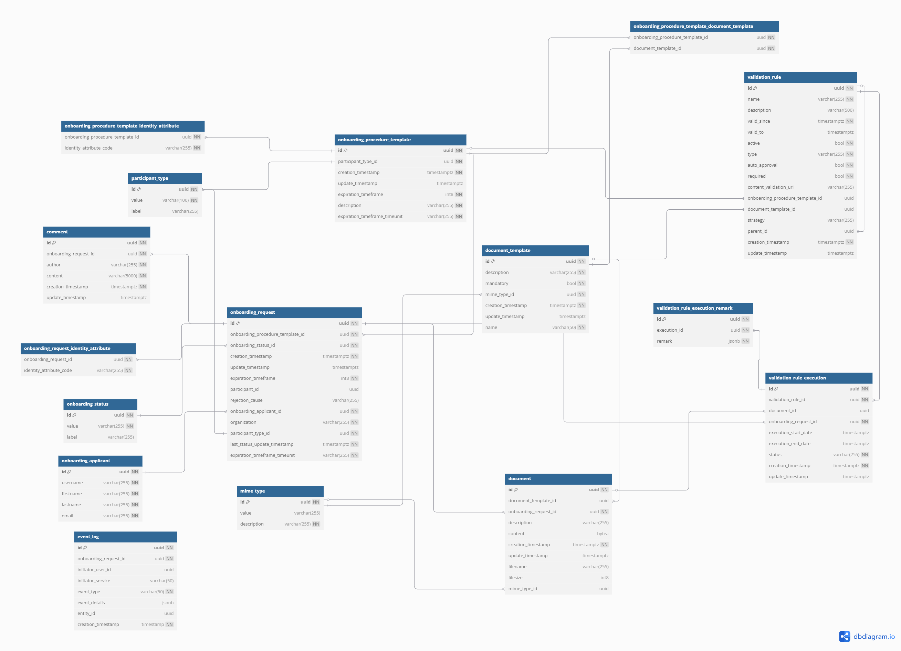
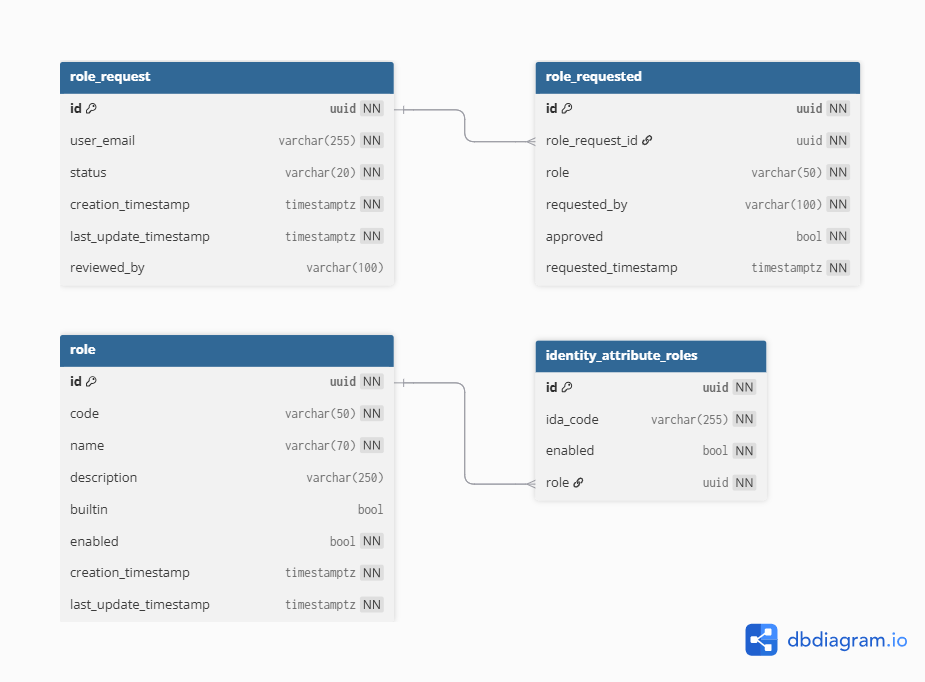
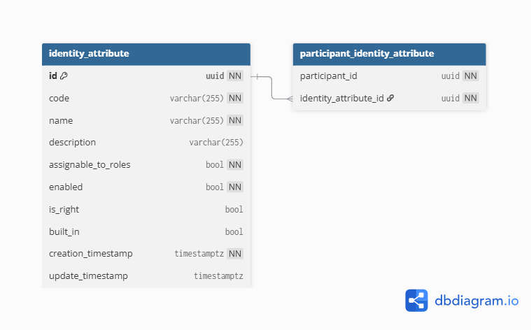
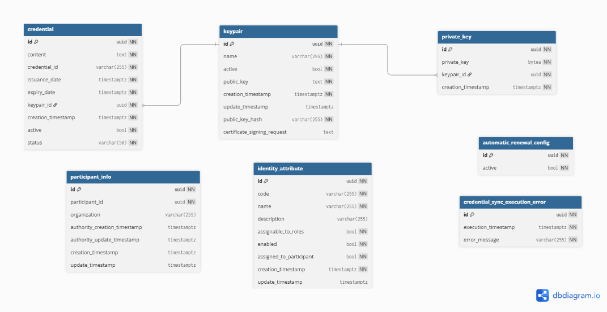
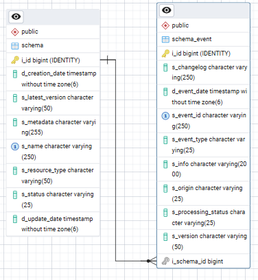

⚠️ <strong>Work in progress — yet to be validated</strong>

📍 <strong>You are here</strong> 
<a href="../../README.md">🏠 Home</a> 
    <a href="../README.md">Foundations</a> 
        <a href="README.md">Data architecture</a> 
            <strong>Physical data model</strong> 

# Physical data model

> FTA §5.2.3 (lines 8040–9013 of the source, dated 2026-04-20). Upstream link: [FTA spec §5.2.3](https://code.europa.eu/simpl/simpl-open/architecture/-/blob/master/functional_and_technical_architecture_specifications/Functional-and-Technical-Architecture-Specifications.md?ref_type=heads#523-physical-data-model).

---

####  5.2.3. Physical Data Model

Attributes labelled with "NN" are Not Null.

#####  2.21.1. PDM - Domain 1 - Access Control & Trust

Contains the export of the physical data model of IAA Microservice.
Please refer to the LDM - Domain 1 - Access Control & Trust for a
description of entities and fields.

###### PDM - Onboarding

Postgres physical data model of the Onboarding service. It handles the
onboarding of a new participant in the Data Space.

**mime\_type**

-   **id**: The identifier of the MIME type.

-   **value**: A human-readable text that describes the MIME type (e.g.
    "pdf", "zip").

-   **name**: The actual MIME type value following the RFC6838 (e.g.
    "application/pdf", "application/zip").

**participant\_type**

-   **id**: The identifier of the participant type.

-   **value**: The code of the participant type.

-   **label**: A human-readable name for the participant type.

**onboarding\_procedure\_template**

-   **id**: The template identifier.

-   **description**: A brief description of the onboarding procedure
    template (e.g. "The role of this participant in the dataspace is
    ....").

-   **participant\_type\_id**: The participant type the onboarding
    procedure template refers to. Foreign key to the participant\_type
    table.

-   **expiration\_timeframe**: An expiration timeframe after which the
    onboarding request is considered rejected, expressed in seconds.

-   **expiration\_timeframe\_timeunit**: The time unit for the
    expiration timeframe (HOUR, DAY, YEAR).

-   **creation\_timestamp**: The creation timestamp.

-   **update\_timestamp**: The update timestamp.

**onboarding\_procedure\_template\_identity\_attribute**

-   **onboarding\_procedure\_template\_id**: The identifier of the
    onboarding procedure template. Foreign key to the
    onboarding\_procedure\_template table.

-   **identity\_attribute\_code**: The code of the identity attribute
    mapped to the onboarding procedure template.

**document\_template**

-   **id**: The template identifier.

-   **name**: The short name of the document template.

-   **description**: A brief description of the requested document (e.g.
    "Business License", "Proof of Identity").

-   **mandatory**: Specifies if the document template has to be provided
    or is optional. Defaults to true.

-   **mime\_type\_id**: The document MIME type. Foreign key to the
    mime\_type table.

**onboarding\_applicant**

-   **id**: The identifier of the applicant.

-   **username**: The username of the user (same as the one in
    Keycloak).

-   **firstname**: User's first name.

-   **lastname**: User's last name.

**onboarding\_request**

-   **id**: The identifier of the onboarding request.

-   **onboarding\_procedure\_template\_id**: The onboarding procedure
    template that the onboarding request refers to. Foreign key to the
    onboarding\_procedure\_template table.

-   **onboarding\_status\_id**: The status of the onboarding request.
    Foreign key to the onboarding request status.

-   **expiration\_timeframe**: An expiration timeframe after which the
    onboarding request is considered rejected.

-   **expiration\_timeframe\_timeunit**: The time unit for the
    expiration timeframe (HOUR, DAY, YEAR).

-   **participant\_type\_id**: The participant type, copied from the
    related onboarding procedure template. Foreign key to the
    participant\_type entity.

-   **participant\_id**: The participant's identifier. Populated when
    the onboarding request is approved and the participant is created.

-   **rejection\_cause**: The text explaining why the request is
    rejected.

-   **onboarding\_applicant\_id**: The identifier of the applicant
    representative that created the onboarding request. Foreign key to
    the onboarding\_applicant entity.

-   **organization**: The name of the organisation that opened this
    onboarding request through the applicant representative.

-   **creation\_timestamp**: The creation timestamp.

-   **update\_timestamp**: The update timestamp.

**onboarding\_request\_identity\_attribute**

-   **onboarding\_request\_id**: The identifier of the onboarding
    request. Foreign key with the onboarding\_request table.

-   **identity\_attribute\_code**: The code of the identity attribute
    mapped to the onboarding procedure template.

**document**

-   **id**: The identifier of the document.

-   **description**: A brief description of the requested document (e.g.
    "Business License", "Proof of Identity").

-   **document\_template\_id**: The document template in the onboarding
    procedure to which this document refers. Foreign key to the
    document\_template table. Can be null if the document is requested
    during onboarding of the applicant participant.

-   **onboarding\_request\_id**: The identifier of the onboarding
    request. Foreign key to the onboarding\_request entity.

-   **mime\_type\_id**: The document type. Foreign key to the mime\_type
    table.

-   **content**: The actual content of the document uploaded by the
    applicant dataspace participant during the request creation or
    editing. Null if not uploaded yet.

-   **fileSize**: The size of the uploaded file.

-   **filename**: The name of the uploaded file.

**comment**

-   **id**: The identifier of the comment.

-   **onboarding\_request\_id**: The identifier of the onboarding
    request to which the comment belongs. Foreign key to the
    onboarding\_request table.

-   **author**: The author of the comment. It’s the username stored in
    Keycloak.

-   **content**: The comment written by the author.

**onboarding\_status**

-   **id**: The id of the status.

-   **value**: The actual status of an onboarding request.

-   **label**: A human-readable label for the status.

**event\_log**

-   **id**: The identifier of the event.

-   **onboarding\_request\_id**: The identifier of the related
    onboarding request. Foreign key to the onboarding\_request table.

-   **initiator\_user\_id**: The identifier of the user that caused the
    event.

-   **initiator\_service**: The identifier of the component or service
    that caused the event (e.g. background service monitoring stale
    requests).

-   **event\_type**: Type of event (e.g. COMMENT\_INSERTED,
    STATUS\_CHANGED).

-   **event\_details**: Additional JSON metadata that contains details
    about the event (e.g. new state).

-   **entity\_id**: The id of the entity related to the event (e.g. the
    id of the comment if event\_type is COMMENT\_INSERTED).

-   **creation\_timestamp**: The creation timestamp of the event.

**validation\_rule**

-   **id**: The identifier of the validation rule.

-   **name**: The short name of the validation rule.

-   **description**: A detailed description of the validation rule.

-   **document\_template\_id**: The identifier of the document template
    to which the rule applies. Foreign key to the document\_template
    table.

-   **onboarding\_procedure\_template\_id**: The onboarding procedure
    template where the rule has been created. Foreign key to the
    onboarding\_procedure\_template table.

-   **valid\_since**: The date from which the rule becomes valid and
    must be evaluated.

-   **valid\_to**: The date until which the rule remains valid and must
    be evaluated.

-   **active**: Boolean parameter indicating if the rule is active. An
    inactive rule is not evaluated.

-   **type**: The validation rule type (CONTENT\_CHECK, PRESENCE,
    COMPOSITE).

-   **auto\_approval**: Flag indicating that if the rule passes, the
    related onboarding request is automatically approved.

-   **required**: Flag indicating that if the rule does not pass, the
    related onboarding request is automatically rejected.

-   **content\_validation\_rule**: When the type is CONTENT\_CHECK,
    contains the URL to an external validation service.

-   **strategy**: The evaluation strategy for a composite rule. ALL
    means all child rules must be valid; AT\_LEAST\_ONE means only one
    rule must be valid.

-   **parent\_id**: The id of the parent COMPOSITE rule if the rule is a
    child rule. Foreign key to the validation\_rule table.

-   **creation\_timestamp**: The creation timestamp.

-   **update\_timestamp**: The update timestamp.

**validation\_rule\_execution**

-   **id**: The identifier of the execution.

-   **validation\_rule\_id**: The identifier of the validation rule used
    for this execution. Foreign key to the validation\_rule table.

-   **document\_id**: The ID of the document on which the validation was
    performed. Foreign key to the document table.

-   **onboarding\_request\_id**: The onboarding request this execution
    is related to. Foreign key to the onboarding\_request table.

-   **execution\_start\_date**: The start date and time of the rule
    execution.

-   **execution\_end\_date**: The end date and time of the rule
    execution.

-   **status**: The outcome of the validation (SUCCESS, IN PROGRESS,
    ERROR, FAULT).

-   **creation\_timestamp**: The creation timestamp.

-   **update\_timestamp**: The update timestamp.

**validation\_rule\_execution\_remark**

-   **id**: The identifier of the remark.

-   **execution\_id**: The identifier of the validation rule execution
    to which the remark refers. Foreign key to the
    validation\_rule\_execution table.

-   **jsonb**: An unstructured field containing the remark in JSONB
    format.

###### PDM - Users Roles

Postgres physical data model of the User Roles Microservice. It helps to
map tier 1 roles with tier 2 security attributes.

**identity\_attribute\_roles**

-   **id**: The unique ID of the attribute to role association.

-   **ida\_code**: The unique identity attribute code.

-   **role\_name**: The role name mapped to the attribute. The role name
    references a role defined inside the tier1 authentication provider.

-   **enabled**: Flag indicating if the association between the identity
    attribute and the role is valid.

**role\_request**

-   **id:** The unique ID of the roles request.

-   **user\_email:** the email of the user who requested the roles.

-   **status:** the status of the request (open, cancelled, approved,
    rejected).

-   **reviewed\_by:** the id of the user that reviewed the request.

-   **creation\_timestamp**: The creation timestamp.

-   **update\_timestamp**: The update timestamp.

**role\_requested**

-   **id:** The unique ID of the requested role request

-   **role\_request\_id:** the id of the parent role request. Foreign
    key to role\_request table.

-   **role:** the code of the requested role.

-   **requested\_by:** either the id of the end-user that requested the
    role or the id of the approver that added the role to the existing
    role request.

-   **approved:** if the role has been included when the parent role
    request has been accepted.

-   **requested\_timestamp**: The request timestamp.

**role**

-   **id:** The unique ID of the role.

-   **code:** The role code.

-   **name:** The role's human-readable name.

-   **description:** The role's human-readable description.

-   **builtin:** Boolean indicating if the role builtin (default) for
    Simpl-Open.

-   **enabled:** Boolean indicating if the role can be assigned to a
    user and can be included in their session after authentication. 

-   **creation\_timestamp**: The creation timestamp.

-   **update\_timestamp**: The update timestamp.

###### PDM - Security Attributes Provider

Postgres physical data model for the Security Attributes Microservice.
It contains the association between participants and identity
attributes. Being the core of the Dynamic Attribute Provisioning
approach, it is queried by the identity provider to build the Ephemeral
Proofs to onboarded Dataspace Participants. Deployed only by the Data
Space Governance Authority.

**identity\_attribute**

-   **id**: The unique ID of the identity attribute.

-   **code**: The unique identity attribute code.

-   **name**: The human-readable identity attribute name.

-   **description**: Flag indicating if the association between the
    identity attribute and the role is valid.

-   **assignable\_to\_role**: Flag indicating if the identity attribute
    can be assigned to a role.

-   **enabled**: Flag indicating if the identity attribute is enabled
    for the dataspace.

-   **is\_right**: Flag indicating if the identity attribute is
    considered a legal right (currently not used).

-   **built\_in:** Flag indicating that the identity attribute is
    built-in (installed with the agent and not modifiable).

-   **creation\_timestamp**: The creation timestamp.

-   **update\_timestamp**: The update timestamp.

**participant\_identity\_attribute**

-   **participant\_id**: The ID of the participant (owned by the
    identity provider component).

-   **identity\_attribute\_id**: The ID of the participant associated
    with the entity attribute. Foreign key to identity\_attribute table.

###### PDM - Identity Provider

Postgres physical data model for the Identity Provider Microservice. It
contains the participant information, the participant's Certificate
Signing Request(CSR) and the participant's tier1 public key. Deployed
only by the Data Space Governance Authority.

**participant**

-   **id**: The unique ID of the participant.

-   **participant\_type**: The type of the participant.

-   **organization**: The organisation name of the participant.

-   **certificate\_signing\_request\_content**: The content of the CSR
    needed to issue a credential to the participant

-   **tier1\_public\_key\_content**: Contains the tier 1 public key
    (Keycloak public key) used by the participant Keycloak to sign user
    tier1 JWTs.

-   **active\_credential\_id**: The id of the participant's active
    credential. Foreign key to the **credential** table.

-   **is\_authority**: Boolean indicating that the participant is the
    Governance Authority of the data space.

-   **renewal\_request\_timestamp**: The timestamp of the renewal
    request issuance by the participant.

-   **applicant\_email**: The email of the applicant responsible for the
    onboarding procedure of the participant.

-   **creation\_timestamp**: The creation timestamp.

-   **update\_timestamp**: The update timestamp.

**credential**

-   **id**: The id of the credential 

-   **participant\_id**: The id of the participant owning the
    credential. Foreign key to the **participant** table.

-   **credential\_type:** Type of the credential, currently only x509
    credentials are supported

-   **certificate\_authority**: The certificate authority name of
    the credential factory component (EJBCA)

-   **serial:** The serial number of the credential in the credential
    factory component (EJBCA)

-   **credential\_id:** The id of the credential inside the credential
    factory component (EJBCA)  

-   **creation\_timestamp**: The creation timestamp.

-   **update\_timestamp**: The update timestamp.

**auto\_renewal\_default**

-   **id:** the id of the auto-renewal configuration.

-   **days\_before\_expiry:** the number of days prior to the
    credential’s expiration at which the auto-renewal process is
    triggered by the scheduled job.

-   **modified\_by\_user:** indicates if the default installation
    configuration has been overwritten by a user of the Governance
    Authority.

-   **creation\_timestamp**: The creation timestamp.

-   **update\_timestamp**: The update timestamp.

**auto\_renewal\_participant**

-   **participant\_id:** the id of the participant. Foreign key to the
    **participant** table.

-   **days\_before\_expiry:** the number of days prior to the
    credential’s expiration at which the auto-renewal process for the
    participant is triggered by the scheduled job.

-   **boolean:** indicates if the auto renewal is enabled for the
    participant.

-   **creation\_timestamp**: The creation timestamp.

-   **update\_timestamp**: The update timestamp.

**auto\_renewal\_error**

-   **d:** the id of the logged error.

-   **participant\_id:** the id of the participant for whom the
    autorenewal has failed.

-   **description:** the description of the error.

-   **creation\_timestamp**: The creation timestamp.

###### PDM - Authentication Provider

Postgres physical data model for the authentication provider
microservice. It contains the keypair and the credentials that the
participant uses to communicate with other participants. It also
contains a local copy of the dataspace identity attributes.

**keypair**

-   **id**: The unique ID of the participant.

-   **name:** The name of the KeyPair, inserted by the user upon
    creation.

-   **active:** Boolean indicating that the keypair is linked to an
    active credential.

-   **public\_key**: The keypair public key content.

-   **public\_key\_hash:** The keypair public key hash.

-   **certificate\_signing\_request:** The content of the CSR, needed
    for requesting the issuance of a new credential linked to the
    keypair

**private\_key**

-   **id:** The ID of the private key.

-   **private\_key:** The private key encrypted content.

-   **keypair\_id:** The keypair linked to this key. Foreign key to the
    **keypair** table. 

**credential**

-   **id**: The unique ID of the credential.

-   **content**: The credential (x509 certificate or foreseen SSI
    Verifiable Credential).

-   **issuance\_date:** The date and time when the credential was
    issued.

-   **expiry\_date:** The expiry date and time of the credential.

-   **keypair\_id:** the keypair linked to this credential. Foreign key
    to the **keypair** table.

**identity\_attribute**

-   **id**: The id of the identity attribute

-   **code**: The unique code identifying the identity attribute

-   **description**: The description of the identity attribute

-   **assignable\_to\_roles**: Boolean indicating if the identity
    attribute is assignable to roles

-   **enable**: Boolean indicating if the identity attribute is enabled
    or not

-   **assigned\_to\_participant**: Boolean indicating if the identity
    attribute is currently assigned to the participant.

-   **creation\_timestamp**: The creation timestamp

-   **update\_timestamp**: The update timestamp

**participant\_info**

-   **id: the ID of the entry**

-   **participant\_id:** the ID of the participant owning the agent. 

-   **organization:** the name of the organization of the participant
    owning the agent

-   **authority\_creation\_timestamp:** the creation timestamp of the
    participant inside the governance authority

-   **authority\_update\_timestamp:** the update timestamp of the
    participant inside the governance authority

-   **creation\_timestamp:** the creation timestamp

-   **update\_timestamp:** the update timestamp

**automatic\_renewal\_config**

-   **id:** the ID of the entry

-   **active:** indicates if the auto-renewal is enabled for the
    participant agent.

**credential\_sync\_execution\_error**

-   **id:** the ID of the entry

-   **execution\_timestamp:** the execution timestamp of the attempted
    credential synchronisation.

-   **error\_message:** the error details.

#####  2.21.2. PDM - Domain 2 - Publish and consume resources

###### PDM - Contract Manager

**DBML**

Table contract\_agreements {

contract\_agreement\_id UUID \[primary key\]

contract\_definition\_id uuid

consumer\_signature\_date timestamptz

provider\_signature\_date timestamptz

status text

contract\_negotiation\_id text

asset\_id text

provider\_id text

consumer\_id text

}

###### **PDM - Infrastructure Provider Storage**

**Infrastructure Provider - PDM**

Table infrastructure\_provider {

  id BIGINT \[pk\]

  name VARCHAR(255)

}

Table deployment\_script {

  id BIGINT \[pk, increment\]

  valid BOOLEAN

  creation\_date DATE

  description VARCHAR(255)

  file OID

  gitea\_sha VARCHAR(255)

  location VARCHAR(255)

  original\_file\_name VARCHAR(255)

  title VARCHAR(100)

  update\_date DATE

  cloud\_provider\_id BIGINT \[ref: &gt; infrastructure\_provider.id\]

  script\_identify\_id BIGINT \[ref: &gt; script\_identify.id, unique\]

}

Table script\_trigger {

  id BIGINT \[pk, increment\]

  decommissioned\_date\_time TIMESTAMP

  provisioned\_date\_time TIMESTAMP

  key\_user VARCHAR(255)

  key\_vault VARCHAR(255)

  requester\_email VARCHAR(255)

  requester\_unique\_id VARCHAR(255)

  resource\_status VARCHAR(255)

  status VARCHAR(255)

  script\_id BIGINT \[ref: &gt; deployment\_script.id\]

  volume\_id VARCHAR(255)

  datacenter\_id VARCHAR(255)

  error\_message TEXT

}

Table script\_identify {

  id BIGINT \[pk\]

  deployment\_script\_id VARCHAR(50) \[unique\]

  hash VARCHAR(255)

}

Table config\_file {

  id BIGINT \[pk, increment\]

  file\_name VARCHAR(255)

  file TEXT

  script\_id BIGINT \[ref: &gt; deployment\_script.id\]

}

Table template (

id bigserial,

cloud\_environment\_id bigint \[ref: &gt; cloud\_environment.id\],

cloud\_provisioner\_template\_id bigint \[ref: &gt;
cloud\_provisioner\_template.id\],

name varchar(100),

description text,

cpu\_core integer,

ram integer,

storage integer,

os varchar(50),

active boolean,

creation\_date date,

script\_id bigint \[ref: &gt; script.id\]

)

Table template (

id bigserial,

cloud\_environment\_id bigint \[ref: &gt; cloud\_environment.id\],

cloud\_provisioner\_template\_id bigint \[ref: &gt;
cloud\_provisioner\_template.id\],

name varchar(100),

description text,

cpu\_core integer,

ram integer,

storage integer,

os varchar(50),

active boolean,

creation\_date date,

script\_id bigint \[ref: &gt; script.id\]

)

Table cloud\_environment

(

id bigserial,

cloud\_provider\_id bigint \[ref: &gt; cloud\_provider.id\],

environment\_name varchar(100) ,

environment\_description text,

iac varchar(50),

datacenter\_name varchar(100),

datacenter\_description text,

location varchar(100),

vault\_path varchar(255),

total\_cpu\_cores integer,

used\_cpu\_cores integer,

total\_raminteger,

used\_ram integer,

total\_storage integer,

used\_storage integer,

vault\_user varchar(255),

vault\_keyvarchar(255)

)

Table cloud\_provider

(

id bigint,

cloud\_provider\_name varchar(255)

)

Table cloud\_provisioner\_template

(

id bigserial,

file\_name varchar(100),

file text,

min\_cpu\_core integer,

max\_cpu\_core integer,

min\_ram integer,

max\_ram integer,

min\_storage integer,

max\_storage integer,

os text\[\],

cloud\_provisioner\_template\_uuid varchar(50),

is\_ovh boolean,

ovh\_flavor varchar(255),

ovh\_project\_id varchar(255),

ovh\_os\_image\_id varchar(255),

ovh\_region varchar(255),

)

###### **PDM - Sync Schema Adapter**

**DBML**

CREATE TABLE IF NOT EXISTS public.schema

(

i\_id bigint NOT NULL GENERATED ALWAYS AS IDENTITY ( INCREMENT 1 START 1
MINVALUE 1 MAXVALUE 9223372036854775807 CACHE 1 ),

d\_creation\_date timestamp(6) without time zone NOT NULL,

s\_latest\_version character varying(50) COLLATE pg\_catalog."default"
NOT NULL,

s\_metadata character varying(255) COLLATE pg\_catalog."default" NOT
NULL,

s\_name character varying(250) COLLATE pg\_catalog."default" NOT NULL,

s\_resource\_type character varying(50) COLLATE pg\_catalog."default"
NOT NULL,

s\_status character varying(25) COLLATE pg\_catalog."default" NOT NULL,

d\_update\_date timestamp(6) without time zone,

CONSTRAINT schema\_pkey PRIMARY KEY (i\_id),

CONSTRAINT schema\_un1 UNIQUE (s\_name)

)

CREATE TABLE IF NOT EXISTS public.schema\_event

(

i\_id bigint NOT NULL GENERATED ALWAYS AS IDENTITY ( INCREMENT 1 START 1
MINVALUE 1 MAXVALUE 9223372036854775807 CACHE 1 ),

s\_changelog character varying(250) COLLATE pg\_catalog."default",

d\_event\_date timestamp(6) without time zone NOT NULL,

s\_event\_id character varying(250) COLLATE pg\_catalog."default" NOT
NULL,

s\_event\_type character varying(25) COLLATE pg\_catalog."default" NOT
NULL,

s\_info character varying(2000) COLLATE pg\_catalog."default",

s\_origin character varying(25) COLLATE pg\_catalog."default" NOT NULL,

s\_processing\_status character varying(25) COLLATE
pg\_catalog."default" NOT NULL,

s\_version character varying(50) COLLATE pg\_catalog."default",

i\_schema\_id bigint NOT NULL,

CONSTRAINT schema\_event\_pkey PRIMARY KEY (i\_id),

CONSTRAINT schema\_name\_un1 UNIQUE (s\_event\_id),

CONSTRAINT fklpbr0w32che4eibn92v5c464 FOREIGN KEY (i\_schema\_id)

REFERENCES public.schema (i\_id) MATCH SIMPLE

ON UPDATE NO ACTION

ON DELETE CASCADE

)

