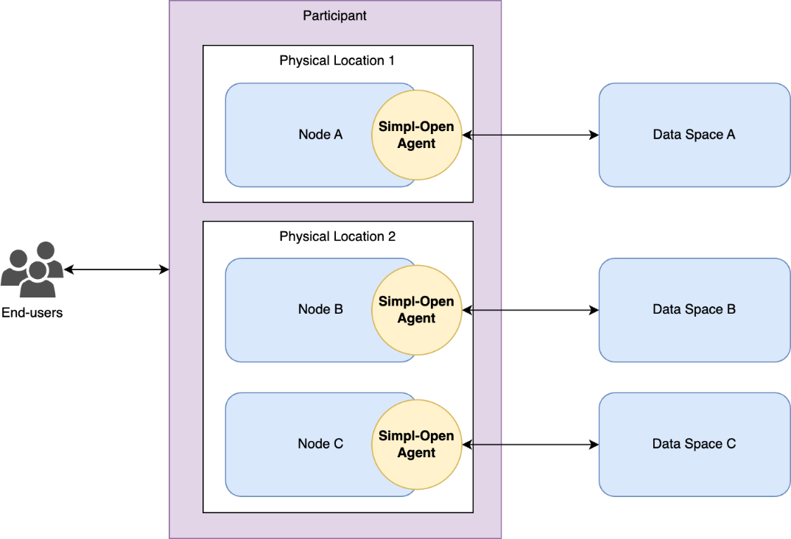
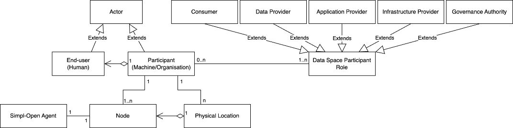
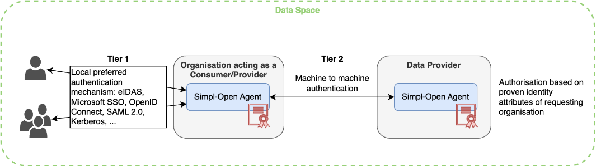
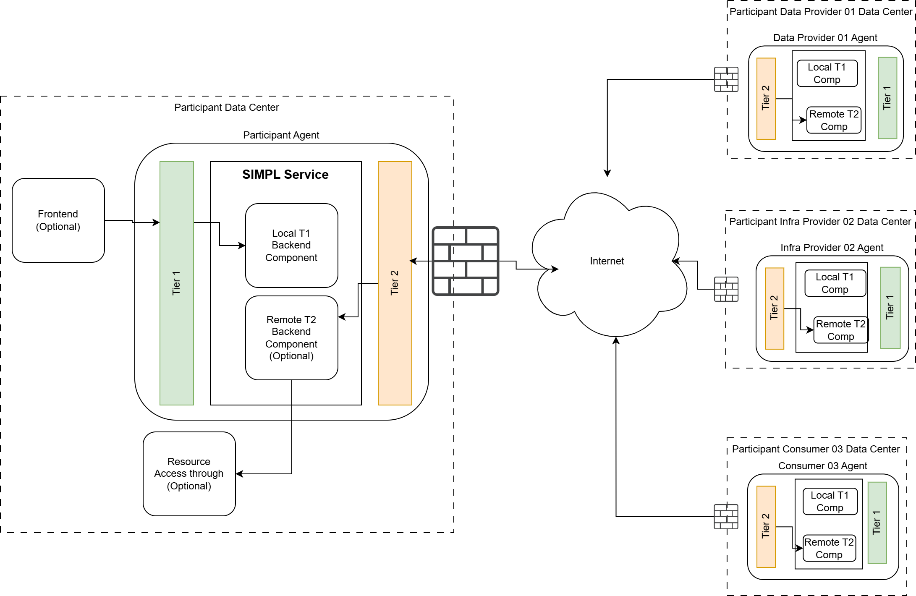
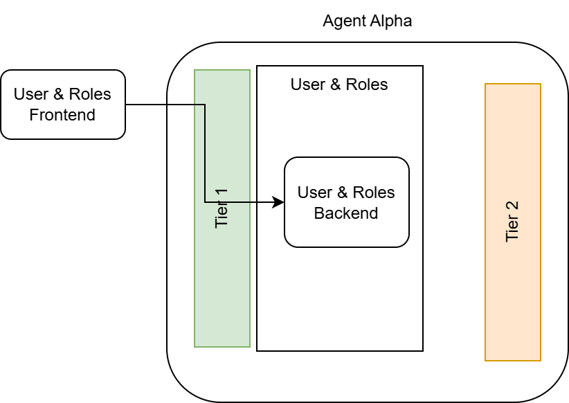
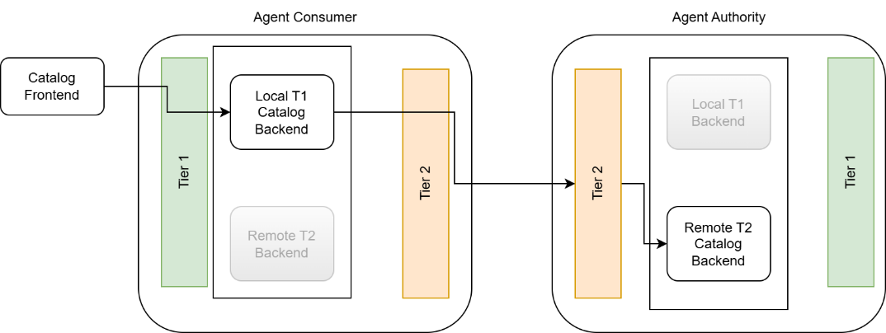
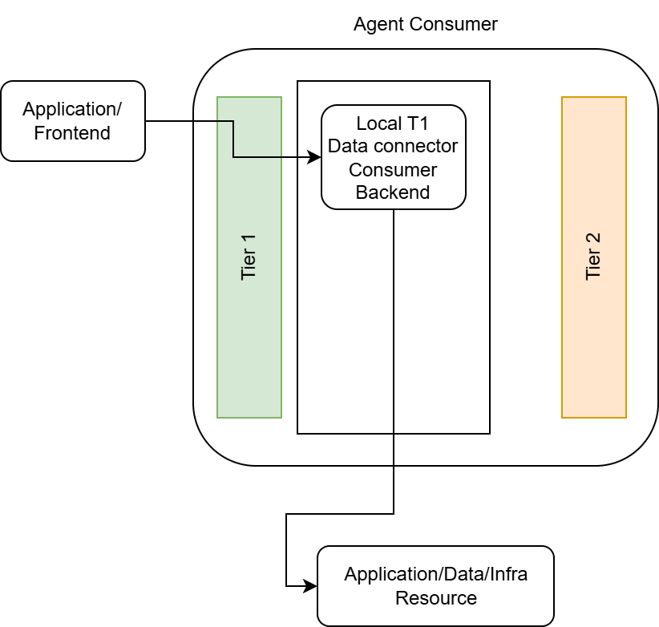
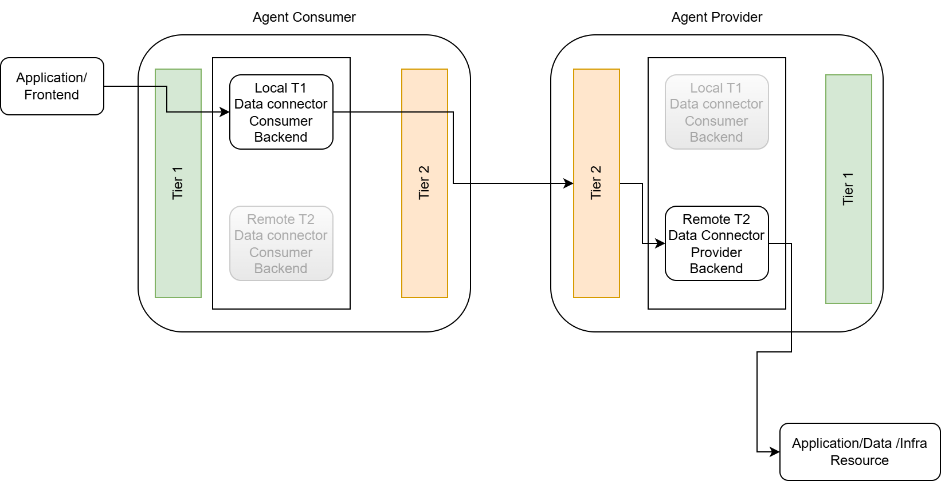
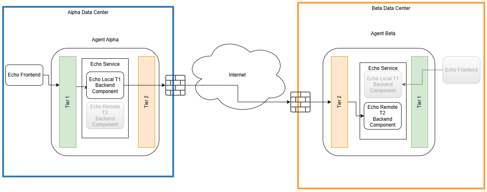

⚠️ <strong>Work in progress — yet to be validated</strong>

📍 <strong>You are here</strong> 
<a href="../README.md">🏠 Home</a> 
    <a href="README.md">Foundations</a> 
        <strong>Data Space Concepts</strong> 

# Data space concepts

The conceptual model that frames every Simpl-Open business process and solution: how participants are organised into agents, the Tier I / Tier II split, the anatomy of a Simpl-Open service, the difference between built-in services and access-through services, and the Echo Service template that all internally developed Simpl-Open services follow. Every dimension folder in this catalogue assumes the reader is familiar with the model on this page.

## Source

Extracted verbatim from `Functional-and-Technical-Architecture-Specifications.md`, section **2.2 Data Space Concepts** (lines 817–1037 of the source, dated 2026-04-20). Upstream link: [FTA spec §2.2](https://code.europa.eu/simpl/simpl-open/architecture/-/blob/master/functional_and_technical_architecture_specifications/Functional-and-Technical-Architecture-Specifications.md?ref_type=heads#22-data-space-concepts).

---

###  2.2. Data Space Concepts

This section defines general concepts that are necessary for a good
understanding of the Simpl-Open documentation and ecosystem in general.

####  2.2.1. Actors and Data Space Deployment 

As described above, a Data Space consists of **actors** (individuals or
entities) who need to interact with each other. In Simpl-Open, it is
assumed that individuals (called **end-users**) are always part of an
entity (called **participant**). A participant can operate one or
multiple **node**(s) which represent a distinct and/or isolated set of
IT resources and can participate to different Data Spaces with various
participant **roles** (including Data Provider, Application Provider,
Consumer, Infrastructure Provider and - exactly one - Governance
Authority). Nodes can also be spread across physical locations.

Example: a university (= **participant**) which embodies students,
researchers or accountants (= **end-users**). The university has a
dedicated network (with connected IT resources) for its sciences
department (= the sciences **node**) hosted in Paris (= **physical
location**) and a dedicated network for its economy department (= the
economy **node**) hosted in Rome (= **physical location**). The sciences
department might want to offer the results of its researches (= data
provider **role**) to a science-related Data Space while the economy
department might want to consume data (= consumer **role**) from an
economy-related Data Space.

**Simpl-Open Agent** is a middleware, to be deployed on each node,
acting as a local gateway for secure communication within a Data Space.

The following diagram illustrates this deployment view:

The following diagram translates the above deployment view into a data
domain model to better understand the relationship and cardinality
between the different entities. 

####  2.2.2. Data Space Participant: Tier I and Tier II

Only the HL concepts of Tier I and Tier II are presented here as it is
required for a good understanding of the next sections. More details can
be found in the Simpl-Open Application and Technology Architecture,
especially related to Domain 1.

Identification, authentication and authorisation are of paramount
importance within a Data Space. 

The identification must be supported by the governance authority. This
authority is in charge of reviewing the identity details of
organisations that want to participate in the Data Space. If the
authority approves the participation of and organisation in the Data
Space, it provides a proof of identification that the organisation
installs in its Simpl-Open Agent. With this proof, the participant
authenticates itself to other Data Space participants and other
participants define authorisation rules based on the verifiable
identity.

The identification system plays an important role in two functionalities
of Simpl-Open:

1.  Establish secure communication channels;

2.  Provide the information on which participants can base themselves to
    define access and usage policies.

To keep the identification system manageable in a large-scale
environment, the identification is split into two tiers:

1.  The **first tier** manages the identification, authentication and
    authorisation of the organisation's members (humans or machines) to
    use the Simpl-Open Agent of their organisation;

2.  The **second tier** identifies and authenticates the organisation as
    a whole in the Simpl network.

The figure below depicts this two-tier approach:

In the **first tier**, the Simpl-Open Agent connects to the preferred
IAA system of the organisation: EU Login, eID, Microsoft AD, OpenID
Connect, etc. This mechanism is already well established and not unique
to Simpl.

The **second tier** involves the machine-to-machine authentication and
identification of an organisation in the Simpl network. Each
organisation holds an "Identity" file to support the identification,
authentication and authorisation of the organisation in the Data Space.
Recalling the two functionalities that the IAA supports, the necessary
content of this Identity file becomes apparent:

-   For the **establishment of a secure communication channel between
    participants (1)**, the Identity file should contain a proof of the
    organisation’s public key. Each Data Space participant will create a
    cryptographic public/private keypair that is used in the
    asynchronous authentication mechanisms needed to establish a
    communication channel. An example of how such a secure communication
    channel can be established is the well-known TLS/SSL protocol. The
    Identity file associates the public key of an organisation to its
    identity. Proving the identity of the organisation then becomes
    proving the possession of the private key that belongs to the
    respective public key. This way, the organisation can be
    authenticated in the network and a secure communication channel can
    be established.

-   **Access control and authorisation by providers (2)** can be
    performed based on custom identity attributes of an organisation.
    Examples of such attributes are the organisation name, geographical
    location, whether it is a private or public institution, etc. Based
    on these attributes, providers can define access and usage policies
    for their resources. For example, a provider can open a resource to
    all public institutions, or to all participants from a specific
    Member State. On the other hand, the access control policies can be
    more stringent and access is only allowed for a specific
    organisation. The Identity file proves the attributes of an
    organisation and, as such, ensures the trust on which a provider can
    rely to enforce their access control.

####  2.2.3. Anatomy of a Simpl-Open service

Simpl-Open is deployed within the participant organization's premises
(e.g., data center) and is intended to be connected to the internet via
a firewall. Only the Tier 2 Gateway is designed to be exposed through
the firewall, enabling agent-to-agent communication.

The Tier 1 Gateway is intended to remain privately accessible within the
organization's internal network.

Simpl-Open Agents consist of a tailored set of Simpl-Open services,
depending on the participant's role (e.g., Consumer, Data Provider,
Infrastructure Provider, Application Provider).

Each Simpl-Open service includes the following components:

-   **Tier 1 Frontend**: Accessible by the organization's end users,
    this interface provides access to the agent’s functionalities.

-   **Tier 1 Gateway**: Secures internal traffic and enforces Role-Based
    Access Control (RBAC) policies.

-   **Local Tier 1 Backend**: Located behind the Tier 1 Gateway, it
    delivers local services to the agent and may also interact with
    remote Tier 2 Backends.

-   **Tier 2 Gateway**: Secures inter-organizational communications and
    enforces Attribute-Based Access Control (ABAC) policies.

-   **Remote Tier 2 Backend**: Accessed through the Tier 2 Gateway, it
    offers services to external agents.

-   **Local Resource (Data/Infrastructure/Application)**: Resources
    owned by the organization but external to the Simpl-Open Agent,
    accessible through the Local Tier 1 Backend.

-   **Remote Resource (Data/Infrastructure/Application)**: Resources
    owned by another organization and external to its Simpl-Open Agent,
    accessible through the Remote Tier 2 Backend.

According to the Architecture Vision documents, services are categorized
into two types: Built-in Services and Access-Through Services.

####  2.2.4. Built-in Services

Built-in services are services that Simpl-Open offers to end users and
are completely implemented by the middleware.

##### **Local Built-in Services**

An example of a local Built-in Service is the User & Roles component.
This service enables agent administrators to manage users and roles
locally within the scope of the agent.

##### Cross-Agent Built-in Services

The Catalog is an example of a Cross-Agent Built-in Service. It allows
the local Tier 1 Catalog Backend of a consumer to interact with the
Remote Tier 2 Catalog service provided by the Governance Authority.

####  2.2.5. Access-through Services

This kind of service enables access to the
Application/Data/Infrastructure resources that providers can
offer through the Simpl-Open middleware.

##### Local Access Through

A Local Access-Through Service enables an external application (or
frontend) to access to a participant's internal resource via the local
Tier 1 component. Currently, none of the services within Simpl-Open
operate in this manner.

##### Remote Access Through

A Remote Access-Through Service enables access to a remote resource via
the local Tier 1 component, which communicates with the remote Tier 2
component through Tier 2 communication. 

####  2.2.6. Simpl-Open Service Template - The Echo Service

The  echo service is an example of cross-agent built-in service that
allows to check if the connection and the attribute exchange between
participant is working. A boilerplate example of the Echo local and
remote backend has been open sourced
[here](https://code.europa.eu/simpl/simpl-open/development/iaa/echo-backend).

