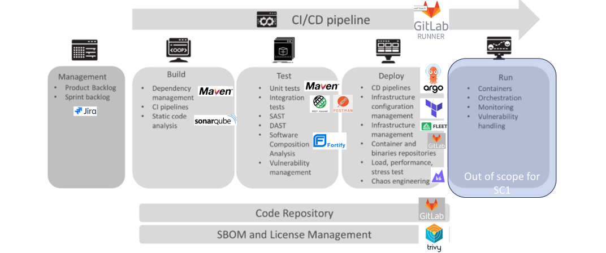
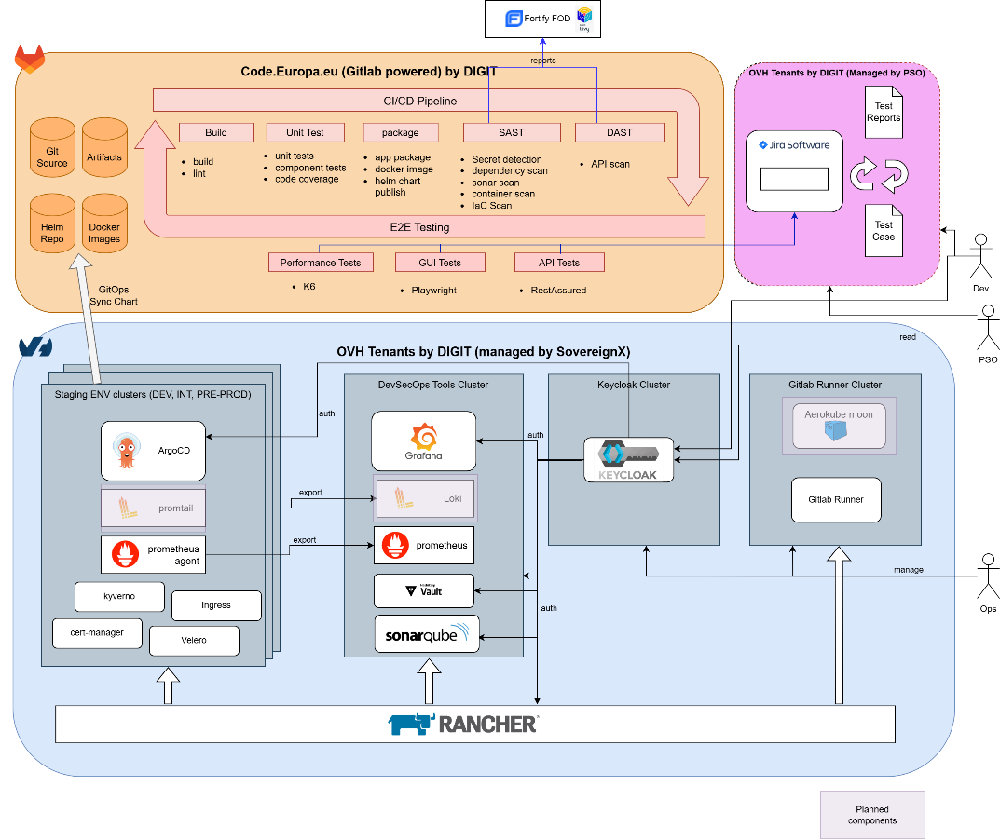
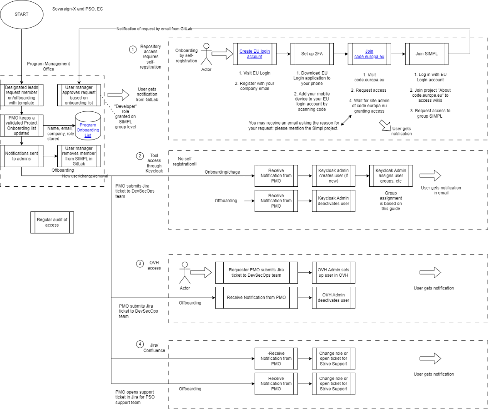
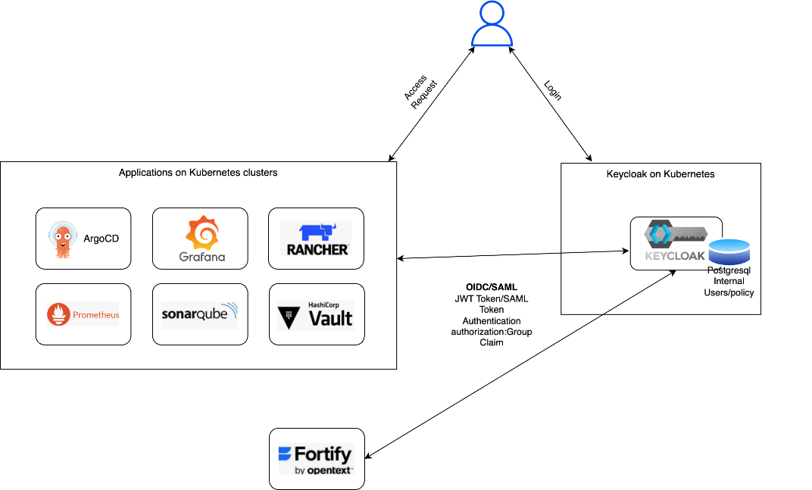
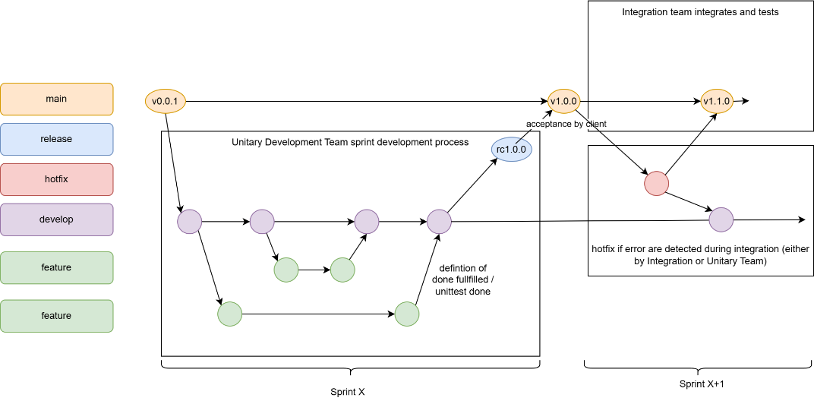
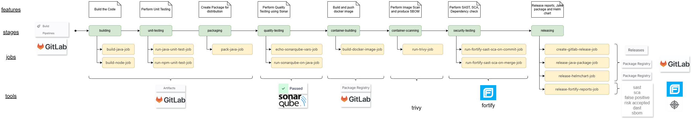
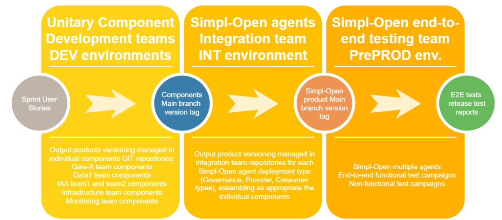
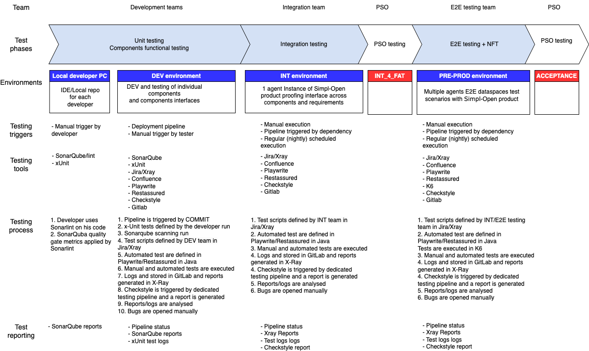

⚠️ <strong>Work in progress — yet to be validated</strong>

📍 <strong>You are here</strong> 
<a href="../../README.md">🏠 Home</a> 
    <a href="../README.md">Foundations</a> 
        <strong>DevSecOps</strong> 

# DevSecOps approach

The complete DevSecOps approach for Simpl-Open: cluster planning and provisioning, environment onboarding, security and access control, security checks, GitOps and continuous deployment, testing, monitoring and logging, backup/restore, and environment deprovisioning. This is the operations counterpart to the [security architecture](security-architecture.md) chapter — together they cover everything from "how is the cluster provisioned" through "how does a deployment land in it" to "how is it deprovisioned." Tools named here (Gitea, GitLab, Helm, Trivy, Fortify, SonarQube, Argo CD, Ansible, Spring Cloud Config, etc.) each have a solution folder; this page is the unified workflow reference.

## Contents (FTA §8 sub-section anchors)

- §8.1 Overview
- §8.2 Planning and Design of Clusters
- §8.3 Cluster Provisioning and Setup
- §8.4 Environment Onboarding Process
- §8.5 Security and Access Control (including §8.5.1 Access Management, §8.5.2 Mapping of basic roles)
- §8.6 Security Checks (including §8.6.1 Kubernetes best practices)
- §8.7 Continuous Deployment and GitOps (§8.7.1 Architecture, §8.7.2 GitFlow, §8.7.3 CI/CD Pipeline, §8.7.4 Release Management, §8.7.5 Helm Charts, §8.7.6 Argo CD)
- §8.8 Testing
- §8.9 Monitoring and Logging
- §8.10 Backup and restore
- §8.11 Deprovision of Environments (§8.11.1 Application Deprovisioning, §8.11.2 Infrastructure Deprovisioning)

## Source

Extracted verbatim from `Functional-and-Technical-Architecture-Specifications.md`, chapter **8 DevSecOps Approach** (lines 17217–18107 of the source, dated 2026-04-20). Upstream link: [FTA spec §8](https://code.europa.eu/simpl/simpl-open/architecture/-/blob/master/functional_and_technical_architecture_specifications/Functional-and-Technical-Architecture-Specifications.md?ref_type=heads#8-devsecops-approach).

---

##  8. DevSecOps Approach

This section gives an overview of the architecture for the DevSecOps
tools and environments for Simpl-Open. The following diagram is taken
over from Specific Contract 1 - Terms of reference, which provides an
overall view of the required DevSecOps approach completed with the
relevant choices of tools/technologies in our implementation.

###  8.1. Overview

This architecture diagram below shows the main components of the
DevSecOps toolchain used to comply with the above-mentioned approach for
the development of Simpl-Open.

The central CI/CD pipeline to build and test the applications and
components, as well as the code repositories, are on a GitLab instance
on code.europe.eu.

OVH is used for the different Kubernetes clusters:

-   Dedicated cluster with various namespaces for development;

-   Dedicated cluster with various namespaces for integration;

-   Dedicated cluster with various namespaces for end-to-end testing;

-   Dedicated clusters for Keycloak identity management, GitLab Runners,
    DevSecOps tools and DevSecOps tool testing (staging env for
    DevSecOps tools).

Tickets, test cases and test reports are found in Jira, which is set up
along with Xray for test management.

The diagram reflects the current status of the toolchain, with planned
elements shown shaded.

###  8.2. Planning and Design of Clusters

The DevSecOps team provides the infrastructure resources to the
development teams. It is responsible for the setup of the Kubernetes
clusters on OVH and the management of those.

The cluster "Dev-components" is set up as the development environment.
Each team gets isolated name space(s) to run their services.

To avoid vendor-lock-in, it is proposed to avoid using managed services
on OVH like managed databases. This guarantees that the designed
solution will also work on other cloud platforms without modifications
needed.

The DevSecOps team manages the clusters via Rancher and provides access
to the projects and namespaces only to the team members of the product
streams. 

The expected workload for each of the environments is estimated based on
the input from the different development teams and used for initial
cluster sizing.

The table below shows the different stages and what they are used for.

<table>
<thead>
<tr class="header">
<th><strong>Stage</strong></th>
<th><strong>Purpose</strong></th>
<th><strong>Data </strong></th>
<th><strong>Operations Level Agreement</strong></th>
<th>
<strong>Target User Group</strong>

<strong>(responsible for deployment)</strong>
</th>
<th><strong>Release Management</strong></th>
<th><strong>Deployment Strategy (when releases are applied)</strong></th>
</tr>
</thead>
<tbody>
<tr class="odd">
<td><strong>Dev</strong></td>
<td><ul>
<li>
The development stage is where new features and enhancements are developed and tested;
</li>
<li>
Isolated Simpl product teams dev environments (opt: connected to feature branches);
</li>
<li>
No involvement in commercial applications.
</li>
</ul></td>
<td><ul>
<li>
Synthetic, manually created data per dev test to conduct functional testing of the individual product. (For further details see Test Plan).
</li>
</ul></td>
<td>n/a</td>
<td><ul>
<li>
Developers of consortia members
</li>
<li>
QA engineers for testing
</li>
</ul></td>
<td><ul>
<li>
dev versions, e.g. 0.0.4-snapshot
</li>
</ul></td>
<td><ul>
<li>
Daily and continuous builds from develop branch and/or feature branch
</li>
</ul></td>
</tr>
<tr class="even">
<td><strong>Int</strong></td>
<td><ul>
<li>
The int stage is dedicated to comprehensive testing of features and fixes before they are promoted to release branch;
</li>
<li>
Used for functional testing of API endpoints and correct interaction between different components.
</li>
</ul></td>
<td><ul>
<li>
Synthetic, manually created data per dev test to conduct functional testing of individual product;
</li>
<li>
May use sanitised production data. The sanitisation process will ensure no sensitive information will be used.
</li>
</ul></td>
<td>n/a</td>
<td><ul>
<li>
QA engineers for testing
</li>
</ul></td>
<td><ul>
<li>
release candidate versions
</li>
</ul></td>
<td><ul>
<li>
Manual sync for release candidates
</li>
</ul></td>
</tr>
<tr class="odd">
<td><strong>Pre-Prod</strong></td>
<td><ul>
<li>
The pre-prod stage serves as a pre-production environment where the validation of the system's end-to-end workflows (End-to end testing) are taking place from user scenario point of view;
</li>
<li>
Also, this stage is responsible for all non-functional testing (load/stress testing, security testing by DAST).
</li>
</ul></td>
<td><ul>
<li>
Subset of production data or representative data to simulate the production environment accurately;
</li>
<li>
Data will be sanitised or anonymised to protect sensitive information while preserving the integrity of the dataset.
</li>
</ul></td>
<td>n/a</td>
<td><ul>
<li>
E2E testing team
</li>
</ul></td>
<td><ul>
<li>
stable release versions 
</li>
</ul></td>
<td><ul>
<li>
manual sync for released versions
</li>
<li>
Aimed to automate as much as feasible as maturity grows
</li>
</ul></td>
</tr>
</tbody>
</table>

###  8.3. Cluster Provisioning and Setup

###  8.4. Environment Onboarding Process

If a Dev-Team needs a new environment for any stage, they need to create
an issue in the following GitLab repo:
Simpl/Operations/Environment-onboarding. 

The DevSecOps team will create the environment with the default tool
stack and grant access to it afterwards.

Process Description:

1.  Create project in Rancher in the desired cluster (dev, int, …);

2.  Deploy default toolstack (ingress etc.);

3.  Create project in Argo CD;

4.  Grant access to Rancher project and Argo CD project.

###  8.5. Security and Access Control

The following best practices are used to secure the environments.

####  8.5.1. Access Management 

Access is granted / revoked based on the process described below.

**Definition of Basic roles (as tracked in PMO master list)**

<table>
<thead>
<tr class="header">
<th><strong>User role name</strong></th>
<th><strong>Description</strong></th>
</tr>
</thead>
<tbody>
<tr class="odd">
<td>ADMIN</td>
<td>Role for the operation of the DevSecOps toolchain</td>
</tr>
<tr class="even">
<td>PSO/ EC</td>
<td>Members of PSO accessing the DevSecOps toolchain for quality assurance purposes</td>
</tr>
<tr class="odd">
<td>DEVELOPER</td>
<td>Developers who will use the DevOps pipeline for development activities</td>
</tr>
<tr class="even">
<td>LEAD DEVELOPER</td>
<td>Developer with code ownership and elevated security privileges</td>
</tr>
<tr class="odd">
<td>DEVELOPER OPS</td>
<td>Developers with elevated infrastructure privileges</td>
</tr>
<tr class="even">
<td>LEAD DEVELOPER OPS</td>
<td>Developers with code ownership and elevated security + infrastructure privileges</td>
</tr>
<tr class="odd">
<td>TESTER</td>
<td>Testers who will take part in the testing of developed code</td>
</tr>
</tbody>
</table>

####  8.5.2. Mapping of basic roles

This table shows the mapping between the basic roles and the internal
roles within each tool.

<table>
<thead>
<tr class="header">
<th>
<strong>Tool (with internal Roles)</strong>

<strong>Basic Role</strong>
</th>
<th><strong>code.europe.eu</strong></th>
<th>
<strong>Argo CD</strong>

<strong>(ADMIN, DEV, READ-ONLY)</strong>
</th>
<th>
<strong>Rancher</strong>

<strong>(ADMIN, Project Member, Read-Only)</strong>
</th>
<th>
<strong>Vault</strong>

<strong>(ADMIN, DEV, DENY-ALL)</strong>
</th>
<th>
<strong>Fortify</strong>

<strong>(Security Lead (Admin), Developer, Lead Developer, Tester)</strong>
</th>
<th>
<strong>SonarQube</strong>

<strong>(ADMIN, DEV)</strong>
</th>
<th><strong>Prometheus</strong></th>
<th><strong>Grafana</strong></th>
<th><strong>Loki</strong></th>
<th><strong>Aerokube Moon</strong></th>
</tr>
</thead>
<tbody>
<tr class="odd">
<td>everyone on PMO master list (non-need for any specific  DevSecOps role)</td>
<td>
DEVELOPER on Simpl group level

(subject to self-registration)
</td>
<td>n/a</td>
<td>n/a</td>
<td>n/a</td>
<td>n/a</td>
<td>n/a</td>
<td>n/a</td>
<td>n/a</td>
<td>n/a</td>
<td>n/a</td>
</tr>
<tr class="even">
<td>ADMIN</td>
<td>MAINTANER is set manually for DevSecOps team</td>
<td>ADMIN for Argo CD</td>
<td>ADMIN</td>
<td>ADMIN</td>
<td>Security Lead (Admin)</td>
<td>ADMIN</td>
<td>ADMIN</td>
<td>ADMIN</td>
<td>ADMIN</td>
<td>ADMIN</td>
</tr>
<tr class="odd">
<td>PSO</td>
<td>
DEVELOPER on Simpl group level

(subject to self-registration)
</td>
<td>READ-ONLY</td>
<td>READ-ONLY</td>
<td>DENY-ALL</td>
<td>n/a</td>
<td>Dev</td>
<td>n/a</td>
<td>VIEWER</td>
<td>n/a</td>
<td>n/a</td>
</tr>
<tr class="even">
<td>DEVELOPER</td>
<td>
DEVELOPER on Simpl group level

(subject to self-registration)
</td>
<td>
Project Member

(per project)
</td>
<td>n/a</td>
<td>n/a</td>
<td>
Developer

(per application)
</td>
<td>Dev</td>
<td>n/a</td>
<td>VIEWER</td>
<td>n/a</td>
<td>n/a</td>
</tr>
<tr class="odd">
<td>LEAD DEVELOPER</td>
<td>
DEVELOPER on Simpl group level

CODEOWNER in repository

(subject to self-registration)
</td>
<td>
Project Member

(per project)
</td>
<td>n/a</td>
<td>n/a</td>
<td>
Lead Developer (including Developer rights)

(per application)
</td>
<td>Dev</td>
<td>n/a</td>
<td>VIEWER</td>
<td>n/a</td>
<td>n/a</td>
</tr>
<tr class="even">
<td>DEVELOPER OPS</td>
<td>
DEVELOPER on Simpl group level

(subject to self-registration)
</td>
<td>
Project Member

(per project)
</td>
<td>
Project Member

(per project)
</td>
<td>
DEV

(per project)
</td>
<td>
Developer

(per application)
</td>
<td>Dev</td>
<td>n/a</td>
<td>VIEWER</td>
<td>n/a</td>
<td>n/a</td>
</tr>
<tr class="odd">
<td>TESTER</td>
<td>
DEVELOPER on Simpl group level

(subject to self-registration)
</td>
<td>READ-ONLY</td>
<td>n/a</td>
<td>n/a</td>
<td>Tester</td>
<td>Dev</td>
<td>n/a</td>
<td>VIEWER</td>
<td>n/a</td>
<td>TESTER</td>
</tr>
</tbody>
</table>

Keycloak is used as a central instance for user management and providing
the login mechanisms for the different tools:

###  8.6. Security Checks

Application security scans will be done by Fortify on Demand (FoD). The
scope is the following:

-   Static Application Security Test (SAST);

-   Static Component Analysis (SCA);

-   Container Scanning;

-   Dynamic Application Security Test (DAST).

**SAST** (Static Application Security Testing) is a method of testing
the source code of an application for security vulnerabilities without
executing the application. It's a type of white-box testing that
analyses the application's internal structures and logic on the code
level for flaws that might lead to security risks and vulnerabilities.
Main advantages of using SAST:

-   Enables detection and remediation of vulnerabilities early in the
    Software Development Lifecycle (SDLC), reducing costs and risks;

-   Can analyse the entire codebase, providing a comprehensive security
    assessment;

-   Helps the project to comply with security standards like OWASP, PCI
    DSS and others

**WHEN:** SAST *is performed on every commit/merge*

**WHAT:** *the source code is scanned*

**WHERE:** *during the development lifecycle*

**WHO:** *the pipeline is starting the analysis automatically*

Fortify is integrated with the central component development pipeline
which triggers a Static Application Security Test (SAST) when new code
is merged in the repository by the development or the integration teams.
For the feature branch a scan can be requested manually. The result of
the scan is shown on the dashboard of Fortify. Developers can review the
results of their components and handle identified vulnerabilities in the
next version of the code. A quality gate set in Fortify must be met for
the pipeline to merge the code to the main branch.

**SCA** (Software Composition Analysis) is a process used to identify
and manage risks associated with the use of third-party and Open-Source
software components in an application. It is a critical aspect of modern
software development, as applications increasingly rely on external
libraries and frameworks. Main advantages of using SCA:

-   Protects the Simpl agent by identifying and addressing
    vulnerabilities in external components;

-   Mitigates legal risks from improper use of Open-Source licenses;

-   Automates tracking and reporting of third-party components.

**WHEN:** *SCA is performed on every commit/merge*

**WHAT:** *third-party libraries are scanned*

**WHERE:** *during the development lifecycle*

**WHO:** *the pipeline is starting the analysis automatically*

SCA is integrated with the same approach as SAST using the debricked
service of the Fortify online platform.

**Container scanning** refers to the process of analysing and inspecting
container images for security vulnerabilities, compliance issues,
malware and other potential risks before they are deployed in a
production environment. Here’s a brief overview:

-   Purpose: The primary goal is to ensure that containers are free from
    known security vulnerabilities and adhere to organisational security
    policies. This helps in maintaining the integrity, confidentiality
    and availability of applications running inside these containers.

-   Components Scanned:

    -   Base Images: Checking if the base images from which containers
        are built have any known vulnerabilities.

    -   Dependencies: Examining all the software libraries and
        dependencies included within the image for vulnerabilities or
        outdated versions.

    -   Configuration: Assessing the container's configuration files for
        potential security misconfigurations.

**WHEN:** *container scanning is performed in the development lifecycle
at every branch and i every commit/merge*

**WHAT:** *the containers and images used are scanned*

**WHERE:** *during the development lifecycle*

**WHO:** *the pipeline is starting the analysis automatically*

**DAST** (Dynamic Application Security Testing) is a method used to
identify security vulnerabilities in an application by analysing it
during runtime. It simulates attacks on a running application, typically
from an external perspective, to uncover vulnerabilities that can be
exploited in real-world scenarios. Main advantages of using DAST:

-   Identifies vulnerabilities of the Simpl software as an attacker
    would exploit them

-   Finds issues related to application logic, runtime behaviour and
    server configuration.

**WHEN:** *at the end of the development lifecycle, after e2e testing.*

**WHAT:** *DAST is performed on the Agents.*

**WHERE:** *DAST is performed in the pre-prod environment*

**WHO:** *the end2end team is responsible for configuring and running
the scans*

DAST is implemented using the WebInspect service of the Fortify online
platform.

While SAST, SCA and Container Scanning are integrated into the component
pipeline and used on the component level, DAST will be triggered
manually after deployment of the integrated Simpl agent in the pre-prod
environment and the completion of preparational steps. This testing type
may require a runtime of up to 2-3 days by Fortify. Once the testing is
complete the Fortify dashboard will provide an overview of the results.
Similarly to SAST and SCA developers can review the identified issues
and act on them as necessary.

####  8.6.1. Kubernetes best practices

In order to set up a flexible and scalable environment for managing our
containerised applications, Kubernetes has been identified as the best
fit technology. The primary reasons for the choice are:

-   vendor neutral platform;

-   support of microservices infrastructure;

-   autoscaling capabilities to handle growing and fluctuating
    workloads;

-   support for DevSecOps;

-   support of multi-tenant environments;

-   high availability.

Main features of Kubernetes:

-   **Network Policies**: Defined network policies [network
    policies](https://kubernetes.io/docs/concepts/services-networking/network-policies/)
    to control traffic within the cluster; OVH provides a default set of
    policies. Inside the Kubernetes cluster ingress and egress isolation
    for pod level according to the specific needs of the cluster are
    used.

-   **Secret Management**: Usage of Kubernetes Secrets and/or Vault to
    store sensitive data securely. Secrets used in the pipeline are
    stored in an external tool like Vault;

-   **Role-Based Access Control (RBAC)**: Implemented RBAC to manage
    access to cluster resources based on user roles; Keycloak groups are
    mapped to Rancher projects to ensure proper isolation of namespaces.
    User roles are mapped to Keycloak groups/roles.

-   **Service Accounts**: Usage of Service Accounts to authenticate and
    authorise pods;

-   **Image Scanning**: The integrity and security of container images
    are verified before deployment in the pipeline; This is done by
    using Trivy/Fortify triggered by the pipeline.

-   **Regular Updates and Patching**: To keep the Kubernetes
    distribution and components up-to-date with the latest security
    patches regular updates are done. Since Kubernetes is a managed
    service, updates are made available by OVH. Admins regularly check
    update options and decide to stay with the current version or
    update.

###  8.7. Continuous Deployment and GitOps

This section outlines the implementation of continuous deployment (CD)
and GitOps in Simpl-Open using GitLab CI/CD, Helm Charts, Argo CD and
multiple environments.  
The goal is to automate the release management process, ensuring
consistent and reliable deployments across various environments.

####  8.7.1. Architecture

The architecture consists of:

1.  **GitLab**: The source code is managed on the GitLab instance at
    [code.europa.eu](https://code.europa.eu). There also the CI/CD
    pipeline is used;

2.  **Helm Charts**: Package managers for Kubernetes applications;

3.  **Argo CD**: A continuous deployment tool for automating the
    application release process for the development, integration and
    pre-prod environments

4.  **Fleet Management**: A K8 concept and tool to centrally manage
    DevSecOps tools, agents, components on every cluster in the
    landscape.

5.  **Multiple Environments**: The deployment is done in multiple
    environments.

####  8.7.2. GitFlow

The project uses GitFlow, as a branching strategy for Git repositories
designed to streamline collaboration and manage releases in software
projects. GitFlow has become widely adopted in software development
workflows, especially for projects with regular release cycles.

The advantages of the GitFlow approach:

-   Clearly defines branches for development, features, releases and
    hotfixes;

-   Makes it easier for teams to work on different features or issues
    simultaneously;

-   Facilitates managing multiple releases and hotfixes.

Artefacts should be versioned according to the Semantic Versioning
Concept.

The GitFlow approach in Simpl is depicted in the following diagram:

Explanation for the branches:

1.  **main**: The main branch, which represents the production-ready
    code;

2.  **develop**: The development branch, where new features are
    developed and tested;

3.  **feature/**\*: Feature branches for specific tasks or fixes;

4.  **release**: Release branch for release candidates;

5.  **hotfix**: Forked from tags of the main branch used for urgent
    fixes.

In GitLab (code.europa.eu) the main and develop branches are set up as
protected. Merge to main can be initiated from develop, release and
hotfix. Developers remove release and hotfix following the merge of the
updated code to main. Develop is only allowed to merge code from
feature/\* (for instance feature/SIMPL-1234). Developers remove the
feature branch after merging to develop.

####  8.7.3. CI/CD Pipeline

The pipeline is implemented using GitLab CI/CD. The are multiple steps
included to ensure proper testing and security before the deployment:

Pipeline features:

-   **Building the Code**: Compile the source code into executable
    binaries or artifacts;

-   **Perform Unit Testing**: Execute automated tests to verify
    individual components of the codebase for correctness;

-   **Create package for distribution**: Bundle the application into
    distributable formats like jar and publish to the GitLab artifacts;

-   **Perform Quality Testing with Sonar**: Perform static code analysis
    to identify code quality issues and technical debt;

-   **Build and Push Docker Image**: Create a Docker image from the
    application and push it to the GitLab Container registry;

-   **Perform Image Scan and produce SBOM**: Scan the Docker image for
    vulnerabilities and compliance issues using Trivy, list all
    dependencies created with Trivy and Fortify;

-   **Perform SAST (Static Application Security Testing)/SCA (Software
    Composition Analysis)** : Analyse the source code for security
    vulnerabilities without executing the code using Fortify;

-   **SCA (Software Composition Analysis)**: Identify and analyse
    Open-Source components (dependencies scanning) for known
    vulnerabilities using Trivy for image scanning and Fortify for
    dependencies;

-   **Release reports, Java package and Helm Chart**: Update the
    version, package and release a Helm chart for Kubernetes deployments
    in the GitLab Package Registry;

Pipeline runs can be tracked on the UI of GitLab. Issues are indicated
by the progress diagrams on the UI, details are provided by GitLab based
on the logs of the failing jobs.

####  8.7.4. Release Management

The release management process will be carried out on two distinct
levels (App of Apps concept):

-   Unitary Component development

-   Agent Components (integration and pre-prod)

The following diagram shows the overall process:

As shown in the diagram there are multiple stages with different
environments:

1.  **Development Environment**: The development environment is where
    new features and enhancements are developed and tested on component
    level; 

2.  **Integration Environment**: The integration environment is
    dedicated to integration activities and integration testing before
    they are promoted to pre-prod;

3.  **Pre-Prod Environment**: The pre-prod environment serves as an
    environment where features are integrated and tested together as a
    cohesive unit, end to end. This is where load testing is taking
    place.

A Production environment is not planned for Simpl-Open, just for
Simpl-Labs and Simple-Live.

As an overall concept, the release management process is automated using
GitLab CI/CD and Argo CD:

1.  **Prepare a Release**: A new release version is created following
    the GitFlow approach on GitLab;

2.  **Build and Test**: The extended pipeline stages run to validate the
    release quality, including E2E testing and extensive security
    scanning;

3.  **Deploy**: Argo CD deploys the release to the target environment;

4.  **Verify**: Verify the deployment by running tests and monitoring
    application logs.

####  8.7.5. Helm Charts

Helm Charts are used to manage components and Kubernetes applications.
Similarly, Helm Charts define the application on Agent level.

1.  **Chart Management**: Helm Charts are managed using GitLab CI/CD,
    allowing for automated updates and versioning;

2.  **Deployment**: Helm Charts are deployed to the target environment
    using Argo CD.

Component development teams release their component by a Helm Chart. By
the application of the App of Apps concept, on the Agent level (App) the
individual components (Apps) are defined and managed. This is ensured by
the configuration of Helm Charts in a hierarchical manner (Agent level
configuration overwrites component level configuration).

Benefits of the App of Apps Concept

-   **Scalability**: Simplifies managing a large number of components in
    complex agents;

-   **Centralised Management**: Enables a single point of control for
    all components;

-   **Flexibility**: Supports managing components across multiple
    environments or clusters;

-   **Modularity**: Each component remains independently manageable,
    facilitating updates and troubleshooting;

-   **GitOps Alignment**: Integrates seamlessly with GitOps workflows
    for declarative management.

####  8.7.6. Argo CD

Argo CD is used to automate the deployment process. It is deployed in
each environment to support the release process.

1.  **Application Definition**: Define applications in Argo CD's
    configuration file (application.yaml);

2.  **Source Code Management**: Argo CD manage automatic deployments.
    Deployments happen based on the following triggers: by repo source
    code change, package registry change and manually. Dev team have the
    freedom to configure this for their components.

3.  **Deployment Strategies**: Choose deployment strategies for each
    application, such as rolling updates or blue-green deployments.

###  8.8. Testing

The testing process is separated into different phases which are shown
in the diagram below. The full test process is described in the testing
document.

###  8.9. Monitoring and Logging

Monitoring and logging tools are used to track application performance
and detect issues:

1.  **Prometheus**: A monitoring tool that collects metrics from the
    environments/ tools and stores them in a timeseries database;
    Deployed as an agent on all clusters.

2.  **Grafana**: A visualisation tool that displays dashboards based on
    Prometheus data. Centrally deployed on the DevSecOps-tools cluster
    as a central instance.

3.  **Promtail**: will be deployed on the clusters as the agent to
    discover and gather logs. 

4.  **Loki**: will be deployed to centrally aggregate and manage
    collected logs.

Prometheus agents will be deployed to all Kubernetes clusters and
connected to the central Prometheus instance (on the DevSecOps tool
server) to consolidate metrics. Grafana, deployed on the DevSecOps
cluster will use the data available for the Grafana central instance to
visualise data.

Metrics data is retained for 1 month.

Currently, email based alerting mechanism is set up in Grafana to notify
the operators for events configured in the tool.

Further extension of the infrastructure will be done with the deployment
of Promtail and Loki.

###  8.10. Backup and restore

On the Kubernetes clusters Velero is used for backing up and restoring
persistent volumes. The tool is deployed on the following clusters:

<table>
<thead>
<tr class="header">
<th>Cluster</th>
<th>Backup policy</th>
</tr>
</thead>
<tbody>
<tr class="odd">
<td>dev-components</td>
<td>WEEKY, DAILY</td>
</tr>
<tr class="even">
<td>devint-agents</td>
<td>WEEKY, DAILY</td>
</tr>
<tr class="odd">
<td>devsecops-keycloak</td>
<td>NONE</td>
</tr>
<tr class="even">
<td>devsecops-runners</td>
<td>WEEKLY</td>
</tr>
<tr class="odd">
<td>devsecops-tools</td>
<td>WEEKY, DAILY</td>
</tr>
<tr class="even">
<td>devsecops-toolstest</td>
<td>NONE</td>
</tr>
<tr class="odd">
<td>preprod-agents</td>
<td>WEEKY, DAILY</td>
</tr>
</tbody>
</table>

Backup is done for the specific Namespaces configured for the process.

Data restoration is carried out with the same tool.

###  8.11. Deprovision of Environments

Deprovisioning refers to the process of removing or deleting resources
that were initially provisioned. In this context, it involves removing
the application from the Kubernetes clusters across different
environments and deleting the infrastructure managed by Terraform.

For Simpl there are two steps for the deprovisioning: One for the
application and the second for the overall infrastructure to shut down
Simpl completely.

####  8.11.1. Step 1: Application Deprovisioning

The application deployed via ArgoCD can be removed by deleting the
relevant application resource. This can be achieved using the ArgoCD CLI
or the ArgoCD API.

Please note that this process has to be repeated for every instance of
the application running on different Kubernetes clusters within each
environment.

####  8.11.2. Step 2: Infrastructure Deprovisioning

Terraform maintains an up-to-date state file that reflects the current
state of the infrastructure. To deprovision the infrastructure, it needs
to be destroyed using Terraform.

Terraform offers the \`destroy\` command to delete the infrastructure
which was deployed by Terraform. The command compares the state file to
the current infrastructure and removes everything that exists.

The command has to be executed for each of the environments separately.
This can be done exclusively by the admins of the DevSecOps team for
each environment.

If the infrastructure including the DevSecOps-Tools-Cluster is
destroyed, also the managed applications like Keycloak, Vault etc. are
deleted. Any necessary data must be backed up before this process is
started.

